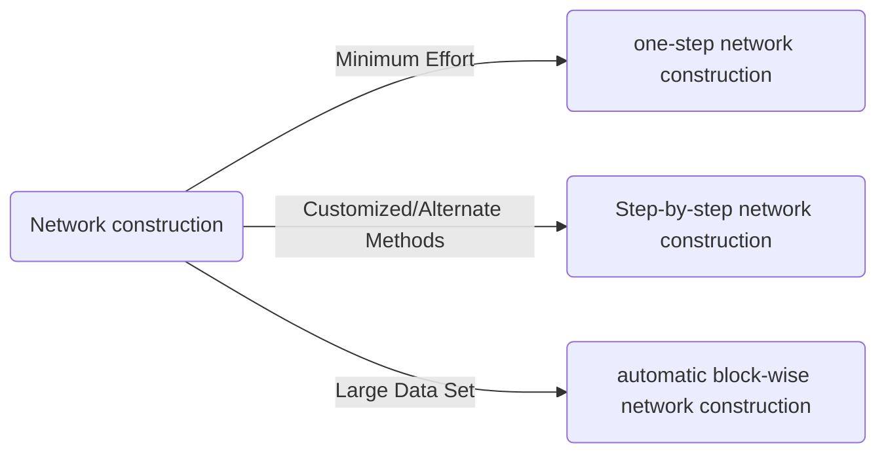

# WGCNA - Weighted Correlation Network Analysis

[Official Website](https://horvath.genetics.ucla.edu/html/CoexpressionNetwork/Rpackages/WGCNA/)
Paper: [Peter Langfelder, 2008](https://bmcbioinformatics.biomedcentral.com/articles/10.1186/1471-2105-9-559)

Weighted correlation network analysis (WGCNA) can be used for finding clusters (modules) of highly correlated genes, for summarizing such clusters using the module eigengene or an intramodular hub gene, for relating modules to one another and to external sample traits (using eigengene network methodology), and for calculating module membership measures.


# Installou

```r
# Mirrors
# options("repos" = c(CRAN="https://mirrors.tuna.tsinghua.edu.cn/CRAN/"))
# options(BioC_mirror="https://mirrors.tuna.tsinghua.edu.cn/bioconductor")
install.packages("BiocManager")
BiocManager::install("WGCNA")
```

Data:
- [Female data](https://horvath.genetics.ucla.edu/html/CoexpressionNetwork/Rpackages/WGCNA/Tutorials/FemaleLiver-Data.zip)
- [Male data](https://horvath.genetics.ucla.edu/html/CoexpressionNetwork/Rpackages/WGCNA/Tutorials/MaleLiver-Data.zip)

# 1. Data Preparation

## 1. Loading DataSet
The data sets contain roughly 130 samples each. Note that each row corresponds to a gene and column to a
sample or auxiliary information.
```r
library(WGCNA)

# Reading Data
options(stringsAsFactors = FALSE)
#Read in the female liver data set
femData = read.csv("LiverFemale3600.csv")
# Read in the male liver data set
maleData = read.csv("LiverMale3600.csv")
```

## 2. Groups in List
```r
# We work with two sets:
nSets = 2;
# For easier labeling of plots, create a vector holding descriptive names of the two sets.
setLabels = c("Female liver", "Male liver")
shortLabels = c("Female", "Male")

# Form multi-set expression data: columns starting from 9 contain actual expression data.
multiExpr = vector(mode = "list", length = nSets)

multiExpr[[1]] = list(data = as.data.frame(t(femData[-c(1:8)])));
names(multiExpr[[1]]$data) = femData$substanceBXH;
rownames(multiExpr[[1]]$data) = names(femData)[-c(1:8)];
multiExpr[[2]] = list(data = as.data.frame(t(maleData[-c(1:8)])));
names(multiExpr[[2]]$data) = maleData$substanceBXH;
rownames(multiExpr[[2]]$data) = names(maleData)[-c(1:8)];
# Check that the data has the correct format for many functions operating on multiple sets:
exprSize = checkSets(multiExpr)
```

## 3. Rudimentary data cleaning and outlier removal
Check that all genes and samples have sufficiently low numbers of missing values.
```r
gsg = goodSamplesGenesMS(multiExpr, verbose = 3);
gsg$allOK

if (!gsg$allOK)
{
  # Print information about the removed genes:
  if (sum(!gsg$goodGenes) > 0)
    printFlush(paste("Removing genes:", paste(names(multiExpr[[1]]$data)[!gsg$goodGenes],
                                              collapse = ", ")))
  for (set in 1:exprSize$nSets)
  {
    if (sum(!gsg$goodSamples[[set]]))
      printFlush(paste("In set", setLabels[set], "removing samples",
                       paste(rownames(multiExpr[[set]]$data)[!gsg$goodSamples[[set]]], collapse = ", ")))
    # Remove the offending genes and samples
    multiExpr[[set]]$data = multiExpr[[set]]$data[gsg$goodSamples[[set]], gsg$goodGenes];
  }
  # Update exprSize
  exprSize = checkSets(multiExpr)
}
```

## 4. Cluster

```r
sampleTrees = list()
for (set in 1:nSets)
{
  sampleTrees[[set]] = hclust(dist(multiExpr[[set]]$data), method = "average")
}

par(mfrow=c(2,1))
par(mar = c(0, 4, 2, 0))
for (set in 1:nSets)
  plot(sampleTrees[[set]], main = paste("Sample clustering on all genes in", setLabels[set]),
       xlab="", sub="", cex = 0.7)
```
[](https://imgchr.com/i/t2ocjA)

By inspection, there seems to be <span style="background:salmon">**one outlier**</span> in the female data set, and no obvious outliers in the male set. We
now <span style="background:salmon">**remove the female outlier**</span> using a semi-automatic code that only requires a choice of a height cut

## 5. Remove Outlier
```r
# Choose the "base" cut height for the female data set
baseHeight = 16
# Adjust the cut height for the male data set for the number of samples
cutHeights = c(16, 16*exprSize$nSamples[2]/exprSize$nSamples[1]);
# Re-plot the dendrograms including the cut lines
png(file = "SampleClustering.png");
par(mfrow=c(2,1))
par(mar = c(0, 4, 2, 0))
for (set in 1:nSets)
{
  plot(sampleTrees[[set]], main = paste("Sample clustering on all genes in", setLabels[set]),
       xlab="", sub="", cex = 0.7);
  abline(h=cutHeights[set], col = "red");
}
dev.off();

# Removing outlier
for (set in 1:nSets)
{
  # Find clusters cut by the line
  labels = cutreeStatic(sampleTrees[[set]], cutHeight = cutHeights[set])
  # Keep the largest one (labeled by the number 1)
  keep = (labels==1)
  multiExpr[[set]]$data = multiExpr[[set]]$data[keep, ]
}
collectGarbage();
# Check the size of the leftover data
exprSize = checkSets(multiExpr)
exprSize
```


## 6. Loading Clinical Trait Data
```r
traitData = read.csv("ClinicalTraits.csv");
# remove columns that hold information we do not need.
allTraits = traitData[, -c(31, 16)];
allTraits = allTraits[, c(2, 11:36) ];
# See how big the traits are and what are the trait and sample names
dim(allTraits)
names(allTraits)
allTraits$Mice
# Form a multi-set structure that will hold the clinical traits.
Traits = vector(mode="list", length = nSets);
for (set in 1:nSets)
{
  setSamples = rownames(multiExpr[[set]]$data);
  traitRows = match(setSamples, allTraits$Mice);
  Traits[[set]] = list(data = allTraits[traitRows, -1]);
  rownames(Traits[[set]]$data) = allTraits[traitRows, 1];
}
collectGarbage();
# Define data set dimensions
nGenes = exprSize$nGenes;
nSamples = exprSize$nSamples;
```

# 2. Network Construction and Module Detection



## 2.1 One-Step Network Construction and Module Detection
### 1. soft-thresholding power

```r
# Choose a set of soft-thresholding powers
powers = c(seq(4,10,by=1), seq(12,20, by=2));
# Initialize a list to hold the results of scale-free analysis
powerTables = vector(mode = "list", length = nSets);
# Call the network topology analysis function for each set in turn
for (set in 1:nSets)
  powerTables[[set]] = list(data = pickSoftThreshold(multiExpr[[set]]$data, powerVector=powers,
                                                     verbose = 2)[[2]]);
collectGarbage();
# Plot the results:
colors = c("black", "red")
# Will plot these columns of the returned scale free analysis tables
plotCols = c(2,5,6,7)
colNames = c("Scale Free Topology Model Fit", "Mean connectivity", "Median connectivity",
"Max connectivity");
# Get the minima and maxima of the plotted points
ylim = matrix(NA, nrow = 2, ncol = 4);
for (set in 1:nSets)
{
  for (col in 1:length(plotCols))
  {
    ylim[1, col] = min(ylim[1, col], powerTables[[set]]$data[, plotCols[col]], na.rm = TRUE);
    ylim[2, col] = max(ylim[2, col], powerTables[[set]]$data[, plotCols[col]], na.rm = TRUE);
  }
}
# Plot the quantities in the chosen columns vs. the soft thresholding power
sizeGrWindow(8, 6)
png(file = "scaleFreeAnalysis.png")
par(mfcol = c(2,2));
par(mar = c(4.2, 4.2 , 2.2, 0.5))
cex1 = 0.7;
for (col in 1:length(plotCols)) for (set in 1:nSets)
{
  if (set==1)
  {
    plot(powerTables[[set]]$data[,1], -sign(powerTables[[set]]$data[,3])*powerTables[[set]]$data[,2],
         xlab="Soft Threshold (power)",ylab=colNames[col],type="n", ylim = ylim[, col],
         main = colNames[col]);
    addGrid();
  }
  if (col==1)
  {
    text(powerTables[[set]]$data[,1], -sign(powerTables[[set]]$data[,3])*powerTables[[set]]$data[,2],
         labels=powers,cex=cex1,col=colors[set]);
  } else
    text(powerTables[[set]]$data[,1], powerTables[[set]]$data[,plotCols[col]],
         labels=powers,cex=cex1,col=colors[set]);
  if (col==1)
  {
    legend("bottomright", legend = setLabels, col = colors, pch = 20) ;
  } else
    legend("topright", legend = setLabels, col = colors, pch = 20) ;
}
dev.off();
```
 

### 2.  Network construction and consensus module detection

<span style="background:salmon">Attention</span>: We have chosen the soft thresholding power <span style="background:salmon">6</span>, minimum module size <span style="background:salmon">30</span>, the module detection sensitivity deepSplit <span style="background:salmon">2</span>, cut height for merging of modules 0.20 (implying that modules whose eigengenes are correlated above 1 − 0.2 = 0.8 will be merged), we requested that the function return numeric module labels rather than color labels, we have effectively turned off reassigning genes based on their module eigengene-based connectivity KME, and we have instructed the code to save the calculated consensus topological overlap.

In this example most of them are left at their default value. We encourage the user to read the help file provided within the package in the R environment and experiment with tweaking the network construction and module detection parameters. The potential reward is, of course, better (biologically more relevant) results of the analysis.
```r
net = blockwiseConsensusModules(
        multiExpr, power = 6, minModuleSize = 30, deepSplit = 2,
        pamRespectsDendro = FALSE,
        mergeCutHeight = 0.25, numericLabels = TRUE,
        minKMEtoStay = 0,
        saveTOMs = TRUE, verbose = 5)
```

### 3 Model Extract

```r
consMEs = net$multiMEs;
moduleLabels = net$colors;
# Convert the numeric labels to color labels
moduleColors = labels2colors(moduleLabels)
consTree = net$dendrograms[[1]]

sizeGrWindow(8,6);
png(file = "ConsensusDendrogram-auto.png", wi = 600, he = 340)
plotDendroAndColors(consTree, moduleColors,
                    "Module colors",
                    dendroLabels = FALSE, hang = 0.03,
                    addGuide = TRUE, guideHang = 0.05,
                    main = "Consensus gene dendrogram and module colors")

dev.off()
```


---


```r
powers = c(c(1:10), seq(from = 12, to=20, by=2))
# Call the network topology analysis function
sft = pickSoftThreshold(data_matrix_mv, powerVector = powers, verbose = 5)
# Plot the results:
##sizeGrWindow(9, 5)
par(mfrow = c(1,2));
cex1 = 0.9;
# Scale-free topology fit index as a function of the soft-thresholding power
plot(sft$fitIndices[,1], -sign(sft$fitIndices[,3])*sft$fitIndices[,2],
     xlab="Soft Threshold (power)",ylab="Scale Free Topology Model Fit,signed R^2",type="n",
     main = paste("Scale independence"));
text(sft$fitIndices[,1], -sign(sft$fitIndices[,3])*sft$fitIndices[,2],
     labels=powers,cex=cex1,col="red");
# this line corresponds to using an R^2 cut-off of h
abline(h=0.90,col="red")
# Mean connectivity as a function of the soft-thresholding power
plot(sft$fitIndices[,1], sft$fitIndices[,5],
     xlab="Soft Threshold (power)",ylab="Mean Connectivity", type="n",
     main = paste("Mean connectivity"))
text(sft$fitIndices[,1], sft$fitIndices[,5], labels=powers, cex=cex1,col="red")


#3. һ�������繹����One-step network construction and module detection
net = blockwiseModules(data_matrix_mv, power = 6, maxBlockSize = 12000,
                       TOMType = "unsigned", minModuleSize = 30,
                       reassignThreshold = 0, mergeCutHeight = 0.45,
                       numericLabels = TRUE, pamRespectsDendro = FALSE,
                       saveTOMs = TRUE,
                       saveTOMFileBase = "AS-green-FPKM-TOM",
                       verbose = 3)
table(net$colors)


#4. �滭���չʾ
# open a graphics window
#sizeGrWindow(12, 9)
# Convert labels to colors for plotting
mergedColors = labels2colors(net$colors)
# Plot the dendrogram and the module colors underneath
plotDendroAndColors(net$dendrograms[[1]], mergedColors[net$blockGenes[[1]]],
                    "Module colors",
                    dendroLabels = FALSE, hang = 0.03,
                    addGuide = TRUE, guideHang = 0.05)


#5.�������
moduleLabels = net$colors
moduleColors = labels2colors(net$colors)
table(moduleColors)
MEs = net$MEs
geneTree = net$dendrograms[[1]]


#1. ���ӻ�ȫ����������
# Calculate topological overlap anew: this could be done more efficiently by saving the TOM
# calculated during module detection, but let us do it again here.
dissTOM = 1-TOMsimilarityFromExpr(data_matrix_mv, power = 12);
# Transform dissTOM with a power to make moderately strong connections more visible in the heatmap
plotTOM = dissTOM^7;
# Set diagonal to NA for a nicer plot
diag(plotTOM) = NA;
# Call the plot function
#sizeGrWindow(9,9)
TOMplot(plotTOM, geneTree, moduleColors, main = "Network heatmap plot, all genes")


TOM = TOMsimilarityFromExpr(data_matrix_mv, power = 6);
# Read in the annotation file
# annot = read.csv(file = "GeneAnnotation.csv");
# Select modules��Ҫ�޸ģ�ѡ����Ҫ������ģ����ɫ
modules = c("turquoise");
# Select module probesѡ��ģ��̽��
probes = colnames(data_matrix_mv)
inModule = is.finite(match(moduleColors, modules));
modProbes = probes[inModule];
#modGenes = annot$gene_symbol[match(modProbes, annot$substanceBXH)];
# Select the corresponding Topological Overlap
modTOM = TOM[inModule, inModule];
dimnames(modTOM) = list(modProbes, modProbes)
# Export the network into edge and node list files Cytoscape can read
cyt = exportNetworkToCytoscape(modTOM,
                               edgeFile = paste("0.77", paste(modules, collapse="-"), ".txt", sep=""),
                               nodeFile = paste("nodes-", paste(modules, collapse="-"), ".txt", sep=""),
                               weighted = TRUE,
                               threshold = 0.77,
                               nodeNames = modProbes,
                               #altNodeNames = modGenes,
                               nodeAttr = moduleColors[inModule]);


#######################################################################################################


                       #step7:����Ŀ��ӻ�
                        #��Ҫ�ο����ϣ�PDF document, R script

                         #����������л�����ͼ
 nGenes = ncol(data_matrix_mv)
 nSamples = nrow(data_matrix_mv)
 geneTree = net$dendrograms[[1]];
 dissTOM = 1-TOMsimilarityFromExpr(data_matrix_mv, power = 6);
 plotTOM = dissTOM^7;
 diag(plotTOM) = NA;
 #TOMplot(plotTOM, geneTree, moduleColors, main = 'Network heatmap plot, all genes')

                              #����dz����ļ�����Դ��ʱ�䣬���Խ���ѡȡ���в��ֻ�����ͼ���ɣ��Ҿ�û�л������Ҹ�������Ĵ���ѡȡ���ֻ�������ͼ��

                               #Ȼ�����ѡȡ���ֻ�����ͼ
nSelect = 4000

# For reproducibility, we set the random seed

set.seed(10);
select = sample(nGenes, size = nSelect);
selectTOM = dissTOM[select, select];

# There��s no simple way of restricting a clustering tree to a subset of genes, so we must re-cluster.

selectTree = hclust(as.dist(selectTOM), method = 'average')
selectColors = moduleColors[select];

# Open a graphical window

sizeGrWindow(9,9)

# Taking the dissimilarity to a power, say 10, makes the plot more informative by effectively changing
# the color palette; setting the diagonal to NA also improves the clarity of the plot

plotDiss = selectTOM^7;
diag(plotDiss) = NA;
TOMplot(plotDiss, selectTree, selectColors, main = 'Network heatmap plot, selected genes')


TOM = TOMsimilarityFromExpr(data_matrix_mv, power = 12);
# Read in the annotation file
# annot = read.csv(file = "GeneAnnotation.csv");
# Select modules��Ҫ�޸ģ�ѡ����Ҫ������ģ����ɫ
modules = c("turquoise");
# Select module probesѡ��ģ��̽��
probes = colnames(data_matrix_mv)
inModule = is.finite(match(moduleColors, modules));
modProbes = probes[inModule];
#modGenes = annot$gene_symbol[match(modProbes, annot$substanceBXH)];
# Select the corresponding Topological Overlap
modTOM = TOM[inModule, inModule];
dimnames(modTOM) = list(modProbes, modProbes)
# Export the network into edge and node list files Cytoscape can read
cyt = exportNetworkToCytoscape(modTOM,
                               edgeFile = paste("AS-green-FPKM-One-step-CytoscapeInput-edges-", paste(modules, collapse="-"), ".txt", sep=""),
                               nodeFile = paste("AS-green-FPKM-One-step-CytoscapeInput-nodes-", paste(modules, collapse="-"), ".txt", sep=""),
                               weighted = TRUE,
                               threshold = 0.9,
                               nodeNames = modProbes,
                               #altNodeNames = modGenes,
                               nodeAttr = moduleColors[inModule]);


Connectivity=softConnectivity(datExpr,power=12)-1
ConnectivityCut = 3600 # number of most connected genes that will be considered  # Incidentally, in the paper by Mischel et al (2005) we considered all 3600 #genes.  
ConnectivityRank = rank(-Connectivity)   
restConnectivity = ConnectivityRank <= ConnectivityCut  # thus our module detection uses the following number of genes
sum(restConnectivity)

ADJ= adjacency(datExpr[,restConnectivity],power=12)
dissTOM=TOMdist(ADJ)
hierTOM = hclust(as.dist(dissTOM),method="average");
par(mfrow=c(1,1))
plot(hierTOM,labels=F)
colorh1= cutreeStaticColor(hierTOM,cutHeight =0.94, minSize = 125)
par(mfrow=c(2,1),mar=c(2,4,1,1))
plot(hierTOM, main="Cluster Dendrogram", labels=F, xlab="", sub="");
plotColorUnderTree(hierTOM,colors=data.frame(module=colorh1))
title("Module (branch) color")
TOMplot(dissTOM,hierTOM,colorh1)


###########################################


module = 'blue'
probes = colnames(datExpr) ## �������������probe���ǻ�����
inModule = (moduleColors==module);
modProbes = probes[inModule];
modTOM = TOM[inModule, inModule];
dimnames(modTOM) = list(modProbes, modProbes)


cyt = exportNetworkToCytoscape(

      modTOM,

     edgeFile = paste('CytoscapeInput-edges-', paste(module, collapse='-'), '.txt', sep=''),

     nodeFile = paste('CytoscapeInput-nodes-', paste(module, collapse='-'), '.txt', sep=''),

     weighted = TRUE,

     threshold = 0.5,

     nodeNames = modProbes,

     nodeAttr = moduleColors[inModule])


####################################################################
show model tree

Connectivity=softConnectivity(datExpr,power=6)-1
ConnectivityCut = 3600 # number of most connected genes that will be considered
# Incidentally, in the paper by Mischel et al (2005) we considered all 3600 #genes.
ConnectivityRank = rank(-Connectivity)
restConnectivity = ConnectivityRank <= ConnectivityCut

sum(restConnectivity)
# Now we define the adjacency matrix for the 3600 most connected genes
ADJ= adjacency(datExpr[,restConnectivity],power=6)
gc()
# The following code computes the topological overlap matrix based on the
# adjacency matrix.
# TIME: This about a few minutes....
dissTOM=TOMdist(ADJ)
gc()

hierTOM = hclust(as.dist(dissTOM),method="average");
par(mfrow=c(1,1))
plot(hierTOM,labels=F)
colorh1= cutreeStaticColor(hierTOM,cutHeight = 0.94, minSize = 125)
# The above should be identical to colorh1=datSummary$color1[restConnectivity]
par(mfrow=c(2,1),mar=c(2,4,1,1))
plot(hierTOM, main="Cluster Dendrogram", labels=F, xlab="", sub="");
plotColorUnderTree(hierTOM,colors=data.frame(module=colorh1))
title("Module (branch) color")


par(mfrow=c(2,1),mar=c(2,4,1,1))
plot(hierTOM, main="Cluster Dendrogram", labels=F, xlab="", sub="");
plotColorUnderTree(hierTOM,colors=data.frame(module=colorh1))
title("Module (branch) color")
cmd1=cmdscale(as.dist(dissTOM),2)
par(mfrow=c(1,1))
plot(cmd1, col=as.character(colorh1), main="MDS plot",xlab="Scaling Dimension
1",ylab="Scaling Dimension 2")

############
############
############

 for (i in list[[1]]){
 T=datExpr[,which(dynamicColors == i)]
 write.table(T,file=paste(i,".modle",sep=''),quote=F,sep='\t')
 P= melt(T)
 p <- ggplot(P,aes(x=Var1,y=value,group=Var2))+geom_line()
 ggsave(p,file=paste(i,".png"))}

```


---
github: [https://github.com/Karobben](https://github.com/Karobben)
blog: [Karobben.github.io](http://Karobben.github.io)
R 语言画图索引: [https://karobben.github.io/R/R-index.html](https://karobben.github.io/R/R-index.html)
