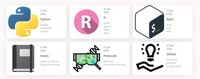
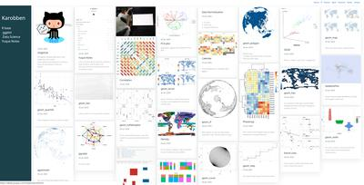

# Karobben.github.io
Karobbon

Location: <a href="https://github.com/Karobben">https://github.com/Karobben</a>

# [Why Do I Start A Blog?](https://karobben.github.io/Others/Whyblog.html)
> [Why?](https://karobben.github.io/Others/Whyblog.html) Because writing html is fun. And I want to practice my English, too.  
On the other hand, I'd like to share my experience for beginners on how to quickly fall in love with coding rather than be frustrated by it and give up to learn it.

# Who Am I?

I am not a Computer Science student but a Life Science student. And I learned almost all those skills from Dr. Baidu or Dr. Google. So, I am an amateur in this area. My codes are hard to read and have a huge improving space. So, I'll try to add clear comments in scripts, making them are easy to be hacked with and redistributed.

# What Will I Do with This Blog?

> As is shown in the picture, this blog has 6 main categories. Up three are python, R and Bash. They are all related to coding. The Notes is the notes for studying like English, Physics, etc. Protocols is a repository to store Bioinformatical Notes. The Others is an area to place something about something, like, my ideas.

> To concentrate on studying and working, I don't want to distribute copies on all different websites. As a result, I'd like to post my notes in  [Yuque](https://www.yuque.com/dashboard/books), upload my scripts in [Github](https://github.com/Karobben), and writing some posts here.  (Most of them would be posted on ["Others"]())

# R
> I devoted  most of my time in the first month to writing an graphical [index for Statistical visualization](https://karobben.github.io/R/R-index.html) (mostly are related to ggplot2). Just as I mentioned before, most of the posts are in [Yuque Notes](https://www.yuque.com/liuwenkan/rr), too.

