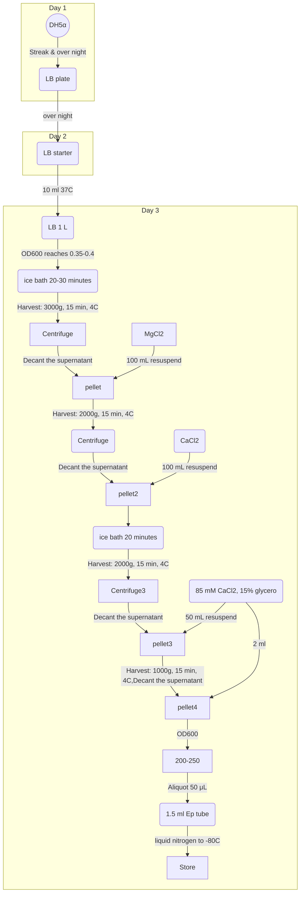

## Making Calcium Competent Cells

Preparing for Day 2:

**Chill overnight at 4°C**:
100 mM CaCl2
100 mM MgCl2
85 mM CaCl2, 15% gly  cerol v/v
Centrifuge rotor  

## Day 1

1. Streak out frozen glycerol stock of bacterial cells (Top10, DH5α, etc.) onto an LB plate (no antibiotics since these cells do not have a plasmid in them). Work sterile. Grow plate overnight at 37°C.

## Day 2
1. **Autoclave**:
1 L LB (or your preferred media)
1 L of 100 mM CaCl2
1 L of 100 mM MgCl2
100 mL of 85 mM CaCl2, 15% glycerol v/v
4 centrifuge bottles and caps
Lots of microfuge tubes

2. **Chill overnight at 4°C**:
100 mM CaCl2
100 mM MgCl2
85 mM CaCl2, 15% glycerol v/v
Centrifuge rotor

3. Prepare starter culture of cells
Select a single colony of E. coli from fresh LB plate and inoculate a 10 mL starter culture of LB (or your preferred media – no antibiotics). Grow culture at 37°C in shaker overnight.

Notes:
• You will have extra CaCl2 and MgCl2. These solutions can be saved and reautoclaved for the next time you make competent cells.
• You can also substitute other media like SOB, 2xYT, etc. for the LB if you prefer.
• All glassware should be detergent free. Presence of detergent reduces
competency of cells.

## Day 3
1. Inoculate 1 L of LB media with 10 mL starter culture and grow in 37°C shaker. Measure the OD600 every hour, then every 15-20 minutes when the OD gets above 0.2.

2. When the OD600 reaches 0.35-0.4, immediately put the cells on ice. Chill the culture for 20-30 minutes, swirling occasionally to ensure even cooling. Place centrifuge bottles on ice at this time.

    **IMPORTANT NOTES**:
    • It is important not to let the OD get any higher than 0.4. The OD should be carefully monitored and checked often, especially when it gets above 0.2, as the cells grow exponentially. It usually takes about 3 hours to reach an OD of 0.35 when using a 10 mL starter culture.
    • It is also very important to keep the cells at 4°C for the remainder of the procedure. The cells, and any bottles or solutions that they come in contact with, must be pre-chilled to 4°C.

3. (Spin #1) Split the 1 L culture into four parts by pouring about 250 mL into ice cold centrifuge bottles. Harvest the cells by centrifugation at 3000g (~4000 rpm in the Beckman JA-10 rotor) for 15 minutes at 4°C.
4. Decant the supernatant and gently resuspend each pellet in about 100 mL of ice cold MgCl2. Combine all suspensions into one centrifuge bottle. Make sure to prepare a blank bottle as a balance.
5. (Spin #2) Harvest the cells by centrifugation at 2000g (~3000 rpm in the Beckman JA-10 rotor) for 15 minutes at 4°C.
6. Decant the supernatant and resuspend the pellet in about 200 mL of ice cold CaCl2. Keep this suspension on ice for at least 20 minutes. Start putting 1.5 mL microfuge tubes on ice if not already chilled.
7. (Spin #3) Harvest the cells by centrifugation at 2000g (~3000 rpm in the Beckman JA-10 rotor) for 15 minutes at 4°C. At this step, rinse a 50 mL conical tube with ddH2O and chill on ice.
8. Decant the supernatant and resuspend the pellet in ~50 mL of ice cold 85 mM CaCl2, 15% glycerol. Transfer the suspension to the 50 mL conical tube.
9. (Spin #4) Harvest the cells by centrifugation at 1000g (~2100 rpm in the Beckman GH-3.8 rotor) for 15 minutes at 4°C.
10. Decant the supernatant and resuspend the pellet in 2 mL of ice cold 85 mM CaCl2, 15% glycerol. The final OD600 of the suspended cells should be ~ 200-250.
11. Aliquot 50 μL into sterile 1.5 mL microfuge tubes and snap freeze with liquid nitrogen. Store frozen cells in the -80°C freezer.

---
Advocation:

This protocol belongs to [berkeley.edu 2008](http://mcb.berkeley.edu/labs/krantz/protocols/calcium_comp_cells.pdf). I just gently reset part of the sentences.
If there are any offensive behaviors, please contact <a mailto="a591465908@outlook.com">me</a> and I'll delete it
