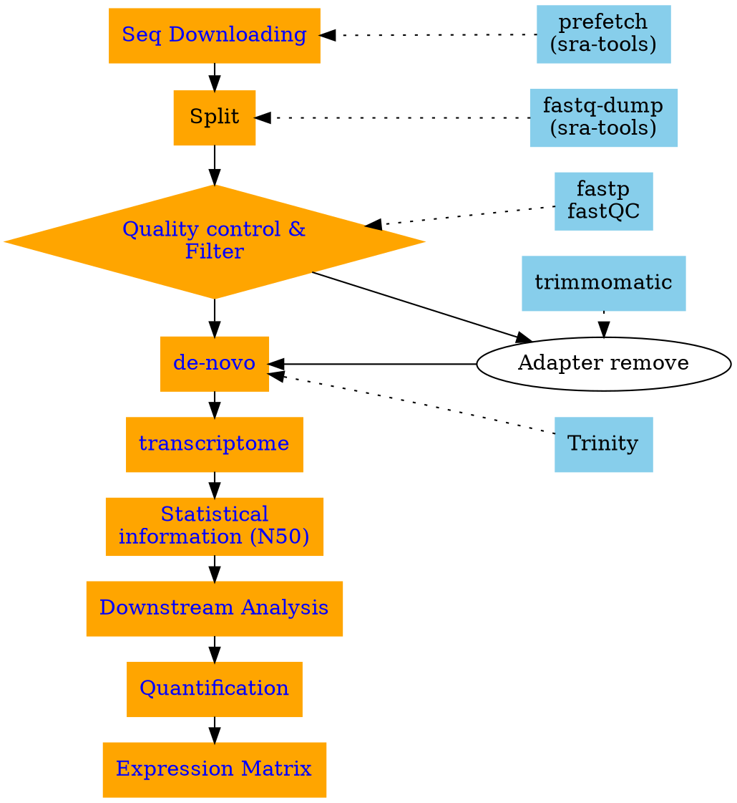

## RNA-seq with Trinity



## Downloading RNA-Seq sequences

For this practicing, I found a group of mouse RNA-Seq which have replicates and the size of SRA is easy handle for your PC.

SRR14962733	to SRR149627346

```bash
prefetch SRR14962733
prefetch SRR14962734
prefetch SRR14962735
prefetch SRR14962736

# or
for i in {3..6};
  do prefetch  SRR1496273$i;
done
```

download with ascp
```bash
##### Downloading the RNA-seq
prefetch  --ascp-path "/usr/bin/ascp|/home/ken/.aspera/connect/etc/asperaweb_id_dsa.putty" ERR025599
```

## Seq Clean

### Turn sra to fastq
```bash
## move the result from default directory to local
mv ~/ncbi/public/sra .

##### Split SSR to fastq
fastq-dump --defline-seq '@$sn[_$rn]/$ri' --split-files sra/*
mkdir fastq
mv *fastq fastq
```

### Quality control

SRA download from NCBI doesn't included the ASCII grades of the reads now. So, we can't doing this for free-download reads. I'll skip this step.
```bash
##### cut the low quality reads
##basic command
##fastp -u 15 -w 8 -i SRR7760055_1.fastq -o cut_SRR7760055_1.fastq
for i in $(ls *.fastq);do  fastp -u 15 -w 8 -i $i -o cut_$i; mv fastp.html $i.html;done

##### Trimmomatic cut the lower grade head or tail jodged by the quality report
java -jar  trimmomatic-0.38.jar SE -threads 8 -phred33 SRR771602.fastq 2.fq ILLUMINACLIP:TruSeq3-SE:2:30:10 LEADING:3 TRAILING:3 SLIDINGWINDOW:4:15 MINLEN:36 HEADCROP:10 CROP:87
for i in $(ls cut_SRR77600*);do
  java -jar  trimmomatic-0.38.jar SE -threads 8 -phred33 $i 2_$i ILLUMINACLIP:TruSeq3-SE:2:30:10 LEADING:3 TRAILING:3 SLIDINGWINDOW:4:15 MINLEN:36 HEADCROP:10 CROP:87
done

```

## De-novo

> We recommend generating a single Trinity assembly based on combining all reads across all samples as inputs.
> cite: [Tirnity wiki](https://github.com/trinityrnaseq/trinityrnaseq/wiki/Trinity-Differential-Expression#differential-expression-analysis-using-a-trinity-assembly)

Now, waiting...
```bash
# merge all reads
cat fastq/* > all.fastq

##Trnity
Time1=$(date)
Trinity --seqType fq --max_memory 55G --single all.fastq --CPU 8 --full_cleanup
Time2=$(date)
```

It takes me 81 min.

### errors
<pre>
Error, do not understand options: fastq/SRR14962734_1.fastq
</pre>


## Result

I made a mistake. With the codes above, I got only three sequences. So, I suspect that mabey this is not RNA-Seq but miRNA-seq. I looked back to the NCBI and checking carefully this time. Guess what? This is a miRNA-Seq! = =

You can find the information in:

**Library**:
  *Name:* ...
  *Strategy:* miRNA-Seq

Now, let's repeat the codes above with another groups: SRR14962739-SRR14962742


```bash
# or
for i in {39..42};
  do prefetch  SRR149627$i;
done
```

check the time consuming:
```bash
du all.fastq
echo $Time1
echo $Time2
```
<pre>
14G	all.fastq
Sun Jul  4 06:20:58 PM CST 2021
Mon Jul  5 02:36:32 AM CST 2021
</pre>

about 8 hours


## Statistical information of the result

Trinity supplied a perl script to calculating and evaluating the result: `TrinityStats.pl`

It has two group of results:
1. Stats based on ALL transcript contigs:
2. Stats based on ONLY LONGEST ISOFORM per 'GENE':
```bash
 {$path}/trinityrnaseq-v2.12.0/util/TrinityStats.pl trinity_out_dir.Trinity.fasta
```

<pre>
################################
## Counts of transcripts, etc.
################################
Total trinity 'genes':	41400
Total trinity transcripts:	42451
Percent GC: 49.50

########################################
Stats based on ALL transcript contigs:
########################################

	Contig N10: 6068
	Contig N20: 4371
	Contig N30: 3377
	Contig N40: 2687
	Contig N50: 2100

	Median contig length: 426
	Average contig: 991.80
	Total assembled bases: 42102797

#####################################################
## Stats based on ONLY LONGEST ISOFORM per 'GENE':
#####################################################

	Contig N10: 5781
	Contig N20: 4155
	Contig N30: 3202
	Contig N40: 2543
	Contig N50: 1982

	Median contig length: 415
	Average contig: 948.27
	Total assembled bases: 39258319
</pre>


## Downstream Analysis

We are processing the downstream analysis based on the scripts trinity supplied. Most of them are in the ${Trinity directory}/util/

<pre  style="color:#a1f174;background:#2e2e2e">
TrinityStats.pl
abundance_estimates_to_matrix.pl
align_and_estimate_abundance.pl
analyze_blastPlus_topHit_coverage.pl
filter_low_expr_transcripts.pl
insilico_read_normalization.pl
retrieve_sequences_from_fasta.pl
sift_bam_max_cov.pl
</pre>

`TrinityStats.pl` is for calculating the value of N50

### Align and Abundance Estimate

The script, `align_and_estimate_abundance.pl`, was used here to estimate the abundances of each transcripts from your transcriptome library. More details about this scripts is in [trinity wiki](https://github.com/trinityrnaseq/trinityrnaseq/wiki/Trinity-Transcript-Quantification)

Because we have replicates, we need a file to interpreted the groups. (`group.csv`)

<pre>
miR-31    miR-31_rep1    fastq/SRR14962739_1.fastq
miR-31    miR-31_rep2    fastq/SRR14962740_1.fastq
Scr-2    Scr-2_rep1    fastq/SRR14962741_1.fastq
Scr-2    Scr-2_rep2    fastq/SRR14962742_1.fastq
</pre>


```bash
~/Bio/trinityrnaseq-v2.12.0/util/align_and_estimate_abundance.pl --transcripts trinity_out_dir.Trinity.fasta --seqType fq --samples_file group.csv --est_method RSEM --aln_method bowtie --trinity_mode --prep_reference --output_dir rsem_outdir
```

It could build index, pair the reads and counting the matched reads automatically.

It using the file automatically generated by Trinity assembly to distinguish the gene and isoform. An example of `trinity_{sample}.Trinity.fasta.gene_trans_map` looks like below. Two columns are seperated by `Tab` which the first column is Gene ID and the second column is isoform ID.
<pre>
TRINITY_DN9652_c0_g1	TRINITY_DN9652_c0_g1_i2
TRINITY_DN9653_c0_g1	TRINITY_DN9653_c0_g1_i1
TRINITY_DN9630_c0_g1	TRINITY_DN9630_c0_g1_i1
TRINITY_DN9699_c0_g1	TRINITY_DN9699_c0_g1_i1
TRINITY_DN9681_c0_g1	TRINITY_DN9681_c0_g1_i1
TRINITY_DN9660_c0_g1	TRINITY_DN9660_c0_g1_i1
</pre>

!!! warning Not Trinity assembled results
    if you don't have this file, you can using parameters `--gene_trans_map`. The difference between this to parameters are explained in `--help`

<pre>
#  --gene_trans_map <string>        file containing 'gene(tab)transcript' identifiers per line.
#     or  
#  --trinity_mode                   Setting --trinity_mode will automatically generate the gene_trans_map and use it.
</pre>

After down, you'll got a bunch of result. The abaundance file was in the directories `miR-31_rep1, miR-31_rep2, Scr-2_rep1, Scr-2_rep2` as the statistic scripts, the result was divided into two groups, gene and isoforms: `RSEM.genes.results  RSEM.isoforms.results`. This is where the `count`, `TPM`, and `FPKM` were generated and stored (If you are using **RSEM**).

`FPKM`: fragments per kilobase transcript length per million fragments mapped
`TPM`: transcripts per million transcripts


```bash
# Check the results.
head miR-31_rep1/RSEM.isoforms.results
```

<pre>
transcript_id	gene_id	length	effective_length	expected_count	TPM	FPKM	IsoPct
TRINITY_DN10000_c0_g1_i1	TRINITY_DN10000_c0_g1	3506	3457.00	489.00	10.97	6.58	100.00
TRINITY_DN10001_c0_g1_i1	TRINITY_DN10001_c0_g1	441	392.00	15.00	2.97	1.78	100.00
TRINITY_DN10002_c0_g1_i1	TRINITY_DN10002_c0_g1	5392	5343.00	2609.00	37.85	22.73	100.00
TRINITY_DN10003_c0_g1_i1	TRINITY_DN10003_c0_g1	1419	1370.00	1995.00	112.89	67.78	100.00
TRINITY_DN10004_c0_g1_i1	TRINITY_DN10004_c0_g1	3829	3780.00	1715.00	35.17	21.12	100.00
TRINITY_DN10005_c0_g1_i1	TRINITY_DN10005_c0_g1	2379	2330.00	1755.00	58.39	35.06	100.00
</pre>

!!! note How it works with bowtie2 and RSEM

    By checking the log of Trinity, the codes from bowtie2 to RSEM could be:

    ```bash
    bowtie2 --no-mixed --no-discordant --gbar 1000 --end-to-end -k 200  \
    -q  -x DB/dmel-all-transcript-r6.39.fasta.bowtie2 \
    -U Merged_FQ/CF-1_S1.S.fq.gz -p 64 | samtools view -@ 64 -F 4 -S -b |\
    samtools sort -@ 64 -n -o bowtie2.bam
    touch bowtie2.bam.ok
    convert-sam-for-rsem bowtie2.bam bowtie2.bam.for_rsem
    ## Just can't understand what happened here
    samtools sort -n -@ 1 -m 1G -o bowtie2.bam.for_rsem.tmp.bam bowtie2.bam
    rsem-scan-for-paired-end-reads 1 bowtie2.bam.for_rsem.tmp.bam bowtie2.bam.for_rsem.bam
    rsem-sam-validator bowtie2.bam.for_rsem.bam
    rsem-parse-alignments /lustre/project/wdeng7/wliu15/kraken_RNA/DB/dmel-all-miRNA-r6.39.fasta.RSEM RSEM.temp/RSEM RSEM.stat/RSEM bowtie2.bam.for_rsem.bam 1 -tag XM
    rsem-build-read-index 32 1 0 RSEM.temp/RSEM_alignable.fq
    rsem-run-em /lustre/project/wdeng7/wliu15/kraken_RNA/DB/dmel-all-miRNA-r6.39.fasta.RSEM 1 RSEM RSEM.temp/RSEM RSEM.stat/RSEM -p 64
    rm -rf RSEM.temp
    rsem-calculate-expression  -p 64 --fragment-length-mean 200 \
    --fragment-length-sd 80   --no-bam-output --bam bowtie2.bam.for_rsem.bam DB/dmel-all-transcript-r6.39.fasta.RSEM RSEM
    touch RSEM.isoforms.results.ok
    ```
    0. prepare: build bowtie2 and RSEM index if there are not.
    1. Bowtie2 align reads from `-U` into indexed reference from `-x` and bowtie2.bam was created. After that, `bowtie2.bam.ok` was touched to mark this process is done
    2. bam was converted into `bowtie2.bam.for_rsem.bam` and started counting by using RSEM index


### Expression matrix

Of course that trinity supplied a script, `abundance_estimates_to_matrix.pl`, do it for you as well.

```bash
~/Bio/trinityrnaseq-v2.12.0/util/abundance_estimates_to_matrix.pl --est_method RSEM \
    --gene_trans_map trinity_out_dir.Trinity.fasta.gene_trans_map \
    --out_prefix RSEM \
    --name_sample_by_basedir \
      Scr-2_rep1/RSEM.isoforms.results \
      Scr-2_rep2/RSEM.isoforms.results \
      miR-31_rep1/RSEM.isoforms.results \
      miR-31_rep2/RSEM.isoforms.results
```

```bash
# my results of prefix is RSEM
ls RSEM*
```
<pre>
RSEM.gene.TMM.EXPR.matrix		   RSEM.gene.counts.matrix			 RSEM.isoform.TPM.not_cross_norm.runTMM.R
RSEM.gene.TPM.not_cross_norm		   RSEM.isoform.TMM.EXPR.matrix			 RSEM.isoform.counts.matrix
RSEM.gene.TPM.not_cross_norm.TMM_info.txt  RSEM.isoform.TPM.not_cross_norm
RSEM.gene.TPM.not_cross_norm.runTMM.R	   RSEM.isoform.TPM.not_cross_norm.TMM_info.txt
</pre>

Now, all the matrix were extracted from separated results of samples.

move them into a new directory
```bash
mkdir RSEM_result
mv RSEM* RSEM_result
```

### Errors
1. libreadline
<pre>
/home/ken/miniconda3/envs/Biostation/lib/R/bin/exec/R: error while loading shared libraries: libreadline.so.6: cannot open shared object file: No such file or directory
</pre>

chech the libreadlines:
```bash
ls /lib/libreadline.*
```
<pre>
/lib/libreadline.so  /lib/libreadline.so.8  /lib/libreadline.so.8.1
</pre>

The problem is this script is relying on an very old version. So, you can heck on the script, or cheat it.
This is how I fool the script:
```bash
sudo ln -s /lib/libreadline.so.8 /lib/libreadline.so.6
```

2. libncurses
<pre>
/home/ken/miniconda3/envs/Biostation/lib/R/bin/exec/R: error while loading shared libraries: libncurses.so.5: cannot open shared object file: No such file or directory
</pre>

The same as error 1

```bash
sudo ln -s /lib/libncursesw.so.6  /lib/libncurses.so.5
```

### Low-Expression Reads Filter

The results of the matrix are huge. we got 42451 pieces of isforms but lot's of them are low expression gene we want to remove. You can achive this by using R. Trinity supplied the related scripts to handle with this, too.

This is the function in R to down the same thing as the scripts from Trinity
```r
A <- read.table("RSEM.isoform.TPM.not_cross_norm")

Filter <- function(A, Th){
  tmp = A
  for(i in c(1:ncol(A))){
    tmp = tmp[which(tmp[,i] < Th),]
  }
  return(tmp)
}
```

In trinity, perl scripts, `util/misc/count_matrix_features_given_MIN_TPM_threshold.pl`, is aiming to that the genes/isoforms expressed above a minimum TPM expression threshold in any sample.

```bash
~/Bio/trinityrnaseq-v2.12.0/util/misc/count_matrix_features_given_MIN_TPM_threshold.pl \
    RSEM.isoform.TPM.not_cross_norm
```
<pre>
neg_min_tpm	num_features
-6771	1
-6758	2
-6185	3
-6092	4
.
.
.
-4	36909
-3	41004
-2	42353
-1	42440
0	42451
</pre>

In this result, `-1 42440` means that 42440 isoforms's TPM is larger than 1 in all samples. You can get the same result with the function in R above. (`Filter(A, 1)`)

Ploting the result

```bash
# write the result into a file
~/Bio/trinityrnaseq-v2.12.0/util/misc/count_matrix_features_given_MIN_TPM_threshold.pl RSEM.isoform.TPM.not_cross_norm| tee isoform_matrix.TPM.not_cross_norm.counts_by_min_TPM
```

Plot the result with R
```r
data = read.table("isoform_matrix.TPM.not_cross_norm.counts_by_min_TPM", header=T)
plot(data, xlim=c(-100,0), ylim=c(0,100000), t='b')
```


### Filtering

By the function above, you can easily filtering the matrix from the row matrix. Trinity also supplied a pl script to extracting the transcripts from your transcriptome (you fasta file) to build a new library.

```bash
~/Bio/trinityrnaseq-v2.12.0/util/filter_low_expr_transcripts.pl  \
  --matrix RSEM.isoform.TPM.not_cross_norm \
  --transcripts ../trinity_out_dir.Trinity.fasta \
  --min_expr_any  5
```


### Expression matrix QC

#### Checking the replicates
relied R packages: fastcluster,
```bash
~/Bio/trinityrnaseq-v2.12.0/Analysis/DifferentialExpression/PtR  \
    --matrix RSEM_result/RSEM.isoform.counts.matrix \
    --samples group.csv --log2 --CPM \
    --min_rowSums 10 \
    --compare_replicates
```
<pre>
Processing replicate QC analysis for sample:  miR-31
for plotting:: min.raw: 0.994299466204194 max.raw: 1
Processing replicate QC analysis for sample:  Scr-2
for plotting:: min.raw: 0.993762297454055 max.raw: 1
</pre>

You'll get the PDF result like it's show in [Trnity wiki](https://github.com/trinityrnaseq/trinityrnaseq/wiki/QC-Samples-and-Biological-Replicates#compare-replicates-for-each-of-your-samples)

#### Checking all groups

```bash
~/Bio/trinityrnaseq-v2.12.0/Analysis/DifferentialExpression/PtR  \
    --matrix RSEM_result/RSEM.isoform.counts.matrix \
    --samples group.csv --log2 --CPM \
    --min_rowSums 10 \
    --sample_cor_matrix
```


**PCA Analysis**
```bash
~/Bio/trinityrnaseq-v2.12.0/Analysis/DifferentialExpression/PtR  \
    --matrix RSEM_result/RSEM.isoform.counts.matrix \
    --samples group.csv --min_rowSums 10 --log2 \
    --CPM --center_rows \
    --prin_comp 3
```


### Differential Expression Matrix

Here we are supposed to using counts file for calculating.

```bash
~/Bio/trinityrnaseq-v2.12.0/Analysis/DifferentialExpression/run_DE_analysis.pl \
          --matrix RSEM_result/RSEM.gene.counts.matrix \
          --method voom \
          --samples_file group.csv
```

a `voom.******.dir` directory was generated by default.

You can also using `edgeR/DESeq2` instead of `voom`

### Extracting and clustering differentially expressed transcripts

Now, enter the directory generated above and run codes below

```bash
~/Bio/trinityrnaseq-v2.12.0/Analysis/DifferentialExpression/analyze_diff_expr.pl\
  --matrix ../RSEM_result/RSEM.gene.TMM.EXPR.matrix -P 1e-3 -C 2
```

Now, you can have the ugly heatmap `^_^`


I tried those three different algorithms and get different results.

Packages|Number of DEGs
:-|:-
edgeR|149
DESeq2|167
Voom|18


---
<pre>

.
├── DB
│   └── dmel-all-miRNA-r6.39.fasta
├── Merged_FQ
│   └── CF-1_S1.S.fq.gz
└── Trinity.map

</pre>

```bash
# Prepare bowtie2 referennce
bowtie2-build --wrapper basic-0 DB/dmel-all-miRNA-r6.39.fasta DB/dmel-all-miRNA-r6.39.fasta.bowtie2

# Prepare the RSEM reference
# Here you can also using gtf by --gtf instead of --transcript-to-gene-map
rsem-prepare-reference --transcript-to-gene-map Trinity.map DB/dmel-all-miRNA-r6.39.fasta DB/dmel-all-miRNA-r6.39.fasta.RSEM

#rsem-synthesis-reference-transcripts DB/dmel-all-miRNA-r6.39.fasta.RSEM 0 1 Trinity.map DB/dmel-all-miRNA-r6.39.fasta

## prepaire an working directory
mkdir CF-1_S1_miRNA; cd CF-1_S1_miRNA

# bowtie align first. After that, bowtie2.bam was generated
bowtie2 --no-mixed --no-discordant --gbar 1000 --end-to-end -k 200  -q -x ../DB/dmel-all-miRNA-r6.39.fasta.bowtie2 -U ../Merged_FQ/CF-1_S1.S.fq.gz -p 64 | samtools view -@ 64 -F 4 -S -b | samtools sort -@ 64 -n -o bowtie2.bam
# touch this file to indicate bowtie2 process is done
touch bowtie2.bam.ok

# convert = = I don't know why we need this step
convert-sam-for-rsem bowtie2.bam bowtie2.bam.for_rsem

# why they do it agian????
# it seams like it can only do paired reads. So, it create another set when the reads are single end
samtools sort -n -@ 1 -m 1G -o bowtie2.bam.for_rsem.tmp.bam bowtie2.bam
rsem-scan-for-paired-end-reads 1 bowtie2.bam.for_rsem.tmp.bam bowtie2.bam.for_rsem.bam

#Conversion is completed. bowtie2.bam.for_rsem.bam will be checked by 'rsem-sam-validator'.
rsem-sam-validator bowtie2.bam.for_rsem.bam
rsem-parse-alignments ../DB/dmel-all-miRNA-r6.39.fasta.RSEM RSEM.temp/RSEM RSEM.stat/RSEM bowtie2.bam.for_rsem.bam 1 -tag XM
rsem-build-read-index 32 1 0 RSEM.temp/RSEM_alignable.fq

rsem-run-em ../DB/dmel-all-miRNA-r6.39.fasta.RSEM 1 RSEM RSEM.temp/RSEM RSEM.stat/RSEM -p 64
rsem-calculate-expression -p 64 --fragment-length-mean 200 --fragment-length-sd 80   --no-bam-output --bam bowtie2.bam.for_rsem.bam ../DB/dmel-all-miRNA-r6.39.fasta.RSEM RSEM
```

<pre>
.
└── CF-1_S1_miRNA
    ├── bowtie2.bam
    ├── bowtie2.bam.for_rsem.bam
    ├── bowtie2.bam.for_rsem.tmp.bam
    ├── bowtie2.bam.ok
    ├── RSEM.genes.results
    ├── RSEM.isoforms.results
    └── RSEM.stat
</pre>


Now, you can have the result from `RSEM.genes.results`, or isoform infromation from `RSEM.isoforms.results`.


!!! error RSEM errors
    ```bash cmd: rsem-prepare-reference
    rsem-prepare-reference  --transcript-to-gene-map Trinity.map DB/Updated_Drosophila_Viruses.fasta DB/Updated_Drosophila_Viruses.fasta.RSEM
    ```
    <pre>
    rsem-synthesis-reference-transcripts DB/Updated_Drosophila_Viruses.fasta.RSEM 0 1 Trinity.map DB/Updated_Drosophila_Viruses.fasta
    FASTA file DB/Updated_Drosophila_Viruses.fasta contains an unknown character, ~ (ASCII code 126), at line 24057, position 43!
    "rsem-synthesis-reference-transcripts DB/Updated_Drosophila_Viruses.fasta.RSEM 0 1 Trinity.map DB/Updated_Drosophila_Viruses.fasta" failed! Plase check if you provide correct parameters/options for the pipeline!
    </pre>
    The error code is `contains an unknown character, ~ (ASCII code 126), at line 24057, position 43!` in the second line. By following this codes and check the line 24057, we can find  "~" in the sequence.
    <pre>AGCGCATTGGAGCGGGATTCCGGATCTTACTTCGATGTGGCT~CCCCTCACTC~GCATTG</pre>
    After cleaned all "~" by using `sed`, the code passed.


## Another Example in Slurm Server


```bash
# load module
module load trinity/2.8.5
module load bwa bowtie2/2.3.3 rsem/1.2.31 samtools/1.5

# Prepar the group list
for SAMPLE in $(ls ../../RNA_RAW/*/*/*fastq.gz |awk -F "/" '{print $NF}'| sed 's/_L00[12]_R[12]_001.fastq.gz//'| sort |uniq);
    do echo $SAMPLE
done

ls ../../RNA_RAW/*/*/*fastq.gz > group.csv
```


<style>
pre {
  background-color:#38393d;
  color: #5fd381;
}
</style>
