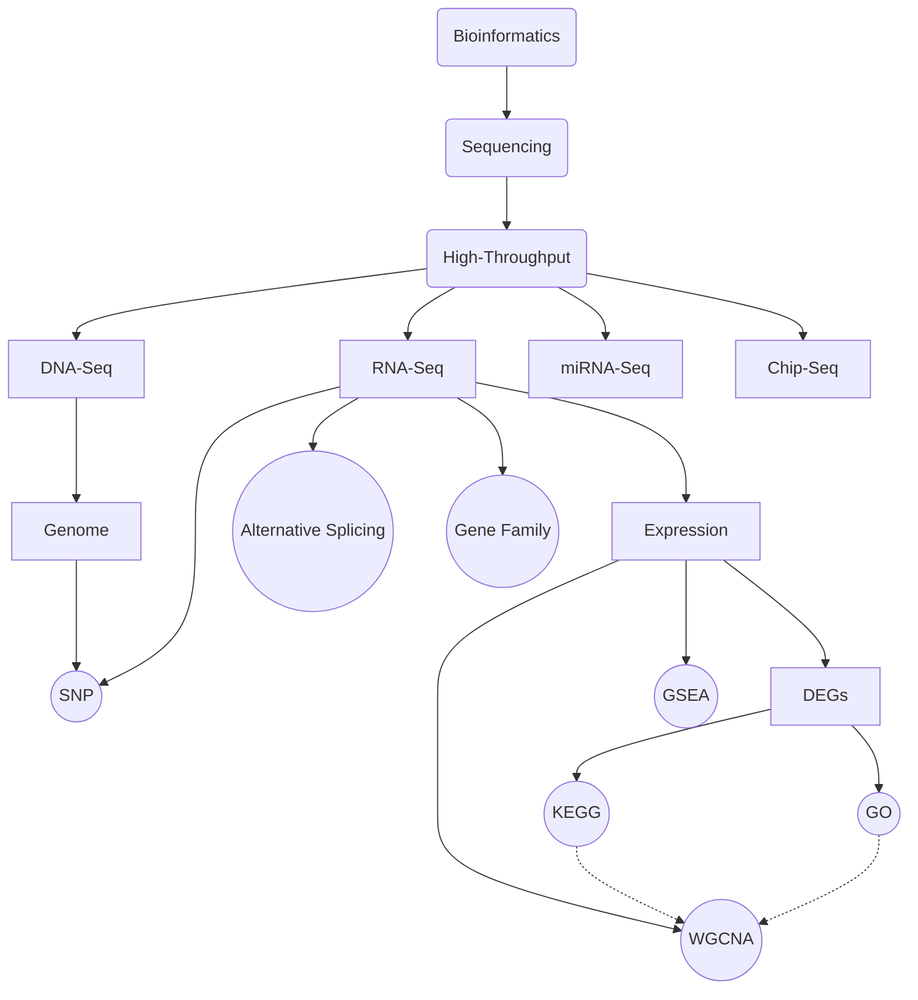

## Skill NetWork

```mermaid
graph TB;
   START(Bioinformatics)

   A1(Sequencing)
     A_A1(High-Throughput)
  AltS((Alternative Splicing))
  WGCNA((WGCNA))
  GeneFa((Gene Family))
  SNP((SNP))
  GO((GO))
  KEGG((KEGG))
  GSEA((GSEA))

START  --> A1
A1 --> A_A1
  A_A1 --> DNA-Seq
  A_A1 --> RNA-Seq
  A_A1 --> miRNA-Seq
  A_A1 --> Chip-Seq

  DNA-Seq --> Genome
  Genome --> SNP
  RNA-Seq
    RNA-Seq --> SNP
    RNA-Seq --> AltS
    RNA-Seq --> GeneFa
    RNA-Seq --> Expression

    Expression
      Expression --> WGCNA
      Expression --> GSEA
      Expression --> DEGs
    DEGs
      DEGs --> KEGG
      DEGs --> GO
    WGCNA
      GO -.-> WGCNA
      KEGG -.-> WGCNA
  DNA-Seq
```

DEGs: Differential Expression Genes
SNP: Single Nuclear polymorphism
