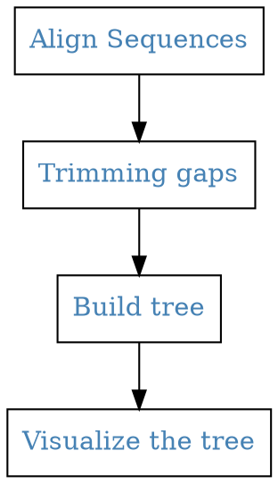

## Align your Sequence



### Set your arguments

```python
INPUT  = ""
OUTPUT = ""
ARG_TREE = "" # NJ / UPGMA
```

### Import libraries

```python
import os
from Bio.Align.Applications import ClustalwCommandline
from Bio import AlignIO
from Bio import Phylo
```


### Pre-align
```python
cwline = ClustalwCommandline("clustalw2", infile= INPUT, outfile = OUTPUT + ".fasta",  output= "fasta" )
print(cwline)
stdout, stderr = cwline()
```

<pre>
clustalw2 -infile=Base.fa -outfile=assignment2.fasta -output=fasta
</pre>

## Trimming the gap

Gap from the head and tail could have huge effects on the result of the tree. So, we should avoid the side effects from the gaps because of the length-difference.

Here, we just counting the gaps from the head and tail of each sequences and retain the largest number. On the other hand, the numbers' of gap extension were printed out so you can customize your own.

```python
## reading the alignments
align = AlignIO.read(OUTPUT + ".fasta", "fasta")

## Count the longest space on the head

Gap_head = 0
Gap_tail = 0
Gap_list_head = []
Gap_list_tail = []
for seq_tmp in align:
    Num = 0
    while seq_tmp[Num] == "-":
        Num +=1
    Gap_list_head += [Num]
    if Num > Gap_head:
        Gap_head = Num
## Count the longest space on the tail
for seq_tmp in align:
    Num = 0
    while seq_tmp[::-1][Num] == "-":
        Num +=1
    Gap_list_tail += [Num]
    if Num > Gap_tail:
        Gap_tail = Num

print("\nGap head list: ", Gap_list_head,
      "\nGap head tail: ", Gap_list_tail)
print("\nGap head: ", Gap_head,
      "\nGap head: ", Gap_tail)

## Count the longest space on the head


# Alignment objects can be manipulated

# slice alignment
align_slice = align[:, Gap_head : len(seq_tmp)-Gap_tail]
print ("Slice of alignment from position " + str(Gap_head) + " to " + str(Gap_tail) +"\n")
print(align_slice)

## wirte it out
F = open(OUTPUT + "_scliced.fa", 'w')
F2 = open(OUTPUT + "_gap.fa", 'w')
for Seq_tmp in align_slice:
    F.write(">" + Seq_tmp.id+"\n")
    F2.write(">" + Seq_tmp.id+"\n")
    Seq_seq = str(Seq_tmp.seq)
    F2.write(Seq_seq+"\n")
    Seq_seq = Seq_seq.replace("-","")
    F.write(Seq_seq+"\n")
F.close()
F2.close()

```
<pre>
Gap head list:  [115, 115, 86, 86, 86, 115, 115, 115, 115, 115, 115, 115, 115, 115, 115, 115, 115, 115, 115, 91, 170, 70, 115, 117, 0, 115, 115, 192]
Gap head tail:  [13, 13, 13, 13, 13, 13, 13, 13, 13, 13, 13, 13, 13, 13, 13, 13, 13, 13, 13, 13, 13, 13, 13, 13, 13, 0, 0, 12]

Gap head:  192
Gap head:  13
Slice of alignment from position 192 to 13

Alignment with 28 rows and 167 columns
</pre>


## Build the tree
```python
##
# Make Phylogenetic Tree

cwline = ClustalwCommandline("clustalw2", infile= OUTPUT + "_gap.fa",  clustering = ARG_TREE, bootstrap = 1000)
print(cwline)
stdout, stderr = cwline()


tree = Phylo.read(OUTPUT.split(".")[0]+"_gap.phb", "newick")
Phylo.draw_ascii(tree)

# select the 3 sequences in the top branch of phylo tree

align_branch = align_slice[0:3]
print(align_branch)
```
<pre>
  , XP_009431258.3
  |
  | , XP_005584739.1
  | |
  |,| NP_001036203.1
  |||
  ||| XP_011717782.1
  ||
  |, XP_011852471.1
  ||
  || NP_001277233.1
  ||
  ,| XP_025230146.1
  ||
  |, AAU95547.1
  ||
  || XP_011803362.1
  ||
  || XP_010378328.1
  |
  | , XP_033039886.1
  |,|
  |||__ XP_037851661.1
  |||
  |||________ XP_026309478.1
  ||
  ||  ___ XP_011926036.1
  ||,|
  ||||_____ XP_017738318.1
  |||
  | |          _______________ XP_024205865.1
  | |_________|
  |           |_______________ XP_024205864.1
  |           |
  |           |_________________________________________ NP_175517.1
  |
  | XP_008962016.1
  |
  | XP_030866972.1
  |
  | XP_009250187.1
  |
  | XP_004041225.1
  |
  | XP_004041226.1
  |
  | XP_002827755.1
  |
  | XP_002827754.1
  _|
  , sp|P01241|SOMA_HUMAN
  |
  | XP_002827756.1
  |
  | XP_024090242.1
</pre>


## Visualizing it with ggtree
Reference: [ggplot2 extensions; 2016](https://exts.ggplot2.tidyverse.org/ggtree.html)

```r
args <- commandArgs(trailingOnly = TRUE)
print("Input", str(args))

library("ggtree")


tree <- read.tree(args)
ggtree(tree, branch.length = 'none') +
  geom_text2(aes(subset=!isTip, label=node), hjust= 1.5, vjust = -0.5) +
  geom_tiplab() +
  xlim(NA, 15 + length(strsplit(tree$tip.label[1], "*")[[1]])/2.5)
ggsave(paste(args, ".png", sep=""))
```

```python
### save the tree as png
PATH_lib = os.path.dirname(__file__)
CMD = "Rscript " + PATH_lib + "/lib/R/ggtree.R " + OUTPUT +  "_gap.phb"
print(CMD)
os.system(CMD)
```


## How to use

The quickest way:
- input file: `sample.fasta`
- output file prefix: `result`
- tree type: `UPGMA`

```bash
Seq2tree.py -i sample.fasta -o result -t UPGMA
```

results:
- result.fasta: original aligned file (with gaps)
- result_gap.fa: Trimmed file (with gaps)
- result_scliced.Trimmed file (with==out== gaps)
- result_gap.phb: Tree file
- result_gap.phb.png: Tree visualizing with ggtree
