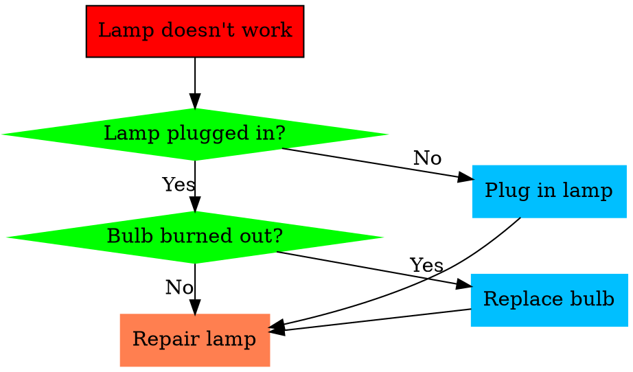

## Hexo Theme: Icarus


GitHub: [Ruipeng Zhang](https://github.com/ppoffice/hexo-theme-icarus)
Document: [PPOffice Blog](https://blog.zhangruipeng.me/hexo-theme-icarus/categories/)

<b style="background-color:salmon;font-size:20px; border-radius: 5px; padding:3px">Current Version: 4.0.0</b>

## Install

```bash
sudo apt upgrade node

hexo init /media/ken/Data/Github/hexo-icarus
cd /media/ken/Data/Github/hexo-icarus
sudo npm install -g hexo-cli
npm install

npm install hexo-theme-icarus
hexo config theme icarus
hexo server
```

!!! error Error Message
    <pre>
    (node:19025) ExperimentalWarning: The fs.promises API is experimental
    INFO  =======================================
    ██╗ ██████╗ █████╗ ██████╗ ██╗   ██╗███████╗
    ██║██╔════╝██╔══██╗██╔══██╗██║   ██║██╔════╝
    ██║██║     ███████║██████╔╝██║   ██║███████╗
    ██║██║     ██╔══██║██╔══██╗██║   ██║╚════██║
    ██║╚██████╗██║  ██║██║  ██║╚██████╔╝███████║
    ╚═╝ ╚═════╝╚═╝  ╚═╝╚═╝  ╚═╝ ╚═════╝ ╚══════╝
    =============================================</sub>
    INFO  === Checking package dependencies ===
    ERROR Package bulma-stylus is not installed.
    ERROR Package hexo-renderer-inferno is not installed.
    ERROR Please install the missing dependencies your Hexo site root directory:
    ERROR npm install --save bulma-stylus@0.8.0 hexo-renderer-inferno@^0.1.3
    ERROR or:
    ERROR yarn add bulma-stylus@0.8.0 hexo-renderer-inferno@^0.1.3
    </pre>


!!! note how to solve
    ``` bash
    npm install bulma-stylus
    npm install hexo-renderer-inferno
    hexo config theme icarus
    hexo server
    ```

!!! Error Error Message
    <pre>
    ERROR Package bulma-stylus's version (0.9.1) does not satisfy the required version (0.8.0).
    </pre>


!!! note how to solve
    ``` bash
    npm install bulma-stylus@0.8.0
    hexo config theme icarus
    hexo server
    ```

## Stylize

After you run `hexo new Notes`, a file nameds as `Notes.md` would be created in `source/_posts`. The head a few lines would be exactly as you stored in `./scaffolds/post.md`. As a result, you just need to change the words in that file to create your own model for all new posts. For example, I'll add some new features and a style feature for text block by change this file.  

```yml post.md
---
title:
ytitle:
date: {{ date }}
toc: true
description:
url: {{ title }}
excerpt:
tags:
category:
cover:
thumbnail:
covercopy: '© Karobben'
priority: 10000
---


<style>
pre {
  background-color:#38393d;
  color: #5fd381;
}
</style>
```

## icarus: To Do List

Before we started, there are a few other excellent posts I'd like to share with:
[iMaeGoo 2020](https://www.imaegoo.com/2020/icarus-with-bulma/): 活用 Bulma 美化 Icarus 文章

Anyway, let's follow the document first:
Document: [PPOffice Blog](https://blog.zhangruipeng.me/hexo-theme-icarus/categories/)

<p id="icarus_todo"></p>

- [X] [RSS](#icarus_rss)
- [X] [Image for post at Home page and Recent Block](#Thumbnail_Cover)
- [X] [Index](#icarus_index)
- [X] [Read more button in post card](#icarus_rm)
- [X] [Comment](#icarus_Comment)
- [X] [Personal file and images](#Log_Image)
- [X] [Share](#icarus_share)
- [X] [Baidu Statistics](#icarus_baidu_an)
- [X] [Anchor sidebars](#icarus_sb_anchor)
- [X] [Math Function](#icarus_math)
- [X] [Math Function fontSize](#icarus_mathf)
- [X] [admonition](#icarus_admonition)
- [x] [CC block](#icarus_cc)
- [x] [Footnote](https://karobben.github.io/2020/08/04/Blog/Hexo_footnotes)
- [x] [Lived 2D](https://karobben.github.io/2020/07/30/Blog/Hexo_live2d)
- [x] [Flow Chart & Mermaid Graph](#icarus_mermaid)
- [x] [Busuanzi statistic](#icarus_busuanzi)  
- [X] [Visitors for each posts](#icarus_busuanzi2)
- [x] [Copyright announcement for Cover image](#icarus_ccopy)
- [x] [Co-exist with waque](#icarus_waque)
- [x] [Change the size of the Logo](#icarus_logo)
- [x] [Stick the togs (headers)](#icarus_toc)
- [X] [`==`==high light==/==mark==`==`](#icarus_mark)
- [X] [limit height of `<pre>` and `<code>`](#icarus_pre)
- [X] [Abbreviation Change](#icarus_abbr)
- [X] [Sitemap](https://karobben.github.io/2021/03/22/Blog/hexo-sitemap)
- [X] [Visitor-traffics map](#icarus_map)
- [x] [Widget Graphviz](#icarus_graphviz)
- [X] [strike style](#icarus_strike)
- [x] [pre tag style for output](#icarus_pre)
- [ ] [Change the tags style in the post page]()
- [ ] [Change the article-meta line]()
- [ ] [Weather widget]()
- [ ] [Fold a part of the tags]()
- [ ] [Fold a part of the archives]()
- [ ] [Code highlight]()
---
Optional:
- [x] [Change the "latest posts" to "Recommended Post"](#icarus_sug)


## _config.icarus.yml


### RSS
- a, p, <span style="font-size:30px;color:salmon" id='icarus_rss'> RSS</span> span
```bash Terminal
# install the RSS plugin
npm install hexo-generator-feed
# Generate RSS XML file
hexo g
```
It indicates you made it if you can see the code below:
<pre>
...
INFO  Generated: 2020/06/10/R/WGCNA/index.html
INFO  Generated: <span style=color:salmon>atom.xml</span>
INFO  Generated: 2019/08/13/R/edgeR/index.html
INFO  Generated: content.json
INFO  690 files generated in 21 s
</pre>

Then, adding the path into `_config.icarus.yml`
```yml _config.icarus.yml
social_links:
    RSS:
        icon: fas fa-rss
        url: 'atom.xml'
```
<p id='Thumbnail_Cover'></p>

### Thumbnail & Cover[^weixin_30300225]
[^weixin_30300225]: [weixin_30300225, 2019: 安装配置hexo icarus主题配置](https://blog.csdn.net/weixin_30300225/article/details/97132344)

thumbnail is the image show in recent
cover is the image show in main page
  ```yml post.md
  ---
  cover: '/img/123.png'
  thumbnail: '/img/123.png'
  ---
  ```

<a id='icarus_index'></a>

### Index
```yml post.md
toc: true
---
```

<p id='icarus_rm'></p>

### Read More Button

```yml post.md
---
title: '123'
excerpt: "This post is for recording..."
---
```

<p id="icarus_Comment"></p>

### Comment[^Document1]
[^Document1]: [PPOffice, 2017: Icarus User Guide - Comment Plugins](https://blog.zhangruipeng.me/hexo-theme-icarus/Plugins/Comment/icarus-user-guide-comment-plugins)

<pre>
comment:
    type: utterances
    repo: Your-GitHub-Username/Your-Public-Repo-Name
    issue_term: pathname        # Required if issue_number is not set
    issue_number: 100           # Required if issue_term is not set. Every post can be mapped to a separate, manually-created GitHub issue.
    label: some-issue-label     # Optional
    theme: github-light         # Optional
    crossorigin: anonymous
</pre>

<p id="Log_Image"></p>

### log, favicon, and avatar
log is the img line with the action bar
```yml _config.icarus.yml
logo: # image of your logo

head:
  favicon: # image for web tag logo

  avatar: # image for profile
```

<p id='icarus_share'></p>

### Share
the easiest way:
```yml _config.icarus.yml
share:
    type: sharejs
```

<p id='icarus_baidu_an'></p>

### baidu_analytics[^Document2]
[^Document2]: [PPOffice, 2016: Icarus用户指南 - 网站分析插件](https://blog.zhangruipeng.me/hexo-theme-icarus/Plugins/Comment/icarus-user-guide-comment-plugins)


``` yml _config.icarus.yml
plugins:
    baidu_analytics:
        tracking_id: 3f06f2b************
```

<p id='icarus_sb_anchor'></p>

### Anchor Sidebar

``` yml _config.icarus.yml
sidebar:
    left:
        sticky: true
    right:
        sticky: true
```

<p id='icarus_math'></p>

### Math Function

```yml _config.icarus.yml
mathjax: true
```

<p id='icarus_mathf'></p>

### Math Function Font Size

The default size of the math function is the same size as the article which makes the functions are hard to distinguish from the main page.

The easiest method to alter their font-size is adding something if `themes/icarus/include/style/article.styl`:

PS:
- `.mjx-chtml` works on `$$` (double) quoted functions only.
- `.mjx-math` works on both `$$` and `$` quoted function.
```diff article.styl
article
  &.article
    .content
        word-wrap: break-word
        font-size: $article-font-size
+       span
+           .mjx-chtml
+                 overflow: auto
+                 max-width: 100%
+                 font-size: 1.5 em
+                 z-index: 999
+           .mjx-math
+                 font-size: 1.1 em
+                 font-weight: 700
+                 color: SteelBlue
+                 background-color:white;
```

|Default Style| Changed Style|
|:-:|:-:|
|||

<p id='icarus_admonition'></p>

### Admonition

reference: [lxl80/hexo-admonition](https://github.com/lxl80/hexo-admonition)

1. install the plugin:

```bash
npm install hexo-admonition --save
```

2. add the codes at the end of `themes/icarus/include/style/article.styl`:

```styl article.styl
.admonition {
      margin: 1.5625em 0;
      padding: .6rem;
      overflow: hidden;
      font-size: 1rem;
      page-break-inside: avoid;
      border-left: .3rem solid #42b983;
      border-radius: .3rem;
      box-shadow: 0 0.1rem 0.4rem rgba(0,0,0,.05), 0 0 0.05rem rgba(0,0,0,.1);
      background-color: #fafafa;
    }

    p.admonition-title {
      position: relative;
      margin: -.6rem -.6rem .8em -.6rem !important;
      padding: .4rem .6rem .4rem 2.5rem;
      font-weight: 700;
      background-color:rgba(66, 185, 131, .1);
    }

    .admonition-title::before {
      position: absolute;
      top: .9rem;
      left: 1rem;
      width: 12px;
      height: 12px;
      background-color: #42b983;
      border-radius: 50%;
      content: ' ';
    }

    .info>.admonition-title, .todo>.admonition-title {
      background-color: rgba(0,184,212,.1);
    }

    .warning>.admonition-title, .attention>.admonition-title, .caution>.admonition-title {
      background-color: rgba(255,145,0,.1);
    }

    .failure>.admonition-title, .missing>.admonition-title, .fail>.admonition-title, .error>.admonition-title {
      background-color: rgba(255,82,82,.1);
    }

    .admonition.info, .admonition.todo {
      border-color: #00b8d4;
    }

    .admonition.warning, .admonition.attention, .admonition.caution {
      border-color: #ff9100;
    }

    .admonition.failure, .admonition.missing, .admonition.fail, .admonition.error {
      border-color: #ff5252;
    }

    .info>.admonition-title::before, .todo>.admonition-title::before {
      background-color: #00b8d4;
      border-radius: 50%;
    }

    .warning>.admonition-title::before, .attention>.admonition-title::before, .caution>.admonition-title::before {
      background-color: #ff9100;
      border-radius: 50%;
    }

    .failure>.admonition-title::before,.missing>.admonition-title::before,.fail>.admonition-title::before,.error>.admonition-title::before{
      background-color: #ff5252;;
      border-radius: 50%;
    }

    .admonition>:last-child {
      margin-bottom: 0 !important;
    }
```

3. Use:

```bash
hexo clean
hexo s -g
```

```md post.md
!!! note Hexo-admonition 插件使用示例
    这是基于 hexo-admonition 插件渲染的一条提示信息。类型为 note，并设置了自定义标题。

    提示内容开头留 4 个空格，可以有多行，最后用空行结束此标记。

!!! warning
    这是一条采用默认标题的警告信息。
    <pre>
    Warning messages
    </pre>

!!! failure "嵌套链接及引用块"
    欢迎访问我的博客链接：[悟尘纪](https://www.lixl.cn)

    >这里嵌套一行引用信息。


!!! infor "嵌套链接及引用块"
    ```bash
    echo hello world
    ``\`
```


!!! note Hexo-admonition 插件使用示例
    这是基于 hexo-admonition 插件渲染的一条提示信息。类型为 note，并设置了自定义标题。

    提示内容开头留 4 个空格，可以有多行，最后用空行结束此标记。

!!! warning
    这是一条采用默认标题的警告信息。
    <pre>
    Warning messages
    </pre>

!!! failure "嵌套链接及引用块"
    欢迎访问我的博客链接：[悟尘纪](https://www.lixl.cn)

    >这里嵌套一行引用信息。


!!! infor "嵌套链接及引用块"
    ```bash
    echo hello world
    ```

<p id='icarus_cc'></p>

### CC block
You can't alter the infor from `_config.icarus.yml` because everything is recorded in `_congig.yml`...

```yml _congig.yml
title: Karobben
subtitle: ''
description: ''
keywords: Biology, Data Science, Bioinformatics
author: Karobben
language: en
timezone: ''
url: 'https://karobben.github.io/'
```
### edit the footer
You may can't find the `hexo-theme-icarus` in your theme directory. So, for editing the role module, we can editing them in `node_modules/hexo-theme-icarus`

<p id='icarus_mermaid'></p>

## FlowChart & Mermaid

FlowChart and Mermaid: [link](https://karobben.github.io/2020/06/14/Blog/Hexo_gitpage/#flow-and-mermaid-support)

For icarus, hexo document didn't give the resolution for `jsx` file.
So, I insert the  `<script src="https://unpkg.com/mermaid@8.8.4/dist/mermaid.min.js"></script>` directly in `themes/icarus/layout/common/scripts.jsx`

```jsx scripts.jsx
return <Fragment>
    <script src={cdn('jquery', '3.3.1', 'dist/jquery.min.js')}></script>
    <script src={cdn('moment', '2.22.2', 'min/moment-with-locales.min.js')}></script>
    {clipboard && <script src={cdn('clipboard', '2.0.4', 'dist/clipboard.min.js')} defer></script>}
    <script dangerouslySetInnerHTML={{ __html: `moment.locale("${language}");` }}></script>
    <script dangerouslySetInnerHTML={{ __html: embeddedConfig }}></script>
    <script src={url_for('/js/column.js')}></script>
    <Plugins site={site} config={config} page={page} helper={helper} head={false} />
    <script src={url_for('/js/main.js')} defer></script>
    // mermaid script
    <script src="https://unpkg.com/mermaid@8.8.4/dist/mermaid.min.js">
    </script>
    // mermaid script ends
</Fragment>;
}
```

It's not the best resolution, but it works.
And a problem is it can't show the whole word if the word is long.

<p id='icarus_busuanzi'></p>

## Busuanzi

You can try to enable the `busuanzi` plugin in `_congig.icarus.yml`. But I have no idea why that it doesn't work all the time. But it still doen't work at first. Thanks for BoyInTheSun[^BoyInTheSun]. It seams like it conflicted to lived2d plugin. By solving this problem, the best solution is download the script to local and alter the script.

[^BoyInTheSun]: [BoyInTheSun, 2020: 解决live2d看板娘和busuanzi不蒜子计数冲突](https://boyinthesun.cn/post/error-live2d-busuanzi/#!)

Before you do this, make sure you have called the `busuanzi: false` in `_congig.icarus.yml` or it won't work.

Insert latest script inner the `<div class="level-start">` tags at `/themes/icarus/layout/common/footer.ejs` file

The latest script you can find at [BUSUANZI](http://busuanzi.ibruce.info/)
```ejs /themes/icarus/layout/common/footer.jsx
<script async src="//busuanzi.ibruce.info/busuanzi/2.3/busuanzi.pure.mini.js"></script>
            <span id="busuanzi_container_site_pv">本站总访问量<span id="busuanzi_value_site_pv"></span>次</span>
```

Go check the raw codes. if it shows that `<span id="busuanzi_container_site_uv" style="display: none;">` and nothing show at all, it means some plugin conflicted to it. You can fix this by following [another post](https://karobben.github.io/2021/02/21/Blog/hexo_lived2d_busuanzi/).

<p id='icarus_busuanzi2'></p>

## Visitors for each post[^busuanzi]

[^busuanzi]: [摆柿阔落, 2019: Hexo | 两个你可能会用到的icarus主题配置](https://susreal.com/article/2019/hexo-theme-icarus-2/)

This script is based on the Busaunzi script below
After you insert the codes below appropriately, we can add the codes below inner `<div class="level-left">` in `/themes/icarus/layout/common/article.jsx`

```jsx /themes/icarus/layout/common/article.jsx
{/* counts of this passage*/}
<i class="far fa-eye"></i>
<span>&nbsp;</span>
<span id="busuanzi_container_page_pv" style="display: inline;">
    <span id="busuanzi_value_page_pv">0</span>&nbsp;
</span>
{/* counts of this passage Done*/}
```

<p id='icarus_ccopy'></p>

## Copyright announcement for Cover image[^spantext]

[^spantext]:[开着拖拉机的梦想家, 2016: HTML让文字在图片上显示](https://blog.csdn.net/wu920604/article/details/53781377)

Result:


add a `covercopy` tag in the `md` header
```md ***.md
title: "Hexo theme: icarus"
date: "2021/02/11"
toc: true
covercopy: '© ppoffice'
```

Then, insert the codes below in `card-image` tag in `themes/icarus/layout/common/article.jsx` file as it's show.

```html
<span style="position: absolute; bottom: 0; right: 0; padding-right:3px; padding-left:4px; background-color: rgba(255, 255, 255, 0.6)" class="ccopy" dangerouslySetInnerHTML={{ __html: index && page.covercopy ? page.covercopy : page.covercopy }}></span>
```

My example:
```jsx article.jsx
{cover ? <div class="card-image">
    {index ? <a href={url_for(page.link || page.path)} class="image is-7by3">
        
    </a> : <span class="image is-7by3">
        
    </span>}
    <span style="position: absolute; bottom: 0; right: 0; padding-right:3px; padding-left:4px; background-color: rgba(255, 255, 255, 0.6)" class="ccopy" dangerouslySetInnerHTML={{ __html: index && page.covercopy ? page.covercopy : page.covercopy }}></span>
</div> : null}
```

<p id='icarus_waque'></p>

## 和瓦雀共存

瓦雀需要`summary.md`做index界面, 需要(可選) `layout.md` 做統一落款, 用 `yuque.yml` 做配置文件

如果直接使用, 則會出現如下圖片情況:


這些文件都會被渲染且置頂(因爲沒有時間). 非常難受.
查閱後可知, hexo 自帶的 `skip_render` 可以完美解決此方案. 因此, 只需要在`_config.yml` 中, 添加通配字符, 即可解決次問題.

```yml _config.yml
skip_render:
  - _posts/**/**.yml
  - _posts/**/layout.md
  - _posts/**/summary.md
  - _posts/**/index.md
```

之後, 記得 清除緩存, 再查看效果
```bash
hexo clean
hexo s --watch
```

用 python 腳本輔助更新語雀筆記: [腳本鏈接](https://karobben.github.io/2021/03/02/Python/yuqueAPI/)

<p id='icarus_logo'></p>

## Change the Size of the Logo

The size of the default logo was too small to fit the cell phone page.
So, I tried to alter the height from the raw code. But nothing happened. By retrieving the element one by one, you'll finally find that it sited an argument of `max-height: 1.75rem` for this class. The quick solution is to set a new value for `max-height` in `themes/icarus/include/style/navbar.styl`.(PS: I set it equals `3.8rem`)
Bsides, I also commented the `padding` and `margin` to make the header tight.
```css themes/icarus/include/style/navbar.styl
.navbar-item
    display: flex
    align-items: center
    /*padding: $navbar-item-padding-v $navbar-item-padding-h*/
    /*margin: $navbar-item-margin-v $navbar-item-margin-h*/
```
||||
|:--:|:--:|:--:|
|(c) Karobben<br>Before|(c) Karobben<br>After|(c) Karobben<br>The Final|


And this how I find everything.

By checking the raw codes, we can know the logo was:
```html
<a class="navbar-item navbar-logo" href="/">
  
</a>
```
The `class` is `navbar-logo`.
So, by searching this class, we can located it in
```bash
grep -s "navbar-logo" $(find themes/icarus)| awk -F":" '{print $1}'
```
<pre>
themes/icarus/include/style/navbar.styl
themes/icarus/layout/common/navbar.jsx
</pre>

By checking the `themes/icarus/layout/common/navbar.jsx`, there are nothing we can do.
```jsx
<a class="navbar-item navbar-logo" href={siteUrl}>
    {navbarLogo}
</a>
```

By checking the `themes/icarus/include/style/navbar.styl`, we now know,
```styl
.navbar-logo
    img
        max-height: $logo-height
```

Let's continue to retrive the `logo-height`
```bash
grep -s "logo-height" $(find themes/icarus)| awk -F":" '{print $1}'
```
<pre>
themes/icarus/include/style/base.styl
themes/icarus/include/style/footer.styl
themes/icarus/include/style/navbar.styl
</pre>

Finally, you'll find this in `themes/icarus/include/style/base.styl`:
```styl
$logo-height ?= 1.75rem
```

<p id="icarus_toc"></p>

## Stick the togs (headers/CATALOGUE)


In version V4.0, the scripts in `themes/icarus/layout/widget` are all gone except `profile.jsx`. I have no idea why. But by reading the [issue #740](), I thought maybe I can try to bring it back to the `widget`. When I firstly copy `toc.jsx` from [hexo-component-inferno](https://github.com/ppoffice/hexo-component-inferno/blob/master/src/view/widget/toc.jsx), it runs incorrectly:
<pre>
<span style="background-color:red;color:white">ERROR</span> {
  err: Error: Cannot find module '../../util/cache'
  Require stack:
  - /media/ken/Data/Github/hexo-icarus/themes/icarus/layout/widget/toc.jsx
  - /media/ken/Data/Github/hexo-icarus/node_modules/hexo-renderer-inferno/lib/compile.js
  - /media/ken/Data/Github/hexo-icarus/node_modules/hexo-renderer-inferno/index.js
      at Function.Module._resolveFilename (node:internal/modules/cjs/loader:923:15)
</pre>

Obviously, we lack a model named `cache.js`
So, I checked the repository again and found the `util/cache.js` at [here](https://github.com/ppoffice/hexo-component-inferno/blob/master/src/util/cache.js)

Instead of making another directory, I placed the `cache.js` to `themes/icarus/scripts/cache.js` and change the path in `themes/icarus/layout/widget/toc.jsx`

Here's how I achieved it:
1. copy the `cache.js` from [GitHub](https://github.com/ppoffice/hexo-component-inferno/blob/master/src/util/cache.js) to `themes/icarus/scripts/cache.js`
2. copy the `toc.jsx` from [GitHub](https://github.com/ppoffice/hexo-component-inferno/blob/master/src/view/widget/toc.jsx) to `themes/icarus/layout/widget/toc.jsx`
3. Replace the codes:
    ```diff toc.jsx
    - const { cacheComponent } = require('../../until/cache');
    + const { cacheComponent } = require('../../scripts/cache');
    ```
4. Adding the `is-sticky` in to the `class`[^Andy_2020]:
    ```diff toc.jsx
    - <div class="card widget" id="toc" data-type="toc">
    + <div class="card widget is-sticky" id="toc" data-type="toc">
    ```

[^Andy_2020]: [Andy Cen, 2020: Hexo-Icarus主题配置建议](https://blog.andycen.com/2020/03/07/Hexo-Icarus%E4%B8%BB%E9%A2%98%E9%85%8D%E7%BD%AE%E5%BB%BA%E8%AE%AE/#%E7%9B%AE%E5%BD%95%E7%B2%98%E6%80%A7%E5%B8%83%E5%B1%80)


```bash BASH
hexo clean
hexo g
```


<p id="icarus_sug"></p>

## Change the "latest posts" to "Recommended Post"

One of the sidebars is showing the latest posts. But, yeah, it is unnecessary since everything shows on the home page already. But it'll be a good place to place your most recommended or valuable posts. By doing that, we need to make a few changes.

### For old version[^somebody_2019]:

1. Find `\icarus\layout\widget\recent_posts.ejs`:
Change the code 1 to code 2
    ```diff ejs recent_posts.ejs
    - <% site.posts.sort('date', -1).limit(5).each(post => { %>
    + <% site.posts.sort('priority', -1).limit(5).each(post => { %>
    ```
2. Change the name of the block: Change the name in language is fine
    ```diff en.yml
    - recents: 'Recents'
    + recents: 'Recommend'
    ```

3. Adding the `priority` at the head of the posts.
    ```diff post.md
    ---
    title: "Hexo theme: icarus"
    date: "2021/02/11"
    toc: true
    + priority: 1
    ---
    ```

[^somebody_2019]: [somebody, 2019: hexo主题Icarus浅度修改教程](https://big-news.cn/2019/08/12/hexo%E4%B8%BB%E9%A2%98Icarus%E6%B5%85%E5%BA%A6%E4%BF%AE%E6%94%B9%E6%95%99%E7%A8%8B/)

### For Version 4.0
As is the situation in [above](#icarus_toc), we need to cp the files, first.

1. copy the  `article_media.jsx` from [GitHub](https://github.com/ppoffice/hexo-component-inferno/blob/master/src/view/common/article_media.jsx) to `layout/common/article_media.jsx`
2. copy the `recent_posts.jsx` [GitHub](https://github.com/ppoffice/hexo-component-inferno/blob/master/src/view/widget/recent_posts.jsx) to `themes/icarus/layout/widget/recent_posts.jsx`
3. Alter the require path:
    ```diff recent_posts.jsx
    - const { cacheComponent } = require('../../until/cache');
    + const { cacheComponent } = require('../../scripts/cache');
    ```
4. Alter the codes similar like the old version:
    ```diff recent_posts.jsx
    - .sort('date', -1)
    + .sort('priority')
    ```
5. Adding `priority` as same as above:
    ```diff post.md
    ---
    title: "Hexo theme: icarus"
    date: "2021/02/11"
    toc: true
    + priority: 1
    ---
    ```

<b style="background-color:salmon; border-radius: 5px; padding:3px">
Attention:</b>

It might not work if you didn't add `priority` to most of the posts and this takes me a few hours to found it out...

You can use `sed` to add the `priority` to all posts:
```bash
sed -i  '/^thumbnail:/a\priority: 10000'  $(find source/_posts/ -name "*.md")
```
Make sure that the `^thumbnail:` is unique to each post.  

```bash
hexo clean
hexo g
```

==Keep `_post` directory free with suspicious files==
<p id="icarus_mark"></p>

## Highlight/Mark

In markdown, we can using the `==` to mark words or sentences.
But the the default `mark` would be rendering to yellow: <span style="background-color:yellow">Highlight</span>
And my target is change it to <span style="background-color:salmon; border-radius: 5px; padding:3px">Highlight</span>

Open `include/style/article.styl`:

```diff article.styl
h5
    font-size: 1em

+    mark
+        background-color: salmon
+        padding: .2em
+        border-radius: .4em
```

```bash BASH
hexo clean
hexo g
```

<p id="icarus_pre"></p>

## max height for `<pre>` and `<code>`

The passage would be looked untidy if the `code` block or the `<pre>` block is too long. So, assign the `max-height` is a good choise.

Since `code` was embedded in `pre`, we just need to change `pre`.

Open `include/style/article.styl`:

```diff article.styl
pre
    font-size: .85em
+    max-height: 30em
```

```bash BASH
hexo clean
hexo g
```


<p id="icarus_abbr"></p>

## Abbreviation style

Though abbreviation is convenient in markdown, it is hard to achive in cellphone since there are no suspend events for touch screen. Adding an click event could make it friendly to cellphone users.

Open `include/style/article.styl`:

```styl article.styl
        abbr
          position: relative;
          color: seagreen

        abbr:active::before
          content: attr(title);
          white-space: nowrap;
          round: 90;
          position: absolute;
          top: 100%;
          background-color: #000000;
          color: #fff;
          border-radius: 5px;
          opacity:0.8;
          padding-left: 10px;
          padding-right: 10px;
          z-index: 999
```

Abbreviation grammar in markdown:
```md post.md
*[HB]: hemoglobin
HB
```
*[HB]: hemoglobin
HB


```bash BASH
hexo clean
hexo g
```

<p id="icarus_map"></p>

## Visitor-traffics map

Pick a Visitor traffics map server you like: [link](https://karobben.github.io/2021/03/22/Blog/hexo-worldmap/)

Personally, I'd like to adding it at the end of the profile:
so, the code would be inserted into `layout/widget/profile.jsx` around line-77.

```diff profile.jsx
        </div> : null}
        {socialLinks ? this.renderSocialLinks(socialLinks) : null}
      </div>
+
+      <div class= "card">
+        <script type="text/javascript" src="//rf.revolvermaps.com/0/0/7.js?i=${your ID}&m=0c&c=f03b11&cr1=ffffff&sx=0&cw=ffffff&cb=3472cd" async="async"></script>
+      </div>
+
    </div>;
  }
}
```

<p id="icarus_graphviz"></p>

## Widget Graphviz

[GitHub document](https://github.com/sounak98/hexo-graphviz)

- Install

```bash
npm install --save hexo-graphviz
# npm install https://github.com/dwatow/hexo-filter-viz.git
```

- Adding the script

Added this to `layout/common/footer.jsx` before `</footer>;`
```jsx footer.jsx
    {/*graphviz script start*/}
    <script src='https://cdnjs.cloudflare.com/ajax/libs/viz.js/1.7.1/viz.js'></script>
    {/*graphviz script end*/}
</footer>;
```

- (Optional) set the `max-width`
If the width of Graphviz is long, it may exceed out of the border.
`include/style/article.styl`

```diff article.styl
&.article
    .article-meta, .article-tags
        color: $text-light

    .article-meta
        overflow-x: auto
        margin-bottom: .5rem

    .article-more
        @extend .button.is-light

    .content
        word-wrap: break-word
        font-size: $article-font-size

+       svg
+         max-width : 100%;
```
include the code below in `graphviz`


<pre>
digraph F {
    rankdir = LR;
    edge [style=solid];
    node [style=filled, font=Courier];

    subgraph M {
        rank = same;
        Start [label = "Lamp doesn't work", shape = box, fillcolor = "#FF0000" ];
        End   [label = "Repair lamp"      , shape = box, color = coral];

        Con1 [label = "Lamp plugged in?", shape = diamond, color = green, size = 3];
        Con2 [label = "Bulb burned out?", shape = diamond, color = green, size = 3];
    }

    subgraph C {
        rank = same;
        RB [label = "Replace bulb", shape = box, color = deepskyblue1];
        AP [label = "Plug in lamp", shape = box, color = deepskyblue1];
    }

    Start -> Con1;
    Con1 -> AP   [label = "No"];
    Con1 -> Con2 [label = "Yes"];

    Con2 -> RB  [label = "Yes"];
    Con2 -> End [label = "No"];

    AP -> End
    RB -> End
}
</pre>




<p id="icarus_strike"></p>

## Strike Style

Open `include/style/article.styl`:

```diff article.styl
h5
    font-size: 1em

+   s
+       color: #00CD66
```

```bash BASH
hexo clean
hexo g
```


## Giscus

Origin blog: [Yury Zhauniarovich](https://zhauniarovich.com/post/2021/2021-06-giscus/)

1. Create public repository in your github (like 'Giscus')

<p id="icarus_pre"></p>

## Pre style

Add the codes below in each of md file

```css
<style>
pre {
  background-color:#38393d;
  color: #5fd381;
}
</style>

<pre>
Pre block presentation
Just love this style
</pre>
```
<pre>
Pre block presentation
Just love this style
</pre>

<style>
pre {
  background-color:#38393d;
  color: #5fd381;
}
</style>
