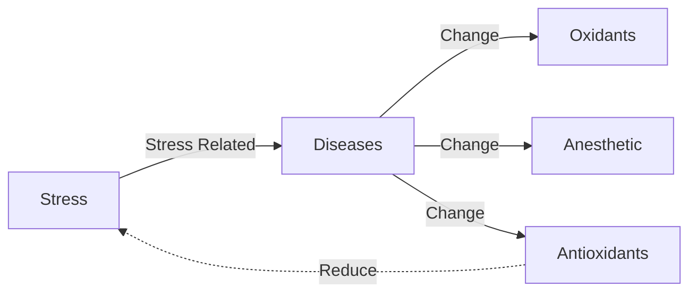

## Transcriptomic analysis of juvenile Chinese sea bass (Lateolabrax maculatus) anesthetized by MS-222 (tricaine methanesulfonate) and eugenol

Cite: Dong, H., Wang, W., Duan, Y. et al. Transcriptomic analysis of juvenile Chinese sea bass (Lateolabrax maculatus) anesthetized by MS-222 (tricaine methanesulfonate) and eugenol. Fish Physiol Biochem (2020). https://doi.org/10.1007/s10695-019-00755-x

## General Information
### Statistic information

|Content|Words|Ratio|
|:--:|:--:|:--:|
|Total Words|3624|100%|
|Abstract|306|8.43%|
|Introduction|512|14.11%|
|M&M|685|18.88%|
|Results|821|22.63%|
|**Discussion**|1300|35.83%|

### Background

[*Lateolabrax maculatus*](https://baike.baidu.com/item/%E8%8A%B1%E9%B2%88/901118?fromtitle=%E4%B8%AD%E5%9B%BD%E8%8A%B1%E9%B2%88&fromid=9645483):

||
|:--:|
|(c) `baike.baidu.com`|

MS-222 & eugenol: Fish anesthetics.

## Abstract

1. M & E are two widely used fish anesthetics.
2. This experiment reveals the transcriptomic changing during the recovering from fish anesthetics (6h after treated).
3. RNA from gills and livers were extracted and compared.
4. Non essential data filled here.
5. Some DEGs participated in human disease and metabolism.(ps: ummmm...WHAT? = =)
6. Two treatment interested different pathways.
7. MS-222 may affect metabolism and immunity and more harmful than eugenol.

PS: *Abstract* briefly introduced the purpose & results of the experiment. First, it revealed the toxicity of two anesthetics, and second, it can improve our understanding on some human diseases(maybe??) and the detoxification of the fish in the transcription level.

## Introduction

P1: What is anesthetics; The contribution of anesthetics; Which anesthetics are available; How do them work;  

P2: Wide geography-distribution(It's an important commercial species). Anesthetic could reduce the mortality during transportation.

P3: Some related experiments had done but not on the same page. So, with the evidences of this experiment, people can make a better choice between MS-222 and eugenol.  

## M&M
Skip (^ ^ )
- Animal
- Sample extraction
- RNA extraction, library preparation, and Illumina Hiseq
sequencing
- De novo assembly and annotation
- Differentially expressed genes
- Single nucleotide polymorphism and simple sequence
repeat detection

## Result
- Transcriptome sequence assembly
- Annotation and function analysis
- Differentially expressed genes
- SNP and SSR detection

>## Transcriptome sequence assembly
> - Raw reads
>  - Clean reads
>  - Unigenes
>  - Annotated Genes
>
>## Annotation and function analysis
>- COG (p1)
>- GO (p2)
>- KEGG (p3)  
>
>Table (sample, Raw reads)
> ## Differentially expressed genes
>- Unigenes  
>  - DEGs count(unique genes, annotated genes)
>  - (Charts & tables)
>- GO
>  - Unique/interested  Go-Terms
>  - Charts
>- KEGG
>  - Unique/interested pathways  
>
>## SNP and SSR detection
Skip

## Discussion

### P1-General result from DEGs
1. **Less DEGs** found in eugenol-treated livers sample
2. Pathways associated with human diseases and metabolism were found in **both samples**.  
3. E group is intrested in **detoxification** and **xenobiotics**; M group is interested in **organismal system**

### P2-Comparative
1. **Stress**

2. **Eugenol is less harmful than MS-222**
- Eugenol group: 22 DEGs involved in 30 different pathways related xenobiotics biodegradation and metabolism, which means <b>detoxification activities of the livers</b>.
- MS-222 group: higher levels of AST, ALT, AKP, which reveals MS-222 cause <b>more damages to livers</b>.(explain: can not be metabolized)
3. **GST** (Glutathione-S-transferase)
- BG: low activity of GST means low detoxification ability.
- Different responses of facing MS-222 in different species from previous research.
- Our result: *L. maculatus* is more vulnerable.
4. **A smaller number of DEGs** may reveals lees intervention of E  compared with M. (PS: = = smaller...)
5. Additionally, eugenol is **natural** and may easier to metabolized.  
(PS: ... Good, I just learned another skill to fill more words on discussion section)

### P3 Stress & Metabolism
1. BG: liver glucose oxidation is enhanced. Amino acid evolved in gluconeogenesis during the stress responses.
2. Those pathways are **enriched in both groups**.
3. Recent start verified *point 1*.

### P4 Pathways involved in environmental information processing
- Jak-STAT signaling, PI3KAkt signaling, TNF signaling, and cytokine-cytokine receptor interaction.
- BG: HPI->Cotisol; stress can inhibit inflammatory cytokine production and induce apoptosis, proliferation, and phagocytosis of immune cells.
Here: More DEGs related immune-related pathways are found in E group.
- BG: stress affects HPG and may affect reprodctive performance;
Here: Some DEGs involved in productive activities are found in M group.
- BG: Lethimonier observed that stress-induced cortisol inhibited vitellogenesis,
Here: We found it here, too.
- Conclusion: MS-222 is more harmful than eugenol.

### P5 Gill & Livers
Result:  not change the original functions of the organs

### P6 Conclusion
MS-222 revealed that all these anesthetics regulate the metabolic and immune pathways in the fish, and MS-222 may trigger more damages on the fish liver and reproduction.

---
## Related papers:  
Morais S, Pratoomyot J, Taggart JB, Bron JE, Guy DR, Bell JG, Tocher DR (2011b) Genotype-specific responses in Atlantic salmon (Salmo salar) subject to dietary fish oil replacement by vegetable oil: a liver transcriptomic analysis. BMC Genomics 12:255

Morais S, Edvardsen RB, Tocher DR, Bell JG (2012a) Transcriptomic analyses of intestinal gene expression of juvenile Atlantic cod (Gadus morhua) fed diets with Camelina oil as replacement for fish oil. Comp Biochem Physiol B Biochem Mol Biol 161:283–293.  

Tacchi L, Secombes CJ, Bickerdike R, Adler MA, Venegas C, Takle H, Martin SA (2012)  Transcriptomic and physiological responses to fishmeal substitution with plant proteins in formulated feed in farmed Atlantic salmon (Salmo salar). BMC Genomics 13:363

---
## Related Notes:

[De novo characterization of the liver transcriptome of javelin goby Synechogobius hasta and analysis of its transcriptomic profile following waterborne copper exposure](https://karobben.github.io/2020/07/07/LearnNotes/Paper_RNASeq_Fish2/)

[Physiological and transcriptomic responses to fishmeal-based diet and rapeseed meal-based diet in two strains of gibel carp (Carassius gibelio)](https://karobben.github.io/2020/07/07/LearnNotes/Paper_RNASeq_Fish3/)

[Transcriptomic response to soybean meal-based diets as the frst formulated feed in juvenile yellow perch (Perca favescens)](https://karobben.github.io/2020/07/07/LearnNotes/Paper_RNASeq_Fish4/)
