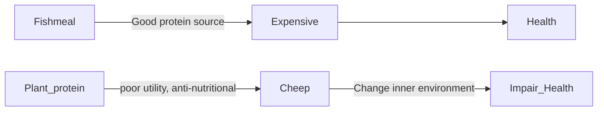
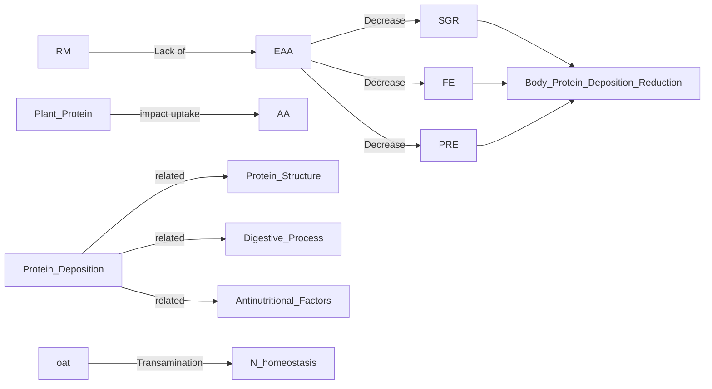
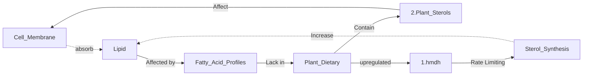

## Physiological and transcriptomic responses to fishmeal-based diet and rapeseed meal-based diet in two strains of gibel carp (Carassius gibelio)

Cite: Xu, W., Jin, J., Han, D. et al. Physiological and transcriptomic responses to fishmeal-based diet and rapeseed meal-based diet in two strains of gibel carp (Carassius gibelio). Fish Physiol Biochem 45, 267–286 (2019). https://doi.org/10.1007/s10695-018-0560-7

## General Information
### Statistic information

|Content|Words|Ratio|
|:--:|:--:|:--:|
|Total Words|5104|100%|
|Abstract|218|4.27%|
|Introduction|824|16.14%|
|M&M|1403|27.49%|
|Results|654|12.81%|
|**Discussion**|2005|39.28%|

### Background
[***Synechogobius hasta***](https://baike.baidu.com/item/%E5%BC%82%E8%82%B2%E9%93%B6%E9%B2%AB):

Img from: [link](http://www.naturephoto-cz.com/carassius-auratus-gibelio-photo_lat-15205.html)

## Abstract
1. fishmeal  & Rapeseedmeal to explore the effects of protein source.
2. Two strains are feed.
3. Growth performance,body composition, hematologic indices, and hepatic transcriptomes were measured.
4. A prefer FM, F prefer RM
5. Different involved in lots of metabolic pathways

## Introduction

P1:

P2: Previous mainly researches are focus on dietary background, genetic backgrounds are essential, too. As a result, understanding of molecular mechanisms is needed.

P3: NGS could achieving it. See bass response similar to fishmeal diet, but response different to plant-based diet.

P4:G. carp is important. A: fast growth; B: fast growth & Diseases resist.

## M&M
- Materials and methods
- Experimental fish and rearing conditions
- Sample collection
- Chemical analysis
- Transcriptome analysis
- Quantitative real-time PCR
- Statistical analysis

## Results
- Growth performance
- Physiological and biochemical indices in plasma
- Transcriptome analysis results
- Confirmation of RNA-seq data by qRT-PCR

### Growth performance
Counts and table

### Physiological and biochemical indices in plasma
Statistics and table
### Transcriptome analysis results
Statistics and tables
### Confirmation of RNA-seq data by qRT-PCR

## Discussion

### P1-2 Poor Growth Performance
- Different response to plant protein. It is regulated by the gene in liver which involved in protein/lipid metabolism.
- Metabolic, digestive, cell signals... are also changed.
- Metabolic response interact with genotype.

### P3 Essential Amino Acids.

Challenges:
- The rapeseeds lack of *lysine* and *methionine*.
- Imbalanced amino acid diet.

Responds:
- Low body protein deposition
- OAT(***ornithine aminotransferase***) improved to generates more nonessential AA.

### P4 Lipid metabolism
- ***hmdh*** high expression: Cholesterol Synthesis;
- Appropriate explanation: Plant sterols affect membrane properties, modify phospholipid order, impair cholesterol absorption. To response it, liver increased the cholesterol synthesis.
<b>Structure</b>:

### P5 Higher FR
Related higher expression genes--> compensation mechanism for poor protein dietary.
<b>Structure</b>:

### P6 Overall
...

### Different responses to RM diet between strains
- **F better use RM than A.(similar found in rainbow trout)**
- **RAN-seq in strain F feed with RM**
  - Digestive enzyme activated
  - Higher plasma AA at 2h after diet
  - Better growth performance
  - Genes included in *assy, gcsp2, serc* expressed lower
  - higher PRE
- **RAN-seq in strain A feed with RM**
  - immune response-related genes, including xxx, but unaltered in strain F.
  - This indicate higher inflammatory response in strain A, associated some other reports.
- Strain F has lower LRE with RM group.
  - arachidonic acid metabolism were lower in F, which related to immune responses.
  -  F had lower lipid deposition to lower inflammatory responses
  - Genes, like XXX, related phospholipid metabolism had lower expression in F.
- **Take together**
  - Diet had interaction with Genotype.

## Conclusion

**Skip!**

---
## Related papers:  
Morais S, Pratoomyot J, Taggart JB, Bron JE, Guy DR, Bell JG, Tocher DR (2011b) Genotype-specific responses in Atlantic salmon (Salmo salar) subject to dietary fish oil replacement by vegetable oil: a liver transcriptomic analysis. BMC Genomics 12:255

Morais S, Edvardsen RB, Tocher DR, Bell JG (2012a) Transcriptomic analyses of intestinal gene expression of juvenile Atlantic cod (Gadus morhua) fed diets with Camelina oil as replacement for fish oil. Comp Biochem Physiol B Biochem Mol Biol 161:283–293.  

Tacchi L, Secombes CJ, Bickerdike R, Adler MA, Venegas C, Takle H, Martin SA (2012)  Transcriptomic and physiological responses to fishmeal substitution with plant proteins in formulated feed in farmed Atlantic salmon (Salmo salar). BMC Genomics 13:363

---
PS

I think that the author did a good job on the discussion secession.
First of all, he mad a conclusion about the Growth performance of the corps. This is what what we can see at the first glance, and one of the direct purpose of this experiment. On the other hand, the author gave a general summery of the different in metabolic, digestives, and cell signals change, etc.

After that, the author focused on two widely concerned challenges in plant meals: lacking of some essential amino acids and lipid deficiency. As a result, the body protein deposition was definitely affected and ***oat*** was involved in Nitrogen compensate. About the Lipid metabolism, they found that the gene ***hmdh*** are respond to keep cholesterol homeostasis.

After this discussion, the author are focused in talking about the interaction of the diet and genotype, the part makes this experiment unique.

Above of, this discussion is a good example to show how to handle a discussion, how to write a story logically and neatly.

---
## Related Notes:

[Transcriptomic analysis of juvenile Chinese sea bass (Lateolabrax maculatus) anesthetized by MS-222 (tricaine methanesulfonate) and eugenol](https://karobben.github.io/2020/07/07/LearnNotes/Paper_RNASeq_Fish1/)

[De novo characterization of the liver transcriptome of javelin goby Synechogobius hasta and analysis of its transcriptomic profile following waterborne copper exposure](https://karobben.github.io/2020/07/07/LearnNotes/Paper_RNASeq_Fish2/)

[Transcriptomic response to soybean meal-based diets as the frst formulated feed in juvenile yellow perch (Perca favescens)](https://karobben.github.io/2020/07/07/LearnNotes/Paper_RNASeq_Fish4/)
