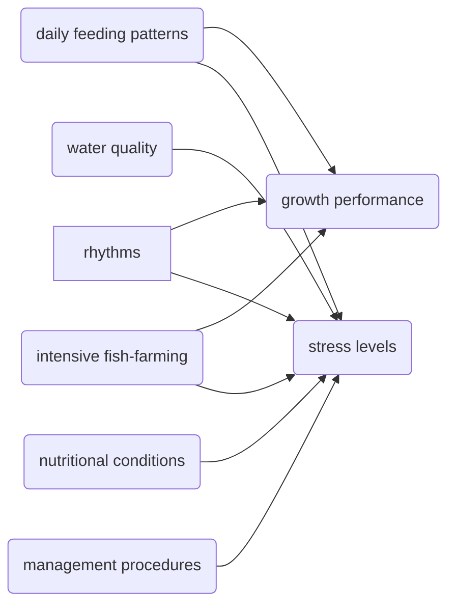

## Abstract
- A 6 week 5×2 two factorial experiment
  - 5 culture densities
    - 1.1 kg m−3(0.55 kg fish per tanks, CD1.1)
    - 2.2 kg m-3(1.1 kg fish per tank, CD2.2)
    - 3.3 kg m−3(1.65 kg fish per tank, CD3.3)
    - 4.4 kg m−3(2.2 kg fish per tank, CD4.4)
    - 5.5 kg m−3(2.75 kg fish per tank, CD 5.5)
  - 2 feeding frequencies(FF)
    - 2 meals a day (FF2)
    - 3 meals a day (FF3)
- growth performance
- body composition
- digestive enzyme activity
- tissues histology

|ID|Density|Feeding Frequency|
|:--:|:--:|:--:|
|G1|CD1.1|FF3|
|G2|CD2.2|FF3|
|G3|CD3.3|FF3|
|G4|CD4.4|FF3|
|G5|CD5.5|FF3|
|G6|CD1.1|FF2|
|G7|CD2.2|FF2|
|G8|CD3.3|FF2|
|G9|CD4.4|FF2|
|G10|CD5.5|FF2|

### Result
|||
|:--|:--|
|Weight Gain|- High: **G7; G1**; - Lowest: **G3**; - FF2 > FF3|
|Muscle|  - **G8** > **G2-G6** - No significantly different between G8 and other groups|
|Protein Content|similar like the muscle|
|Serum|- glutamic oxaloacetic aminotransferase (AST), alanine aminotransferase (ALT), triglyceride (TG) and cholesterol (CHO) - Immune function: albumin (ALB), serum lysozyme (LZY), superoxide dismutase (SOD) and alkaline phosphatase (AKP) were significantly affected|
|Density|- pepsin and lipase in stomach, intestine and liver were significantly affected|
|Histological Structure|- Normal: G1, G2, G7 and G8 - Other groups were damaged to varying degrees|

## Introduction

### Feeding frequency
- regulating the feed intake
- growth and chemical composition
- reduction of aquaculture production **cost**
- preventing **water quality** deterioration

**Challenge**:

**Overfeed**:
- Canoverload: decreasing **digestive efficiency** and **reductions**

**Insufficient FF**:
poor growth; high mortality;
- sporadic feeding and low feeding rates may contribute to reduced growth as well as increased hunger, intraspecific aggression, and increased rate of cannibalism[^1]

[^1]: Folkvord A, Ottera H (1993).Effects of initial size distribution, day length, and feeding frequency on growth, survival, and cannibalism in juvenile Atlantic cod (Gadusmorhua L.). Aquaculture 114: 243-260

### Intensive
Intensive fish-farming practices often cause **stress and poor health** in fish.
- welfare
- aquaculture profitability

**High Density**
- stunts fish survival
- percentage weight gain
- specific growth rate
- physical
- injuries
- stress
- susceptibility to disease
- swimming behaviour
- intensify aggression

The results are attributed to social interactions competition for food and/or space[^2], leading to the establishment of hierarchies[^3].

[^2]: Lloyd M J , Bates A E . Influence of density-dependent food consumption, foraging and stacking behaviour on the growth rate of the Northern abalone, Haliotis kamtschatkana[J]. Aquaculture, 2008, 277(1-2):24-29.
[^3]: Cristina E. Trenzado and Manuel de la Higuera and Amalia E. Morales. Influence of dietary vitamins E and C and HUFA on rainbow trout (Oncorhynchus mykiss) performance under crowding conditions[J]. Aquaculture, 2007.

## Materials and Methods

Skip

## Result

## Discussion

- **Weight**

- **Blood**

- **Muscle**
**moisture** in the muscle gradually decreased with the increase of CD
**Protein**, **fat** and **ash** showed a gradual decline

- **enzyme activities**
  - **pepsin activity** and **amylase
  activity** FF2 > FF3
  - activity increased as the increase of CD except **intestinal amylase**

*[CD]: culture density  
*[FF]: culture frequency
