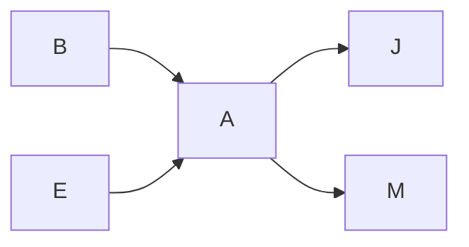
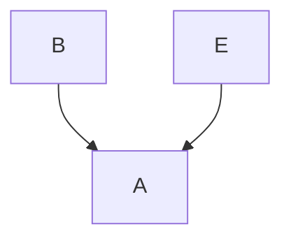
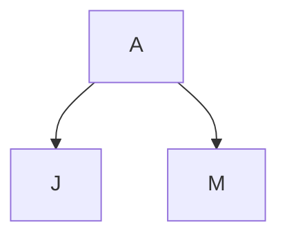

## Naïve Bayes

!!! note The problem with likelihood: Too many words
    What does it mean to say that the words, x, have a particular probability? 
    Suppose our training corpus contains two sample emails: 
    - Email1: Y = spam, X ="Hi there man – feel the vitality! Nice meeting you…" 
    - Email2: Y = ham, X ="This needs to be in production by early afternoon…" 
    
    Our test corpus is just one email: 
    - Email1: X="Hi! You can receive within days an approved prescription for increased vitality and stamina" 
    How can we estimate P(X="Hi! You can receive within days an approved prescription for increased vitality and stamina"|Y = spam)? 

One thing we could do is:

1. $P(W = \text{"hi"} | Y = \text{spam}), P(W = \text{"hi"} | Y = \text{ham})$
2. $P(W = \text{"vitality"} | Y = \text{spam}), P(W = \text{"vitality"} | Y = \text{ham})$
3. $P(W = \text{"production"} | Y = \text{spam}), P(W = \text{"production"} | Y = \text{ham})$

Then the approximation formula for $P(X | Y)$ is given by:

$$ P(X = x | Y = y) \approx \prod_{i=1}^{n} P(W = w_i | Y = y) $$

In this context, $W$ represents a word in a document, $X$ represents the document itself, $Y$ represents the class (spam or ham), $w_i$ represents the $i$-th word in the document, and $n$ is the total number of words in the document. The product is taken over all words in the document, assuming that the words are conditionally independent of each other given the class label $Y$.

!!! question Why naïve Bayes is "naïve"?
    We call this model "naïve Bayes" because the words aren't really conditionally independent given the label. For example, the sequence "for you" is more common in spam emails than it would be if the words "for" and "you" were conditionally independent. 
    **True Statement**: 
        - ***P(X = for you|Y= Spam > P( W = for |Y = Spam)(P = you |= Spam)*** 
    The naïve Bayes approximation simply says: estimating the likelihood of every word sequence is too hard, so for computational reasons, we'll pretend that sequence probability doesn't matter. 
    
    **Naïve Bayes Approximation**: 
        - ***P(X = for you |Y = Spam) ≈ P(W = for |Y = Spam)P( W= you |Y= Spam)*** 
    We use naïve Bayes a lot because, even though we know it's wrong, it gives us computationally efficient algorithms that work remarkably well in practice. 

### MPE = MAP using Bayes’ rule

$$
P(Y= y | X= x) = \frac{P(X =x| Y=y)P(Y = y)}{P(X =x)}
$$

Definition of conditional probability:

$$
P(Y|f(X), A) = \frac{P(f(X)|Y, A)P(Y|A)}{P(f(X)|A)}
$$

### Floating-point underflow

That equation has a computational issue. Suppose that the probability of any given word is roughly ***P(W = W~i~|Y = y) ≈ 10^-3^***, and suppose that there are 103 words in an email. Then ***∏^n^~i=1~ P(W = W~i~|Y = y) = 10^-309^***,which gets rounded off to zero. This phenomenon is called "floating-point underflow".

!!! note Solution
    $$f(x) = \underset{y}{\mathrm{argmax}} \left( \ln P(Y = y) + \sum^n_{i=1} \ln P(W = w_i | Y = y) \right)$$

### Reducing the naivety of naïve Bayes
Remember that the bag-of-words model is unable to represent this fact: 
- **True Statement**:
    - ***P(X = for you|Y= Spam > P( W = for |Y = Spam)(P = you |= Spam)***
    Though the bag-of-words model can’t represent that fact, we can represent it using a slightly more sophisticated naïve Bayes model, called a "bigram" model.

- N-Grams:
    - Unigram: a unigram (1-gram) is an isolated word, e.g., “you”
    - Bigram: a bigram (2-gram) is a pair of words, e.g., “for you”
    - Trigram: a trigram (3-gram) is a triplet of words, e.g., “prescription for you”
    - 4-gram: a 4-gram is a 4-tuple of words, e.g., “approved prescription for you”

!!! note Bigram naïve Bayes
    A bigram naïve Bayes model approximates the bigrams as conditionally independent, instead of the unigrams. For example, 
    ***P(X = “approved prescription for you” | Y= Spam) ≈*** 
    ***P(B = “approved prescription” |Y = Spam) ×*** 
    ***P(B = “prescription for” | Y= Spam) ×*** 
    ***P(B = “for you” |Y = Spam)***

- The naïve Bayes model has two types of parameters:
    - The a priori parameters: ***P(Y = y)***
    - The likelihood parameters: ***P(W = w~i~| Y = y)***
- In order to create a naïve Bayes classifiers, we must somehow estimate the numerical values of those parameters.
- Model parameters: feature likelihoods ***P(Word | Class)*** and priors ***P(Class)***

### Parameter estimation: Prior

The prior, ***P(x)***, is usually estimated in one of two ways.
- If we believe that the test corpus is like the training corpus, then we just use frequencies in the training corpus:
$$
P(Y = Spam) = \frac{Docs(Y=Spam)}{Docs(Y=Spam) + Docs(Y \neq Spam)}
$$
where ***Docs(Y=Spam)*** means the number of documents in the training corpus that have the label Y=Spam.
- If we believe that the test corpus is different from the training corpus, then we set ***P(Y = Spam)*** = the frequency with which we believe spam will occur in the test corpus.

### Parameter estimation: Likelihood

The likelihood, ***P(W = w~i~|Y = y), is also estimated by counting. The “maximum likelihood estimate of the likelihood parameter” is the most intuitively obvious estimate:
$$
P(W=w_i| Y = Spam) = \frac{Count(W=w_i, Y = Spam)}{Count(Y = Spam)}
$$
where ***Count(W=w~i~, Y = Spam)*** means the number of times that the word ***w~i~*** occurs in the Spam portion of the training corpus, and ***Count(Y = Spam)*** is the total number of words in the Spam portion.

### Laplace Smoothing for Naïve Bayes

One of the biggest challenge for Bayes is it can't handle unobserved situation.

- The basic idea: add $k$ “unobserved observations” to the count of every unigram
  - If a word occurs 2000 times in the training data, Count = 2000+k
  - If a word occur once in training data, Count = 1+k
  - If a word never occurs in the training data, then it gets a pseudo-Count of $k$

- Estimated probability of a word that occurred Count(w) times in the training data:
  $$ P(W = w) = \frac{k + \text{Count}(W = w)}{k + \sum_v (k + \text{Count}(W = v))} $$

- Estimated probability of a word that never occurred in the training data (an “out of vocabulary” or OOV word):
  $$ P(W = \text{OOV}) = \frac{k}{k + \sum_v (k + \text{Count}(W = v))} $$

- Notice that
  $$ P(W = \text{OOV}) + \sum_w P(W = w) = 1 $$

## Bayesian Networks

!!! question Why Network?
    - Example: $Y$ is a scalar, but $X = [X_1, … , X_{100}]^T$ is a vector
    - Then, even if every variable is binary, $P(Y = y|X = x)$ is a table with $2^{101}$ numbers. Hard to learn from data; hard to use.

A better way to represent knowledge: Bayesian network
- Each variable is a node.
- An arrow between two nodes means that the child depends on the parent.
- If the child has no direct dependence on the parent, then there is no arrow.

### Space Complexity of Bayesian Network

- Without the Bayes network: I have 5 variables, each is binary, so the probability distribution $P(B, E, A, M, J)$ is a table with $2^5 = 32$ entries.
- With the Bayes network:
    - Two of the variables, B and E, depend on nothing else, so I just need to know $P(B = ⊤)$ and $P(E = ⊤)$ --- 1 number for each of them.
    - M and J depend on A, so I need to know $P(M = ⊤|A = ⊤)$ and $P(M = ⊤|A = ⊥)$ – 2 numbers for each of them.
    - A depends on both B and E, so I need to know $P(A = ⊤|B = b, E =e)$ for all 4 combinations of $(b, e)$
    - Total: 1+1+2+2+4 = 10 numbers to represent the whole distribution!

$$
P(B = T \mid J = T, M = T) = \frac{P(B = T, J = T, M = T)}{P(J = T, M = T)} \\\\
= \frac{P(B = T, J = T, M = T)}{P(J = T, M = T)} + \frac{P(B = L, J = T, M = T)}{P(J = T, M = T)} \\\\
= \sum_{e=T}^{L} \sum_{a=T}^{L} P(B = T, E = e, A = a, J = T, M = T) \\\\
= \sum_{e=T}^{L} \sum_{a=T}^{L} P(B = T) P(E = e) \ × \\\\
P(A = a \mid B = T, E = e) P(J = T \mid A = a) P(M = T \mid A = a)  
$$

### Variables are independent and/or conditionally independent

#### Independence

- Variables are independent if they have no common ancestors
  $ P(B = \top, E = \top) = P(B = \top)P(E = \top)= P(B = \top) $

!!! Independent variables may not be conditionally independent

- The variables B and E are not conditionally independent of one another given knowledge of A
- If your alarm is ringing, then you probably have an earthquake OR a burglary. If there is an earthquake, then the conditional probability of a burglary goes down:
    - $P(B = \top| E = \top, A = \top) \neq P(B = \top| E = \bot, A = \top)$
- This is called the "explaining away" effect. The earthquake "explains away" the alarm, so you become less worried about a burglary.

#### Conditional Independence

- The variables J and M are conditionally independent of one another given knowledge of A
- If you know that there was an alarm, then knowing that John texted gives no extra knowledge about whether Mary will text:
$P(M = \top | J = \top , A = \top)=P(M = \top | J = \bot, A = \top)= P(M = \top| A = \top)$

!!! note Conditionally Independent variables may not be independent
    - The variables J and M are not independent!
    - If you know that John texted, that tells you that there was probably an alarm. Knowing that there was an alarm tells you that Mary will probably text you too:
    - $P(M = \top| J = \top) \neq P(M= \top| J = \bot)$

- Variables are conditionally independent of one another, given their common ancestors, if (1) they have no common descendants, and (2) none of the descendants of one are ancestors of the other
  $ P(U = T, M = T \mid A = T) = P(U = T \mid A = T)P(M = T \mid A = T) $

#### How to tell at a glance if variables are independent and/or conditionally independent

- Variables are independent if they have no common ancestors
    - $P(B = \top, E = \top) = P(B=\top)P(E =\top)$
- Variables are conditionally independent of one another, given their common ancestors, if:
    1. they have no common descendants, and 
    2. none of the descendants of one are ancestors of the other
    - $P(J = \top, M = \top| A = \top) = P(J = \top| A = \top) P (M = \top| A = \top)$

