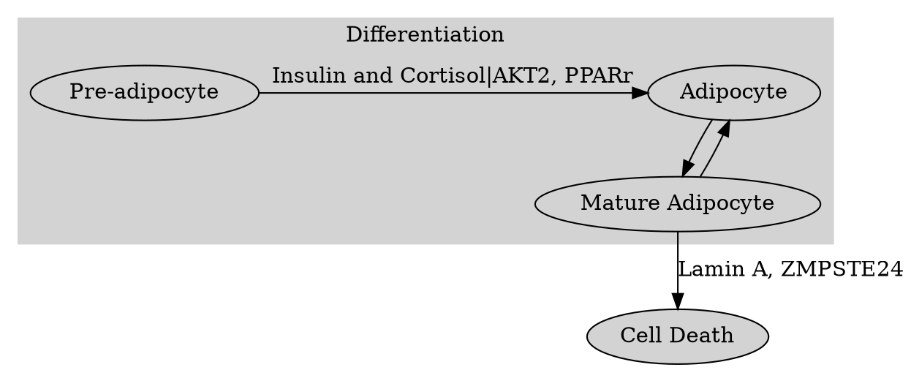
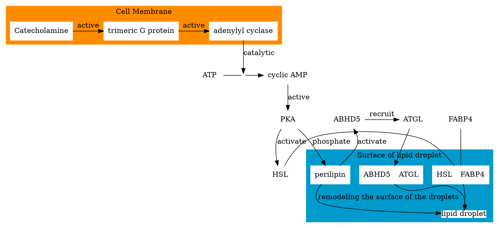
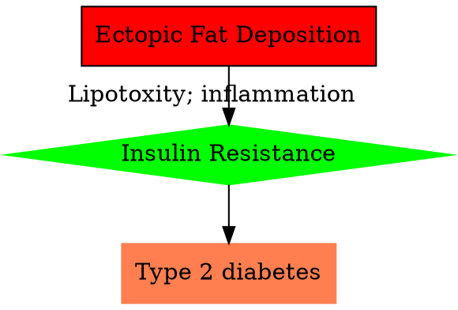

## Lipids for Membrane Functions
- Membrane **Curvature**
- Bilayer **Asymmetry**
- Membrane **Fluidity**

### Membrane Curvature

The **conical shape** of lipids was more prefer the inner layer which means the two layers of the membrane are **asymmetrical**.

- Exp:
  - ***Phosphatidylcholine*** - cylindrical shape
  - ***Phosphatidylethanolamine*** - Conical shape

#### Human Red Blood Cells

The lipid asymmetry of the membrane of the red blood cell:
|![Proposed distribution of phospholipids in human red blood cells put forward by Verkleij et al[^1]](https://www.researchgate.net/profile/Georg-Pabst/publication/276067418/figure/fig1/AS:294532152348672@1447233345197/Proposed-distribution-of-phospholipids-in-human-red-blood-cells-put-forward-by-Verkleij.png)|
|:-:|
|(c) Verkleij et al[^1] |

In <u>aged</u> red blood cells, the composition of the leaflet is changed. The phosphatidylserine appears on the surface of red blood cells and becomes predominant. This gives a signal to the macrophages to <u>clear them out</u>.

#### Maintain the asymmetry

Lipid transport proteins are responsible for maintaining asymmetry.

***Flipase***: outer into inner
***Floppase***: Inner into outer
***Scramblase***: Both directions

The lipids composition of the ER, Golgi apparatus and the cell membrane are very similar.

### The Fluidity of the Membrane

Situation 1: Full of Saturated, long fatty acid tails:
 - The membrane was packed much denser
 - It has low fluidity
 - It is called a **Paracrystalline state**
 - Situation 2: The membrane with shorter and unsaturated tails:
 - Packing much looser
 - More fluid
 - It is called a **fluid state**
 - Situation 3: Cholesterol
 - During the Golgi transport, a part of sphingolipids and cholesterol are transported into the cell membrane.
 - Intercalate between fatty acid tails
 - Disturb the tight packing
 - improve fluidity and maintain the rigidity of the **Paracrystalline state**

At a physiological Tm, a membrane existed between these two states.

## Protein and lipids in the membrane

Exp: lipid draft

### ***FRAP***

***FRAP***: Fluorescence Recovery After Photobleaching
||
|:-:|
|[(c) zeiss-campus](http://zeiss-campus.magnet.fsu.edu/articles/livecellimaging/techniques.html)|
1. Label of lipids
2. Make a small dark spot with laser
3. Measure the time the dark became fluorescence again.

**Fluorescence recovery is due to the near lipids diffusion.**

So, we can make a graph to show how long it takes to determine the ==diffusion-coefficient==.

$$
s = \sqrt{ 4Dt}
$$

$s$: Average distance traveled
$D$: Diffusion Coefficient
$t$: Time

### Membrane proteins

||
|:-:|
|[(c) teaching.ncl.ac.uk](https://teaching.ncl.ac.uk/bms/wiki/index.php/Membrane_protein)|

#### Protein Diffusion

The diffusion velocity of the protein is variable.

- Similar to lipids: Photoreceptor.
- Very slow: chloride bicarbonate in red blood cell, which has interaction in the intracellular region of other protein networks, membrane skeleton.

#### Protein Functions

The total **concentration** and **composition** of the protein are **highly variable**.

#### Protein Position

- Integral membrane protein: fully embedded in the lipid.
- Peripheral protein: with lipids that are inserted into the lipid bilayer.

#### Functions

- Signal Transduction
- Molecular transportation (Pumps / Channels)
  - Ion
  - Glucose
  - Water

## Signal Role of the lipids

Both too little and too many lipids were causing pathologies.

Lipid droplets:
  - Few:
    Lipodystrophy & Cachexia

### Lipids Maintain

### The fate of lipid droplets

The form of the lipid droplets is controlled by the rate of ==triacylglycerol synthesis== and the rate of ==mobilization by lipolysis==

**High energy state**:
  - ***GPAT***, ***AGPAT***, and ***MGAT*** catalyze the addition of fatty acids to glycerol or to monoacylglycerol to produce diacylglycerol
  - ***DGAT1*** and ***DGAT2*** contributed to the final synthesis of triacylglycerol
  - triacylglycerol stored in the endoplasmic reticulum
  - triacylglycerol will then accumulate between the two leaflets of the ER to form a small bump
  - Finally buds off and became a lipid droplet.

Genetic mutation reducing the activity of the ***AGPAT*** is implicated in over 50% of congenital generalized lipodystrophy.

**Low energy state**:

Any mutation leading to uncontrolled activation of lipolysis will also result in lipodystrophy.

**Exp**: mutations prevent perilipin inhibition of ***ABHD5*** binding to the ***lipase ATGL***, leading to constitutive activation of **lipolysis**, and ultimately to **lipodystrophy**.

### Acquired Lipodystrophy

**Exp**: Autoimmune reaction and drug treatment.

HIV-associated acquired lipodystrophy.
Nucleoside reverse transcriptase inhibitors: mitochondrial toxicity.
Protease inhibitors: inhibit a protein needed for the processing of the nuclear protein lamin A.

## High Body Fat Situation

Two diseases: **Neutral Lipid Storage Disease**; **Metabolic Syndrome**

### Neutral Lipid Storage Disease

**Adipocytes**: Very large lipid droplets; Dominated by the TAG.
**Monogenic Disease**

Two Types of NLSD:
- ***Cardiomyopathy***: Characterized by a type of **heart disorder**
- ***NLSD-M***: Characterized by ***Ichthyosis*** (Sin takes on fish-scale-like appearance)
- ***NLSD-I***

#### ***NLSD-M***

The associated gene is ***ATGL***, which catalyzes the first step of triacylglycerol.  
Mutation of this gene prevented its recruitment.

Connection with ***Cardiomyopathy***:
This mutation impairment the release of energy fuels and impacts the tissues such as the cardiac muscle.

#### ***NLSDI***

NLSD-I: Chanarin-Dorfman Syndrome

Associated gene: $\alpha/\beta$-hydrolase domain-containing protein 5 (ABHD5)

ABHD5: triacylglycerol to diacylglycerol

***Ichthyosis***:
  - "Ichthyo": Having to do with fish
  - "-osis": pathology, or abnormal.
  - The skin of the patient was dry and rough like fish scales

**Causes**:
  - Abundant abnormal lipid deposits in the skin, which could reduce the permeability of the skin.
  - The outer layer of the skin was made by lipid-based Extracellular Matrix
  - The permeability of this layer is functional when lipolysis is functional.
  - Impaired lipolysis leads abnormal deposition of triacylglycerol.
  - Result: breakdown of the mortar holding the bricks; makes the skin taking on a dry, rough, and scale-like appearance.

## Metabolix Syndrome

Metabolix Syndrome is characterized by a cluster of pathologies: high blood level of triacylglycerol, cholesterol, and LDL, hyperglycemia, and insulin resistance.

Polygenic disease.

Ectopic fat deposition -[Lipotoxity; inflammation]-> insulin resistance -> Type 2 diabetes

perilipin: control the size of the lipid droplets. (by initiating a chain reaction to lipid degradation.)

inflammation: <l>lipid gives the extra ATP in a muscle which recruits more adipocytes and attracts the macrophages.</l>

[^1]: Verkleij, A.J.; Zwaal, R.F.A.; Roelofsen, B.; Comfurius, P.; Kastelijn, D.; van Deenen, L.L.M.The asymmetric distribution of phospholipids in the human red cell membrane. A combinedstudy using phospholipases and freeze-etch electron microscopy. Biochim. Biophys. Acta 1973,323, 178–193
