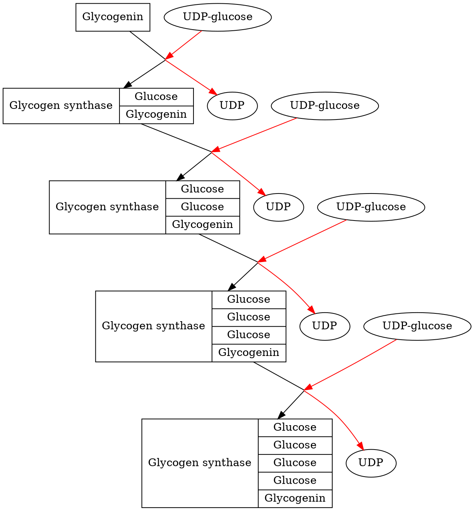
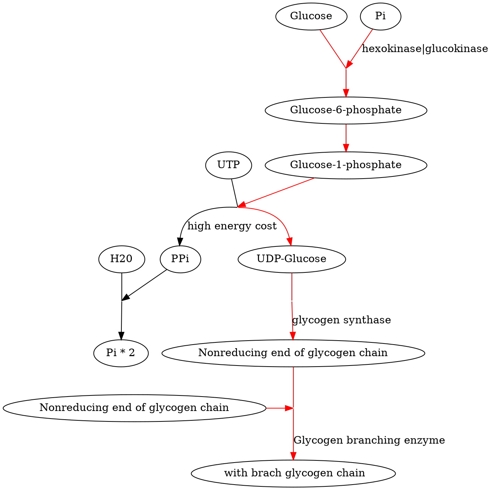

## Introduction

Carbohydrates have structure variety, functional variety, both chemical and physical.

|Aldoses|Ketoses|
|:-|:-|
|The Chain ends with a carboxyl group|When the carboxyl group was not in the terminal (C~2~ in nature)|
|-ose|-ulose|

||
|:-:|
|[(c) vivadifferences.com](https://vivadifferences.com/difference-between-aldose-and-ketose-sugar-with-examples/)|

C~3~ and C~4~ carbohydrates are too sample to be found in a **complex molecule**. They are metabolic intermediates.

C~5~ **pentose** has abounded in **ribose** and **deoxyribose** form.
C~6~ **hexose** was very popular in both structure and energy resources.

### **Enantiomers**

Identify the number of the asymmetry carbon in monosaccharides.

**Exp** Glyceraldehyde:
- One asymmetric carbon
- Two enantiomers
- Sharing most of the chemical properties
- Affect **polarized light**

When the **polarized light** goes through a cell that contains our chiral sugar, the plane of the polarized light will rotate. The rotation direction:

- clockwise: ***Dextrorotatory***; (+)-glyceraldehyde
- counterclockwise: ***Levorotatory***; (-)-glyceraldehyde

### D/L series

||
|:-:|
|[(c) masterorganicchemistry.com](https://www.masterorganicchemistry.com/2017/05/24/d-and-l-sugars/)|

The steps of determing the D/L series:
1. Write the developed chemical structure (vertical)
2. Place the ketone/aldehyde group at the top of the structure
3. Number the carbon started from the top
4. Identify the asymmetry carbon.

When the hydroxyl group carried by the bottom-most asymmetry carbon is:
- on the right: D series
- on the left: L series

The D/S series is kind of arbitrary and not really corresponded with **enantiomers**

Most of the monosaccharides in cells are belong to the D series.

## Pentose

||
|:-:|
|[(c) Pubchem ID:229](https://pubchem.ncbi.nlm.nih.gov/compound/229)|

### Chemical Feature:
***Schiff reaction***:
1. Shiff reagent (pink) + sulfur dioxide -> Discolored
2. Adding aldehyde -> recolored (pink)

==Hypothesized==: the aldehyde is linear: **free aldehyde group** and it could recolor the Schiff reagent.
==Observed==: aldose **failed to recolor** the Schiff reagent
==Conclusion==: It **doesn't have a free aldehyde group**, it's not linear but cyclic.

### Physical Feature:
Theoretically, the D-Glucose has **unique physical properties** like melting Tm, degree of rotation of polarized light.

But two distinct methods synthesized D-glucose has **different physical properties**.

|Synthesis|Melting Temperature| Specific Rotation|Form|
|:-|:-|:-|:-|
|Methoud 1| $146^ \circ C$|$+112^ \circ$|$\alpha ^ {_ -}D^ {_ -}glucose$|
|Methoud 2| $150^ \circ C$|$+18^ \circ$|$\beta^ {_ -} D^ {_ -}glucose$|

### Cyclic Structure

Structural analysis a show that hexose and pentose exist in a cyclic structure. The linear structure represents only 0.02% of the molecules of sugar in this solution

#### Cyclic Formation

||
|:-:|
|[(c) glossary.periodni.com](https://glossary.periodni.com/dictionary.php?en=hemiacetal)|
$aldehyde + alcohol \to hemiacetal $
$ketone + alcohol \to hemiketal $

D-glucose -> attack the fount or back, to form the alpha or beta cyclic glucose
||
|:-:|
|[(c) masterorganicchemistry.com](https://www.masterorganicchemistry.com/2017/08/17/mutarotation/)|

#### Pryan and Furan

Hexose: Pryan; $\alpha^ {_ -}D^ {_ -}glucopyranose$
Ketose: Furan; $\beta^ {_ -}D^ {_ -}ribofuranose$

#### Significance

D-Glucose:
  - A much stable form: $\alpha^ {_ -}D^ {_ -}glucopyranose$
  - A much unstable form: $\alpha^ {_ -}D^ {_ -}glucofuranose$

#### Conformations

Chair and Boat conformations!

## Saccharides poly-formation

*[Maltose]: 麦芽糖
*[Trehalose]: 海藻糖

|$\alpha^ {_ -}D^ {_ -}Glucose +  \beta^ {_ -}D^ {_ -}Glucose$|$\alpha^ {_ -}D^ {_ -}Glucose +  \alpha^ {_ -}D^ {_ -}Glucose$|
|:-:|:-:|
|***Maltose***: $1 \to 4 glycosidic linkage$|***Trehalose***: $ 1 \to 1 glycosidic linkage$|
|||
|[(c) Pubchem ID:6255](https://pubchem.ncbi.nlm.nih.gov/compound/6255)|[(c) Pubchem ID:7427](https://pubchem.ncbi.nlm.nih.gov/compound/7427)|

|$\beta^ {_ -}D^ {_ -}Galactose +  \beta^ {_ -}D^ {_ -}Glucose$|$\alpha^ {_ -}D^ {_ -}Glucose +  \beta^ {_ -}D^ {_ -}Fructose$|
|:-:|:-:|
|***Lactose***: $1 \to 4 glycosidic linkage$|***Sucrose***: $1 \to 2 glycosidic linkage$|
|||
|[(c) Pubchem ID:6134](https://pubchem.ncbi.nlm.nih.gov/compound/6134)|[(c) Pubchem ID:5988](https://pubchem.ncbi.nlm.nih.gov/compound/5988)|

### Glycogen

||
|:-:|
|[(c) Pubchem ID:146037391](https://pubchem.ncbi.nlm.nih.gov/compound/146037391)|

#### Basic Structure
A polymer of $\alpha ^{_ -}D ^{_ -} Glucose$
- Main Stream: reducing end: $1^{_ -} 4\ glycosidic linkage$
- Branch Streams: non-reducing ends: $1^{_ -} 6\ glycosidic linkage$

#### Synthesis

##### Initiation

Glycogenin-Try194 + UDP-glucose
CC-glycogen synthase (complex)

glycogenin will catalyze the next three units to form the primer.
Then, the glycogen synthase would able to elongate the chain.

##### Elongation

Branches ~ every 10 units
up to 55,000 glucose units
~ 2,100 nonreducing ends
