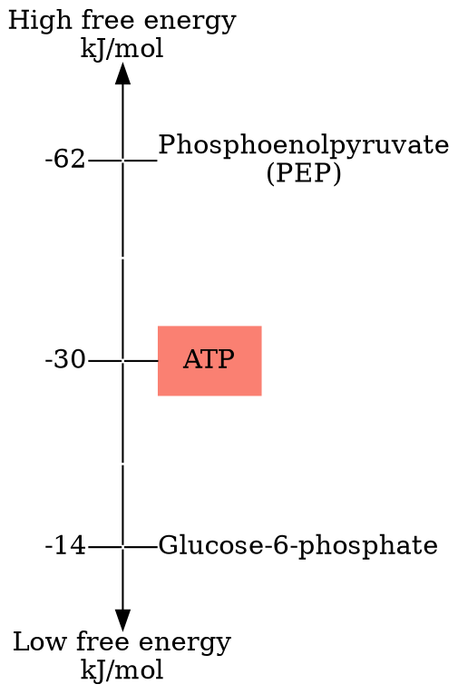
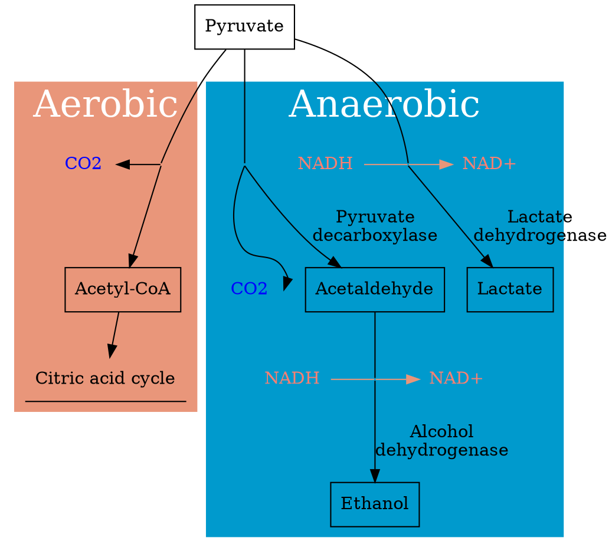

## Glycolysis

```graphviz
digraph{
  rankdir = "UD"

  subgraph cluster_0{
    hexo1 [label = "", shape = hexagon, width = 1, height = .8]
    node [style=filled,color=white];
    label = "Glucose";
    color = "white";
    labeljust=l
    labelloc=b
  }

  subgraph cluster_1{
    hexo2 [label = "", shape = hexagon, width = 1, height = .8]
    node [style=filled,color=white];
    label = "Glucose-6-phosphate";
    URL="https://www.bing.com";
    subgraph C{
      rank = same
      P1 -> hexo2 [dir = none, headport = "nw", arrowhead ="none"]
    }
    color = "white";
    labeljust=l
    labelloc=b
  }

  subgraph cluster_2{
    hexo3 [label = "", shape = hexagon, width = 1, height = .8]
    node [style=filled,color=white];
    label = "Fructose-6-phosphate";
    URL="https://www.bing.com";
    subgraph C{
      rank = same
      P2 -> hexo3 [dir = none, headport = "nw", arrowhead ="none"]
    }
    color = "white";
    labeljust=l
    labelloc=b
  }

  subgraph cluster_3{
    hexo4 [label = "", shape = hexagon, width = 1, height = .8]
    node [style=filled,color=white];
    label = "Fructose-1,6-phosphate";
    URL="https://www.bing.com";
    subgraph C{
      rank = same
      P3 -> hexo4 [dir = none, headport = "nw", arrowhead ="none"]
      hexo4 -> P4 [dir = none, arrowhead ="none"]
    }
    color = "white";
    labeljust=l
    labelloc=b
  }

  ATP1  [label="ATP"]
  ADP1  [label="ADP"]
  ATP2  [label="ATP"]
  ADP2  [label="ADP"]
  ATP3  [label="ATP", color="salmon", style="filled"]
  ADP3  [label="ADP"]
  ATP4  [label="ATP", color="salmon", style="filled"]
  ADP4  [label="ADP"]
  P1    [label="", shape = circle, color= "cyan3", height = 0.3, width = 0.3]
  P2    [label="", shape = circle, color= "cyan3", height = 0.3, width = 0.3]
  P3    [label="", shape = circle, color= "cyan3", height = 0.3, width = 0.3]
  P4    [label="", shape = circle, color= "cyan3", height = 0.3, width = 0.3]
  NAD1  [label = "Pi, NAD+"]
  NADH1 [label = "H+, NADH", color="salmon", style="filled"]
  BSG   [label = "1,3-\nBisphosphoglycerate", shape = underline]
  Phos  [label = "3-Phosphoglycerate", shape = underline]
  Pho2  [label = "2-Phosphoglycerate", shape = underline]
  Phoe  [label = "Phosphoenol-\npyruvate", shape = underline]
  Pyru [label = "Pyruvate", shape = underline]

  mm1 [label = "Hexokinase" , shape = box, color = "coral", fontcolor = "coral"]
  mm2 [label = "Phosphoglucose\nisomerase" , shape = box, color = "coral", fontcolor = "coral"]
  mm3 [label = "Phospho\nFructokinase" , shape = box, color = "coral", fontcolor = "coral"]
  mm4 [label = "Aldolase" , shape = none, color = "coral", fontcolor = "coral"]
  mm5 [label = "Triose\nphosphate\nisomerase" , shape = box, color = "coral"]
  mm6 [label = "" , shape = none, width = 0, height = 0]
  mm7 [label = "Phosphoglycerate\nkinase" , shape = box, color = "coral", fontcolor = "coral"]
  mm8 [label = "Phosphoglycerate\nMutase" , shape = box, color = "coral", fontcolor = "coral"]
  mm9 [label = "Enolase" , shape = box, color = "coral", fontcolor = "coral"]
  mm10 [label = "Pyruvate\nkinase",  shape= box, color = "coral", fontcolor = "coral"]


  hexo1 -> mm1    [dir = none , color = "deeppink"]
  mm1   -> hexo2  [  color = "deeppink"]
  hexo2 -> mm2    [dir = none , color = "deeppink"]
  mm2   -> hexo3  [  color = "deeppink"]
  hexo3 -> mm3    [dir = none , color = "deeppink"]
  mm3   -> hexo4  [ color = "deeppink"]
  hexo4 -> mm4    [dir = none , color = "deeppink"]
  mm4   -> GAP    [color = "deeppink"]
  DHAP  -> mm4    [dir = back , color = "deeppink"]
  DHAP  -> mm5    [dir = back , color = "deeppink", headport = w]
  mm5   -> GAP    [color = "deeppink", tailport = e]
  GAP   -> mm6    [dir = back , color = "deeppink"]
  mm6   -> BSG    [color = "deeppink"]
  NAD1  -> mm6    [dir = none , tailport = w, headport = n, style = dashed]
  mm6   -> NADH1  [tailport = n, headport = w, style = dashed]
  BSG   -> mm7    [dir = back, color = "deeppink"]
  mm7   -> Phos   [color = "deeppink"]
  Phos  -> mm8    [dir = back, color = "deeppink"]
  mm8   -> Pho2   [color = "deeppink"]
  Pho2  -> mm9    [dir = back, color = "deeppink"]
  mm9   -> Phoe   [color = "deeppink"]
  H2O   -> mm9    [dir = back, color = "deeppink"]
  Phoe  -> mm10    [dir = back, color = "deeppink"]
  mm10   -> Pyru   [color = "deeppink"]

  subgraph A{
    rank = same
    ATP1 -> mm1 [dir = none , color = "blue"]
    mm1 -> ADP1 [color = "blue"]
  }
  subgraph B{
    rank = same
    ATP2 -> mm3 [dir = none , color = "blue"]
    mm3 -> ADP2 [color = "blue"]
  }
  subgraph BB{
    rank = same
    ADP3 -> mm7 [dir = none , color = "blue"]
    mm7 -> ATP3 [color = "blue"]
  }
  subgraph BC{
    rank = same
    ADP4 -> mm10 [dir = none , color = "blue"]
    mm10 -> ATP4 [color = "blue"]
  }

  subgraph C{
    rank = same
    mm4
    DHAP  [label= "Dihydroxyacetone\nphosphate", shape = underline]
    GAP   [label= "Glyceraldehyde\n3-phosphate", shape = underline]
  }
  subgraph D {
    rank = same
    NADH1
    mm6
  }
  subgraph E {
    rank = same
    H2O
    mm9
  }
}
```

## Free Energy of Hydrolysis

## Coupling

$PEP + H_ 2O \longrightarrow Pyruvate + P_ i$
$\ \ \ \ \Delta G^ {\circ} = -62 kJ/mol$

$ADP + P_ i \longrightarrow ATP + H_ 2O$
$\ \ \ \ \Delta G^ {\circ} = +30 kJ/mol$

Since they share the common reactacts, this two reaction could be combined together, which was called ***coupling***

$PEP + ADP \overset{Pyruvate Kinase}{\longrightarrow} Pyruvate + ATP$
$\ \ \ \ \Delta G^ {\circ} = -32 kJ/mol$

***Coupling***:
 1. Common reactacts
 2. Catalyzed by one enzyme

### Example 1

$PEP + H_ 2O \longrightarrow Pyruvate + P_ i$
$\ \ \ \ \Delta G^ {\circ} = -62 kJ/mol$
$Glucose + P_ i \longrightarrow Glucose^ {_ -} 6 ^{_ -} phosphate + H_ 2O$
$\ \ \ \ \Delta G^ {\circ} = +14 kJ/mol$
The Enzyme were ==dose not shared== by this two reaction
As as result, they ==can not be coupled==

### Example 2

$ATP + H_ 2O \longrightarrow ADP +  P_ i$
$\ \ \ \ \Delta G^ {\circ} = -30 kJ/mol$
$Glucose + P_ i \longrightarrow Glucose^ {_ -} 6 ^{_ -} phosphate + H_ 2O$
$\ \ \ \ \Delta G^ {\circ} = +14 kJ/mol$

Coupled Reaction:

$Glucose + ATP \overset{hexokinass}{\longrightarrow} Glucose^ {_ -} 6 ^{_ -} phosphate + ADP$
$\ \ \ \ \Delta G^ {\circ} = -16 kJ/mol$

## Pyruvate and NADH

.
