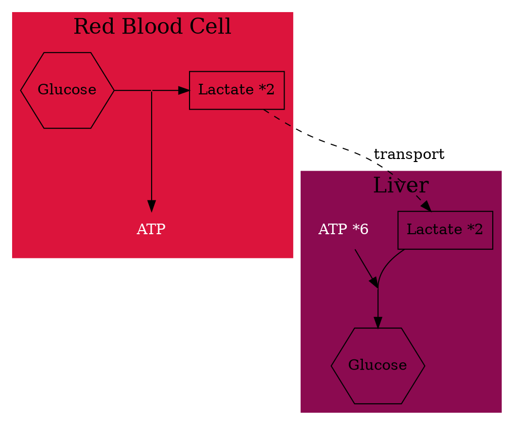
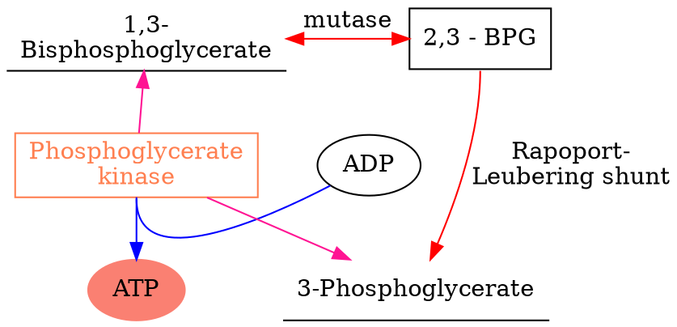
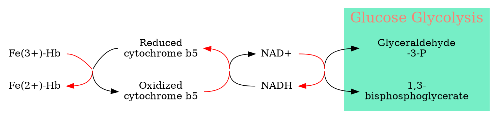
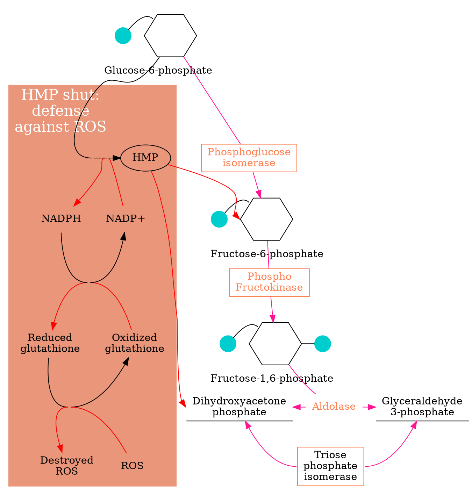

## Red Blood Cell

||
|:-:|
|[(c) Philip W Kuchel, et al.](https://www.researchgate.net/publication/320492390_Accelerating_metabolism_and_transmembrane_cation_flux_by_distorting_red_blood_cells)|

Physiological Adaptation of RBC:
  - one third of the volume is occupied by hemoglobin.
  - lack of intercellular organelles, like Mitochondrial
  - allows deformation for moving through narrow capillaries
  - lactate fermentation
  - **Cori cycle**: lactate catabolism

***Cori Cycle***

## Rapoport-Luebering shunt
It is a pathway that converts 1, 3-bisphosphoglycerate, one intermediate of glycolysis, into its isomer, 2,3-BPG.

As a bypass pathway, the ATP generation was avoid. As a result, most cells have a very low lever of the 2,3-BPG. But it is very high in RBC since this molecule has a very important function in ==release of Oxygen==.

NADH was produced in **Glycolysis** works for maintaining the iron in Fe^2+^ state, which was used to carry the Oxygen.

##  NADH maintains reduced iron

## HMP shut
HMP shut could protect RBC from reactive oxygen species.
Defense against ROS

## Oxygen Tranportaion

Conformation Chage:
  - R-State (oxygenated, high affinity)
  - T-State (non-oxygenated, low affinity)

Affinity

Cooperative binding: Dynamic Oxygen biding
  -  Releasing about 25% of oxygen
  -  When it is needed, it could releasing 75% of O~2~

$$
Hb \underset{O_ 2}{\overset{K1}{\rightleftharpoons}}
HbO_ 2 \underset{O_ 2}{\overset{K2}{\rightleftharpoons}}
Hb(O_ 2)_ 2 \underset{O_ 2}{\overset{K3}{\rightleftharpoons}}
Hb(O_ 2)_ 3  \underset{O_ 2}{\overset{K4}{\rightleftharpoons}}
Hb(O_ 2)_ 4
$$

||
|:-:|
|[(c) HarvardX](https://courses.edx.org/courses/course-v1:harvardx+MCB63X+1T2021/course/#block-v1:harvardx+MCB63X+1T2021+type@sequential+block@0764db07b5c544b2ad9e7157968935d5)|

### Binding affinity change

- Leftward shift: higher affinity
- Rightward shift: lower affinity

#### PH

The PH changed, which also connected the change of concentration's level of
CO~2~:

Muscle: CO~3~, reducing the PH, which causing Rightward shift, and decreasing the affinity, increasing the releasing of the O~2~
Lungs: CO~3~ reduced, PH increased.

2,3-BPG

In the T-shape it was bond
In the R-shape, the bond was crushed and 2.3-BPG was released.
