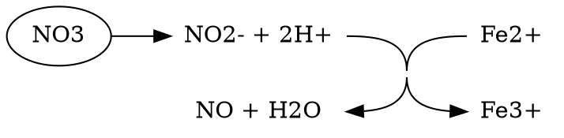

## Aerobes Condition

Metabolic pathways in becteria that operate with Low O~2~

Exp: ***E. Coli***

Multiple fermentation product:
For example, lactate, ethanol, acetate, citrate.

||
|:-:|
|(C) HarvardX|

||
|:-:|
|(C) HarvardX|

## Fermentation Branches

|
|:-:|
|(C) HarvardX|

## Anaerobic Respiration and ATP

|Respiration Type|O~2~|Electron Receptor|Product|$\Delta G (kJ/2e^ -)$|
|:-|:--:|:-|:-|:-|
|Cellular Respiration| O~2~ is sufficient| O~2~| H~2~O|-219.07|
|Fermentation|  O~2~ is not used|Varieties|Varieties|
|Anaerobic (Denitrifier))| O~2~ is not used|NO~3~^-^|N~2~|-209.46|
|Anaerobic (Metal Reducer))| O~2~ is not used|Fe^3+^|Fe^2+^|-206.12|
|Anaerobic (Sulfidogen))| O~2~ is not used|SO~4~^2-^|HS^-^|-20/24|
|Anaerobic (Mehtanogen))| O~2~ is not used|CO~2~|CH~4~|-14.58|

## Dinitrifying

Fe^2+^: Ferrous iron hemoglobin
Fe^3+^: Ferric iron methemoglobin

$2NO_ 3 ^- + 12H^ + 10 e^ - \to N_ 2 + 6 H_ 2O$
$NO_ 3 ^- \to NO_ 2 ^-$ **Nitrate** to **Nitrite**
$NO_ 2 ^- \to NO$ **Nitric oxide**
$NO\ \  \to N_ 2O$ **Nitrous oxide**
$N_ 2O\  \to N_ 2$ **Dinitrogen**

|(C) HarvardX; Dinitrifying|
|:-:|
||
||

## Bacterial and human health

The exist of  bacterial:
Colonization:
- Begins at birth
- First from mother
- Then from environment

Diversity:
- Nutrient availability
- Physical/chemical environment
- Anti-microbial defenses
- Microbe interaction and modification of the local environment

Beneficial:
  - Pathogen defence
  - Metabolic function
  - Immune system maintain
  - Energy balance

Disrabtion:
