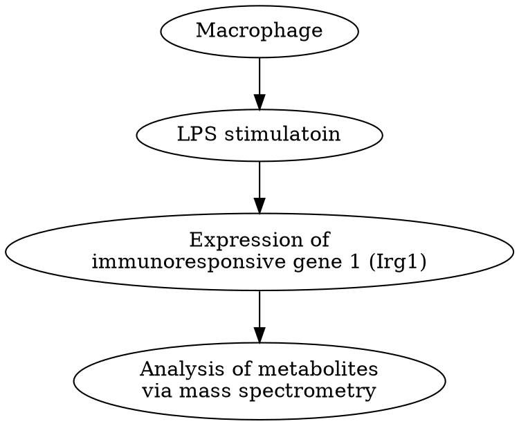

## Quick View of the Citric Acid Cycle

Key of the pathway: Electron donating and accepting.

Fuel molecules will pass the electrons to universal electron acceptors, such as as NAD^+^ and FAD.

||
|:-:|
|(C) HarvardX|

Glucose is not the only source to contribute Citric acid.
Some bacteria convert amino acid or fatty acid to Acetyl-CoA to feed citric acid cycle.

## Oxidative Decarboxylation

Pyruvate to Acetly-CoA

||
|:-:|
|<a herf="https://www.tuscany-diet.net/2019/04/10/pyruvate-dehydrogenase-complex/">(C) tuscany-diet.net</a>|

Pyruvate Dehydrogenase Complex (PDH complex): E1, E2, E3

In bacteria, the PDH complex contains the catalytic core formed by eight trimers, each made of three E2 subunits. Each one of these 24 E2 subunits is divided into three domains-- a flexible deployment domain.

The number of the E1, E2, and E3 is varied from species to species.

More Structure information: [tuscany-diet.net](https://www.tuscany-diet.net/2019/04/10/pyruvate-dehydrogenase-complex/)

*[trimers]: A chemical compound or molecule consisting of three identical simpler molecules.

**The Activity of the PDH complex is relied on Co-Enzymes**:
**E1**
  - THiamine phosphate (TPP)

**E2**
  - Coenzyme A(CoA)
  - Lipoate (Lipoic acid)

**E3**
  - Flavine adenine dinucleotide (FAD)
  - Nicotinamide adenine dinucleotide (NAD^+^)

### 4 Steps of Oxidative Decarboxylation
1. Decarboxylation
2. Oxidation
3. Trasfer
4. Regeneration

General view:

||
|:-:|
|<a herf="https://www.tuscany-diet.net/2019/04/10/pyruvate-dehydrogenase-complex/">(C) tuscany-diet.net</a>|

Acytyl Coa here could be converted into lipids and this is how the glucose was converted into fatty acid. But even thought the process of oxidative decarboxylation is reversible, mammals which lack of called a ***glyoxylate cycle*** can not turn lipids to glucose

1. **Decarboxylation**
Catalyzed by E1
Carbon from TPP is very acidic and can be deprotanated and react with pyruvate

||
|:-:|
|(C) HarvardX|

Pyruvate bind the active site of E1, CO~2~ is released.

The active site of E1 is connected to the surface of E1 by a 20-angstrom long hydrophobic channel. So our hydroxylethyl TPP, the product of the first reaction is **at the bottom of this channel**

2. **Oxidation**
Catalyzed by E1
Disulfide bond from lipoamide arm is broken.

||
|:-:|
|(C) HarvardX|

Thioester group have very high free energy.

The flexible arm of lipoamide that is bound to E2 will penetrate into the channel in E1 and bring the reactive part of the **lipoamide arm** very close.
And **lipoamide arm** swings ot of the E1 active side and enters the catalytic core formed by the E2 subunits.

3. **Transfer**

Catalyzed by E2

||
|:-:|
|(C) HarvardX|

Acetyl coenzyme A is released and fully reduced arm is formed.
4. **Regeneration**

||
|:-:|
|(C) HarvardX|

the Reduced dihydrolipoamide swings from E2 to E3, where the dusulfide bond is regenerated, FADH~2~ isformd, and then re-oxidized again by transferring its electrons and protons to NAD^+^ that was bound to E3.

## PDH complex regulation

PDH complex activity depens on the energey states of the cell.
When the energy state is high, which has high concentration of ATP, PDH activity was inhibited.

### Allosteric reugulaion of PDH

|Energy State| High|
|:-|:-|:-|
|Acetyl-CoA| High|E2|
|NADH|High|E3|
|ATP|High|
|Fatty Acid|High|

Allosteric activators
Low concentration Energy:
high concentration of CoA, NAD+, and AMP  

### Phosphorylation

$$
PDH　\underset{Phosphatase(PDP)}{\overset{Kinase(PDK)}{\rightleftharpoons }} PDH^ {_ -}p
$$

PDK phosphorylates the PDH complex on E1 and in activate the PDH

Acetyl-CoA, NADH, and ATP anctivate the PDK.
Pyruvate and ADP prohibit the activity of PDK.

Calcium which release during the muscle contraction will activate the PDP.

## Citric Acid Cycle

The function of the citric acid cycle
1. Reduce the electron donors which used in ATP synthesis.
  - Acetyl-CoA was full oxidized and generate CO~2~
  - Acetyl-CoA was coming from Glucose (Pyruvate), Fatty Acid, and Amino Acid.
2. Producing precursors for fatty acid and amino acid biosynthesis
 - Oxaloacetate, a citric acid intermediate plays a bypass role:
      $Pyruvate \to Oxaloacetate \to Malate \overset{Out of Mitochondira}{\to} PEP \to Glucose$ (PEP: Phosphoenolpyruvate)

### Acetyl-CoA to Glucose

*[exergonic]: 放能的；能量释放的；放热的
*[Stoichiometry]: 化学计量学；化学计算法

Not possible in mammals:
  - pyruvate to Acytyl-CoA is **highly exergonic**.
  - Stoichiometry of the citric acid cycle: The Carbon was lost:

As a result, the reversible reaction requires the bypass reaction to prevent the carbon-losing.

Some organism like Archea, Bacteria, Protists, Plants, and Fungi are able to revers the Acetyl-CoA to Pyruvate.

|(C) HarvardX|
|:-:|
||
||
||
||
||

## Enzymes for Gluconeogenesis
In mammals, two key enzymes are lacked for the the Gluconeogenesis: **Glyoxylate** and **Succinate**

## Human healthy with Glyoxylate Cycle

Effects:
  - Environment changes
  - Food source shifts
  - Invade other organisms

### Fungi and Bacteria

#### ***Stagonospora nodorum***:

It can cause diseases on cereals. It is a necrotic pathogen that relies on glyoxylate cycle during the infection.

Increased malate synthase activity during spore germination and virulence.
And this activity increases further with the fungus becomse more virulent.

Experiment:
The mutation of the ***mls 1*** fungus are **unable to create lesions**. (Inactivation of the malate synthesis)

#### ***Colletotrichum lagenarium*** which could cause lesions on both fruit and leaves of melon plants.
The ability of creating **lesions** are decreased in ***icl 1 knok-out*** fungus. (Lacking **isocitrate lyase**)

#### ***Candida albicans***

- In microbiota of mammalian skin and gastrointestial-tract
- Implicate in fungal infections of mucosal surfaces, sytemeic infections in immunocompormised patients.

- During proliferation, it relies on:
  - Isocitrate lyase(ICL)
  - Malate synthetase(MS)

***Irg 1*** is essential for the activity of the macrophage.

***LPSs*** (Lipopolysaccharides), a natural component of the bacterial outer membrane

**Connection**

Irg 1 triger the production of itaconic acid.
itaconic acid prohibit the isciotrate lyase produced by pathogenic bacteria to blocking the Glyoxylate cycle.
itaconic acid is derived from citric acid cycle.

**Relation**
IRG-1 is the enzyme that catalyzes the decarboxylation of cis-aconitate.

### Example of ***Mycobacterium tuberculosis***

==Hypothesis==:

1. **Limited Nutrition**
    - At the beginning of the process, the bacteria allows them to use acetate and acetyl groups as a food source. (C~2~)
    - This metabolic switch included the activation of the glyoxylate cycle.
2. Response to **phagocytose**
    - Increasing their level of isocitrate lyase
    - isocitrate lyase upregulates the glyoxylate cycle to compensating the itaconic acid.
3. **Survive**
    - The compensate effect allow it survive inside macrophages.

==Evidence==:
1. isocitrate lyase silence *M. tuberculosis* do not survive in macrophages.
2. itaconic acid inhibits the growth of *M. tuberculosis* in the presence of citrateas a sole source of carbon.

Because the ==isocitrate lyase== and ==malate synthase== are not found in human, they could be got targets in therapies.

Y. pestis expression ripABC operon: RipA, RipB, RipC.
Vitro experiments shown that those three protein could convert itaconic acid into pyruvate.
