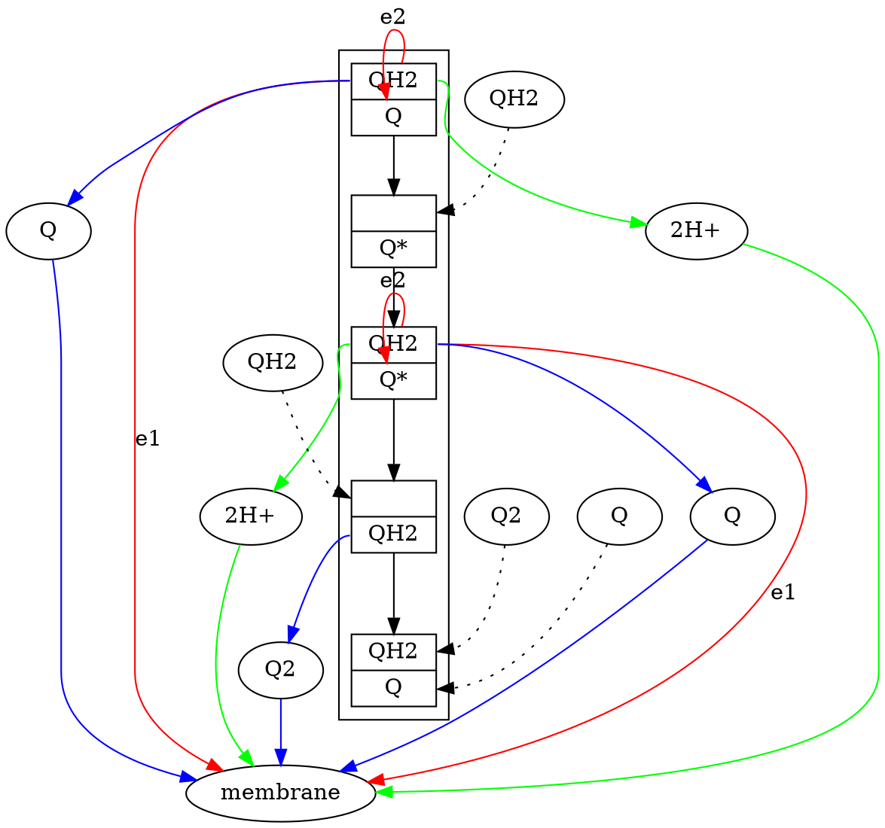

## Quick View
$NADH, FADH_ 2 \to NAD^ +, FAD + e^ -$
$e^ - + O_ 2 \to H_ 2O | ADP + Pi \to ATP$

### Universal electron acceptor

#### NAD

$NAD^ + \rightleftharpoons NADH +  H^ +$

Exp: **Malate dehydrogenase**
$malate \to oxaloacetate$
$ C_ 4H_ 6O_ 5 + NAD^ + \to C_ 4H_ 4O_ 5 + NADH + H^ +$

#### NADP

NADP is the nicotinamide adenine dinucleotide phosphate,

NADPH fules electron to anabolic reactions or biosynthesis reaction, and not directly involved in ATP synthesis.
NADH fules electron to electron transport chain and is resbonsible for catabolic reactions and ATP synthesis.

#### FAD

Flavin adenine dinucleotide, family of vitamin B~2~.

1. $reduced substrate + FAD \rightleftharpoons FADH^ + + Oxidized substrate $
2. $reduced substrate + FADH^ + \rightleftharpoons FADH_ 2 - + Oxidized substrate $

## What drives the flows the electron

### Electron affinity
Electron affinity was measured by **reduction potential**

Electron will flow from the donor into receptor which has higher reduction potential.
$Donor(e^-) \to Receptor$
$low reduction potential \to high reduction potential$

As a result, we can find that the flow of the electrons was driven by the free energy, which is $\Delta G$
We can have the function:
$\Delta G = -nF\Delta E$
$\Delta G'^ { \circ} = -nF\Delta E'^ { \circ} $

$n$: Number of e^-^ transferred
$F$: Faraday constant

Exp: Calculating $\Delta G^ {'\circ}$ for a redox reaction
This is a second reaction in the fermentation pathway
$Acetaldehyde + NADH + H^ \to ENthonal + NAD^ $
Step 1: seperate the reaction
|Reaction|Energy|
|:-|:-|
|$Acetaldehyde + 2H^ + 2e^ -\to ENthonal $|$E'^ { \circ} = -0.197V$|
|$NAD^ + 2H^ + 2e^ -\to NADH + H^ +$|$E'^ { \circ} = -0.320V$|

$\Delta E'^ { \circ} = E'^ { \circ}_ {acceptor} - E'^ { \circ}_ {donor}$
$\ \ \ \ \ \ \ \ \ \ = (-0.197V) - (-0.320V)$
$\ \ \ \ \ \ \ \ \ \ = 0.123V$

The $\Delta E'^ {\circ}$ is larger than 0, which suggest the reaction is spontaneous.

We can also verify this by calculate the $\Delta G$:
$\Delta G'^ {\circ} = -nF\Delta E'^ {\circ}$
$\ \ \ \ \ \ \ \ \ \ = -2(96.5 kJ/Vmol)(0.123V)$
$\ \ \ \ \ \ \ \ \ \ = - 23.7 kJ/mol$

$\Delta G'^ {\circ} $ is lesser than 0 which confirmed it is spontaneous.

Exp2: under nonstandard condition:
[Acetaldeyde], [NADH] = 1M
[ethanol],[NAD^+^] = 0.1 M

$E_ {acetald} = E'^ {\circ} \frac{RT}{nF} Ln\frac{[acetaldehyde]}{[ethanol]} = - 0.167V$
$E_ {NAD^ +} = E'^ {\circ} \frac{RT}{nF} Ln\frac{[NAD^ +]}{[NADH]} = - 0.350V$

$\Delta E'^ { \circ} = E'^ { \circ}_ {acceptor} - E'^ { \circ}_ {donor}$
$\ \ \ \ \ \ \ \ \ \ = (-0.167V) - (-0.350V)$
$\ \ \ \ \ \ \ \ \ \ = 0.183V$

$\Delta G = -nF\Delta E$
$\ \ \ \ \ \ \ \ \ \ = -2(96.5 kJ/Vmol)(0.183V)$
$\ \ \ \ \ \ \ \ \ \ = - 35.3 kJ/mol$

**Spontaneous under these conditions**

## Electron carriers

### Ubiquinone (Q)

||
|:-:|
|[(C) PubChem:5281915](https://pubchem.ncbi.nlm.nih.gov/compound/5281915#section=Structures)|

It is called Benzoquinone (Q) with a very long isoprenoid tail and it is extremely hydrophobic and diffuses inside the inner membrane of the Mt.

$H^ + + e^ - + Q \to QH\cdot$: semi-reduced semiquinone QH
$H^ + + e^ - + QH \to QH_ 2$: full coenzyme QH~2~ (Ubiquinone)

### Cytochromes

3 types of Cytochromes were defined by the hemes.

Heme A: cytochrome A
Heme B: cytochrome B
Heme C: cytochrome C

||||
|:-:|:-:|:-:|
|[(C) PubChem:126456446](https://pubchem.ncbi.nlm.nih.gov/compound/126456446#section=Structures)|[(C) PubChem:4973](https://pubchem.ncbi.nlm.nih.gov/compound/4973#section=Structures)|[(C) PubChem:439171](https://pubchem.ncbi.nlm.nih.gov/compound/439171#section=Structures)|
|Integral membrane protein|Integral membrane protein|Peripheral membrane protein|

## Electron Transport

$NADH \overset{Complex I}{\to} Q \overset{Complex II}{\to} Cyt_ b \overset{Complex III}{\to} Cyt_ {c_ 1} \overset{Complex III}{\to} Cyt_ c \overset{Complex IV}{\to} Cyt_ a \overset{Complex IV}{\to} Cyt_ {a_ 3} \overset{Complex IV}{\to} O_ 2$

Electron can't skip the intermediate steps in this chain.

### Complex I

|<iframe style="width: 500px; height: 300px;" frameborder="0" src="https://embed.molview.org/v1/?mode=balls&pdbid=3m9s&bg=white&chainType=ctrace&chainColor=polarity"></iframe>|
|:-:|
|(C) molview: pdbid=3m9s|
The grey part is the hydrophobic tail which elongated into inner membrane. (Which is supposed have only one tail...)

Complex I:  NADH-ubiquinone oxidoreductase
It as a L shape, with an arm in mitochondria matrix and eleongated into the inner membrane.

FMN univeral electron acceptor in its arm interacte with NADH.
1. $FMN + H^ + + e^ - \to FMNH\cdot$
2. $FMNH\cdot + H^ + + e^ - \to FMNH_ 2$

Electron transferring inner Complex I:
$FNA \to N-2 \to Q \to QH_ 2$

### Complex II

|<iframe style="width: 500px; height: 300px;" frameborder="0" src="https://embed.molview.org/v1/?mode=balls&pdbid=1nek&bg=white&chainType=ribbon&chainColor=polarity"></iframe>|
|:-:|
|(C) molview: pdbid=1nek|

The model shows the polarity properties of the complex II. Hydrophobic residues are exposed to the outer side of the cone-tip which embedded into the inner membrane.  

Compelx II: succinate dehydrogenase

It both serves to citric acid cycle and electron transprot.

In citric acid cycle, it catalyzes the conversion of succinate into fumarate.

Anal part of Compelx II in the mitochondira matrix which contains FAD.

FAD attached: SdhA  -> SdhA: FAD passed to
sdhB: Fe-S centers  -> passed to SdhC and D: heme b and Q.

PS: Q could also comse from (Acyl-CoA dehydrogenase)

### Complex III

|<iframe style="width: 500px; height: 300px;" frameborder="0" src="https://embed.molview.org/v1/?mode=balls&pdbid=1bgy&bg=white&chainType=ribbon&chainColor=polarity"></iframe>|
|:-:|
|(C) molview: pdbid=1bgy|

The neck of the molecule exposed grey hydrophobic aria which indicate the inner membrane area of the protein.

Compelx III has three main funtional groups:
1. Cyt c~1~ subunits
2. Reiske cneter: Fe-S
3. cyt b subunit: Two coenzyme Q biding site Q~0~ and Q~I~

Cyt c can only accept one electron each but coenzyme Q supposed to donate two electron. The compelx III solving this by running The Q cycle:

Electron Passing path:
$e_ 1^ - \to Fe-S \to cyt\ c$
$e_ 2^ - \to cyt\ b_ L \to cyt\ b_ H \to Q$: semi-quinone$

Blue line: Coenzyme Q transport
Red line: electron transport
Green line: Hydrogen transport
Dash line: New resource of coenzyme Q

Overall:
$$
QH_2 + 2 cyt\ c_ {ox} + H^ +_ m \to Q + 2cyt\ c_ {red} + 4 H^ +_ i
$$

#### Complex IV:
|<iframe style="width: 500px; height: 300px;" frameborder="0" src="https://embed.molview.org/v1/?mode=balls&pdbid=1oco&bg=white&chainType=ribbon&chainColor=polarity"></iframe>|
|:-:|
|(C) molview: pdbid=1oco|

Complex IV: Cytochrome oxidase

It is a dimer which each monomer has 13 subunits.

1. e^-^~#1~: $cyt\ c \to Cu^ {_ -}A \to Heme a \to heme a_ 3 \to Cu-B$
    - Cu-B is reduced and lost it function.

2. e^-^~#2~: $cyt\ c \to Cu^ {_ -}A \to Heme a \to heme a_ 3$
    - Heme a~2~ is reduced and works as the hemoglobin which could bind O~2~
    - O~2~: $Fe^ {2+_ -}O^ {_\ \ -}_ {2} Cu^ +$

3. e^-^~#3~ and H^+^: $Fe^ {2+_ -}O\ \ \ \  HO^ {_ -} Cu^ +$

4. e^-^~#4~: $Fe^ {3+}\ \ \ 2H_ 2O\ \ \  Cu^ {2+}$

$$
4 cyt\ c_ {red} + 8H^ +_ m +O_ 2 \to 4cyt\ c_ {ox} + 2H_ 2O+ 4H^ +_ i
$$
