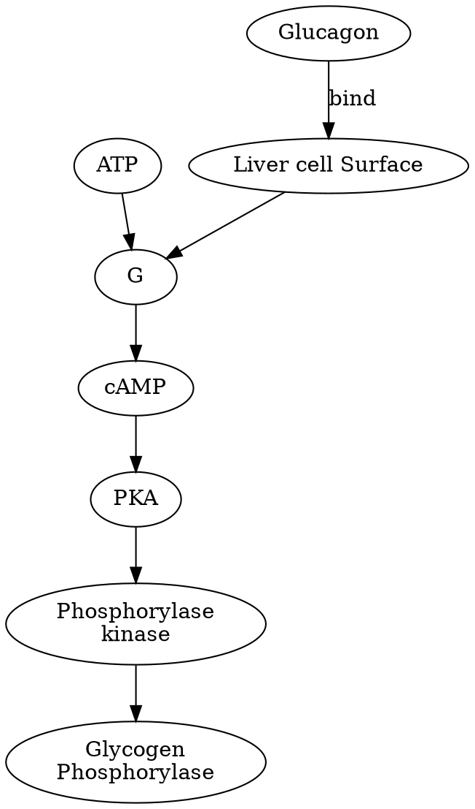
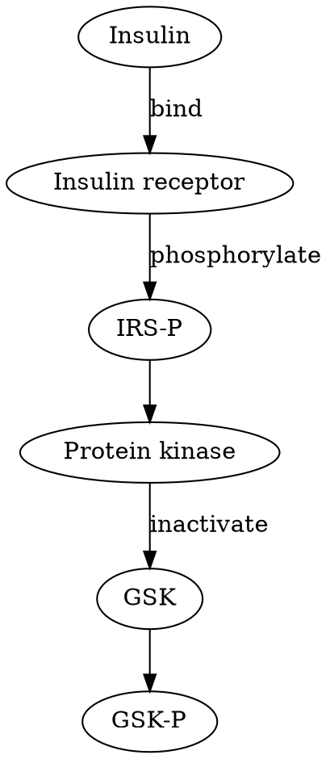
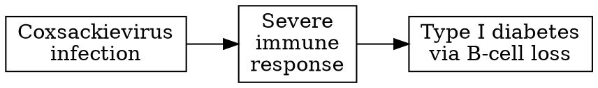
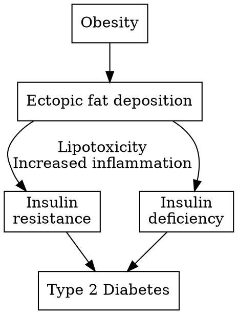
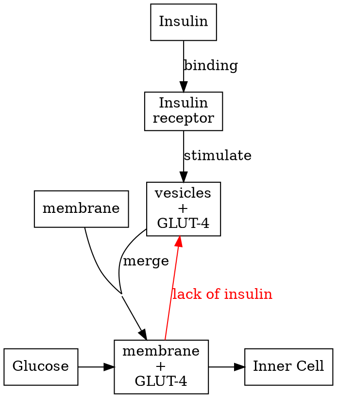
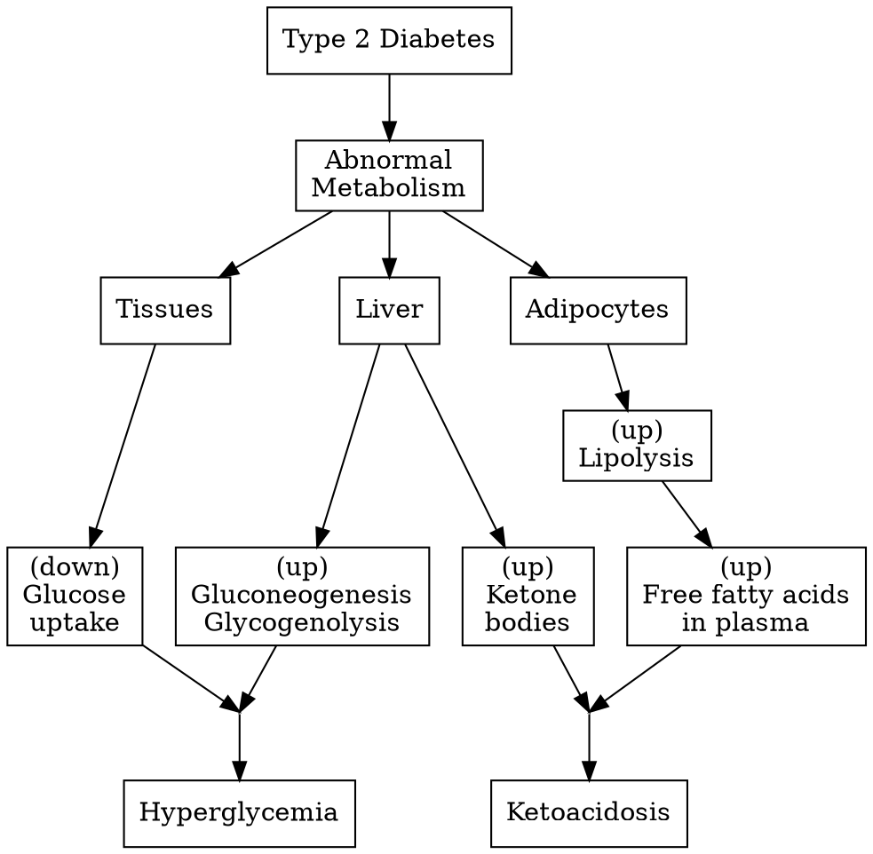
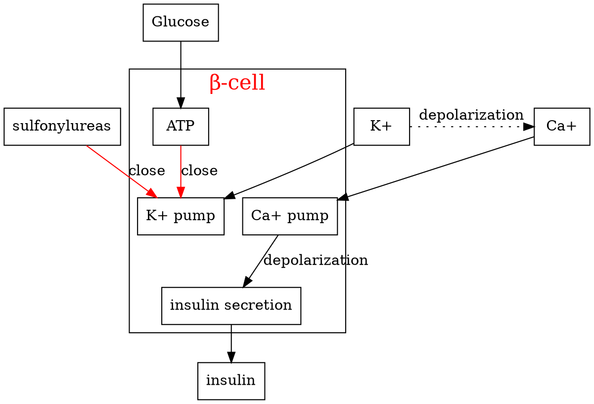

## Introduction
The brain will consume on average 120 grams of glucose per day. It is insufficient from the food.

## Gluconeogenesis

Gluconeogenesis is ==not simply== the reverse of glycolysis

- **Limited reactions (3)**
  - Three metabolic valve enzymes (rate-limiting/Enzyme-limited)
  - Those reactions are highly exergonic and irreversible.
- **Substrate-limited reactions (7)**
  - Near equilibrium
  - Reversible

## Three bypass reactions

$$
Pyruvate + ATP + GTP + HCO_ 3 ^- \rightleftharpoons PEP + ADP + GDP + P_ i + CO_ 2
$$
$\Delta G'^ {\circ} = 0.9\ kJ/mol$
$[PEP]$ low
$\Delta G = -25\ kJ/mol$

The reaction is ==spontaneous and irreversible==

- Pyruvate $\to$ PEP
  In mitochondria: $Alanine \to Pyruvate$
- Pyruvate carboxylase
  1. Pyruvate + ATP $\overset{biotin}{\longrightarrow}$ Oxalocetate + ADP (coenzyme: Biotin)
  2. Oxalocetate + NADH $\overset{Malate\ dehydrogenase}{\rightleftharpoons}$ Malate + NAD^+^
  (The change of free energy is nearly zero)
  2.1. {Malate}~Mitochondria~ $\overset{alpha-ketoglutarate\ transporter}{\longrightarrow}$ {Malate}~Cytosol~
  3. Malate + NAD^+^ $\to$ Oxaloacetate + NADH
  4. Oxaloacetate + GTP $\overset{PEP\ carboxykinase}{\rightleftharpoons}$ PEP + GDP

Glyceraldehyde 3-phosphate NAD^+^ $\rightleftharpoons$ 1,3-Bisphosphoglycerate + NADH

### Source of NADH

$$
[\frac{NADH}{NAD^ +}]_ {cyt} << [\frac{NADH}{NAD^ +}]_ {min}
$$

NADH is not permeable to the membrane of mitochondria.
So, the NADH  does not come from mitochondria.

$Lactate + NAD^ + \to Pyruvate NADH$

### The second bypass reaction

$$
Fru-1,6-biphophotate \overset{Fructose\ 1,6\ biphosphatase}{\longrightarrow} Fru-6-phosphate
\\
$$
$$
\Delta G'^ {\circ} = - 16.3kJ/mol
$$

### The third bypass reaction

$$
Glucose-6-P \overset{Glucose\ 6\ biphosphatase}{\longrightarrow} Glucose
$$
$$
\Delta G'^ {\circ} = -13.8kJ/mol
$$

### Free energy
|Glycolysis|Gluconeogenesis|
|:-:|:-:|
|-63 kJ/mol|-16 kJ/mol|

## Blood glucose regulation

The liver:
  - Balances glycolysis and Gluconeogenesis
  - Controls glycogen synthesis and degradation

Glycogen metabolism is regulated by hormones.

### Low blood glucose

As a result, the glycogen synthesis was inactivated.

### High blood glucose

GSK is the inactivator of the Glycogen synthase. Without the inactivator, the activation of glycogen synthase was increased.

#### PP1

**PP1** is a part of a complex called **Glycogen synthase phosphatase** which contains **Glycogen-targeting regulatory subunit**. It's a member of the family of glycogen-targeting regulatory subunits and could recruit the glycogen synthase phosphatase to glycogen particles.

==In high blood glucose level==:
1. PP1 dephosphorylates both enzymes (Glycogen synthase and Glycogen phosphorylase), so the glycogen synthase becomes activated, and the glycogen phosphorylase is now inactive.
2. Inactivate a protein called phosphorylase kinase and inhibit glycogen breakdown
3. Insulin would decrease the concentration of cAMP which responsible to activate PKA. (PKA could prohibit the function of PP1)
(Glycogen phosphorylase: breakdown the glycogen)
In low a concentration of blood glucose, PKA inhibits the PP1.

==In low blood glucose level
Glycogen phosphorylase would bind to the **Glycogen synthase phosphatase** which inhibited the PP1. So, glycogen synthesis is inhibited.

**Glycogen-targeting regulatory subunit** has two kinds of isoform: G~L~ in the muscle.

## regulation in muscle

### low blood glucose
- PKA cold phosphorylates G~M~. Upon phosphorylation, PP1 dissociates from G~M~ which could reduce the catalytic efficiency of PP1. (Substrate is recognized and recruited by G~M~).
- PKA also phosphorylates the inhibitor of the PP1 and then binds it to the PP1 to inhibit the activity of PP1.

### delay effect on synthase

1. No additional Glucose: **Glycogen phosphorylase** is in an **R state**
2. Added Glucose: turn to T state, **PP1GL complex** is released in now an active form.
3. T state of **Glycogen phosphorylase** is more accessible for **PP1GL complex**
4. **PP1GL complex** could now quickly bind the glycogen synthase and stimulation the glycogen synthesis

## Diabetes
Diabetes Mellitus:
- Elevated levels of blood sugar
- Deficiency in insulin activity

Two main groups of diabetes:
- Type I
  - juvenile-onset diabetes (age of 25)
  - Genetic, autoimmune, environmental
  - Reduced insulin secretion
  - $\beta$-cell  loss
  - Hard to prevent
- Type II
  - Adult-onset (40 to 60 years)
  - Genetic and environmental factors
  - Resistance towards insulin
  - Eventual $\beta$-cell loss and reduced insulin secretion
  - relatively easy to prevent
- Gestational (pregnant woman)
  - Temporary insulin resistance
  - Relapse may occur (to Type II diabetes)

Common complication:
- Hyperglycemia
- Organ damage (eyes, kidneys, and nerves.)

Controlling Type II Diabetes:
- Long-term and continuous regulation of blood sugar
- Strict dietary control

## Type I diabetes (Insulin-dependent diabetes)
Less than 10% of the diabetics
- sudden onset
- Immune system attacks $\beta$-cells

Causes:
- Viral infections initiate autoimmunity
- Genetic factors contribute

Severe $\beta$-cell loss = insufficient insulin secretion:
- undernourished
- underweight
- ketone body production
- metabolic acidosis
- lower the blood pH

Coxsackievirus targets to pancreatic $\beta$-cell and the $\beta$-cell has a very limited ability of regeneration.

Genetic factors: TYK2

TYK2 is the protein of which associate with interferon receptor, which presents INF $\alpha/\beta$ and recognized by the phagocyte.
The ineffectiveness of TYK2 loss of function increases the protection against type 1 diabetes by decreasing the antiviral and apoptotic responses.

PTPN2 could prevent the down-regulation of the antiviral in apoptotic activities.

### Lipolysis

Inhibition of hormone-sensitive lipase: HSL
  - HSL could convert diacylglycerol into monoacylglycerol.
Triacylglycerol (TAG) synthesis:
  - Conversion of glucose to glycerol 3-P in liver and adipocytes.
  - Increased TAG synthesis in liver and adipocytes
  - Increased TAG transport from liver to adipocytes
  - Upregulation of lipoprotein lipase gene
Most tissues:
  - Increased amino acid uptake
  - Activation of translation initiation factors
  - Activation of protein synthesis

### Hyperglycemia

High glucose in blood, very low glucose in the cell
- High fasting blood glucose > 126 mg/dL
  - excess of glucose in the urine
- Osmotic pressure
  - Exessive urination, polyuria, and dehydration
  - Excessive thirst, polydipsia
- Cell stress
  - Tissue Damage: Exp, oxidative damage in $\beta$-cell

Tissue starvation
- Polyphagia: (feel constantly hungry)
- Glyconeogenesis
 -  Hyperglycemia
- Degrade lipids to fatty acids
 - adipose tissue wasting
- ketone bodies synthesis
  - Low blood pH and ketoacidosis

Hypertriacylglycerolemia
Excessive very-low-density lipoproteins due to low activity of lipoprotein lipase

Effect on insulin-insensitive tissues
- protein glycation
- small blood vessels
- retina
- red blood cells

## Treatment for Type I Diabetes

It is caused by loss of insulin secretion because of loss of $\beta$-cell.
The obvious treatment is the administration of purified insulin.
- Subcutaneous injection (fat layer)
- Other injection sites (the part rich in adipose tissues)
  - abdomen
  - top of your thigh
  - back of your arm
- pump-assisted infusion

It should avoid quick absorption in order to prevent from frequent injection

Exogenous insulin administration
||Standard|intensive|Healthy|
|:-|:-|:-|:-|
|blood glucose level| ~225mg/dL|~150mg/dL|~100mg/dL|
|glycated Hb levels| ~8-9%|~7%|< 6%|

Side effect:
It was caused by the time and dose of the insulin injected.
Less or more could cause damages:
To many:
- blood glucose levels < 100mg/dL
- Hypoglycemia
  - Children < 8 yrs: brain development
  - Elderly: heart attacks and stroke

## Type II diabetes

Type II diabetes is characterized by the cell loss responsible for the circulating insulin.

## Glucose uptake

As a result, our body controls the level of blood glucose by dynamically manipulating the number of Glucose pumps (GLUT-4) on the surface of receptor cells which responsible for the circulating insulin.

### Insulin Receptor

1. Tyrosine phosphorylation of the receptor and **IRS-1** recruitment
    - $\overset{phosphatase}{\longrightarrow}$ Insulin Receptor inactivation
    - $\overset{proteosome}{\longleftarrow}$ Receptor and **IRS-1** degradation
2. **IRS-1** phosphorylation and **PI3K** activation
    - $\overset{S/T Kinase}{\longrightarrow}$ **IRS-1** inactivation
3. Conversion of **PIP~2~** into **PIP~3~**
    - $\overset{phosphatase}{\longrightarrow}$ Conversion of **PIP~2~** into **PIP~3~**
      - Inactive **PDK1** and **Akt**
      - Decreased glucose uptake and glycogen synthesis
4. Activation of PDK1 and Akt
5. Increased glucose uptake and glycogen synthesis

## Insulin resistance

adipocytes lead to chronic inflammation
- Adipocyte secretion of anti-inflammatory molecules decreases and adipocyte's  secretion of pro-inflammatory molecules increases.
  - Exp: **MCP-1**, a chemical that attracts macrophages.
  - Glucose transport inside muscle is **still normal**
- Microphages infiltrated in adipose tissue secrete **TNF-alpha**
  - Result: increase lipolysis followed by increased fatty acid export to tissue, including muscle.
  - excessive fatty acid in tissue in ectopic fat deposition and interference with the targeting of glucose transporter at the surface of cells.
  - The consequence is the progression toward **full insulin resistance**.

### One hypothesis: insulin overproduction

Hyperglycemia could trigger a large amount of insulin production. Proinsulin is heavily produced in the inner cellular ER and Golgi system. Over synthesis of this could damage the function of the ER and Golgi, which failed to remove the C-protein and produce misfolded insulin. Accumulation of misfolded insulin triggered apoptosis.

Conclusion: Obesity is a risk factor leading to ectopic fat deposition and ultimately to lipotoxicity and chronic inflammation which finally developed into insulin resistance and insulin deficiency.

### Prevention

- Aerobic exercise, reduced caloric intake, healthy diet
- Lower glucose production by the liver
- Increase insulin production or sensitivity (e.g., sulfonylureas)

**Function of sulfonylureas**
Normal signaling pathway:

