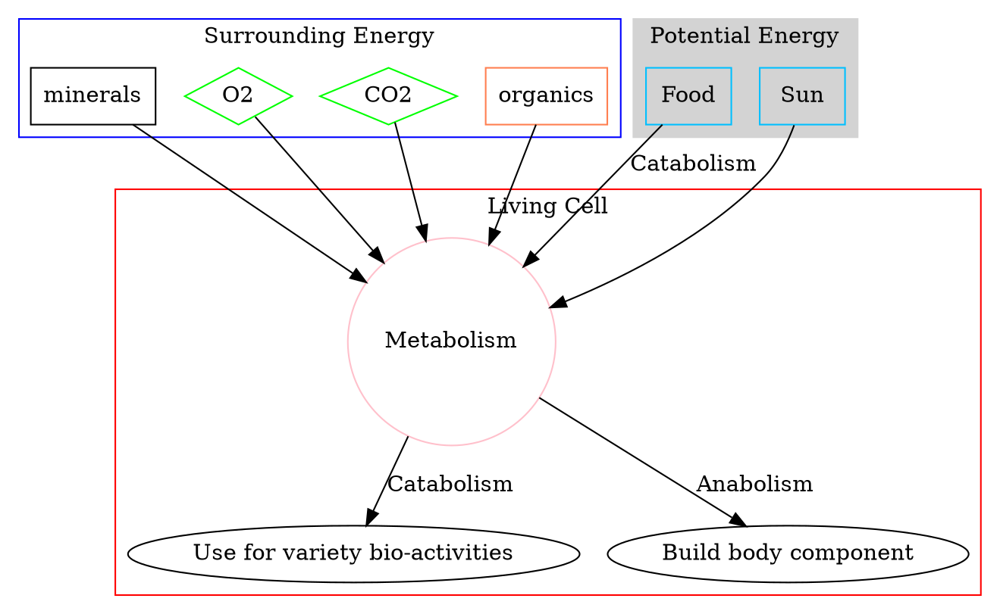
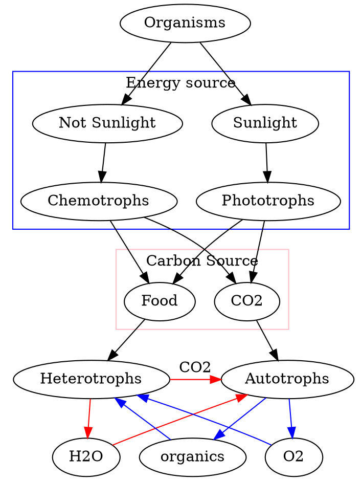

## What is life?

Carbon is the base of life. But organisms are not only a piece of carbon.
Living life constantly carries a series of energy exchange processes.

## Types of Metabolism

## Entropy and reaction

### Gibb's free energy equation
$$
G = H - TS
$$
*G*: Free engergy
*H*: Enthalpy
*T*: Temperature
*S*: Entropy

Enthalpy (H): Total energy of the system (Energy in bonds)
Entropy (S): Quantitative expression for the randomness of the system; (the disorder of the system, the amount of energy that cannot do work)
Temperature (T): Temperature; Degrees Kelvin
$TS$: Increased temperature intensifies random molecular motion, leading to increased disorder.
Free Energy (G): The only portion of the energy that is able to do work.

In a cell that carries reactions, the amount of energy lost as heat, which contributes to random motion, increased entropy, and the reaction was irreversible.

### Spontaneous Reaction
In a spontaneous reaction, the free energy is decreased,
therefor:
$\Delta G < 0$
Because:
$\Delta G = \Delta H - T\Delta S$
As a result:
$\Delta H < T \Delta S$

So,
$\Delta H$ is negative: $(-)\Delta H$, the heat is release, it is a ==exothermic reaction==.
$\Delta H$ is positive: $(+)\Delta H$, the heat is absorbed, it is a ==endothermic reaction==.

The parameters of the reaction:
- Spontaneous or not;
- Equilibrium constant;
- Directionality;
- Velocity;

### Equilibrium

1. A reaction can occur spontaneously only if $\Delta G$ is negative. (exergonic)
2. A system is at *equilibrium* and no net change can take place if $\Delta G = 0$
3. A reaction can not occur spontaneously, only input of free energy to lead it happens when the $\Delta G <0$ . (endergonic)

Equilibrium constant
$S \rightleftharpoons  P$

The concentration of S and P constantly changes.

This ration is called: Equilibrium constant ($K_{eq}$)
$K_{eq} = \frac{[P]_ {eq} } { [S]_{eq}}$

Significant: most chemical reactions are reversible. By knowing the $K_{eq}$ and the initial the concentration, we can predict the direction of reaction.

### Calculating Exp. 1:

Dihydroxyacetone phosphate (DHAP)
Glyceraldehyde 3-phosphate (G3P)

$$DHAP \rightleftharpoons  G3P$$

$K_{eq} = \frac{[G3P]}{[DHAP]}$
$\ \ \ \ \ \ \ = 0.475$

Stabdard free energy change ($\Delta G^{\circ}$):
$$\Delta G^{\circ} = -RTln(K_{eq})$$

*R*: gas constant
*T*: temperature expressed in degrees Kelvin.

So, a standard condition is a condition that the reaction proceeds at a constant temperature-- *T* equals 298 Kelvin or $25^{\circ}$C:

$$T = 298K = 25^{\circ}C$$
Reactants and products = $1M$
$R = 1.98 \times 10^{-3} kcal^1 mol^{-1} deg^{-1}$

$\Delta G^{\circ} = -RTln(K_{eq})$
$\ \ \ \ \ \ \ \ = - (1.98 \times 10^{-3}) \times 298 \times ln(0.0475)$
$\ \ \ \ \ \ \ \ = 1.80 kcal/mol$

So, the $\Delta G^{\circ}$ is positive.

==But== the thing that determines the property spontaneously is the free energy change. It gives a function
$$\Delta G = \Delta G^{\circ}+ RTln(K)$$

Here, K is the actual ratio of glyceraldehyde 3-phosphate and dihydroxyacetone phosphate concentrations in the cell. In this example, the concentration of the DHAP is $2 \times 10^{-4}M$ and the G3P's concentration is $3 \times 10^{-6}M$ (the initial of the concentration).
Under this condition, We now have:

$\Delta G = \Delta G^{\circ}+ RTln(K)$
$\ \ \ \ \ \ \ = 1.80 + RTln(\frac{[G3P]}{[DHAP]})$
$\ \ \ \ \ \ \ = 1.80 + (1.98 \times 10^{-3}) \times 298 \times ln(\frac{3 \times 10^{-6}}{2 \times 10^{-4}})$
$\ \ \ \ \ \ \ = - 0.7 kcal/mol$

As a result, the $\Delta G < 0$
==That's means, it is a spontaneous reaction!==

### Delta G
We already know that:
$\Delta G = \Delta G^{\circ}+ RTln(K)$

When there are no works is down, then, $\Delta G = 0$:
$0 = \Delta G^{\circ} + RTln(K_{eq})$
$\Delta G^{\circ} = - RTln(K_{eq})$

### Calculating Exp. 2:
In the following reaction:
$S \longrightarrow P $
$K_{eq}=4$
Initial concentration of *P* and *S*: $[P]= 10M;[S]=1M$
The forward reaction is ?:

- Standard Calculation:
$\Delta G = \Delta G^{\circ} + RTln(K)$
$\Delta G = - RTln(K_{eq}) + RTln(K)$
$\Delta G = RT(RTln(K) - ln(K_{eq}))$
$\Delta G = RT(ln(10) - ln(K_{4}))$
$\Delta G = 1.98 \times 10^{-3} \times 298 \times (ln(10) - ln(4))$
$\Delta G = 0.5406482kcal/mol$
- or can avoid the calculation:
$\Delta G = \Delta G^{\circ} + RTln(K)$
$\Delta G = - RTln(K_{eq}) + RTln(K)$
$\Delta G = RT(ln(K) - ln(K_{eq}))$
$\Delta G = RT(ln(10) - ln(K_{4}))$
$\because RT > 0$
$\because ln(10) - ln(K_{4}) > 0$
$\therefore RT \times ( ln(10) - ln(K_{4}) ) > 0$
$\therefore \Delta G > 0$

- Another way:
$\because K_{eq} = \frac{[P_{eq}]}{[S_{eq}]} = 4$
$\because K = \frac{P}{S} = 10$
$\therefore K_{eq} < K$
$\therefore ln(K) - ln(K_{eq}) > 0$
$\because RT > 0$
$\therefore RT \times ( ln(10) - ln(K_{4}) ) > 0$
$\therefore \Delta G >0$

---
Cover: [Walkowski, Slawomir & Szymas, Janusz. (2011). Quality evaluation of virtual slides using methods based on comparing common image areas. Diagnostic pathology. 6 Suppl 1. S14. 10.1186/1746-1596-6-S1-S14. ](https://www.researchgate.net/publication/51047721_Quality_evaluation_of_virtual_slides_using_methods_based_on_comparing_common_image_areas)
