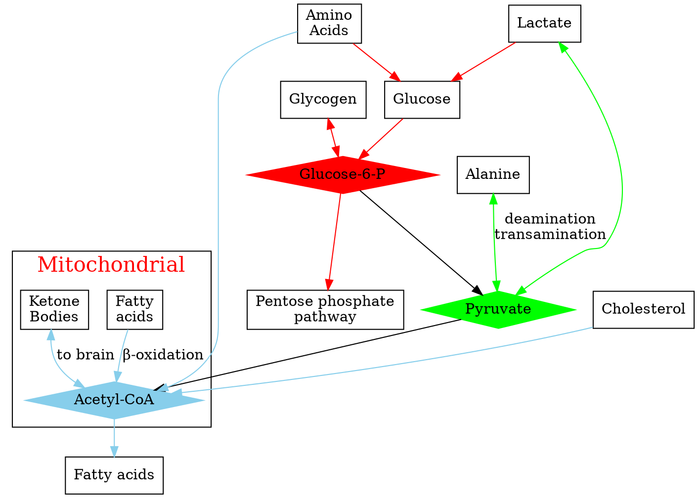
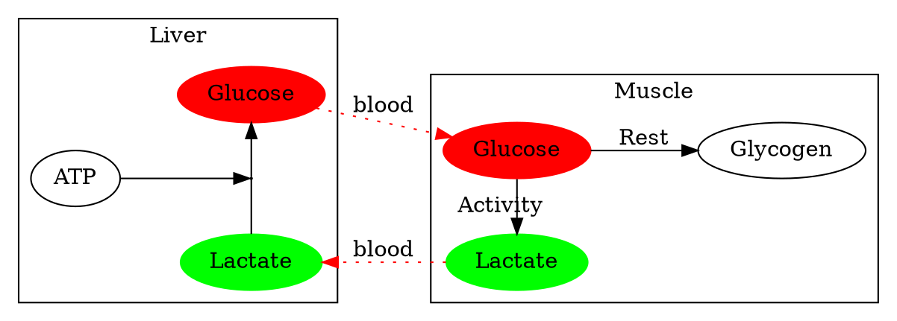
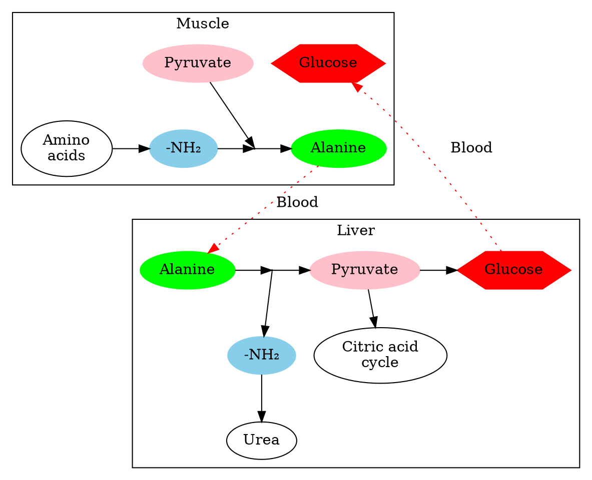

## Over view

glycolysis, citric acid cycle, and oxidative phosphorylation have significant effects on metabolism and catabolism. The substrates and products from metabolism could be used to synthesis nuclide acid, fatty acid, and protein. So, the processes of metabolism should be precisely regulated.

 

Allosteric regulation (e.g., PFK1)
- It's the quickest way to regulate the pathway.

Reversible covalent modification
- (interactive Enzyme phosphorylation) is slower than allosteric regulation.
- Common in reciprocal regulation of the catabolic and anabolic pathway.

Translation, transcriptional, and post-translational control
Compartmentalization
- Establishment of gradients across membranes

## Who all metabolic pathways are connected

Three main "Hubs" for metabolic pathways:
- Glucose-6-phosphate
- Pyruvate
- Acetyl-CoA

- Amino acid catabolism feeds the citric acid cycle
- Citric acid cycle intermediates feed amino acid synthesis
- Metabolic networks are a conduit for carbon backbones:
  - To build new molecules
  - To break them down for energy

## Metabolism adaptation

- Skeletal Muscle (motion):
  Fast ATP synthesis
- Red Blood cells (oxygen delivery):
  Minimal metabolism
- Brain cells (ion pumping):
  Neurotransmitter synthesis
- **Liver (metabolism)**:
  Regulator
  - Processes Toxins
  - Processes nutrients from digestion
  - Controls glucose homeostasis
    (Maintains [Glucose]~blood~ ~4mM)

High blood glucose level:
- Transport
  GLUT2 in the surface of the hepatocyte could transport glucose very efficiently.
- Transfer
  $Glucose + Pi  \overset{Glucokinase}{\longrightarrow} Glucose^{_ -}6^{_ -}P$
  Glucokinase is an isoform of hexokinase in the liver. It won't be prohibited by the products.
- Catabolism
  $Glucose^{_ -}6^{_ -}P \longrightarrow Glycogen$

Low blood glucose level:
- Glycogen broken-down:
$$
Glycogen + Pi \overset{Glycogen\ phosphorylase}{\longrightarrow} Glucose^{_ -}1^{_ -}P   \overset{Phosphogluco-mutase}{\longrightarrow} Glucose^{_ -}6^{_ -}P  \overset{Glucose 6-phosphatase}{\longrightarrow}
 Glucose
$$

### Fates of Fatty acids
- Incorporated int TAG, lipoproteins
- Bind to albumin, feed muscle
- Storage in lipid droplets (fatty liver)

### Fates of Amino acids
- Incorporated into liver proteins
- Incorporated into serum proteins
- Exported as free amino acids in the blood
- Precursors to other biomolecules
  - Nucleotides, hormones, porphyrins
  - Pyruvate, acetyl-ACoA
  - Glucose

## Muscle Metabolism

Muscle consumes 50% of oxygen and 90% during active works.

The skeletal muscle could carry anaerobic breath during the energy burst. But cardiac muscle can’t. It’ll cause cell death and/or heart attack.

**Cardiac muscle**:
- Aerobic metabolism
- Requires O~2~
- Sensitive to low pH
- Ion gradients disrupted by pH changes

### Phosphocreatine system

In cytoplasm
$$
Phosphocreatine + ADP + H^+ \overset{Creatine\ Kinase}{\rightleftharpoons} creatine + ADP
$$

This system is both common in skeletal and cardiac muscles.
H^+^ was consumed, the pH was Maintained. The recovery speed of phosphocreatine could be improved by exercise.

Creatine Kinase is distributed in the inner membrane, cytoplasm, and inter-membrane of the mitochondria.

limited of phosphocreatine system:
During the intense muscle contraction, the ATP and phosphocreatine power the muscle for **5 to 6 seconds**.

## short term, media term, and long term activities

The quickest speed of 100-meter racing is 9.58, the pH of the blood dropped from 7.4 to 7.2.
But the record of 1000 meter is 132.
If the sport keeps the speed like 100 meters, he can finish it with 95s, and the pH of the blood would drop to 6.8, and the cell would die. So, there are other metabolic pathways that get involved in the 1000 meter race compared with the 100-meter race. In this situation, glycogen was broken down.
In a much longer race, like a marathon, more energy was needed.

## Cori Cycle

## Glucose-alanine cycle Cycle

## Type of Fibers

|Slow twitch Type I|Fast twitch Type IIa|Fast twitch Type IIb|
|:--|:--|:--|
|- fatty acid - oxidation|- fatty acid - glycolysis|- glycolysis - fermentation|
|- mitochondria - myoglobin|- mitochondria - myoglobin - glycogen|- glycogen|
|Marathon|1000 meter race|100 meter race|
