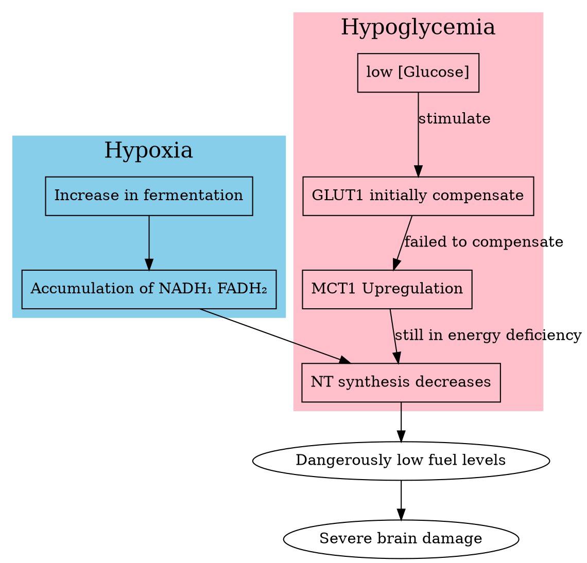
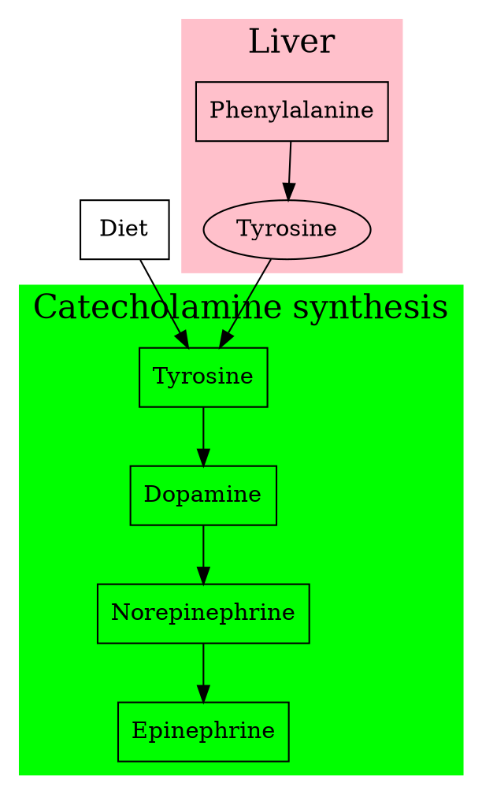
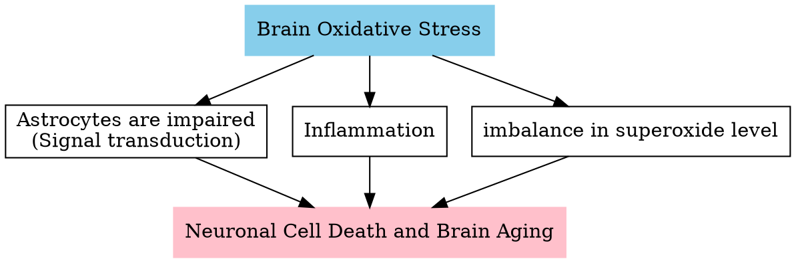

## Hormones regulate metabolism

A similar hormone: **Adrenaline**
Adrenaline works similarly to glucagon. But instead of the liver, the muscle is the key target of *adrenaline*.

**Growth hormone** could also affect blood levels. It is derived from the gradual consumption of fatty acids and not by gobbling glucose.

**Thyroid hormones** (thyroxine) could both regulated anabolic and catabolic pathways.
Overdose:
  - Metabolic overdrive
  - Thyroid hypertrophy
  - Weakness, sweating, weight loss, irregular heartbeat.
Limited dose:
  - Incidence increases with age
  - Slow metabolism
  - Weight gain, fatigue, cold sensitivity
Function:
  - Activates noradrenaline release
  - Noradrenaline stimulates thermogenin in brown fat
  - Promotes uncoupling of ETC
    - Heat production
  - In other tissues: promotes simultaneous synthesis and degradation of molecules.
    - Heat production

Conclusion:
- Tissue specificity of action
- Permits coordination between tissues
- Critical for maintaining homeostasis

**Glucocorticoids**:
They promote survival in the time of stress and scarcity by slowing the rate of nucleic acid synthesis and protein synthesis.

||Insulin| Glucagon|Adrenaline|Growth Hormone|Thyroid Hormone|Cortisol|
|:-|:-|:-|:-|:-|:-|:-|
|**Origin**| $\beta$-cells | $\alpha$-cell|Adrenal medulla|Pituitary gland|Thyroid gland|Adrenal cortex|
|**Stimulus** | $\uparrow$ [Glucose]~blood~|$\downarrow$[Glucose]~blood~|Fear, stress, exercise|Age-dependent|Circadian|Prolonged stress|
|**Liver**|- Glycogen synthesis - Glycolysis - Fatty acid synthesis|- Glycogenolysis - Gluconeogenesis - Glucose Release|==Glucagon==|- Ketogenesis - Gluconeogenesis - Glycogen synth|- Glycogenolysis - Gluconeogenesis|- Gluconeogenesis - Glycogen synthesis - Fatty acid oxidation|
|**Muslce**|- Glucose uptake - Glycogen synth - Amino acid synth|Reduce glucose uptake|- Glycogenolysis - Glycolysis|- AA uptake - AA synth|- Proteolysis - Amino acid synth|- Reduce glucose uptake - Proteolysis|
|**Adipose**|- Glucose uptake - Fatty acid synth|- Reduce glucose uptake - Release fatty acid|Release fatty acid|- Lipolysis - Reduced glucose uptake|- Lipolysis - Fatty acid synth|- Reduce glucose uptake - Lipolysis|
|**Blood Glucose**|Decrease|Increase|==Glucagon==|stable|stable|stable|
|**Free Fatty Acid**|Decrease|Increase|==Glucagon==|Increase|stable|stable|

## Blood-brain barrier

### Capillaries
*[fenestra]:  【解】窗；【动】明斑(蛾类翅上的透明斑点)

||
|:-:|
|(c) HarvardX|
Capillaries are the smallest blood vessels formed by a ring of endothelial cells. The structure of brain capillaries is very different. Some large molecules pass through fluid channels called fenestra directly from the blood to the interstitial fluid. But capillaries in the brain don't have fenestra.

- Gases and water:
  In the brain, H~2~O, CO~2~, and O~2~ are diffuse freely across the endothelial.

- Fuel molecules
  - Glucose
  Glucose is transported by facilitated diffusion witch carried by ***GLUT1***. It was 50,000 faster than sample diffusion. It was also found in cardiac muscle and red blood cells.
  - monocarboxylic acid
  lactate, pyruvate, and ketone bodies.
  facilitated diffusion: ***MCT1***
  - essential fatty acid
  e.g., $\Omega$ 3 fatty acid.
  The transport of fatty acid was poorly understood.
  - essential amino acid
  by specific transporters.
  non-essential fatty acids are blocked.
  - proteins
  insulin: transcytosis

Hypoglycemia:

Glycine is a major inhibitory neurotransmitter in the spinal cord.
$3^ {_ -}P^ {_ -}glycerate  \to Serine \to Glycine$
- $3^ {_ -}P^ {_ -}glycerate  +NAD^ +\to NADH + 3^ {_ -}phosphohydroxy\ pyruvate$
- $3^ {_ -}phosphohydroxy\ pyruvate + Glut. \to 3^ {_ -}P^ {_ -}serine + \alpha^ {_ -} kg$
- $3^ {_ -}P^ {_ -}serine + PO_ 4 \to Serine$
- $Serine + THF \to Glycine + 5,10^ {_ -}methyl^ {_ -}THF + H_ 2O $

**Glutamate** is a critical excitatory neurotransmitter in circuits for memory and learning.
$\gamma^ {_ -}aminobutyric\ acid$ (GABA) is the major inhibitory neurotransmitter in many neuronal circuits.
- $\alpha^ {_ -}ketoglutarate + NH_ 3 + NADH \to NAD^ + + Glutamate$ (In glial cells)
- $Glutamate  \to Glutamine$ (In glial cells)
- $Glutamine \to Glutamine$ (back to neurons)
- $Glutamate + CO_ 2 \to CO_ 2 + \gamma^ {_ -}aminobutyric\ acid$ (in neurons)

### Catecholamine synthesis

Catecholamine synthesis
- $Tyrosine + O_ 2 + BH_ 4 \to BH_ 2 + Dopa$
- $Dopa + CO_ 2 \to Dopamine$
- In some specific neurons
  $Dopamine + O_ 2 + Ascorbate \to Norepinephrine + H_ 2O + Dehydroascorbate$
  $Norepinephrine + CH_ 3 \to Epinephrine$
  **Norepinephrine** acts both as a hormone, by increasing blood pressure or being part of the fight or flight response (increase alertness)
  **Epinephrine** is a hormone that has an important function in homeostasis.

### Transport of neurotransmitters

Transport protein in the membrane of **storage vesicle**
**V-ATPase**: H^+^ Pump
**VMAT2**: NT in, H^+^ out

Neurons: high energy demands
  - Synthesize many neurotransmitters
  - Require energy and O~2~
The brain also requires many lipids
  - For vesicle turnover
  - To form the myelin sheath
  - FA synthesis also has high energy demands.

## Metabolism Disorder: Phenylketonuria (PKU)
*[Phenylketonuria]: 苯基丙胺酸

One gene-one protein disorder disease.

**Mentally retarded** Children with **peculiar musty odor** urine.

Ferric chloride test:
- Diabetic urine: turn reddish
  target: **acetoacetic acid**
-PUK patients: Dark Green
  target: phenylpyruvate

He tests 420 mentally impaired patients:
  - 8 had elevated phenylalanine
  - 2% of the population in the mental hospital compared to 0.01% in the general population.

Healthy population:
-  $phenylalanine \overset{PHA+BH_ 4}{\longrightarrow} tyrosine$
-   PAH (phenylalanine hydroxylase) BH~4~ is the cofactor of PAH

PKU patients
Inactivation of PAH makes phenylalanine remain at a toxic level among blood and tissues.

Untreated children:
- < 6 months: normal
- 6-12 months: lethargic
- > 12 months:
  - Seizures
  - Severe mental retardation
  - Severe Eczema
  - Microcephaly

*[Seizures]: 癫痫
*[Eczema]: 湿疹
*[Microcephaly]: 头小畸型

### Phenylalanine in blood

||Healthy|Mild(HPA)|Mild PKU|PKU (uM)|
|:-|:-|:-|:-|:-|
|Concentration|<20|120-600|360-1200|>1200|

It is passed down generations in an autosomal recessive pattern.

### Treatment

Most causes are the miss-fold of the protein.
- The PKU Diet
The treatment is limited. The most popular measure is taking the PKU Diet which has limited phenylalanine.
- Kuvan (sapropterin dihydrochloride)
  It is a form of BH~4~. It works for some of the patients. But the PKU diet is still needed.

### PAH
PAH belongs to a family of biopterin aromatic amino acid-dependent hydroxylases that convert phenylalanine, tyrosine, and tryptophan into tyrosine, L-DOPA, and oxitriptan respectively.

The classic PKU is caused by the malfunction of PHA.
The mild PKU is caused by the regeneration of BH~4~:
- $BH_ 2 \overset{PCD+DHPR}{\longrightarrow} BH_ 4$

Monomer PAH has three domains:
  - Catalytic domain (73% of mutation)
  - Self-association domain (6% of mutation)
  - The regulatory domain (21% of mutation)
    - allosteric mechanism

Active form PAH is Tetramer

- Allosteric regulation
Closed E~i~ form turn to E~a~ form when the regulatory domain was activated. Both regulatory domain and catalytic domain have a binding site of phenylalanine.
- BH~4~
BH~4~ is the coenzyme of PAH. It also binds the regulatory site and helps PAH to stay in an inactive form.
- Phosphorylation
  phosphorylating the serine residue occupying position 16 in the regulatory domain.
  PAH becomes active at a lower concentration of free phenylalanine.

### Treatment
- Limited intakes of protein-rich food like meat and potatoes
- Persisting neurological or psychosocial issues and poor quality of life despite early intervention
- Nutritional deficiencies due to diet
- The financial burden due to the cost of special medical food and dietary supplements.

Phenylalanine in excess in the blood acts as a competitive inhibitor, limiting the transport of tyrosine and tryptophan in the brain.

- GMP
GMP are proteins derived from whey, the residual liquid left after curd formation which is low in phenylalanine.

**neurological complication**
Despite the restricted diet, some patients still developed neurological complications because they have problems with BH~4~ biosynthesis or regeneration.
60% of them affect the enzymes PCD and DHPR.
Among these patients, the administration of a daily dose of 20 mg of BH~4~ per kg body weight could improve this situation.

BH~4~ acts as a PAH-specific chaperone to leading the correct folding.

### PKU with mental-disorder

The accumulation of phenylalanine:
- Oxidative stress
  - Free radicals - form when oxygen interacts with certain molecules
    - Results in highly reactive atoms with an odd number of electrons
    - Has "free" electrons available for pairing
  - Antioxidants
    - Compounds that can "donate" an electron
    - Neutralize oxidative effects
- Neurotransmitters
- Lipid Metabolism
- Bioenergetics
- Calcium

### ROS, reactive oxygen species
ROS is the most important group of free radicals in the biology system.
- nature product of cellular metabolism
- low concentration
- Maintained by Antioxidants
- High concentration causes:
  - oxidative stress.
  - Cell components such as DNA, proteins, and cell membranes
  are damaged
- Relationship with PKU
  - PKU diet reduced the injection of antioxidants $\downarrow$
  - PKU diet also limited the synthesis of antioxidants $\downarrow$
  - Increased ROS production by chronic exposure to Phe and metabolites
  - Phe inhibition of the synthesis of endogenous antioxidants

#### Oxidative Stress in Brain

### Neurotransmitter

- Precursors
  - Tyrosine is a precursor of neurotransmitters **catecholamines**.
  - Tryptophan is a precursor of the neurotransmitter **serotonin**.
- Inhibitors
  - Natural inhibitors of the enzymes responsible for the syntheses of **L-DOPA** and **dopamine**, **5-hydroxytryptophan**, and **serotonin**.

- Dopamine Deficit
  - Parkinson - like symptoms
  - Anhedonia
  - Depression
- Serotonin Deficit
  - OCD - like symptoms
  - Impulsivity
  - Depression

### Fatty acid

DHA-Ethylester in brain
- The most abundant polyunsaturated $\Omega$-3 fatty acid
- Responsible for many functions
- Low levels of DHA correlated to severely depressed patients
- Low levels of DHA lower the activity of neuronal activity and increase cell death
- A component of the myelin sheath (Damaged:)
  - Cognitive disruption
  - Neuropathies
  - Difficulty controlling movements and balance

### Energy
creatine/phosphocreatine system:
The key enzyme, creatine kinase, was inhibited by phenylalanine.

$Phosphoenolpyruvate +ADP \overset{Pyruvate\ kinase}{\longrightarrow} Pyruvate + ATP$
The key enzyme, Pyruvate kinase, was inhibited by phenylalanine.

The energy production restrictions largely affect the red blood cell and a high level of glycolysis damages the red blood cell structure integrity and are actively phagocytosed. Anemia observed.

**Ketone Bodies**
- Under normal fasting condition, blood sugar level is low
  - The citric acid cycle slows down
  - Liver cells produce ketone bodies
    - The main source of fuel for the brain
- Synthesis of ketone bodies is decreased by high levels of Phe
  - PKU patients can't produce as much
  - Decrease in ATP synthesis in the brain

### Calcium

High concentration of phenylalanine **activates** ***PMCA***: increase in calcium concentration efflux (out). Plasmid Ca^2+^ is low

Long term of phenylalanine exposure:
  chronic effects: PMCA was inactivated, Plasmid Ca^2+^ is high,
  the triggering of action potential is affected.
