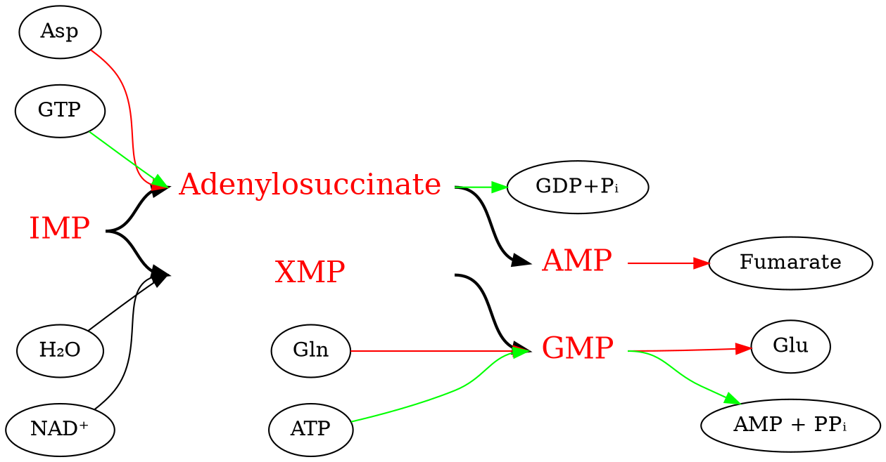
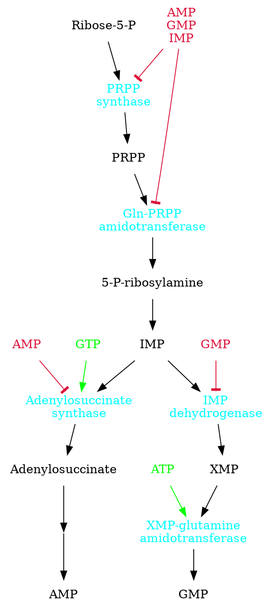
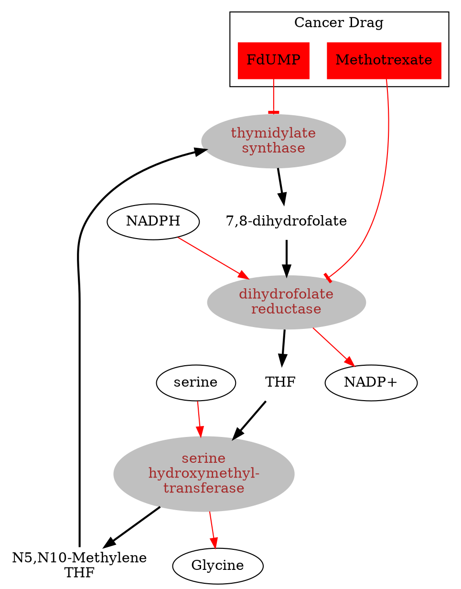

## Quick review

- Building blocks of nucleic acids
- Energy currency in cells (ATP)
- Precursors of universal electron acceptors
- Signaling molecules

RAN: Ribose; DNA: Deoxyribose
Purines: **A** (Adenine), **G** (Guanine)
pyrimidine: **T** (Thymine), **C** (Cytosine),  **U** (Uracil)

Nucleosides:
  - pentos + purine/pyrimidine
  - nucleic acid without a phosphate group
  e.g. Adenosine

Nucleotides:
  - petos + purine/pyrimidine + one or more phosphates
  - Nucleic acid with three phosphates group
  e.g. ATP

DNA/RNA:
  - polymerized Nucleotides are linked by a **phosphodiester linkage**
  - Ribonucleotide: RNA
  - Dexoyribonucleotide: DNA

### Nucleotides Biosynthesis
PRPP: phosphoribosyl pyrophosphate
PRPP + base $\to$ NMP + PP~i~

novo pathway:
PRPP + amino acids + HCO~3~^-^ + folate + ... $\to$ nucleotide

Glucose-6-P $\overset{Pentose\ phosphate\ pathway}{\to}$ Ribose-5-P $\to$ PRPP

**Another contribution of nucleotides**
Coenzyme A; cAMP

## Novo nucleotide biosynthesis

Inositol monophosphate (IMP) $\to$ AMP/GMP
PRPP $\to$ IMP has 11 steps

1. carbonyl activation
$Glycine + ATP \to Glycine-P + ADP $
The carbonyl oxygen of glycine is activated by phosphorylation.

2. Displacement by amine
$Glycine-P + NH_ 2 -R \to Glycine-NH-R$ R is nucleotide
...

Purine Biosynthesis:
- [By Biochemistry Den](https://biochemden.com/purine-synthesis/) (Recommended)
- [By Hidaya Aliouche, B.Sc.](https://www.news-medical.net/life-sciences/Purine-Biosynthesis.aspx)
- [by Sagar Aryal](https://microbenotes.com/purine-synthesis/)

### IMP to AMP/GMP

### Regulation of the synthesis

## Biosynthesis of pyrimidine

$UMP \to UTP \to CTP$

Formation of the pyrimidine-ring:
- $Carbamoyl-P + Aspartate \overset{ATCase}{\longrightarrow} Carbamoyl aspartate$
- $Carbamoyl aspartate  \overset{Dihydroorotase}{\longrightarrow} Dihydroorotate$
- $Dihydroorotate  + NAD^ +\overset{Dihydroorotate\ Dihydroorotase}{\longrightarrow} Orotate + NADH + H^ +$

Pyrimidine assemble
- $Orotate + PRPP \to UMP + PP_ i + CO_ 2$
- $UMP + 2ATP \to UTP + 2ADP$
- $UTP + ATP + Gln \to CTP + ADP + P_ i + Glu$
## NDP to dNDP

## Cancer Treatment

The cancer cell is more sensitive than normal cells to inhibitors  of nucleotide biosynthesis

- $dUMP \overset{Thymidylate\ synthase}{\longrightarrow} dTMP$

### Folate cycle

## Catabolism

### Pyrimidine catabolism
$Uridine + Pi \underset{phophorylase}{\overset{Pyrimidine-}{\longleftrightarrow}} Ribose-1-phosphate + Uracil$
$Uracil + NADPH \to Dihydrouracil + NADP^ +$
$Dihydrouracil \overset{Ring cleavage}{\longrightarrow} \beta-alanine + CO_ 2 + NH_ 4^ +$

### Adenosine degradation
$Adenosine \ monophosphate (AMP) + H_ 2O \to P_ i + Adenosine$
$Adenosine + H_ 2O \to Inosine + NH_ 3$
$Inosine + H_ 2O \to Ribose + Hypoxanthine$
$Hypoxanthine + O_ 2 + H_ 2O \to  Xanthine+ H_ 2O_ 2$

### Guanosine degradation
$GMP + P_ i \to Guanosine + H_ 2O$
$Guanosine + H_ 2O \to Ribose + Guanine$
$Guanine + H_ 2O \to Xanthine + NH_ 3$
$Xanthine \overset{Xanthine \ oxidase}{\longrightarrow} Uric \ acid$

Accumulation of Uric acid in blood could cause gout.

## treatment

- Reduce the formation of uric acid
Hypoxanthine and Allopurinal could serve as potent xanthine oxidase inhibitors. By restricted the production of the uric acid, the xanthine remained. But it is more soluble and easy to be cleaned.
- Uric acid degradation
$Uric acid \overset{Urate oxidase}{\longrightarrow} Allantoin$

## Pyrimidine/Purine salvage
### Pyrimidine
$Uracil \longleftrightarrow Ribose-1-P$
$Ribose-1-P \overset{Pyrimidine \ phosphorylase}{\longleftrightarrow} Uridine + P_ i$

### Purine
$Adenine + PRPP \overset{APRT}{\longrightarrow} Adenosine \ monophosphate$
APRT: adenine phosphoribosyltransferase.
$Guanine + PRPP \overset{HPRT}{\longrightarrow} Guanine \ monophosphate$
HPRT: hypoxanthine guanine phosphoribosyltransferase.

## Lesch-Nyhan disease
Genetic deficiency in HPRT

X-linked (Uncommon in females)

It causes Hyperuricemia, Severn neurological symptoms
Allopurinol treats hyperuricemia, but no neurological symptoms.
