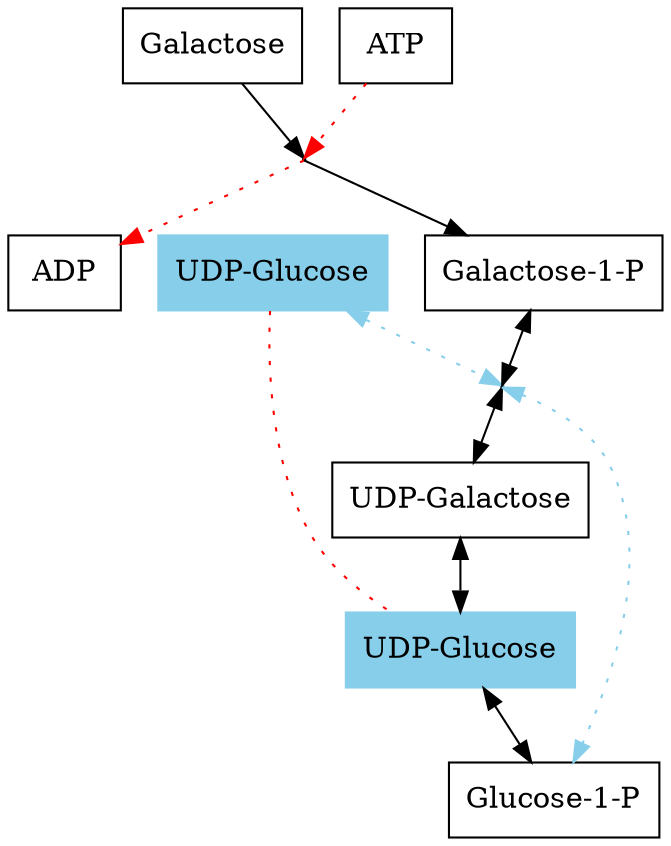
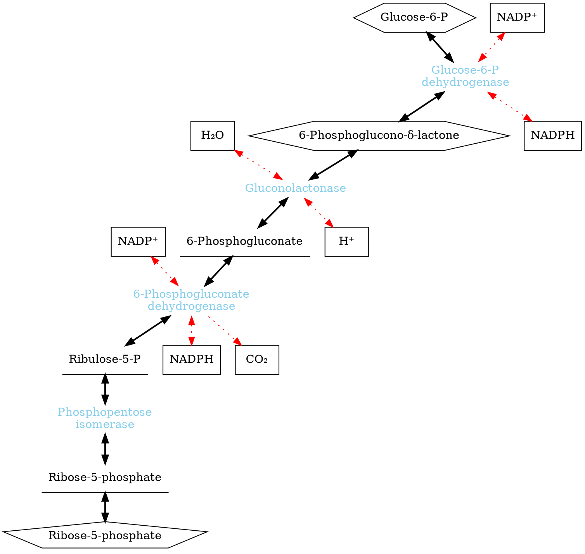
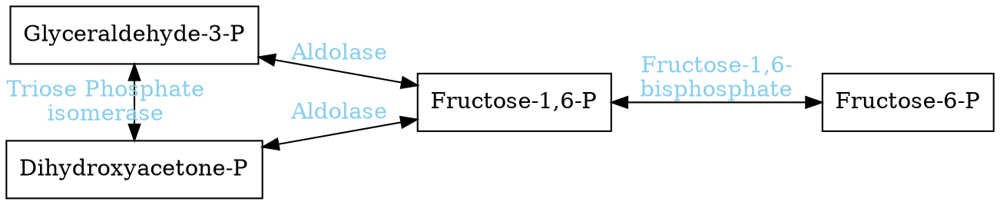

## Transporters

Glucose is not permeable to the cell membranes. So, the transporter is needed for cells absorbing glucose.

### Quick View: Glucose Transporters (GUL1)
- **Passive transport**: Glucose moves with the concentration gradient
- **Not a channel**: Transport is slower than diffusion

Model of **GUL1**: *Stepwise transfer*

### Monosaccharide import

Glucose, galactose, fructose use GLUT transporters.

**RBCs**: glucose and galactose but not fructose transported by ***GLUT1***
**Liver**: ***GLUT2*** transports glucose, galactose, and fructose

## Glycolysis of monosaccharide

### galactose

This net gain of 2 ATP per galactose from glycolysis

### fructose

In glycolysis, hexokinase has a much higher affinity for glucose than for glucose. As a consequence, it phosphorylates the fructose only when the concentration of glucose is low. e.g.: adipocytes

$$
Fructose +ATP \overset{Fructokinase}{\longrightarrow} Fructose^ {_ -}1^ {_ -}P + ADP \overset{Aldolase}{\longrightarrow} Glyceraldehyde + DHAP + (ADP) \overset{Triose\ kinase}{\longrightarrow} Glyceraldehyde ^ {_ -} 3 ^ {_ -} P + ADP
$$
***DHAP***: Dihydroxyacetone phosphonate

### Moannose

Moannose $\to$ Glucose-6-P

## Polysaccharides

Digestion: Polysaccarides $\to$ oligosaccharides $\to$ disaccharides

## Pentose Phosphate Pathway

Oxidative

$$
Glucose^ {_ -}6^ {_ -}P + 2NADP^ + \to Ribose^ {_ -}5^ {_ -}P + 2NADPH
$$

Non-oxidative
\
$$
Ribose^ {_ -}5^ {_ -}P \overset{Transketolase}{\longrightarrow}
\ \ \overset{Transaldolase}{\longrightarrow}
Fructose^ {_ -}1,6^ {_ -} 2P
$$

NADPH = Reducing potential
- Fatty acid synthesis
- ROS neutralization

Ribose-5-P $\to$ PRPP $\to$ Nucleotide synthesis

||
|:-:|
||
|(c) HarvardX|

## Medical Consequence

NADPH is used to turn ***oxidized Glutathione*** to ***reduced Glutathione***.

**Glutathione** could reduce the **H~2~O~2~** and **hemoglobin aggregates**.

### G6PD Deficiency

**Glucose-6-P Dehydrogenase** (***G6PD***) Deficiency

||
|:-:|
|<a href="https://www.rcsb.org/structure/1DPG">(c) PDB:1DPG</a>|
$$
Glucose-6-P \overset{Glucose-6-P Dehydrogenase}{\longrightarrow} 6-Phosphoglucono-\delta-lactone
$$

This enzyme was made by dimer. N-terminal is the site of the NADPH interactive center. $\alpha$ and $\beta$ domains are keeping the dimer structure.

The deficiency of this enzyme

Red blood cells encounter oxidative stress - a large amount of iron & hemoglobin, highly oxygenate tissue
- lack mitochondria
- Dependent on the pentose phosphate pathway for reducing agents

Hemoglobin aggregates lead to the formation of **Heinz bodies** that affect the elastic properties of red blood cells and also contribute to hemolysis.

**Heinz bodies**:
- Heinz bodies (Heinz-Ehrlich bodies)
  - Inclusions within red blood cells composed of denaturing hemoglobin
  - The hallmark of **G6PD** deficiency

|Classes|Result|
|:-|:-|
|**I**|- Extreme deficiency - chronic haemolytic anaemia|
|**II**|- Severely deficiency (1-10% residual activity), acute haemolytic anaemia|
|**III**|- Moderately deficient(10-60%)|
|**IV**|- Normal activity (60-150%)|
|**V**|- Increased Activity(>150%)|

X chromosome linked Gene

#### Discovery

- Soldiers received Primaquine, an anti-malarial drug that adds oxidative stress to blood cells
- Some became anemic - had G6PD deficiency.
- Leading Acute hemolytic anemia (AHA)

Primaquine induces lethal oxidative damage to different strains of Plasmodium. In healthy people, the oxidative damage could be prevented by the ***reduced Glutathione***

Factors affecting the severity of ***AHA***:
- G6PD Activity
- Red Cell Aging
- Drug dose

#### Prevention
Triggering Agents
- Drug
- Ingestion of Fava Bean
- Infection
- Diseases like diabetes, myocardial infraction
- Intense physical exercise

Severe neonatal jaundice
- neurological consequences
- The peak of bilirubin in the blood due to accumulation of hemoglobin breakdown (hallmark)

Favism
- Fava beans contain high concentrations of:
  - Nonvolatile glucosides (vicine, convivine)
  - Aglycones: Produce free radicals
- Can trigger a hemolytic response in G6PD-deficient people.

Cures for G6PD Deficiency
- The most important measure is prevention - avoidance of the drugs and foods that cause hemolysis
- In severe cases of hemolysis, blood transfusions might be necessary, or even dialysis in acute renal failure.
- Some patients benefit from the removal of the spleen as red blood cells are lysed there.

The distribution of the G6PD is correlated to the distribution of malaria, which leads to a hypothesis that the G6PD is a selective advantage in parts of the world.
