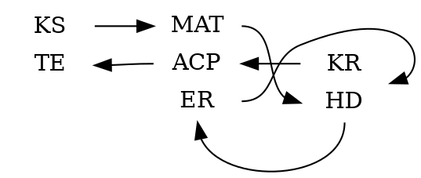
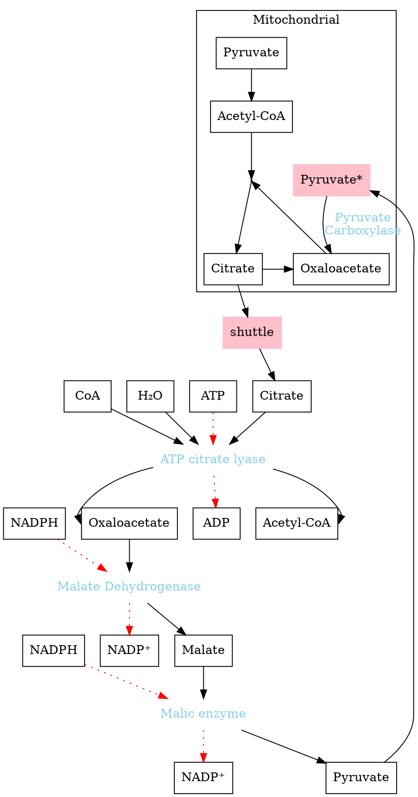

## The Building block of the Fatty acid

$$
Acetyl-CoA + ATP + HCO^ - _3
\overset{ACC}{\longrightarrow}
malonyl-CoA + ADP
$$

***ACC***: Acetyl Coenzyme A Carboxylase

**Fatty Acid Synthesis** (***FAS***)
- A long single polypeptide chain
- few distinct domains with specific enzymatic activities.
- Domains are coordinated during fatty acid synthesis

As you can see, the ***ACP*** domain is at the center of the Enzyme

1. $Acetyl-CoA \overset{MAT}{\longrightarrow} CoA-SH + Acetyl$
$Acetyl + KS \to Acetyl$-***KS***
***MAT*** would cleavage of malonyl CoA
Three carbon malonyl group binds to ***ACP***
***ACP***-malonyl^(3C)^; ***KS***-acetyl^(2C)^
2. A five steps reaction is going to join the group in ***KS*** and ***ACP*** domain
    - Condensation (***KS***)
      malonyl^(3C)^-***ACP*** $\overset{decarboxylate}{\longrightarrow}$ (2C)-***ACP*** + CO~2~
      ***ACP***-R^(2C)^ + Acetyl^(2C)^-***KS*** $\to$ ***ACP***-R^(4C)^ + ***KS***-SH
    - Reduction (***KR***)
      ketone group in R^(4C)^ was removed by ***KR*** with the help of NADPH
      ***ACP***-R^(ketone)^+NADPH + H^+^ $\overset{KR}{\longrightarrow}$ ***ACP***-R^(hydroxyl)^ + NADP^+^
    - Dehydration (***HD***)
      ***ACP***-R^(hydroxyl)^ $\overset{HD}{\longrightarrow}$ ***ACP***-R^(C=C)^ + H~2~O
      double carbon bond was formed and a water molecule was released.
    - Reduction (***ER***)
      ***ACP***-R^(C=C)^ +NADPH + H^+^ $\overset{HD}{\longrightarrow}$ ***ACP***-R^(C-C)^ + NADP^+^
      Two H^+^ was added to the R group and turn the double bond into a single carbon-carbon bond.
      4 carbon saturated fatty acid was formed.
    - Translocation
      R^(4C)^-***ACP*** $\to$ R^(4C)^-***KS***
      ***ACP*** domain is ready for a new 2 carbon chain (Acetyl group) and starts a new cycle to form an even number fatty acid chain
      It could also accept a Propionyl (3C) to form an odd carbon number chain
### Terminated

When the number of carbon is larger than 16, the ***TE*** domain is easy to work on it and release to be a palmitic acid or palmitate.

To conclusion:
$$
8\ Acetyl-CoA + 7\ ATP + 14\ NADPH + 14\ H^+ \to Palmitate + 8\ CoA + 6\ H_2O + 7\ ADP + 7\ P_i + 14\ NADP^+
$$

### Desaturation
||
|:-:|
|(C) HarvardX|

## Acetyl-CoA Shuttle

Acetyl-CoA was made by mitochondria. But Fatty acid synthesis occurred in the cytoplasm. So, a shuttle was needed to transport the Acetyl-CoA from mitochondria to the cytoplasm.

## longer fatty acid synthesis

ER:
  - **Elongation of Palmitate**
    The palmitate is bond to the cytoplasmic phase of the ER and is modified here.
    Malonyl-CoA would be the source of the 2C groups.
  - **Fatty Acid Unsaturation**

## Regulation

***ACC*** was inhibited by **AMPK** (AMP is high) in **low nutrients**
**palmitoyl CoA** prohibited the activity when there are **enough fatty acids**
It could be activated by Citrate in **high nutrients**

### By hormones

Insulin
- promote the activity of **ACC** ~(high-blood-sugar)~

Glucogaon
- promote the inactivate of **ACC** ~(low-blood-sugar)~
Epinephrine
- promote the inactivate of **ACC** ~(fight-or-flight)~

## Acyl-carnitine Shuttle

||
|:-:|
|(C) HarvardX|

Recall: Fatty acid
  - Adipocytes -- **Stored**
  - Lipase enzyme -- **Disassemble**
  - Bound to protein  -- **form lipid droplets**.
  - Bound to serum albumin -- **To blood**
  - Transport protein -- **Taken by tissue**
  - Acyl-carnitine shuttle -- **Mitochondria**

### Palmitate Transport

1. palimate +CoA-SH + ATP $\overset{Acyl-CoA\ synthesis}{\longrightarrow}$ Palmitoyl-CoA + AMP +PP~i~
  Place: **Outer mito membrane**
2. Palmitoyl-CoA + Carnitine $\overset{CPT1}{\longrightarrow}$ Palmitoylcarnitine + CoA-SH
  Place: **Outer mito membrane**
  ***CPT1***: Carnitine palmitoyltransferase. It acts as a gatekeeper
3. Palmitoylcarnitine~out-membrane~ $\overset{Porin}{\longrightarrow}$ Palmitoylcarnitine~inner-membrane-space~
  Place: **Outer mito membrane** to **inner mito membrane space**
  PS: It could be transported before or after the reaction in step 2.
4. Palmitoylcarnitine~inner-membrane-space~ $\overset{Translocase}{\longrightarrow}$ Palmitoylcarnitine~inner-mito~
5. Palmitoylcarnitine + CoA-SH $\overset{CPT2}{\longrightarrow}$ Palmitoyl-CoA + carnitine
carnitine~matrix~ $\overset{Translocase}{\longrightarrow}$ carnitine~inter-membrane-space~

## &beta;-Oxidation

|Order|β-Oxidation|Synthesis|
|:-|:-|:-|
|1|1. Oxidation|4. Condensation|
|2|2. Hydration|3. Reduction|
|3|3. Oxidation|2. Dehydration|
|4|4. Thiolysis|1. Reduction|

1. Oxidation (introduce a double bound into acyl CoA)
  $Acyl-CoA + FAD \to trans-\Delta^2-Enoyl-CoA+FADH_2$
  FADH~2~ to the ETC
2. Hydration (of the double bond)
  $trans-\Delta^2-Enoyl-CoA+FADH_2 + H_2O$
  $\overset{enoyl\ CoA\ hydratase}{\longrightarrow}$
  $L-3-hydroxyacyl-CoA$
3. Oxidation (L-3-hydroxyacyl CoA dehydrogenase)
  $L-3-hydroxyacyl-CoA NAD^+ \to 3-Ketoacyl-CoA + NADH + H^+$
4. Thiolysis (β-ketothiolase)
  $3-Ketoacyl-CoA + CoA-SH \to Acetyl-CoA + Acyl-CoA$

Acyl-CoA now could go through a new cycle of β oxidation.

### Energy production of β-oxidation

E.G.: 16C carbon fatty acid &alpha;

Palmitoyl-CoA^(16C)^ + 7 FAD + 7 NAD^+^ + 7 CoA + 7 H~2~O &xrarr; 8 acetyl-CoA + 7 FADH~2~ + 7 NADH + 7 H^+^

8 Acetyl-CoA can yield ==80 ATP==
7 FADH~2~ can yield ==10.5 ATP==
7 NADPH can yield ==17.5 ATP==

108 - 2 = ==106ATP== in toltal
2ATP was used to turn the Plamitate into Plamitoyl-CoA

### Odd number of the carbon chain palmitate
The final step of β-oxidation was yielding an acetyl-CoA and a **propionyl-CoA**^(3C)^.

**propionyl-CoA** was converted into **Succinyl-CoA**

Palmitoleoyl-CoA (&Delta;^9^)

- **The first three rounds** of &beta;-oxidation proceed as they would with  palmitoyl-CoA.
- The double bond is reached. ==cis-&Delta;^3^-Enoyl-CoA== is produced.
- ==cis==-&Delta;==^3^==-Enoyl-CoA $\overset{isomerase}{\longrightarrow}$ ==trans==-&Delta;==^2^==-Enoyl-CoA

When the double bond in the 4^th^ Carbon:
- (&Delta;==^4^==)Acyl-CoA $\overset{dehydrogenase}{\longrightarrow}$  (&Delta;==^2,4^==)Acyl-CoA
- (&Delta;==^2,4^==)Acyl-CoA + NADPH + H^+^ $\overset{2,4-Dienoyl-CoA\ reductase}{\longrightarrow}$ (&Delta;==^2^==)Acyl-CoA + NADP
-  (&Delta;==^2^==)Acyl-CoA $\overset{trans-\Delta^3-enoyl-CoA\ isomerase}{\longrightarrow}$ tran-&Delta;==^2^==-Acyl-CoA &xrarr; &beta;-oxidation

## Metabolic Myopathies

*[Myopathies]: 【医】肌病
Severe: often fatal
Less severe:
  - Adult-onset
  - Muscle weakness
  - Cramps
  - exercise intolerance
  - heart failure

Carnitine deficiency
It was made by the liver or obtained from the diet

- ***OCTN2*** Deficiency:
  ***OCTN2*** is responsible for the transport of the carnitine.
  carnitine transport was affected including cardiac and skeletal muscle.
- Carnitine synthesis:
  synthesis by the liver at a lower level.
  - palmitoylcarnitine was not made
  - So, the palmitate could not enter the mitochondria
  - lipid storage (unbalance between storage and breakdown)

Treatment:
- oral carnitine
- Fibrates (PPAR activators)
  - Gene expression: CPT2, Acyl-CoA synthetase; Acyl-CoA dehydrogenase

***CPT2*** Deficiency
- Exercise intolerance
- Cramps
- Muscle weakness
- can be fatal

The accumulation of carnitine molecules and causes irregular heartbeats.

**Treatment**
- trigger factors avoid: prolonged exercises or fasting
- High carbohydrate diet
- Fibrates

- Acyl-CoA dehydrogenase
 - VLCAD: very-long-change fatty acid (18C, 16C)
   Similar to CPT2 deficiency
   long-chain FFA in blood and urine
 - MCAD: medium-chain (C10, C8) common
   accumulation of medium-chain of FFA, which is neurotoxic
 - SCAD: short-chain (C6, C4) less severe
   accumulation of methylmalonic acid and cause **Aciduria**

Treatment:
  - Frequent, high-carb meals.
  - VLCAD: Avoid very-long-chain fats.
  supplement triheptanoin
