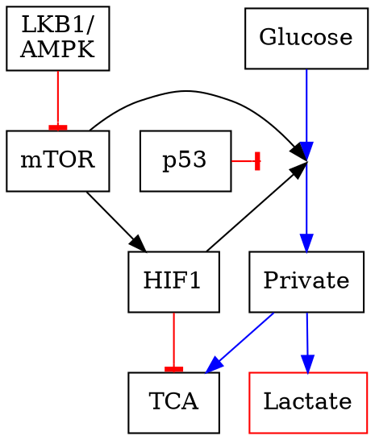
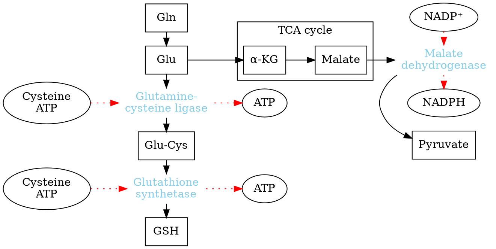

## Cancer

**Normal**:
- Low rate of division
- Metabolize glucose to CO~2~:
- Glycolysis + TCA + Oxidative phosphorylation

**Cancer Cell**:
- Metabolic reprogramming: conventional pathways have altered activity due to genetic mutations and the tumor microenvironment
- Enables increased growth, rapid division

**Healthy cells with rapid division**:
- Embryo development, immune responses, wound healing
- Similar metabolic reprogramming as in cancer

### Factors

- Internal factors
  Genetic mutation:
  - HIF1; PI3K-ATK/mTOR; MYC; KRAS; p53
- External
  Tumor microenvironment:
  - Hypoxia; Nutrient concentration; pH.

**Metabolic Adaptation**:
- **Bioenergetics**: Rapid ATP synthesis; Biomass production
- **Increased Biosynthesis**: Carbohydrates; Proteins; Nucleic Acids; Lipids
- **Maintaining redox status**: Maintain the ratio of oxidized and reduced molecules

## Warburg Effect

**Otto Warburg's observation (1924)**:

Tumor tissues uptake glucose, release lactate
Anaerobic glycolysis, even when O~2~ is available

- Response to heterogeneous/hypoxic conditions in the tumor microenvironment
- Rapid glucose and glutamine uptake by cancer cells starve neighboring differentiated cells.
- Lactate secretion makes the microenvironment acidic, which undermines immune cell responses.
- NADPH production helps tumor cells tolerate their high ROS production

### Hypothesis
Anaerobic Fermentation could generate two more NDAH witch could be used in the generation of the pentose phosphate pathway.
The carbon served to the growth and division.

### Evidence

Pyruvate Kinase in Warburg Effect

Gene|Splicing|Isoform|Tissue Distribution
:-|:-|:-|:-
L|Exon2|L|Liver
L|Exon1|R|Red Blood Cells|
M|Exon9|M1|Adult|
M|Exon9|M2|Embryo and Tumor|

Tumors switch isoforms and use PKM2
less active pyruvate kinase M2 supports the carbon retention that enables rapid cancer cell growth.

p53, LKB1/AMPK mutation is easy to be found among tumor tissues.

## Cancer metabolites

Oncometabolites: metabolic compounds observed in higher concentration in cancer tissue than healthy tissue.

Example: 2-hydroxyglutarate (***2HG***)

In normal cells:
$isocitrate + NAD(P )^+ \overset{IDH}{\longrightarrow} \alpha^{_-}ketoglutarate + NAD(P )H + H^+ + CO_2$

***IDH***: Isocitrate Dehydrogenase

Variantes of ***IDH***:
|Enzyme|Cofactor|Substrate|Localization|
|:-:|:-:|:-:|:-:|
|IDH1|NADP^+^|Isocitrate| Cytosol|
|IDH2|NADP^+^|Isocitrate| Mitochondria|
|IDH3|NAD^+^|Isocitrate| Mitochondria|

***IDH1*** and ***IDH2*** mutate in certain cancers:
  - Accept &alpha; ***KG*** substrate.
  - New product ***2HG*** is a cancer metabolite

$$
isocitrate  \underset{Wild-type\ IDH1/IDH2}{\overset{NAD(P )^+ \to NAD(P )H + H^+ + CO_2}{\longrightarrow}} \alpha^{_-}ketoglutarate  \underset{Mutant\ IDH1/IDH2}{\overset{ NAD(P )H + H^+ \to NAD( P)^+ }{\longrightarrow}} 2-hydroxyglutarate
$$

mTOR directly affects translation
- Effects eukaryotic elongation factor 4E (***elF4E***)
- This leads to overall increased translation

|Metabolism in Cancer Cell|
|:-:|
||
||
||
|(C) HarvardX|

## Reactive Oxygen Species

Reactive Oxygen Species (***ROS***)

- Low levels:
  Cell proliferation; Survival pathway
- media levels:
  Increased mutagenesis; Cancer cells more adaptive: faster growth, fewer controls on proliferation
- High levels:
  Oxidative stress; Cell death

High levels of ***ROS*** mean less ATP was produced. At the same time, a high level of H~2~O~2~ was produced. It increased the level of **oxidized nucleotides** which causing more mutations in our gene: nitrogen-based guanine to 8-oxoguanine.

Prohibited some phosphatase that kinase could not be activated, and the proliferation and growth could not be stopped.

To prevent oxidative stress and cell death leads to from high levels of ***ROS***, Antioxidants like ==NADPH== and ==GSH== (Glutathione) were largely produced.

$$
2GSH \underset{Glutathione\ peroxidase}{\overset{H_2O_ 2 \to 2H_ 2O}{\longrightarrow}} GSSG \underset{Glutathione\ reductase}{\overset{NADPH + H^+ \to NADP^+}{\longrightarrow}}2GSH
$$

***GSH***: Reduced Glutathione
***GSSG***: Oxidized Glutathione

Also, the main source of **NADPH** comes from the pentose phosphate pathway.

## cachexia

Cachexia: Metabolic syndrome
  - Muscle wasting
  - adipose tissue wasting
  - Increased energy expenditure
    - Anabolism in tumor cell
    - Metabolic stress
  - decreased energy intake

Tumor needs lots of energy metabolic precursors. Except for intake from food, adipose tissue and muscle tissue is the main source of the provider.
The adipose tissue provides fatty acid and reduces the intake of TAG. Furthermore, it causes inflammation.

Lactate released from tumor tissues was transported into the liver and back to the tumor after the lactate was converted into glucose.

Glutamine has come from muscle.
- Autophagy: protein degradation
- UCPs: ATP $\downarrow$
- Growth Factors$\downarrow$ : Protein synthesis$\downarrow$

Brain:
- change the neuropeptide
- affecting the sense of smell and taste
- decreased appetite to leads the anorexia
Gut:
- Microbiota
- infection and inflammation
Heart:
- Increase energy consumption
