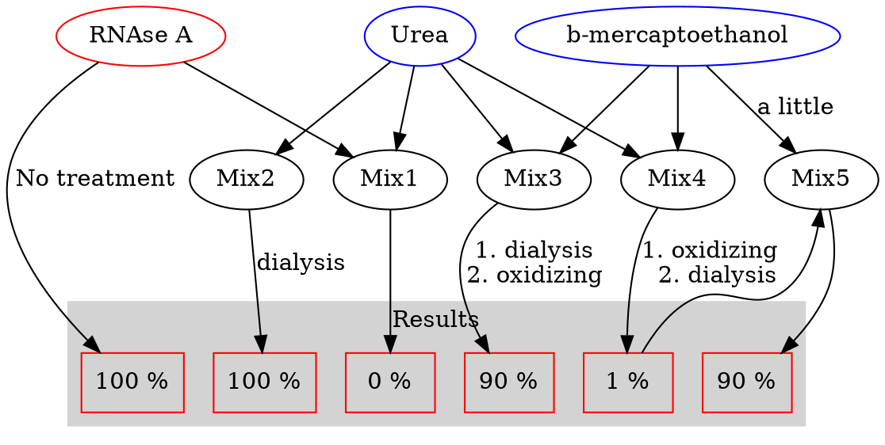
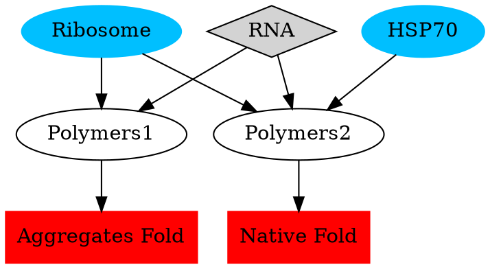
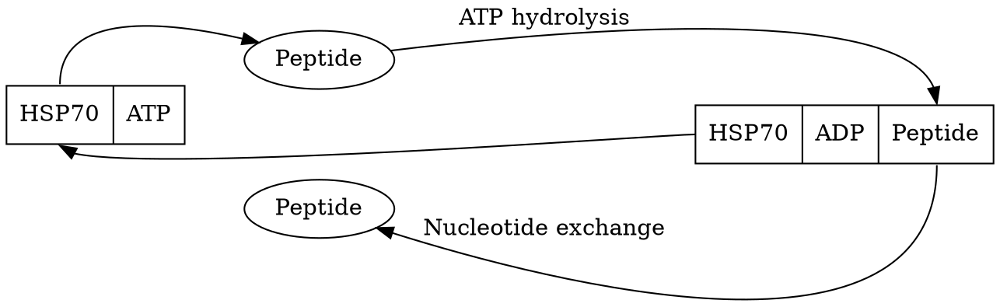

## RNAse A

### Folding Properties

When a peptide is folding, theoretically there are infinite conformations. But the entropy among them is different. They prefer to stay in a lower entropy form by thermodynamic low. This is **thermodynamic stability**. expect that, **the hydrophobic interactions**, **disulfide bonds** are also contributed the protein folding and make the folding predictable.

|Thermodynamic Protein folding funnel||
|:-:|:-|
| [(c) Jon Lieff, MD](https://jonlieffmd.com/blog/protein-folding-and-the-mind) |The image shows left gave an illustration of the protein folding that follows the thermodynamic stability. Though there are **infinite conformations** for peptides, some of them contain **higher free energy** ($G$) which makes them unstable. The lower they fall into, the less $G$ they have, and the more stable they are. This naturally leads the peptide to fold into one (or maybe a few?) more "favorable" conformation|

> ### Hydrophobic effect:
> These hydrophobic interactions have an impact not just on the primary structure but then lead to changes seen in the secondary and tertiary structure as well. Globular proteins acquire distinct compact native conformations in water as a result of the **hydrophobic effect**
>
>[Libretexts: Introduction and Protein Structure](https://chem.libretexts.org/Bookshelves/Biological_Chemistry/Supplemental_Modules_(Biological_Chemistry)/Proteins/Protein_Structure/Protein_Folding)

It is a very highly cooperative process. As the start contacting each other, they constrain the backbone surrounding them and force other hydrophobic molecules to come close like a snowball effect.

    

        <iFrame src="https://www.rcsb.org/3d-view/ngl/5rsa" width="112%" height="910px" scrolling="no">
        </iFrame>
    

[(c) PDB:5RSA](https://www.rcsb.org/3d-view/5RSA?preset=ligandInteraction&sele=ZN)

|**Rnase A**:<li>It is a small and classical model system</li><li>124 residues protein</li><li>4 Disulfide bonds.</li>| [(c) PDB:5RSA](https://www.rcsb.org/3d-view/5RSA?preset=ligandInteraction&sele=ZN)|
|:--|:-:|

### Anfinsen Experiment

1. added 8 molar urea to RNAse A: 0% Activity
    - Urea unfolding protein
    - Remove Urea, 100% Activity Back

2. Urea + $\beta$-mercaptoethanol (destroy disulfide bond)
    - dialysis of the Urea and  $\beta$-mercaptoethanol
    - Reform disulfide bonds in an oxidizing environment
    - Recover to 90% activity.

3. Urea +$\beta$-mercaptoethanol (destroy disulfide bond)
    - Reform disulfide bonds in an oxidizing environment
    - dialysis the Urea
    - About 1% of activity

4. Take the RNAse A from experiment 3 which has about 1% activity to a small concentration of $\beta$-mercaptoethanol and it regains 90% of activity.

- Urea: high poly molecule to denature the protein
- $\beta$-mercaptoethanol: destroy the disulfide bonds.
- Dialysis: Remove the Urea
- Oxidizing: Giving an oxidation environment to form disulfide bonds.

### What can we learn:
1. Urea: a very poly molecule and inhibit the hydrophobic impact of protein folding.
2. Most folding was followed thermodynamic low. So, they can return to natural folding spontaneously.
3. Primary structure is sufficient to predict the higher structures. They don't need templates or instructors.   

### Protein folding  funnel
Protein folding funnel (As its show above)
Folding intermediate: thermodynamic trap
Protein may fold falsely trapped in the **incorrect local** as pointed out below.
||
|:-:|
|(c) [schaechter.asmblog.org](https://schaechter.asmblog.org/schaechter/2012/01/pushing-the-thermodynamic-envelope-into-the-proteomic-edge.html)|

## Protein folding kinetic

Protein funnel.
Starting from the high to the bottom of the funnel.

phi and psi angle:
the region.

1. Only a serious fall in the region could form an alpha-helix or beta-sheet: that protein folding relies on very precise conformations of the backbone through their $\phi-\psi$ angles
2. Magnitude: **Levinthal's paradox**
  Peptide: 100. Hypothesis: 3 conformations for each.
    - $3^100$ possible conformation.
    - $0.1ps$ time per conformation.
    - $10^27$ years to finish.
    - Universe ~ $14 \times 10^9$ years

Because of the paradox, it becomes obvious that the protein cannot sample conformation space in a random fashion. Instead, the protein samples the space in a way consistent with statistical mechanics.[^soft-matter]

[^soft-matter]: [soft-matter, 2011: Levinthal's Paradox](http://soft-matter.seas.harvard.edu/index.php/Levinthal%27s_Paradox)

A Mathematical resolution for **Levinthal's paradox**:
[R Zwanzig, A Szabo, and B Bagchi, 1992: Levinthal's paradox](https://www.pnas.org/content/pnas/89/1/20.full.pdf)
## Cooperativity

Cooperativity in protein:
  - Cooperativity is a phenomenon displayed by enzymes or receptors that have multiple binding sites where the affinity of the binding sites for a ligand is increased, positive cooperativity, or decreased, negative cooperativity, upon the binding of a ligand to a binding site.[^wiki_cooperativity]

[^wiki_cooperativity]: [Wikipedia: Cooperativity](https://wiki2.org/en/Cooperativity)

Exp:
  - **Nucleation Condensation model**: During the hydrophobic effect, more hydrophobic residues are closing to each other after the first pair of hydrophobic residues cooperated, and leads more hydrophobic residues to collapse into a hydrophobic core. <u>After the hydrophobic core collapsed, the peptide started to form secondary structures since the residues are now in close proximity</u>.
  ==Peptide== ->  ==hydrophobic core== -> ==Secondary Structure== -> ==Higher Structure==
  - **Diffusion collision model**: In alpha-helix, the helix was hard to form at the beginning. But once the first hydrogen bond was connected, the peptide was constrained, which leads to the rest of the residues quickly connected because they were closer. <u>Protein starting with form the secondary structure, followed by the tertiary structure</u>
  ==Peptide== -> ==Secondary Structure== -> ==Higher Structure==

## Computer Simulation
**molecular dynamic simulation**

Simulate the motion of the atom: Simulate the small protein in aquatic solution.

Exp： 35 residues: headpiece domain of villin, cytoskeletal protein.
  - Classic model.
  - 6 microseconds.
  - small fold contains 3 helices.
  - started with a standard peptide
  - collapse raptly own itself
  - two out helices formed very quickly
  - middle helix takes a long time to yield
  - the simulation predicted structure is highly constant with experiment result.

## Protein folding in cell

**Environment**: Cytoplasm is filled with lots of DNA, RNA, lipids, and proteins, etc, sort of things. This big jam may prohibit the folding of the peptide.

Aggregates

amyloid $\beta$

Aggregates elimination: chaperones

### Chaperones: HSP70

Features: ATP-Bound substrate-free
  - With the ATP hydrolysis, the conformation of the HSP70 was changed and the peptide was released.
  - 3 domains: ATPase domain; substrate-binding domain; lipid domain.
  - ATP hydrolysis:
    - Lipid domain comes close to the substrate-binding domain
    - Form a substrate-binding pocket,

HSP70 binds the hydrophobic areas of the peptide to prohibit the miss folding introduced by the hydrophobic effect.

HSP70: heat shock protein 70
Increases its expression during the increase of heat.

Tm increase -> protein denature
Expression chaperones protein to prevent aggregates.
It also responds to other stress: expression stress (too much expression)
HSP60, GroEL: Cage structure to house the protein to fold.

Overcome the kinetic trap; thermodynamically favorable aggregates.

    

        <iFrame src="https://www.rcsb.org/3d-view/ngl/4b9q" width="112%" height="910px" scrolling="no">
        </iFrame>
    

|HSP70 Substance-free(C)[PDB: 4b9q](https://www.rcsb.org/3d-view/ngl/4b9q)|
|:-:|

    

        <iFrame src="https://www.rcsb.org/3d-view/ngl/2kho" width="112%" height="910px" scrolling="no">
        </iFrame>
    

|HSP70 Substance-binding(C)[PDB: 2kho](https://www.rcsb.org/3d-view/ngl/2kho)|
|:-:|

---
Reading Materials:
[Kerry Geiler, 2010: PROTEIN FOLDING: THE GOOD, THE BAD, AND THE UGLY](https://sitn.hms.harvard.edu/flash/2010/issue65/)
[Libretexts: Introduction and Protein Structure](https://chem.libretexts.org/Bookshelves/Biological_Chemistry/Supplemental_Modules_(Biological_Chemistry)/Proteins/Protein_Structure/Protein_Folding)
