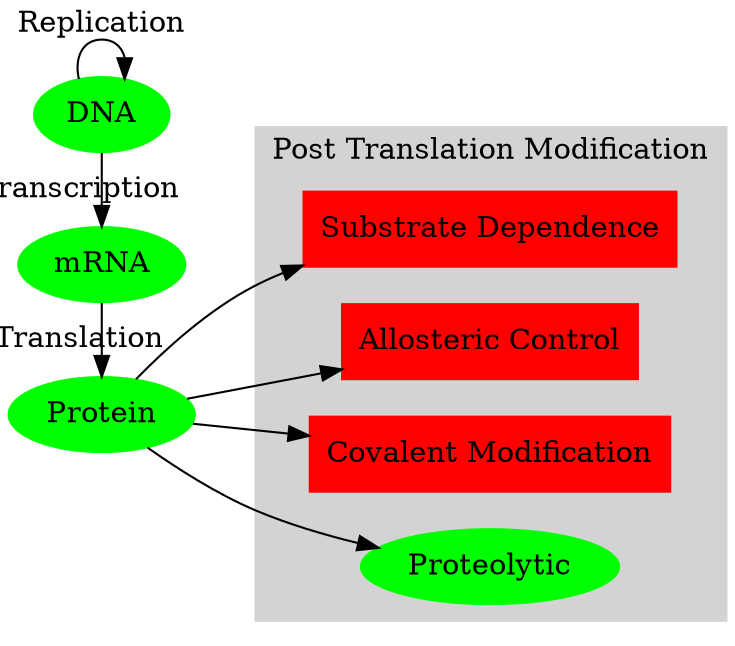
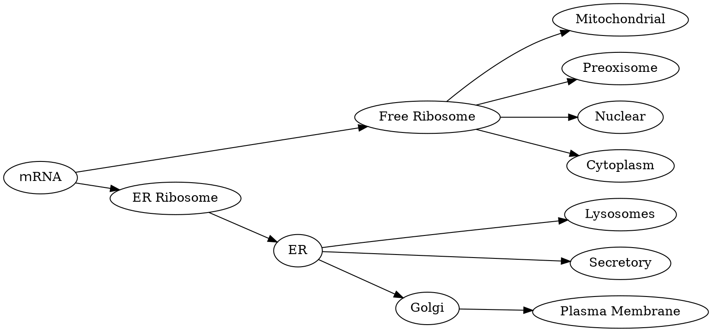
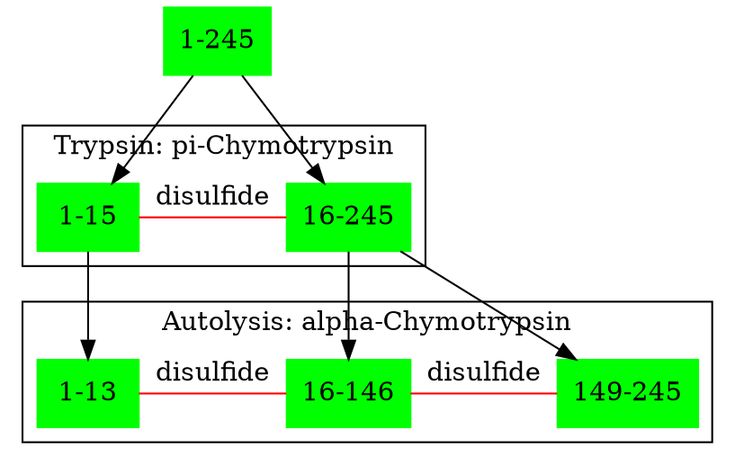
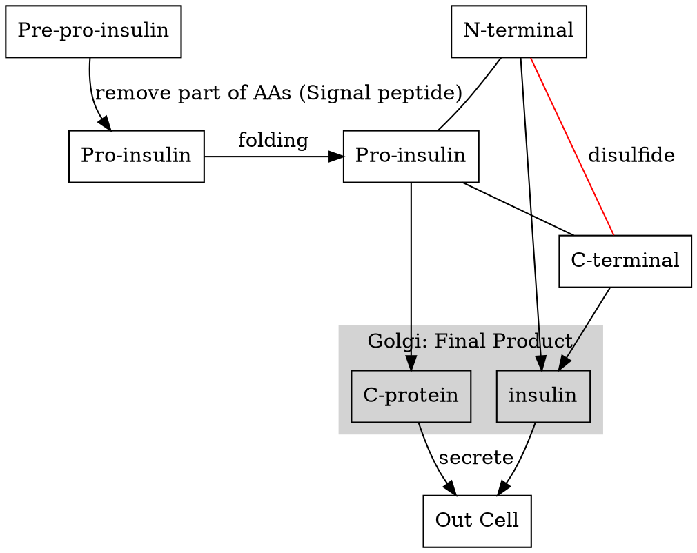
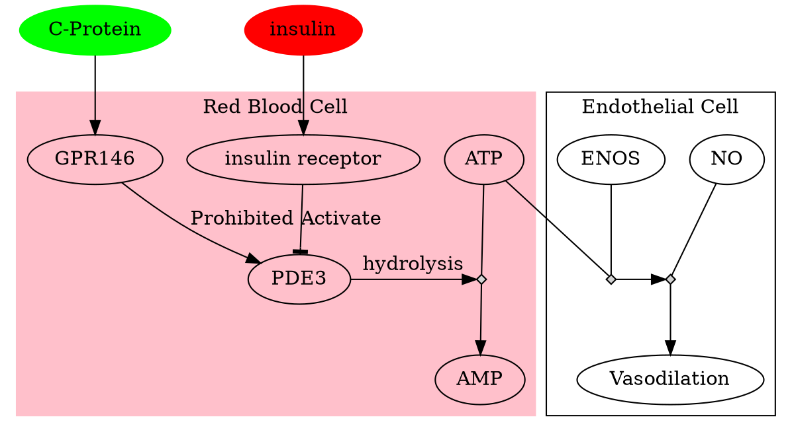
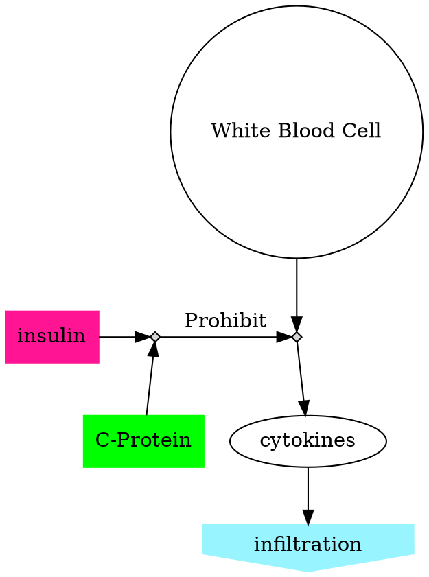
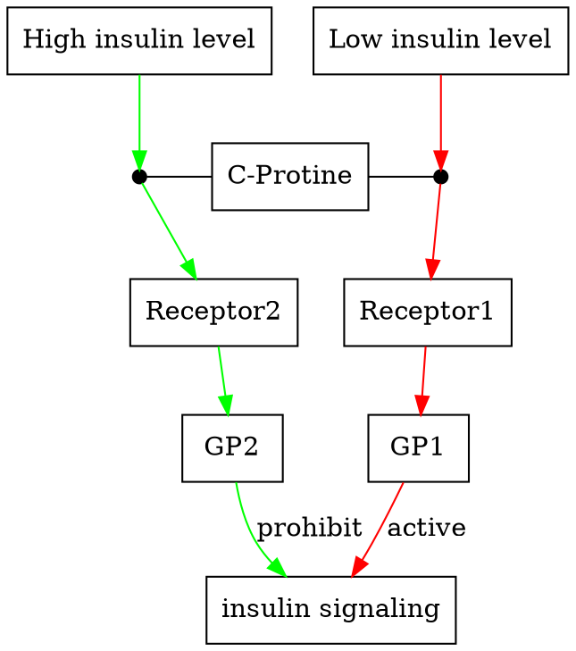

## Enzyme Catalysis

||
|:-:|
|(c) Gerlt J A. 1994|

Though the spontaneous reaction could happen automatically, it could run very slow without the help of the catalyzes.

## Why Enzyme Can Catalysis

- Transient covalent bonds
  - Activate substrate, lower the activate-energy..
- Weak non-covalent interaction
  - binding energy: $ \Delta G_B$ (Figure: Enzymatic Reaction, D), needed energy to decrease the reaction
- Desolvation:  weak interaction between water and substrate is replaced by weak interaction between the substrate and the enzyme.

**Catalysis is driven by structure and conformational changes.**

||
|:-:|
|(c) HarvardX|
### Exp: Beta-galactosidase

$\beta-glycosidic$ bond
$\alpha-glycosidic$ bond

$\beta-galactosidase$ can only hydrolysis the $\beta-glycosidic$ bond but not
$\alpha-glycosidic$ bond though they are highly similar.

## Why enzyme

### Size of the enzyme
Compared to the small active site, the enzyme is relatively large.
Role of the outside residues:
  - position the active residues in the right position
  - optimizing catalysis by induced fit
  - enzyme regulation:
    - Methylation
    - phosphorylation: tyrosine, serine, and threonine residues.
  - enzyme complexes
  - conformation changes after binding the substrate
short peptide:
  - few conformation possibilities.

### 3-point attachment model
Phenomenon: In ethanol, two hydrogen bonds to the Carbon, and both of them are equally expected to be transferred to NADH， but only one of the hydrogen could be transferred.

In this model, the enzyme attaches 3 positions of ethanol:
 - methyl group
 - hydroxyl group
 - one specific hydrogen from the methylene group

## Protein Processing

*[Allosteric]: ~~~~~~~~~~~ 〔生〕变构；别构的
*[Duodenum]: ~~~~~~~~ 十二指肠
*[Proteolytic]: ~~~~~~~~~~ 蛋白水解的 蛋白水解酶

DNA -> mRNA -> Protein ->
Post translation modification:
  - Substrate Dependence
  - Allosteric Control
  - Covalent Modification: **Phosphorylation**
  - Proteolytic: from zymogen and proenzyme to functional protein by **proteolytic enzyme digestion**.

### Proteolytic

#### The fate of the protein

The different fate of protein translation:
  - Translated freely in the cytoplasm by free ribosomes
  - Transported into organisms once been translated
  - Ribosomes were soon attached to the ER and peptides went to the Golgi transport system to Plasma membrane or lysosomes.

#### Enzyme Chymotrypsin

*[zymogen]: ~~~~~~~~~~~~~~~~~~~~~~~~~ A proenzyme, or enzyme precursor, which requires a biochemical change (i.e. hydrolysis) to become an active form of the enzyme.

Chymotrypsin:
  - a zymogen
  - a digested enzyme created by the pancreas
  - Started with an inactive form: chymotrypsinogen.
  - work in the Duodenum to digest the food.
  - 245 residues

1. chymotrypsinogen + Trypsin -> 15 residues peptide + 230 residues peptide
2. $\Pi-Chymotrypsin$:
  - [1:15] S-S [16:245] (disulfide bond)
3. Autolysis:
  - [1:13] S-S [16-146] S-S [149:245]
4. the mature form of chymotrypsin: $\alpha-Chymotrypsin$

Insert an model:
PDBID:

### Hormone: Insulin
Insulin:
  - secreted by the pancreas;
  - regulating the level of blood glucose;

1. Rre-pro-insulin: 110 residues
2. Pro-insulin
3. Folding: intramolecular disulfide bonds link together the N-terminal and the C-terminal
4. Golgi
5. Digested to insulin + C-peptide
6. Secreted

insulin: A (N-terminal)+ B (C-terminal)

C-Protein:
  Previously Recognition: It's for structure support and inactivity by-product.
  Recent research: involved in many physiological events.  
  - opposing with insulin in red blood cells

#### Case 1: Revers Regulation

In red blood cell: PDE3 + ATP -> AMP

When PED3 is deactivated: ATP is released, enzyme ENOS is working:
- ENOS + ATP + NO(nitric oxide) -> Vasodilation

C-Protein +[binding]+ GPR146 (receptors) -> PKC -> prohibited PDE3

#### Case 2: Both have inhibitory effects.
WBC (White blood cell):
  release cytokines-> active adhesion molecules of the endothelial cells -> WBC attach to the endothelial cell -> extravasation  
WBC binds both C-protein and insulin: **decreases** the release of cytokines:
  Prevent tissue infiltration to reduce inflammation.

#### Case 3: C-Protein mediates the tuning of insulin signaling.
- Low insulin levels:
  - C-peptide binds to the membrane receptor
  - Activate G-protein
  - Insulin signaling enhanced
- High insulin level:
  - C-peptide binds the membrane receptor
  - Activate another G-protein
  - Insulin signaling repressed

Conclusion:
Protein processing is an important way to regulate protein activity:
  - Stored as precursors to avoid toxicity
  - Quick response to acute change with active precursors.
