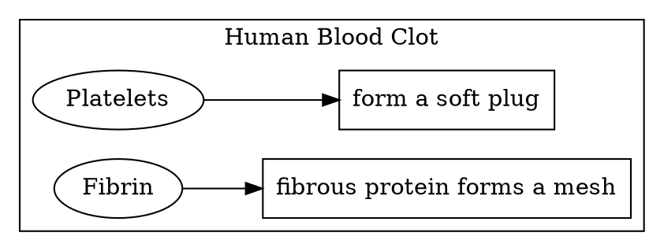
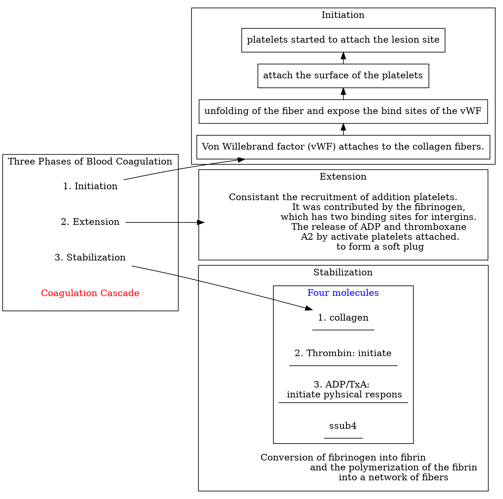
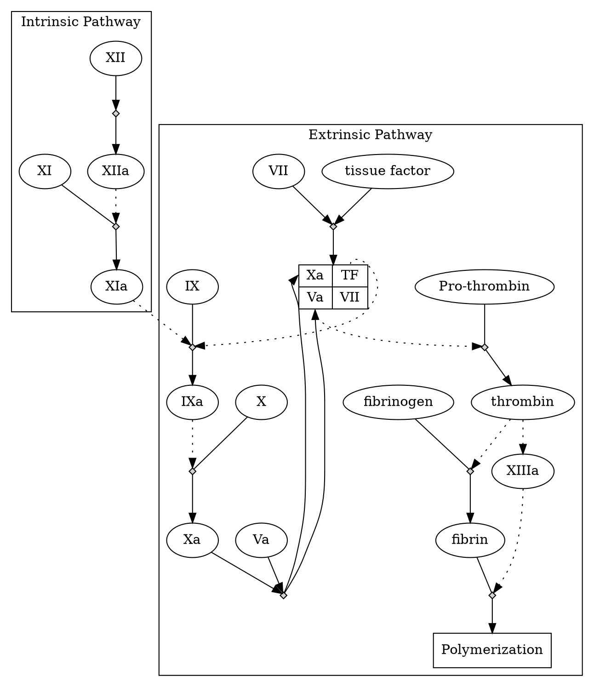

## Blood Clot

### Initiation

*[vWF]: von Willebrand factor
- Von Willebrand factor attaches to the collagen fibers.
- unfolding of the fiber and expose the bind sites of the vWWF
- attach the surface of the platelets
- platelets started to attach the lesion site.

### Extension
consistant the recruitment of addition platelets.
It was contributed by the fibrinogen, which has two binding sites for intergins.

The release of ADP and thromboxane A2 by activate platelets attached.
-> soft plug

### Stabilization
Conversion of fibrinogen into fibrin and the polymerization of the fibrin into a network of fibers.
Stabilize anchored by thrombin.

Four molecules:
  - collagen
  - Thrombin: initiate
  - ADP/TxA: initiate pyhsical respons
  - platelets shell

### Fibrinogen
The third most abundant protein in blood plasma, consisting of two C-terminal domains.

*[thrombin]: 凝血酶

From fibrinogen to fibrin:
  - controlled by the activation of the thrombin.
  - cleave a small portion (18~20) to release 2 binding sites.
  - binding sites could react with other fibrin's C-terminal
  - turned into a meshwork of fibers.
  - meshwork extended from the base of the platelet plug into the lesion
  - which tenses the platelet plug

### A positive feedback process

||
|:-:|
|[© Wayne W. LaMorte; 2016](https://sphweb.bumc.bu.edu/otlt/MPH-Modules/PH/PH709_Heart/PH709_Heart2.html)|

As shown above, the blood vessel has a few layers. Surrounding the endothelium, cells in the second layer of the vessel are characterized by expression **tissue factors** that could trigger blood coagulation.

The lesion would expose the second layer and release the tissue factors.

### Two pathway of the coagulation cascade
- Extrinsic (first)
- Intrinsic: activated plates.

 

Two pathway of the coagulation cascade

#### Extrinsic

VII: coagulation factor VII
VII~a~: **activated** coagulation factor VII
TF + VII ->  TF - VII~a~ (composite)
VII~a~: IX -> IX~a~
IX~a~: X -> X~a~
X~a~ + V~a~  + TF
X~a~ + V~a~ + TF: pro-thrombin -> thrombin
thrombin: fibrinogen -> fibrin

thrombin: V~a~
trhombin -> VIII~a~
VIII~a~: X -> X~a~
thrombin: XIII~a~
XIII~a~: polymerization

#### Intrinsic path
Initiated when some hazer or foreign be recognized.

XII -> XII~a~
XII~a~: XI -> XI~a~
like above.

Misbehavior of the Intrinsic pathway could cause blood clots to cause disease.

### The stop of the coagulation

*[thrombomodulin]: ~~~~~~~~~~~~~ 血栓调节蛋白； 血栓调节素； 凝血酶调节素

Thrombin: control **the size** of the blood clot.

Thrombin + Protein S complexes -> bind to thrombomodulin: form a ternary complex

ternary complex -> Protein C
Protein C: Inactivation of IX and X to stop the clot.

#### Two additional levels of inhibition:
1. TFPIa binds and inactivates the ternary complexes (TF, VIIa, and Xa)
2. Antithrombin 3 binds irreversibly to thrombin. It also responds to the inactivation of the IX, X, XI, and XII.

## Thrombus Detection

### Thrombus

||
|:-:|
|[(c) Peter Caravan, Ph.D. ](https://www.acs.org/content/acs/en/pressroom/newsreleases/2015/august/blood-clots.html)|

- Blood clot that forms in the arteries or veins of the body
- Can cause stroke, coronary artery disease, pulmonary embolism, deep vein thrombosis
- Affects millions of people and costs billions of dollars worldwide.
- Developing new imaging tools is essential for diagnosis and monitoring disease progression

#### Fibrin imaging

- Fibrin is an attractive target for thrombus image
  - only present in blood clots and wound hearling
  - not found in circulating blood
- High density for disease, no background.

#### Phage Display

1. Phage library filter:
    - incubate the phage with fibrin and collect the phage which bind with it.
2. Phage proliferation:
    - Incubate the phage with E. coli to proliferate them.
3. Improve the affinity:
    - Repeat the phase 1 and 2 over and over again.
4. Characterize those phage
5. Magnetic Resonance Imaging (MRI)
    - Need large magnetic field and radiofrequency energy for detection

#### Magnetic Resonance Imaging (MRI)

1. It is able to detect the Hydrogen molecules and mobile molecules, which are mainly water and fats.
2. Metal is another important resource, Gadolinium ion, especially.

|||
|:-:|:-:|
|<nobr>[(c) pubchem:24847884](https://pubchem.ncbi.nlm.nih.gov/compound/Gadolinium-DTPA-BMA)</nobr>|[(c) Penka A Atanassova](https://www.researchgate.net/publication/221921782_Cerebral_Venous_Sinus_Thrombosis_-_Diagnostic_Strategies_and_Prognostic_Models_A_Review)|

- Label with radioactive isotope
    - Positron Emission Tomography
- Label with fluorescent dye
    - Fluorescent microscopy
- Label with ==EP-2014R==:
    - Fibrin-binding peptide coupled to 4 Gadolinium chelates.
    - Binds reversibly and specifically to fibrin
    - Low affinity for fibrinogen, albumin and other components of plasma
    - High relaxivity: makes clots bright.
