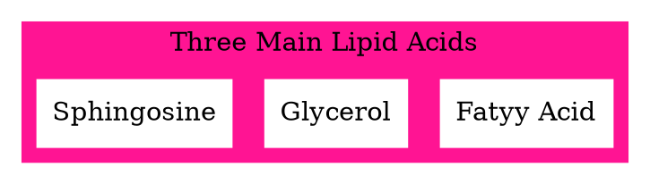
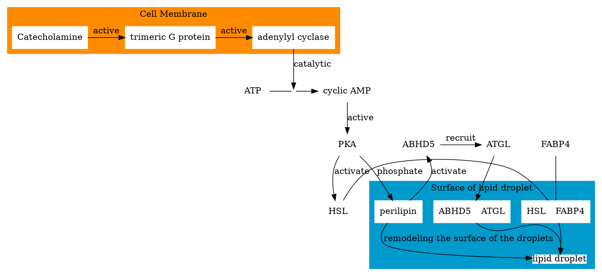

## Lipid Acid

### Fatty Acid

Structure: Carboxyl head + Hydrocarbon tail.

||
|:-:|
|[(c) pubchem; ID:5281](https://pubchem.ncbi.nlm.nih.gov/compound/5281)|
- The length of the tail is **variable**
- The tail could be **saturated** or **unsaturated** (C=C double bond)
- Interacted with each other through ****Van der Waals interaction**.
- With a longer tail and more unsaturated bond, the fatty acid has more interactions and could **pack together more tightly** like animal fat.
- Most of them have an **even number** of the carbon

#### Incorporated into lipids

The tail of the fatty acid could link with different molecules to form different linkages.

- ester linkages
  The hydroxyl group in glycerol reacts with carboxyl group in fatty acid to form ester linkages.
- Phosphodiester linkage
  Phosphate group with hydroxyl group on glycerol or Sphingosine
- amide bond
  Carboxyl group links to the amino group of a Sphingosine forming an amide bond

||||
|:-:|:-:|:-:|
|[(c) pubchem; ID:70698413](https://pubchem.ncbi.nlm.nih.gov/compound/70698413)|[(c) pubchem; ID:52929749](https://pubchem.ncbi.nlm.nih.gov/compound/52929749)|[(c) pubchem; ID:6437496](https://pubchem.ncbi.nlm.nih.gov/compound/6437496)|

#### Triacylglycerol

Three fatty acids form 3 ester linkages with glycerol.
The 3 fatty acids could be either identical or mixed.

|||
|:-:|:-:|
|[(c) pubchem; ID:11146](https://pubchem.ncbi.nlm.nih.gov/compound/11146)|[(c) pubchem; ID:131762421](https://pubchem.ncbi.nlm.nih.gov/compound/131762421)|

#### Structural Lipids

Two major structural lipids:
  - ***glycerophospholipids*** (***phosphoglycerides***)
    - glycerol backbone
    - Phosphodiseter linkage that connects the third carbon to a variable
    - Glycerol C1: Saturated fatty acid (C-16 ~ C-18)
    - Glycerol C2: Unsaturated fatty acid (C-18 ~ C-20)
    - Glycerol C3: Phosphate group which connected a hydrophilic head. The simplest head is the phosphate group connected with hydrogen, which is ***phosphatidic acid***
  - ***sphingolipids***
    - A molecule of sphingosine forms the backbone
    - Both sphingosine and fatty acid groups are hydrophobic
    - The variable group determined the function of the molecule
  - Both the variable group and the fatty acid tails affect the function of the molecule.

|||
|:-:|:-:|
|[(c) pubchem; ID:192817](https://pubchem.ncbi.nlm.nih.gov/compound/192817)|[(c) pubchem; ID:319423558](https://pubchem.ncbi.nlm.nih.gov/compound/319423558)|

#### The shape of fatty acids

|Illustration of the Cylindrical Shape and Conical Shape|
|:-:|
||
|[(C) Bruno Maggio](https://www.researchgate.net/publication/5876999_Composition-driven_Surface_Domain_Structuring_Mediated_by_Sphingolipids_and_Membrane-active_Proteins)|

Some structural lipids, such as ***phosphatidylcholine*** have a <u>cylindrical shape</u>, while other lipids, like ***phosphatidylethanolamine***, have a <u>conical shape</u>, because they have a relatively small head group, and carry unsaturated fatty acids.

As a result, placing more conical shape molecules in the inner layer helps the structure of the membrane more tightly.

#### Cholesterol

||
|:-:|
|[(c) pubchem; ID:5997](https://pubchem.ncbi.nlm.nih.gov/compound/5997)|

Cholesterol has **four hydrocarbon rings** and is very **hydrophobic**. It can interact with other structural lipids in the membrane. It **limits lipids' mobility** and affects membrane **fluidity**.

There are more than 1000 types of lipids we can find in an organism. And About 5% of the genes in a cell are for synthesizing lipids.

## Energy production of lipids

### Triacylglycerol
Most Triacylglycerols are stored in a kind of cell named ==Adipocyte== (Fat cell) in adipose tissue. With the adipocyte, the triacylglycerol was stored as very large lipid droplets which even against the membrane of the adipocyte.
- **Immature** adipocyte tissue: brown, large lipid droplets.
- **Mature** liver adipocytes: small and numerous lipid droplets.   

The **DIFFERENT** between **Glycogen** and **triacylglycerol**:
- 1. The <u>carbon</u> in fatty acids is more reduced. As a result, one gram of the fatty acid has <u>twice the energy</u> as 2 gram glycogen after being completely oxidized.
  2. Hydrophobicity: The fatty acid was stored much tenser than the glycogen. The glycogen has <u>2/3 of the mass of water</u>.
- Glycogen is a polymer of glucose units.
  Glycogen **moves faster** than triacylglycerol.

On the other hand, triacylglycerol also contributed to the benefit of insulation and padding.

## Lipid Transportation

### Challenge 1: Hydrophobic
  - Lipid droplets are surrounded by a **monolayer of phospholipids** with hydrophilic group heads outside.
  - lipid-protein: **perilipin**, which could form a layer on the outer surface of the lipid droplets.

### Challenge 2: Coordination

Triacylglycerol degradation (Lipolysis):
  - ==tri -> di==: ATGL (Adipose triglyceride lipase);  
  - ==di ->Mono==: HSL (Hormone-sensitive lipase);
  - ==Mono->two==: MGL (Monoacylglycerol lipase);

1. **How** are these enzymes activated?
    - ***ATGH*** needs ***ABHD5*** to be recruited at the surface of the lipid droplets.
    - ***HSL*** and ***FABP4*** complex in free cytoplasm could not be recruited.
    - Active: Hormones such as adrenaline and ***noradrenaline*** from the ***catecholamine*** family.

2. **When** are they activated?
    - Catecholamine (Receptor) -> trimeric G protein.
    - trimeric G protein -> adenylyl cyclase
    - adenylyl -> ATP -> cyclic AMP
    - Cyclic AMP -> PKA
    - PKA -(phosphate)-> perilipin and HSL
    - Perilipin-P
      - active ABHD5 to recruit ATGL
      - remodeling the surface of the droplets, increasing the access of the enzyme
    - HSL-P: It could be recruited by the surface of the droplets.

### Challenge 3: Release of fatty acid

- Free fatty acid + FABP4 (chaperone): through the cytoplasm.
- FA is exposed to the bloodstream and associated with serum albumin to travel into the tissue in need.
- Glycerol was exposed in the cytoplasm and went through the cytomembrane through **aquaporin**, a channel protein. And then, they were transported into the liver through the bloodstream. (No chaperone, it's hydrophilic)
