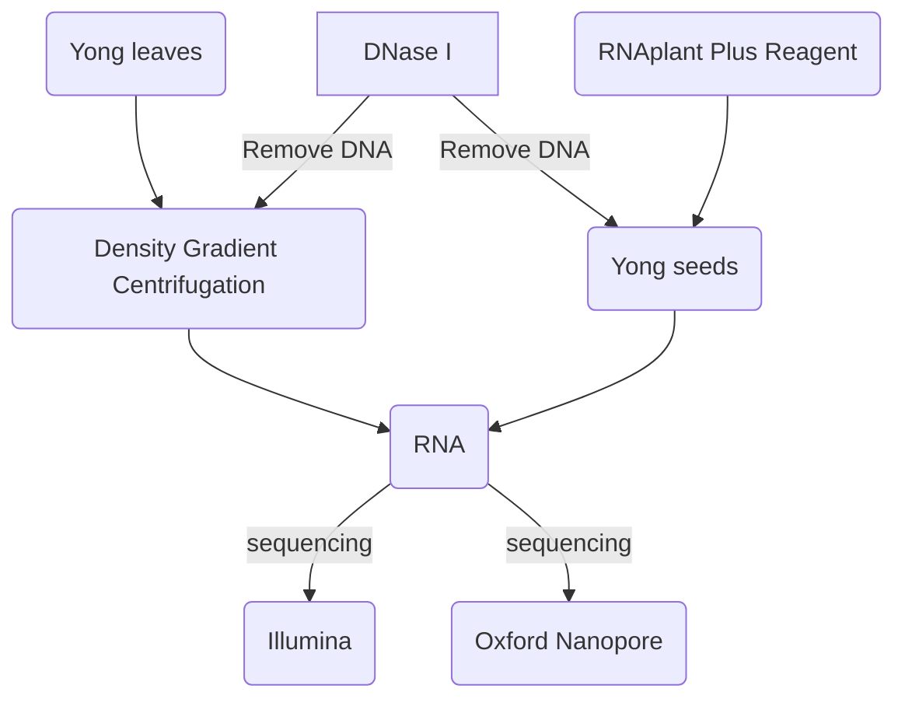
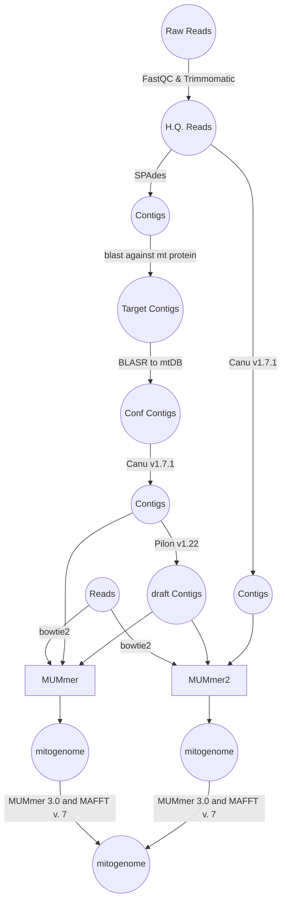

## The complete mitochondrial genome of Taxus cuspidata (Taxaceae): eight proteincoding genes have transferred to the nuclear genome

[
**© Kan et al. 2020**
](https://bmcevolbiol.biomedcentral.com/articles/10.1186/s12862-020-1582-1/figures/1)

cite: Kan, Sheng Long , et al. "The complete mitochondrial genome of Taxus cuspidata (Taxaceae): eight protein-coding genes have transferred to the nuclear genome." Bmc Evolutionary Biology 20.1(2020).
Paper: [click here](https://bmcevolbiol.biomedcentral.com/articles/10.1186/s12862-020-1582-1#Fig1)

  

© wikipedia

## Abstract
**BG**: there have lots of Gymnosperms species but only a few of species have sequenced mitochondrial genome.
**Result**:
1. Complete mitogenome of *Taxus cuspidate*;
2. It lost many genes  
3. Multiple tRNA and introns also have been lost  
4. gene cluster could be less conserved
5. Few RNA sites were identified and may responsible for fewer introns and frequent gene losses

## Background

1. Compared to chloroplast, only few of mitochondria genomes are available.
2. Previous study on mitogenome revealed that *Cycans* and *Ginko* are represent the ancestral type of seed plants.
3. Size; substitution; numerous of genes; introns and RNA editing sites; genome structure; repeats; turnover rates, and foreign sequence ratios are the arguments for mtGenome Comparing.  
4. All other gymnosperms except Conifer II have mtGenome of  represented species.
5. There are some ambiguity in relationship between Conifer, Pianceae, and Gnetales.
6. Our experiment and data are every valuable for the world.

## Methods
### Mitochodiral DNA isolation, total RNA extraction, sequencing and mitogenome assembly of Taxus cuspidata

### Oxford Nanopore
1. First, approximately two micrograms of mitochondrial DNA was
sheared by using Megaruptor
2.  approximately one microgram of mitochondrial DNA was sonicated to ~ 500 bp using the Covaris M220 system

The sonicated DNA was purified using a TIANgel Midi Purification Kit, and a sequencing library was constructed using the NEBNext®
Ultra™ DNA Library Prep Kit for Illumina

[Megaruptor](https://www.diagenode.com/en/p/megaruptor-1-unit): The Megaruptor ® was designed to provide researchers with a simple, automated, and reproducible device for the fragmentation of DNA from 2 kb - 75 kb.Shearing performance is independent of the source, concentration, temperature, or salt content of a DNA sample.

### Illimina

### mitogenome Annotation
protein and rRNA: blast+ against *Cycas taitungensis*, *Ginkgo biloba*
and *Welwitschia mirabilis* database.
- tRNA: **tRNAscan-SE 2.0**
- introns: **RNAweasel tool**
- ORFs: **ORF Finder**
- ORFs-> **Blast2GO**
- Visualization: **OGDRAW**

### RNA editing site identification
- identify: **RES-Scanner**
- predicting: **PREP-Mt**

### mt-genes to nuclear genome
  - **Depth of Sequencing Coverage**: *Bowtie2 v 2.2.9* & *SAMtools v 1.6*
  - **Realtime PCR**: quantify the copy number of all protein coding genes
    (singlecopy nuclear gene *LEAFY* as an experimental control)

### Identification of repeats, tandem repeats, Bpu elements and foreign sequences
- Repeasts: `ROUSFinder.py`
- tandem repeats: **Tandem Repeats Finder**
- Plastid-derived mtDNA (MTPTs) & *Bpu*-like elements: ***Guo et al.***  (span title here)
    - MIPTs: **blastn** (against to genome and mitogenome)
    - *Bpu*-like elements: **blastn** (using the *Cycas Bpu* consensus sequence as a query)
- nuclear-derived repetitive sequences: [RepeatMasker web server](http://www.repeatmasker.org/cgi-bin/WEBRepeatMasker)

### Shared DNAs and gene cluster analyses
(mtDNA shared between species)
**blastn** with a word size of 7 and an e-value cutoff of 1 × 10− 6.
Syntenic relationships were generated using **Circos v. 0.69**

### Evolutionary rate heterogeneity test
1. mitochondrial protein-coding genes
2. ***Ran et al.*** :
  - Sequence alignment;
  - unreliable sequence alignment filtering;
  - synonymous (dS);
  - nonsynonymous length calculations (dN);
  - absolute nonsynonymous(RN);
  - synonymous rate (RS).
3. Effects of C-to-U RNA editing:
  - predicted editing sites were excluded

## Result
### Mitogenome size and gene and intron contents of Taxus cuspidata
|Category|Size|
|:---|:---:|
|Size|468,924bp|
|gene| 46|
|protein|32|
|tRNA|10|
|rRNA|3|
|small subunit ribosomal protein|4|
|large subunit ribosomal protein|2|
|cytochrome C biogenesis|4|
|transport membrane protein|1|
|maturaserelated protein|1|
|**Intron**|
|group I introns|0|
|group II introns|15 (cox2, nad1,nad2, nad4, nad5 and nad7 )|
|cis-spliced|4|
|trans-spliced|11|
|**tRNA**|
|native tRNA|9|
|plastids tRNA|1|
||
|**rRNA**|**copies**|
|rrn5 & rrn26|1|
|rrn18|2|

|Category|Length|
|:---|:---:|
|genes|225 -4104bp|
|exons|22 - 1224bp|
|introns|804 - 2461bp|

nine, one, one, three, and five encoding mitochondrial respiratory chain complexes I, II, III, IV, and V, respectively.

### Variation in gene and intron
Comparing groups: *Taxus,* *Pinus,* *Welwitschia,* *Cycas* and *Ginkgo*.

||*Cycas*|*Ginkgo*|*Pinus*|*Welwitschia*|*Taxus*|
|--|--|--|--|--|--|
|mitogenome Size|414,903|346,544|1,191,054|978,846|468,924|
|GC%|46.9|50.4|47|53|50.39|
|tRNAs|27|23|12|8|10|
|rRNAs|3|3|6|3|4|
|Protein coding|41|41|41|29|32|
|ORF|3945 (414,858 bp)|3944 (323,967 bp)|10,587 (1,191,015 bp)|11,171 (978,799 bp)|3923 (468,857 bp)|
|Introns|26|25|26|10|15|
|Predicted edit sites|1206|1306|1179|225|1102|
|Repeats (kb)|80 (19.2%)|32 (9.3%)|170 (14.2%)|50 (5.0%)|62 (13.2%)|
|Tandem repeats (kb)|22 (5.3%)|3.6 (1.1%)|71 (6.0%)|24 (2.5%)|48 (10.2%)|
|Plastid-derived (kb)|19 (4.6%)|0.3 (0.1%)|5.6 (0.5%)|7.9 (0.8%)|0 (0%)|
|Nuclear-derived repetitive (kb)|3.4 (0.8%)|1.9 (0.6%)|5.3 (0.5%)|2.5 (0.3%)|3.5 (0.8%)|
|Lost Genes||||8+1|8+2|

Homologous transcripts of eight of the nine lost mitochondrial genes (excluding rpl10) were found in the transcriptome of Taxus cuspidata

**© Kan et al. 2020**

### RNA editing site abundance and efficiency

**RES-Scanner**
  - **efficiency**:
    - 0.05; 974 C-to-U
    - 791 them are on protein-coding genes
      - 730 were in coding regions
      - 61 were in introns
    - 1 in tRNA
    - 2 in rRNA
    - 180 in intergenic regions
  - first and second codon positions have higher editing efficiencies
  - nonsilent editing sites have higher editing efficiencies than silent sites

**PREP-Mt**: only nonsilent RNA editing sites in proteincoding genes could be predicted
  - cutoff score: 0.2
  - 1102 C-to-U editing sites
  -  only 474 were identical
  - ...

**© Kan et al. 2020**

### Structural and gene cluster dynamics

1. DNA shared by *Cycas* and *Ginkgo* up to 200 bp (about 1/2)
2. Shared by *Cycas* and other three are short. (30 ~ 50)

### Repeats, tandem repeats, and foreign DNA sequences
1. *Cycas* and *Pinus* mitogenomes contain more dispersed repeats
2. In addition, most repeats had more than two copies in the *Cycas* and *Pinus*
3. Plastid-derived sequence (> 100bp) not found in *Taxus*.
4. nuclear-derived repetitive sequences found in five species.
5. ...

### Variation in nucleotide substitution rates
although eight putatively transferred genes in Taxus and Welwitschia were still found in the mitogenomes of Cycas, Ginkgo and Pinus, their synonymous and nonsynonymous substitution rates were higher than those of other mitochondrial genes

## Discussion
### Separate losses of multiple mitochondrial protein-coding genes in *Taxus* and *Welwitschia*

- Only two genes were lost in the first approximately 300 myr of land plant evolution if maturase is not considered
- parallel gene losses documented in hornworts, lycophytes, and ferns also happened in more recent times
- In angiosperms, a large number of protein-coding genes have been lost in some lineages,
- ...

### Separate losses of multiple mitochondrial tRNA genes in *Pinaceae*, *Taxus* and *Welwitschia*

- all gymnosperms have three rRNA genes in their mitogenomes.
- the number of tRNAs differs greatly

### Frequent losses and cis- to trans-splicing of introns in the mitogenomes of gymnosperms

Both the ancestral angiosperm and gymnosperm mitogenomes contain 26 group II introns.
*Cycas* and *Ginkgo*, have 26 and 25 introns, whereas **only ten introns** are found in *Welwitschia*.

**Mechanisms for intron loss**:
- genomic deletion
- exonization
- gene conversion
- EGT: *rpl2i846* and *rps10i235*
- retroprocessing (a reverse transcriptase-mediated model)

### Gene clusters could be less conserved in gymnosperms, and transposable elements and specific repeats are rare in the Taxus and Welwitschia mitogenomes
...

### The number of RNA editing sites is not correlated with the GC content of mitochondrial genes
*Taxus cuspidata*: results showed that all editing sites are C-to-U conversions
...

### Size variation in gymnosperm mitogenomes is still a mystery
...
