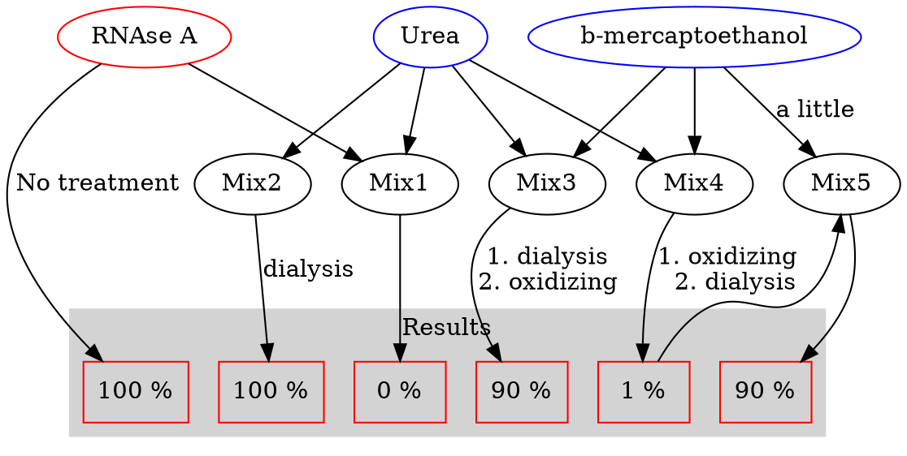

## Overview

> - What is a protein?
> - Folding is chain collapse
> - Visualizing structures
> - Primary, secondary, tertiary, quaternary structure
> - Anfinsen-Merrifield experiments

> - Evolution and sequence conservation
> - Protein structural motifs
> - The Greek Key and β-sandwich
> - The coiled-coil
> - The EF hand

> - Domain structure of large proteins
> - Quaternary structure of proteins

## Protein Structure-Chain Collapse

A protein of 400 amino acids

|      |     |
| :------------- | :------------- |
|Unfolded|~500 Å mean diameter fexible polymer chain|
|Folded | ~40 Å diameter; Density ~1.3 g/ml|

PS:
- organic liquids: 0.8-1.0 g/ml
- organic solids: 1.0-1.4 g/ml

### Properties of folded proteins

> - Folded proteins are as **tightly packed** as crystals of amino acids
> - Secondary **structure is an unavoidable** consequence of packing
> - Most hydrogen bonding groups inside **are** hydrogen bonded

Visualization of Protein Structure

||
|:-:|
|[&copy; asu.edu](https://askabiologist.asu.edu/venom/protein-art)|

a: NA; b: CPK space-filling; c: Cα trace; d: Ribbon diagram;

Schematic is not show here.

**Protein Folding - Levels of Structure**

Primary -> Secondary -> Tertiary -> Quaternary

> Globular Protein: typically have a fixed (small to moderate) number of subunits, ratio of length to width is small.
> Fibrous proteins: large polymeric, ratio of length to width is large

### Protein Folding - Levels of Structure

Ribonuclease A:
- 124 residues
- 4 disulfide bonds
- Unfolded with denaturants (urea or guanidine)

### The Anfinsen/Merrifield Experiments

More details above: [Karobben, Biochemistry_4](https://karobben.github.io/2021/03/26/LearnNotes/edx-biochm-4/#Anfinsen-Experiment)

- Christian Anfinsen and Robert B. Merrifield

**The hypothesis**:

> All of the information needed to determine the structure of a protein is contained within its amino acid sequence

**The experiment**:
> - Ribonuclease in an enzyme with 4 Cys-Cys disulfide bonds
> - The correct linkage is essential for enzymatic activity
> - Anfinsen purified ribonuclease from cow pancreas, and then reduced the disulfide bonds with mercaptoethanol and unfolded the protein with 8 Molar urea (It was completely inactive)
> - The reduced and denatured protein was put into a solution that favored oxidation of disulfide bonds.

**The observations**:
> - There are 105 different arrangements of the S-S bonds but only the single native arrangement gives active enzyme
> - Ribonuclease reoxidized in the presence of 8M Urea gave 1% activity
> - Ribonuclease oxidized in the absence of Urea gave ~100% activity

**The conclusion**:
> All of the information needed to determine the structure of a protein is
contained within its amino acid sequence

**The confirmation**
> Robert Merrifield synthesized ribonuclease chemically and got active enzyme. This experiment demonstrated that no cellular machinery or structural “memory” was involved.

### Cytochrome c Sequence Alignments

||
|:-:|
|[&copy; Gulnaz Afzal, et al.](https://www.researchgate.net/publication/340421348_DNA_Barcodes_of_Southeast_Asian_Spiders_of_Wheat_Agro-ecosystem)|

> **Sequence conservation in a small, critically important Protein cytochrome c**
> Substitutions of amino acids can be:
> **Conservative** (similar physical properties. charge etc)
> **Non conservative** (dissimilar physical properties)Phylogenetic Tree of
> The degree of sequence relatedness is correlated with the degree
of evolutionary relatedness.
> A protein with a conserved sequence will have a conserved structure.

### Protein Folding – Structure Motifs

> - The atomic level 3-dimensional structure is known for ~19,000 proteins
> - A few hundred folding motifs are adequate to describe most structures
> - A structural “motif” is a unit of secondary structure topology
>
> - **Examples of secondary structure motifs**
> a) βαβ
> b) β-hairpins
> c) αα
> d) β-barrel
> e) β-barrel
> f) α/β-barrel
>
> - **Examples of structural motifs**
> TIM-barrel of triosephosphate isomerase
> Motif: (βαβα)~4~

### Small β-sheet motifs

#### A “Greek Key” pattern

> - The two Greek key topologies For a 4 stranded β-sheet
> - Topology of a 4 stranded β-meander

**What 4-stranded β-sheet topologies are found in proteins?**
> - 24 possible topologies exist
> - only 8 have been observed
> - the 2 Greek keys and β-meander (above) account for almost 70% of the observed topologies

#### &beta; sandwich motif

> A β-sandwich motif has two beta sheets (often Greek keys) packed face to face.
> It's a small common folding motif.
> Hydrophobic &alpha;-helix core was been enveloped in the center of the protein.

|<iframe style="width: 500px; height: 300px;" frameborder="0" src="https://embed.molview.org/v1/?mode=vdw&pdbid=1XU2&bg=white&chainType=cylinders&chainColor=spectrum"></iframe>|
|:-:|
|[&copy; Molview; The crystal structure of APRIL bound to BCMA; PDBID=1XU2; hemoglobin](https://molview.org/?pdbid=1XU2)|

#### Coiled Coils – α-helical bundles

> - Dimeric helical pairs have a heptad (7 amino acid) repeat of interacting amino acids.
> - Coiled coils form the basis for many long fibrous proteins

*[Heptad]: 七肽

> Heptad repeat pattern of dimeric
> **Coiled-coils**:
> Residues *d* and *a* are hydrophobic
> Residues *g* and *e* form ==charge pairs==
> Residues *c*, *b* and *f* are variable

> A coiled-coil protein can have from several to hundreds of homologous heptad repeats.

> When the 'd' resides are leucine/isoleucine the motif is called a "leucine zipper"

### Protein Folding – Metal Binding Motif

#### EF-hand or Helix-loop-Helix motif

||
|:-:|
|[&copy; Paul T Wilder, et al.](https://www.researchgate.net/publication/7913920_Solution_Structure_of_Zinc-_and_Calcium-Bound_Rat_S100B_as_Determined_by_Nuclear_Magnetic_Resonance_Spectroscopy)|

EF-hand Sequence:

|------------------------------------**Helix**| ==Loop==| **Helix**------------------------------------|
|-:|:-:|:-|
|<u>V</u>kk<u>AF</u>ai<u>I</u>**D**|q**D**k**S**==G==f<u>I</u>**E**ed**E**|<u>L</u>kl<u>FL</u>qn<u>F</u>|
(Parvalbumin β)

lower case – variable
UPPER CASE – conserved
<u>Underlined</u> – involved hydrophobic interaction between helices
Bold – involved in calcium binding

Essential loop Glycine
Target: Calcium atom

[Helix] - [Loop] - [Helix]

> - lower case – variable
> - ***UPPER CASE*** – conserved
> - ***Underlined*** – involved hydrophobic interaction between helices
> - ***Bold*** – involved in calcium binding

### Protein Architecture - Independent Domains
> - Proteins longer than about 200 residues tend to form globular domains
> - Domains tend to fold independently and have conserved activities
> - A few domain types can make many proteins
> - Number of domain types appears limited to a few hundred

#### An Example of Domains

Proteases in the blood coagulation cascade are good examples of complex multi-domain proteins

> - Calcium binding  domain
> - Kringle domain
>    - Has a specific pattern  of cysteine residues in a  span of ~85 residues
> - Domains that resemble the epidermal growth factor EGFL domain
> - Serine protease  domain

## Quaternary Protein Structure
> - Many proteins are multimeric: Containing more than one polypeptide chain, generally held together by noncovalent interactions
>    - **Homomultimers** – composed of copies of the same polypeptide chain
>    - **Heteromultimers** – composed of more than one polypeptide chain
> - The interactions that drive quaternary structure are the same as those that drive folding
> - interaction strengths can range from weak and transient to strong and essential for structure

> Aspartate Transcarbamoylase:
> - 6 catalytic (C3)2 and 6 regulatory (R2)3 subunits
