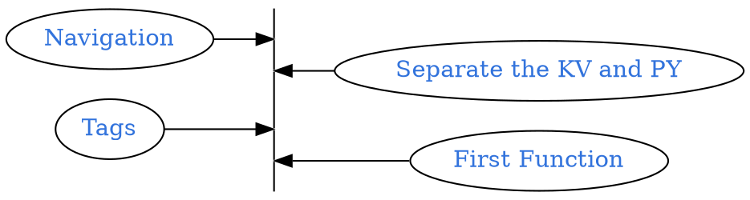

```
CryptoWatch-Kivy          1.13
Kivy                      2.0.0
Kivy-Garden               0.1.4
kivy-garden.wordcloud     1.0.0
kivymd                    0.104.2.dev0
```



## Navigation

Example of Navigation: [KivyMD GitHub](https://github.com/kivymd/KivyMD/wiki/Components-Navigation-Drawer#using-mdnavigationdrawer-has-changed)

Documentation: [Kivymd](https://kivymd.readthedocs.io/en/latest/components/navigation-drawer/)

==Attention==: "MDNavigationLayout" was abandoned, using "NavigationLayout" as substitute.

```diff
Root:
-   MDNavigationLayout:
+   NavigationLayout:
        ScreenManager:
            Screen_1:
            Screen_2:
```

## Example 1

```python
from kivy.lang import Builder
from kivy.uix.boxlayout import BoxLayout
from kivymd.app import MDApp

KV = '''
Screen:
    NavigationLayout:
        ScreenManager:
            Screen:
                BoxLayout:
                    orientation: 'vertical'
                    MDToolbar:
                        title: "Navigation Drawer"
                        elevation: 10
                        left_action_items: [['menu', lambda x: nav_drawer.set_state("open")]]
                    Widget:
        MDNavigationDrawer:
            id: nav_drawer
            ContentNavigationDrawer:
'''

class ContentNavigationDrawer(BoxLayout):
    pass

class TestNavigationDrawer(MDApp):
    def build(self):
        return Builder.load_string(KV)

TestNavigationDrawer().run()
```

## Separate the KV and PY

```bash
mkdir Layout
tree
```
<pre style= "color:#76EE00; background-color:#363636">
.
├── Layout
│   └── Navigation_Draw.kv
└── main.py

1 directory, 2 files
</pre>

<details> <summary><b>
KV file </b></summary>
```kv Navigation_Draw.kv
Screen:
    NavigationLayout:
        ScreenManager:
            Screen:
                BoxLayout:
                    orientation: 'vertical'
                    MDToolbar:
                        title: "Navigation Drawer"
                        elevation: 10
                        left_action_items: [['menu', lambda x: nav_drawer.set_state("open")]]
                    Widget:

        MDNavigationDrawer:
            id: nav_drawer
```
</details>

```python
from kivy.uix.screenmanager import Screen
from kivymd.uix.button import MDRectangleFlatButton
from kivy.lang import Builder

from kivymd.app import MDApp

def OPEN(file):
    return open(file).read()

class MainApp(MDApp):
    def F_test(self, *args):
        print(123)

    def build(self):
        screen = Screen()
        Widget_navi = Builder.load_string(OPEN("Layout/Navigation_Draw.kv"))

        screen.add_widget(Widget_navi)
        screen.add_widget(
            MDRectangleFlatButton(
                text="Hello, World",
                pos_hint={"center_x": 0.5, "center_y": 0.5},
                on_release = self.F_test
            ))
        return screen

MainApp().run()
```

## Tags

Example: [GitHub](https://github.com/kivymd/KivyMD/wiki/Components-Tabs)


```py main.py
from kivy.uix.screenmanager import Screen
from kivymd.uix.button import MDRectangleFlatButton
from kivy.lang import Builder
from kivymd.uix.floatlayout import MDFloatLayout
from kivymd.uix.tab import MDTabsBase

from kivymd.app import MDApp

def OPEN(file):
    return open(file).read()

class Tab(MDFloatLayout, MDTabsBase):
    '''Class implementing content for a tab.'''

class MainApp(MDApp):
    def F_test(self, *args):
        print(123)

    def build(self):
        screen = Screen()
        # loading Navigation (left)
        Widget_navi = Builder.load_string(OPEN("Layout/Navigation_Draw.kv"))
        # loading navigation tags
        Widget_tabs = Builder.load_string(OPEN("Layout/Navigation_Tabs.kv"))
        self.Widget_tabs = Widget_tabs

        screen.add_widget(Widget_tabs)
        screen.add_widget(Widget_navi)
        return screen

    # Functions for Navigation Tab
    def on_start(self):
        Tab1 = Tab(text="alarm")
        Tab1.add_widget(
            MDRectangleFlatButton(
                text="Hello, World",
                pos_hint={"center_x": 0.5, "center_y": 0.5},))
        self.Widget_tabs.ids.tabs.add_widget(Tab1)
        self.Widget_tabs.ids.tabs.add_widget(Tab(text="alarm-bell"))

    # Functions for Navigation Tab Switch
    def on_tab_switch(
        self, instance_tabs, instance_tab, instance_tab_label, tab_text):
        '''Called when switching tabs.
        :type instance_tabs: <kivymd.uix.tab.MDTabs object>;
        :param instance_tab: <__main__.Tab object>;
        :param instance_tab_label: <kivymd.uix.tab.MDTabsLabel object>;
        :param tab_text: text or name icon of tab;
        '''
        instance_tab.ids.label.text = tab_text

MainApp().run()
```

KV file:

<details><summary> <b>Navigation_Tabs.kv</b>
</summary>
```kv
MDBoxLayout:
    orientation: "vertical"

    MDToolbar:
        title: "Example Tabs"

    MDTabs:
        id: tabs
        text: "1"
        on_ref_press: app.on_ref_press(*args)

<Tab>
    MDIconButton:
        id: icon
        icon: ""
        user_font_size: "48sp"
        pos_hint: {"center_x": .5, "center_y": .5}
```
</details>
<br><br>
<pre style= "color:#76EE00; background-color:#363636">
.
├── Layout
│   ├── Navigation_Draw.kv
│   └── Navigation_Tabs.kv
└── main.py

1 directory, 3 files
</pre>


## First Function


Convert `atcg` to `ATCG`

```bash
touch Layout/Seq.kv
tree
```

<pre style= "color:#76EE00; background-color:#363636">
.
├── Layout
│   ├── Navigation_Draw.kv
│   ├── Navigation_Tabs.kv
│   └── Seq.kv
├── lib
│   └── bio_seq.py
├── libWidget
│   └── Seq.py
└── main.py
</pre>

<details><summary>
<b>Seq.kv</b>
</summary>
```kv Seq.kv
MDBoxLayout:
    padding: root.width * .05, root.height * .05,root.width * .05, root.height * .05

    MDBoxLayout:

        id: boxs
        orientation: "vertical"
        functions: None#{"aA":"a"}
        label_c: 0, 0, 1, 1

        MDTextField:
            id: seq_input
            hint_text: "Input DNA Hear"
            pos_hint: {"center_x": .5}

        MDIconButton:
            id: upper
            icon: "android"
            user_font_size: "64sp"
            on_release: boxs.functions#["aA"]
            pos_hint: {"center_x": .5}

        MDLabel:
            id: seq_result
            text: "Result shows Herer"
            color: boxs.label_c
            pos_hint: {"center_x": .5}
```

</details>


```python Seq.py
#from kivy.lang import Builder
from kivy.lang import Builder

class FunctionWidget():
    def OPEN(self, file):
        return open(file).read()

    def PP(self):
        #self.print(self.Function_page.ids.seq_input.text)
        self.Function_page.ids.seq_result.text = self.Function_page.ids.seq_input.text.upper()

    def main(self):
        self.Function_page = Builder.load_string(self.OPEN("Layout/Seq.kv"))
        self.Function_page.ids.upper.on_release = self.PP
        return self.Function_page
```

```python main.py
from kivy.uix.screenmanager import Screen
from kivymd.uix.button import MDRectangleFlatButton
from kivy.lang import Builder
from kivymd.uix.floatlayout import MDFloatLayout
from kivymd.uix.tab import MDTabsBase

from kivymd.app import MDApp


# Function libs

def OPEN(file):
    return open(file).read()

class Tab(MDFloatLayout, MDTabsBase):
    '''Class implementing content for a tab.'''

class MainApp(MDApp):
    def F_test(self, *args):
        print(123)

    def build(self):
        screen = Screen()
        # loading Navigation (left)
        Widget_navi = Builder.load_string(OPEN("Layout/Navigation_Draw.kv"))
        # loading navigation tags
        Widget_tabs = Builder.load_string(OPEN("Layout/Navigation_Tabs.kv"))
        self.Widget_tabs = Widget_tabs
        # loading The Function pages
        # Loading Sequencs function page

        screen.add_widget(Widget_tabs)
        screen.add_widget(Widget_navi)
        return screen

    # Functions for Navigation Ta
    def on_start(self):
        from lib.bio_seq import Bio as FunBioSeq
        Fun = FunBioSeq()
        print(Fun.List())

        def PP():
            print(Function_page.ids.seq_input.text)
            Function_page.ids.seq_result.text = Function_page.ids.seq_input.text.upper()
            Fun = FunBioSeq()

        List = {"Seq":{'icon':"dna",'title':"Sequencs Tools"}}

        Tab1 = Tab(text="Bio")
        Tab1.add_widget(
            MDRectangleFlatButton(
                text="Hello, World",
                pos_hint={"center_x": 0.5, "center_y": 0.5},))
        self.Widget_tabs.ids.tabs.add_widget(Tab1)
        for i in List.keys():
            tmp_tab = Tab(text=List[i]['icon'])
            #Function = Builder.load_string(OPEN("Layout/"+i+".kv"))
            from libWidget.Seq import FunctionWidget
            Fun = FunctionWidget()
            tmp_tab.add_widget(Fun.main())
            self.Widget_tabs.ids.tabs.add_widget(tmp_tab)


    # Functions for Navigation Tab Switch
    def on_tab_switch(
        self, instance_tabs, instance_tab, instance_tab_label, tab_text):
        '''Called when switching tabs.
        :type instance_tabs: <kivymd.uix.tab.MDTabs object>;
        :param instance_tab: <__main__.Tab object>;
        :param instance_tab_label: <kivymd.uix.tab.MDTabsLabel object>;
        :param tab_text: text or name icon of tab;
        '''
        instance_tab.ids.label.text = tab_text

MainApp().run()
```


GitHub Repository: [Karobben Toolbox](https://github.com/Karobben/Kivymd_toolbox)
Android Release: [Karobben Toolbox](https://github.com/Karobben/Kivymd_toolbox)
