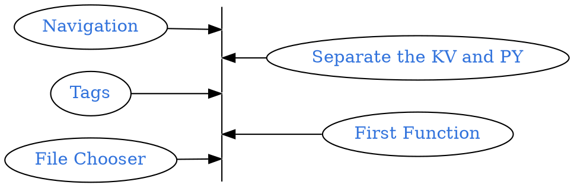

```
CryptoWatch-Kivy          1.13
Kivy                      2.0.0
Kivy-Garden               0.1.4
kivy-garden.wordcloud     1.0.0
kivymd                    0.104.2.dev0
```



## Quick Review
```bash
tree
```
<pre style= "color:#76EE00; background-color:#363636">
├── bin
│   └── KarobbenTB-1.3-armeabi-v7a-debug.apk
├── buildozer.spec
├── favicon.ico
├── font
│   ├── FangZhengHeiTiFanTi-1.ttf
│   ├── HuaKangXinZhuanTi-1.ttc
│   ├── HuaKangXinZhuanTi-1.ttf
│   └── JingDianFanJiaoZhuan-1.ttf
├── Layout
│   ├── filechooser.kv
│   ├── Navigation_Draw.kv
│   ├── Navigation_Tabs.kv
│   └── Seq.kv
├── lib
│   └── bio_seq.py
├── libWidget
│   ├── filechooser.py
│   └── Seq.py
├── logo.png
└── main.py
</pre>

## Filechooser

My another post about Filechooser: [Karobben](https://karobben.github.io/2021/01/02/Python/kivy_filechooser/)
Document: [kivy.org](https://kivy.org/doc/stable/api-kivy.uix.filechooser.html)

```bash
touch libWidget filechooser.py
```

```python main.py
+ from libWidget.filechooser import ConfirmPopup
class MainApp(MDApp):
+     ConfirmPopup = ConfirmPopup()
+     def change_text(self, Files):
+         self.Button_test.text = Files[0]
+         print(str(Files))

def build(self):
    screen = Screen()
+   screen.change_text = self.change_text

def on_start(self):
+       self.Button_test =  MDRectangleFlatButton(
+          text="Hello, World",
+           pos_hint={"center_x": 0.5, "center_y": 0.5},
+           on_release = self.ConfirmPopup.popup_func)
+       Tab1.add_widget(self.Button_test)
```


```py filechooser.py
from kivy.app import App
from kivy.uix.anchorlayout import AnchorLayout
from kivy.uix.boxlayout import BoxLayout
from kivy.uix.popup import Popup
from kivy.lang import Builder


class ConfirmPopup(BoxLayout):
    def __init__(self, **kwargs):
        Builder.unload_file("./Layout/filechooser.kv")
        Builder.load_file("./Layout/filechooser.kv")
        self.register_event_type('on_answer')
        self.register_event_type('on_cancel')
        super(ConfirmPopup, self).__init__(**kwargs)
        self.total_images = 0

    def on_answer(self, filename, MainPage):
        self.total_images = filename
        if len(filename) >0:
            MainPage.change_text(self.total_images)
        else:
            MainPage.change_text("Please Select a File")

    def on_cancel(self, filename, MainPage):
        pass


    def popup_func(self, *args):
        content = ConfirmPopup()
        content.bind(on_answer = self._on_answer)
        content.bind(on_cancel = self._on_answer)
        #content.bind(Cancel    = self._on_answer)
        self.popup = Popup(title="Select .zip file",
                           content=content,
                           size_hint=(None, None),
                           size=(500, 500),
                           auto_dismiss=True)
        self.popup.open()

    def _on_answer(self, instance, answer, obj):
        self.popup.dismiss()

    def dismiss(self):
        self.popup.dismiss()
```

```filechooser.kv
#: kivy 1.10.0
<ConfirmPopup>:
    BoxLayout:
        orientation: 'vertical'
        FileChooserIconView:
            id: filechooser
            #filters: ['*.zip']

        GridLayout:
            cols: 2
            size_hint: 1,0.2
            Button:
                text: 'OK'
                on_release: root.dispatch('on_answer', filechooser.selection, app.root)
                size_hint: 1,0.2
            Button:
                id: cancel
                text: 'Cancel'
                on_release: root.dispatch('on_cancel', filechooser.selection, app.root)
                size_hint: 1,0.2
```

```py main.py
from kivy.app import App
from kivy.uix.floatlayout import FloatLayout
from kivy.factory import Factory
from kivy.properties import ObjectProperty
from kivy.uix.popup import Popup
from kivy.utils import platform

from kivy.uix.screenmanager import Screen
from kivymd.uix.button import MDRectangleFlatButton
from kivy.lang import Builder

from kivymd.app import MDApp

import os


from kivy.uix.anchorlayout import AnchorLayout
from kivy.uix.boxlayout import BoxLayout
from kivy.uix.popup import Popup
from kivy.lang import Builder


from filechooser import ConfirmPopup


class MainPage(AnchorLayout):
    ConfirmPopup = ConfirmPopup()
    def __init__(self, **kwargs):
        super(MainPage, self).__init__(**kwargs)

    def change_text(self, Files):
        self.the_time.text = str(Files)
        print(str(Files))


class Main(App):
    def build(self):
        Builder.load_file("main.kv")
        return MainPage()


if __name__ == "__main__":
    Main().run()
```


## Change the style of the Filechooser

Background color: [@ Nykakin](https://stackoverflow.com/questions/40090453/font-color-of-filechooser)[^picibucor_2016]

[^picibucor_2016]: [picibucor; 2016; font-color of FileChooser; StackOverflow](https://stackoverflow.com/questions/40090453/font-color-of-filechooser)

```python
canvas.before:
    Color:
        rgb: 1, 1, 1
    Rectangle:
        pos: self.pos
        size: self.size
```


## Else

[newbie programmerz; 2019; Changing the icon of Kivy FileChooserIconView; StackOverflow](https://stackoverflow.com/questions/58110063/changing-the-icon-of-kivy-filechoosericonview)

[Cube_tbh; 2015; How to allow user to choose file as background image in kivy?](https://stackoverflow.com/questions/30006162/how-to-allow-user-to-choose-file-as-background-image-in-kivy)


GitHub Repository: [Karobben Toolbox](https://github.com/Karobben/Kivymd_toolbox)
Android Release: [Karobben Toolbox](https://github.com/Karobben/Kivymd_toolbox)
