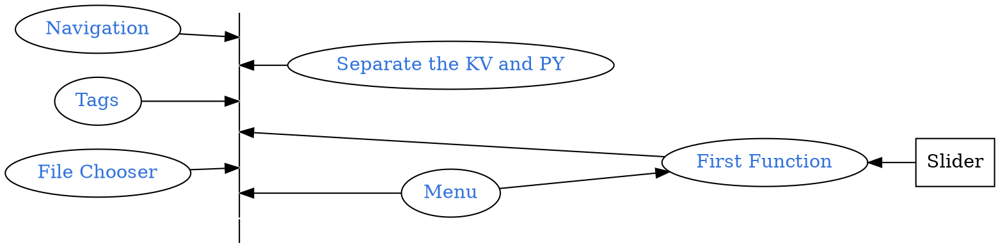

```
CryptoWatch-Kivy          1.13
Kivy                      2.0.0
Kivy-Garden               0.1.4
kivy-garden.wordcloud     1.0.0
kivymd                    0.104.2.dev0
```



## Quick Review
```bash
tree
```
<pre style= "color:#76EE00; background-color:#363636">
├── bin
│   └── KarobbenTB-1.3-armeabi-v7a-debug.apk
├── buildozer.spec
├── favicon.ico
├── font
│   ├── FangZhengHeiTiFanTi-1.ttf
│   ├── HuaKangXinZhuanTi-1.ttc
│   ├── HuaKangXinZhuanTi-1.ttf
│   └── JingDianFanJiaoZhuan-1.ttf
├── Layout
│   ├── filechooser.kv
│   ├── Navigation_Draw.kv
│   ├── Navigation_Tabs.kv
│   └── Seq.kv
├── lib
│   └── bio_seq.py
├── libWidget
│   ├── filechooser.py
│   ├── menu.py
│   └── Seq.py
├── logo.png
└── main.py
</pre>

## Example

Document: [HeaTTheatR, GitHub Issues](https://github.com/kivymd/KivyMD/issues/267)

This example is for another KVmd version  = =
```python
from kivy.lang import Builder

from kivymd.app import MDApp
from kivymd.uix.menu import MDDropdownMenu

KV = '''
Screen:

    MDRaisedButton:
        id: button
        text: "PRESS ME"
        pos_hint: {"center_x": .5, "center_y": .5}
        on_release: app.menu.open()
'''

class Test(MDApp):
    def __init__(self, **kwargs):
        super().__init__(**kwargs)
        self.screen = Builder.load_string(KV)
        menu_items = [{"text": f"Item {i}"} for i in range(5)]
        self.menu = MDDropdownMenu(
            caller=self.screen.ids.button,
            items=menu_items,
            width_mult=4,
        )
        self.menu.bind(on_release=self.menu_callback)

    def menu_callback(self, instance_menu, instance_menu_item):
        print(instance_menu, instance_menu_item.text)
        self.screen.ids.button.text = instance_menu_item.text
        self.menu.dismiss()

    def build(self):
        return self.screen


Test().run()
```

||
|:-:|
||


## Example from document

This is for version 0.104.2.dev0

Installed by `pip install https://github.com/kivymd/KivyMD/archive/master.zip`

```python
from kivy.lang import Builder
from kivy.metrics import dp
from kivy.properties import StringProperty

from kivymd.uix.list import OneLineIconListItem
from kivymd.app import MDApp
from kivymd.uix.menu import MDDropdownMenu

KV = '''
<IconListItem>

    IconLeftWidget:
        icon: root.icon


MDScreen

    MDTextField:
        id: field
        pos_hint: {'center_x': .5, 'center_y': .6}
        size_hint_x: None
        width: "200dp"
        hint_text: "Password"
        on_focus: if self.focus: app.menu.open()
'''


class IconListItem(OneLineIconListItem):
    icon = StringProperty()


class Test(MDApp):
    def __init__(self, **kwargs):
        super().__init__(**kwargs)
        self.screen = Builder.load_string(KV)
        menu_items = [
            {
                "viewclass": "IconListItem",
                "icon": "git",
                "height": dp(56),
                "text": f"Item {i}",
                "on_release": lambda x=f"Item {i}": self.set_item(x),
            } for i in range(5)]
        self.menu = MDDropdownMenu(
            caller=self.screen.ids.field,
            items=menu_items,
            position="bottom",
            width_mult=4,
        )

    def set_item(self, text__item):
        self.screen.ids.field.text = text__item
        self.menu.dismiss()

    def build(self):
        return self.screen


Test().run()
```


## Write is as a widget

```bash
touch libWidget/menu.py
touch Layout/menu.kv
```

`menu.py`

```python
from kivymd.uix.menu import MDDropdownMenu
from kivymd.uix.floatlayout import MDFloatLayout

#KV = '''
'''
Screen:

    MDRaisedButton:
        id: button
        text: "PRESS ME"
        pos_hint: {"center_x": .5, "center_y": .5}
        on_release: app.menu.open()
'''
class Menu(MDFloatLayout):
    #menu = MDDropdownMenu()
    def __init__(self, **kwargs):
        #super().__init__(**kwargs)
        #self.screen = Builder.load_string(KV)
        menu_items = [{"text": f"Item {i}",
                       "viewclass": "OneLineListItem",
                       'font_name': "./font/FangZhengHeiTiJianTi-1",
                        "on_release": lambda x=f"Item {i}": self.menu_callback(x)} for i in range(4)]
        self.menu = MDDropdownMenu(
            #caller=self.screen.ids.button,
            caller= None,
            items=menu_items,
            width_mult=4,
        )
        self.menu.bind(on_release=self.menu_callback)
        print(123)
        #return self.menu
    #
    def menu_callback(self,  instance_menu_item):
        print("instance_menu", instance_menu_item)
        #self.page_callback()
        self.test ="Change Page"
        print(self.test)

        self.menu.dismiss()

    def page_callback(self):
        self.test ="Change Page"
        print(self.test)

    # let's start
    def pop(self):
        self.menu.open()

```

Insert to page:

```diff
from kivy.uix.screenmanager import Screen
from kivymd.app import MDApp
from kivymd.uix.button import MDRectangleFlatButton
from menu import Menu as Seq_Menu

class MainApp(MDApp):
+   Seq_Menu = Seq_Menu()
    def build(self):
        screen = Screen()
        self.Button = MDRectangleFlatButton(
            text="Hello, World",
            pos_hint={"center_x": 0.5, "center_y": 0.5})
+       self.Button.on_release = self.Seq_Menu.pop
+       self.Seq_Menu.menu.caller = self.Button
+       self.Seq_Menu.menu.bind(on_release = self.menu_callback)
+
+       for i in range(len(self.Seq_Menu.menu.items)):
+           self.Seq_Menu.menu.items[i]['text'] = "A" + str(i)
+           self.Seq_Menu.menu.items[i]['on_release'] = lambda x=str(i)+": test": self.menu_callback(x)

        screen.add_widget(self.Button)
        return screen

+       def menu_callback(self, Text):
+           print(123, Text)
+           self.Button.text = "Choosed: "+Text
+           self.Seq_Menu.menu.dismiss()

MainApp().run()
```

After imported the widget, we should bind the `pop` and the `menu.bind`. `pop` is for popup the widget bubble `menu.bind` is for showing the `MenuItems`. You also need to bind the bottom wiht `self.Seq_Menu.menu.caller = self.Button` if the button is in 'kv' file, them, bind its `id`.


GitHub Repository: [Karobben Toolbox](https://github.com/Karobben/Kivymd_toolbox)
Android Release: [Karobben Toolbox](https://github.com/Karobben/Kivymd_toolbox)
