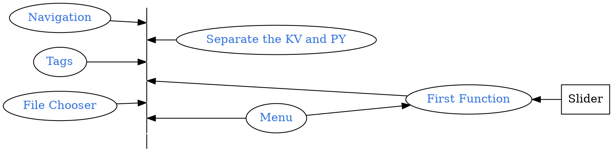

```
CryptoWatch-Kivy          1.13
Kivy                      2.0.0
Kivy-Garden               0.1.4
kivy-garden.wordcloud     1.0.0
kivymd                    0.104.2.dev0
```



## Quick Review
```bash
tree
```
<pre style= "color:#76EE00; background-color:#363636">
.
├── bin
│   └── KarobbenTB-1.3-armeabi-v7a-debug.apk
├── buildozer.spec
├── favicon.ico
├── font
│   ├── ArtificialBox-WdD4.ttf
|   ...
│   └── JingDianFanJiaoZhuan-1.ttf
├── Layout
│   ├── filechooser.kv
│   ├── menu.kv
│   ├── Navigation_Draw.kv
│   ├── Navigation_Tabs.kv
│   └── Seq.kv
├── lib
│   └── bio_seq.py
├── libWidget
│   ├── filechooser.py
│   ├── main.py
│   ├── menu.py
│   └── Seq.py
├── logo.png
└── main.py
</pre>

## Function for Close Tab
`Navigation_Tabs.kv`

[Use on_ref_press method](https://kivymd.readthedocs.io/en/latest/components/tabs/#use-on-ref-press-method)
```diff Navigation_Tabs.kv
    MDTabs:
        id: tabs
        text: "1"
+       on_ref_press: app.on_ref_press(*args)
```

```diff main.py
class MainApp(MDApp):
+    def on_ref_press(
+        self,
+        instance_tabs,
+        instance_tab_label,
+        instance_tab,
+        instance_tab_bar,
+        instance_carousel,
+    ):
+        '''
+        The method will be called when the ``on_ref_press`` event
+        occurs when you, for example, use markup text for tabs.
+        :param instance_tabs: <kivymd.uix.tab.MDTabs object>
+        :param instance_tab_label: <kivymd.uix.tab.MDTabsLabel object>
+        :param instance_tab: <__main__.Tab object>
+        :param instance_tab_bar: <kivymd.uix.tab.MDTabsBar object>
+        :param instance_carousel: <kivymd.uix.tab.MDTabsCarousel object>
+        '''
+
+        # Removes a tab by clicking on the close icon on the left.
+        for instance_tab in instance_carousel.slides:
+            if instance_tab.text == instance_tab_label.text:
+                instance_tabs.remove_widget(instance_tab_label)
+                break
```

## Connect Navigation to Tabs

`Navigation_Draw.kv`

```diff Navigation_Draw.kv
MDNavigationLayout:
    ScreenManager:
        Screen:
            BoxLayout:
                orientation: 'vertical'
                MDToolbar:
                    id: nav_banner
                    icon: "android"
                    title: "Tool Box"
                    elevation: 10
                   left_action_items: [["", lambda x: nav_drawer.set_state("open")]]
                Widget:
                   id: nav_widget

    MDNavigationDrawer:
        id: nav_drawer
        text: "I am here "
        BoxLayout:
+           id: nav_button

            MDLabel:
                text: "Add something here"
```

`main.py`

```diff main.py
class MainApp(MDApp):
     def build(self):
+        self.Widget_navi = Builder.load_string(OPEN("Layout/Navigation_Draw.kv"))
+       self.Widget_tabs = Builder.load_string(OPEN("Layout/Navigation_Tabs.kv"))
+       screen.add_widget(self.Widget_tabs)
+       screen.add_widget(self.Widget_navi)

     def on_start(self):
        from lib.bio_seq import Bio as FunBioSeq
        Fun = FunBioSeq()
        ...
        List = {"Seq":{'icon':"Characters",'title':"Sequencs Tools"}}
+       name_tab = "Bio"
+       Tab1 = Tab(
+                text=f"[ref={name_tab}][color=#fa937f][font=font/heydings-icons-1]{'X'}[/font][/color][/ref]  {name_tab}")
+    '''
+    Navigation test
+    '''
+    Button_test =  MDRectangleFlatButton(
+           text="篆体",
+           pos_hint={"center_x": 0.5, "center_y": 0.5},
+           font_name = "./font/JingDianFanJiaoZhuan-1.ttf",
+           on_release = self.run_test)
+    self.Widget_navi.ids.nav_button.add_widget(Button_test)

+    def run_test(self, *args):
+       self.add_tag()
+       self.Widget_navi.ids.nav_drawer.set_state("close")
+       print(iter(list(self.Widget_tabs.ids.tabs.get_tab_list())))#switch_tab("X 篆书")

+    def add_tag(self, *args):
+       name_tab = " 篆书"
+       Tag_title =  f"[ref={name_tab}][font=font/heydings-icons-1][color=#fa937f]{'X'}[/color][/font][/ref][font=./font/JingDianFanJiaoZhuan-1]{name_tab}[/font]"

+       tmp_tab =Tab( text = Tag_title)
+       from libWidget.Seq import FunctionWidget
+       Fun = FunctionWidget()
+       screen_tmp = Screen()
+       screen_tmp.name = "Test"
+       screen_tmp.add_widget(Fun.main())
+       tmp_tab.add_widget(screen_tmp)
+       self.Widget_tabs.ids.tabs.add_widget(tmp_tab)
+       self.Widget_tabs.ids.tabs.switch_tab(Tag_title)
```

Result:
||
|:-:|
|(C) Karobben|
