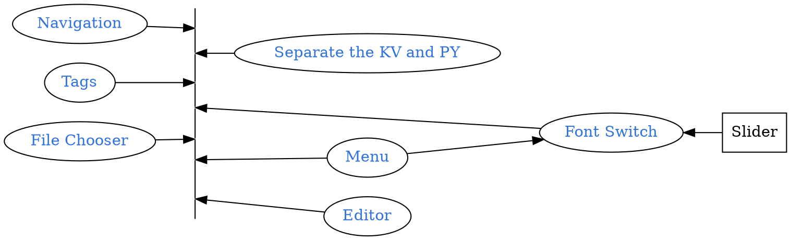

```
CryptoWatch-Kivy          1.13
Kivy                      2.0.0
Kivy-Garden               0.1.4
kivy-garden.wordcloud     1.0.0
kivymd                    0.104.2.dev0
```



## Quick Review
```bash
tree
```
<pre style= "color:#76EE00; background-color:#363636">
.
├── bin
│   └── KarobbenTB-1.3-armeabi-v7a-debug.apk
├── buildozer.spec
├── favicon.ico
├── font
│   ├── ArtificialBox-WdD4.ttf
|   ...
│   └── JingDianFanJiaoZhuan-1.ttf
├── Layout
│   ├── filechooser.kv
│   ├── menu.kv
│   ├── Navigation_Draw.kv
│   ├── Navigation_Tabs.kv
│   └── Seq.kv
├── lib
│   └── bio_seq.py
├── libWidget
│   ├── filechooser.py
│   ├── main.py
│   ├── menu.py
│   └── Seq.py
├── logo.png
└── main.py
</pre>

## Function for Close Tab

[Raw file](https://karobben.github.io/2021/01/02/Python/kivy_filechooser/#Official-Document)

## Added to widget

```bash
touch libWidget/editor.py
touch libWidget/editor.kv
```
`editor.py`
```python editor.py
from kivy.lang import Builder
from kivy.uix.popup import Popup
from kivy.uix.floatlayout import FloatLayout
from kivy.uix.screenmanager import Screen
from kivy.properties import ObjectProperty
from kivy.utils import platform
import os

class LoadDialog(FloatLayout):
    load = ObjectProperty(None)
    cancel = ObjectProperty(None)

class SaveDialog(FloatLayout):
    save = ObjectProperty(None)
    text_input = ObjectProperty(None)
    cancel = ObjectProperty(None)

class FunctionWidget():


    def main(self):
        self.popup = Popup(title="Select .zip file",
                           content=None,
                           size_hint=(None, None),
                           size=(500, 500),
                           auto_dismiss=True)

        Builder.unload_file("Layout/editor.kv")
        self.Function_page = Builder.load_file("Layout/editor.kv")
        # select a file
        self.Function_page.ids.button_load.on_release = self.show_load
        # save the file
        self.Function_page.ids.button_save.on_release = self.show_save

        return self.Function_page


    def dismiss_popup(self):
        self._popup.dismiss()

    def show_load(self):
        content = LoadDialog(load=self.load, cancel=self.dismiss_popup)
        PATH = "."
        if platform == "android":
          from android.permissions import request_permissions, Permission
          request_permissions([Permission.READ_EXTERNAL_STORAGE, Permission.WRITE_EXTERNAL_STORAGE])
          app_folder = os.path.dirname(os.path.abspath(__file__))
          PATH = "/storage/emulated/0" #app_folder
        content.ids.filechooser.path = PATH

        self._popup = Popup(title="Load file", content=content,
                            size_hint=(0.9, 0.9))
        self._popup.open()

    def show_save(self):
        content = SaveDialog(save=self.save, cancel=self.dismiss_popup)
        PATH = "."
        if platform == "android":
          from android.permissions import request_permissions, Permission
          request_permissions([Permission.READ_EXTERNAL_STORAGE, Permission.WRITE_EXTERNAL_STORAGE])
          app_folder = os.path.dirname(os.path.abspath(__file__))
          PATH = "/storage/emulated/0" #app_folder
        content.ids.filechooser.path = PATH
        self._popup = Popup(title="Save file", content=content,
                            size_hint=(0.9, 0.9))
        self._popup.open()

    def load(self, path, filename):
        with open(os.path.join(path, filename[0])) as stream:
            try:
                self.Function_page.ids.text_input.text = stream.read()
            except:
                self.Function_page.ids.text_input.text = "Error, can't open this file"

        self.dismiss_popup()

    def save(self, path, filename):
        with open(os.path.join(path, filename), 'w') as stream:
            stream.write(self.Function_page.ids.text_input.text)

        self.dismiss_popup()
```

`editor.kv`
```kv editor.kv

BoxLayout:
    orientation: 'vertical'
    BoxLayout:
        size_hint_y: None
        height: 30
        Button:
            id: button_load
            text: 'Load'
        Button:
            id: button_save
            text: 'Save'

    BoxLayout:
        TextInput:
            id: text_input
            text: ''

<LoadDialog>:
    BoxLayout:
        size: root.size
        pos: root.pos
        orientation: "vertical"
        FileChooserListView:
            id: filechooser
            path: "."

        BoxLayout:
            size_hint_y: None
            height: 30
            Button:
                id: test
                text: "Cancel"
                on_release: root.cancel()

            Button:
                text: "Load"
                on_release: root.load(filechooser.path, filechooser.selection)


<SaveDialog>:
    text_input: text_input
    BoxLayout:
        size: root.size
        pos: root.pos
        orientation: "vertical"
        FileChooserListView:
            id: filechooser
            on_selection: text_input.text = self.selection and self.selection[0] or ''

        TextInput:
            id: text_input
            size_hint_y: None
            height: 30
            multiline: False

        BoxLayout:
            size_hint_y: None
            height: 30
            Button:
                text: "Cancel"
                on_release: root.cancel()

            Button:
                text: "Save"
                on_release: root.save(filechooser.path, text_input.text)
```
