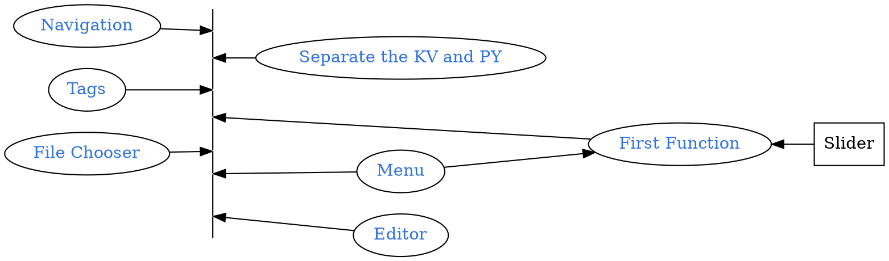

```
CryptoWatch-Kivy          1.13
Kivy                      2.0.0
Kivy-Garden               0.1.4
kivy-garden.wordcloud     1.0.0
kivymd                    0.104.2.dev0
```



## Quick Review
```bash
tree
```
<pre style= "color:#76EE00; background-color:#363636">
.
├── bin
│   └── KarobbenTB-1.3-armeabi-v7a-debug.apk
├── buildozer.spec
├── favicon.ico
├── font
│   ├── ArtificialBox-WdD4.ttf
|   ...
│   └── JingDianFanJiaoZhuan-1.ttf
├── Layout
│   ├── filechooser.kv
│   ├── menu.kv
│   ├── Navigation_Draw.kv
│   ├── Navigation_Tabs.kv
│   └── Seq.kv
├── lib
│   └── bio_seq.py
├── libWidget
│   ├── filechooser.py
│   ├── main.py
│   ├── menu.py
│   └── Seq.py
├── logo.png
└── main.py
</pre>

## Function for Close Tab

[Raw file](https://karobben.github.io/2021/01/02/Python/kivy_filechooser/#Official-Document)

## Added to widget

```bash
mkdir config
touch config/home.json
touch config/Navi.json
```

`Navi.json`

```json Navi.json
{
  "Seq":
    {"icon":"篆体","title":"Sequencs Tools","font":"font/HuaKangXinZhuanTi-1"},
  "editor":
    {"icon":"Text Editor","title":"editor", "font":"font/FangZhengHeiTiFanTi-1"}
}
```


```diff main.py
+        self.List = json.load(open('config/Navi.json'))
+        L = [i for i in self.List.keys()]
+        for x in L:
+            print(x)
+            text = f"[font={self.List[x]['font']}]{self.List[x]['icon']}[/font]"
+            X = MDRectangleFlatButton(text =text)
+            #X.font = self.List[x]['font']
+            X.on_release = lambda Dic = x:self.add_tag(Dic)
+            self.Widget_navi.ids.nav_button.add_widget(X)
         #from libWidget.Seq import FunctionWidget as tmp
+        Home_dic = json.load(open('config/home.json'))
+        for i in list(Home_dic.keys())[::-1]:

+    def HomeTabUpdate(self, Dic):
+        if Dic != None:
+            List = [icon.text.split("]")[0].replace("[ref=","") for icon in  self.Widget_tabs.ids.tabs.get_tab_list()]+[self.List[Dic]['icon']]
+            List.remove("")
+        else:
+            List = [icon.text.split("]")[0].replace("[ref=","") for icon in  self.Widget_tabs.ids.tabs.get_tab_list()]
+        List = list(set(List))
+        Result = []
+        for icon in List:
+            for Key in self.List.keys():
+                if self.List[Key]['icon']==icon:
+                    Result += [Key]
+        Home_dic = {x:self.List[x] for x in Result}
+        with open("config/home.json",'w') as F:
+            F.write(json.dumps(Home_dic))

     def add_tag(self, Dic):
         ...
+        self.HomeTabUpdate(Dic)
     def on_ref_press(
         self,
         instance_tabs,
         instance_tab_label,
         instance_tab,
         instance_tab_bar,
         instance_carousel,
     ):
+        self.HomeTabUpdate(Dic=None)

```


<details><summary>Click to show main.py</summary>

  ```python main.py
  from kivy.uix.screenmanager import Screen
  from kivymd.uix.button import MDRectangleFlatButton
  from kivy.lang import Builder
  from kivy.uix.floatlayout import FloatLayout
  from kivymd.uix.tab import MDTabsBase
  from kivy.core.window import WindowBase
  from kivymd.icon_definitions import md_icons

  from kivymd.app import MDApp

  from libWidget.filechooser import ConfirmPopup

  import json

  WindowBase.softinput_mode = "below_target"

  # Function libs

  def OPEN(file):
      return open(file).read()

  class Tab(FloatLayout, MDTabsBase):
      '''Class implementing content for a tab.'''

  class MainApp(MDApp):
      ConfirmPopup = ConfirmPopup()
      #Editor       = Editor()
      PATH = "."
      def change_text(self, Files):
          #self.the_time.text = str(Files)
          self.Button_test.text = Files[0]
          print("main screen", str(Files))


      def build(self):
          screen = Screen()
          screen.change_text = self.change_text
          # loading Navigation (left)
          self.Widget_navi = Builder.load_string(OPEN("Layout/Navigation_Draw.kv"))
          # loading navigation tags
          self.Widget_tabs = Builder.load_string(OPEN("Layout/Navigation_Tabs.kv"))
          #self.Widget_tabs.ids.tabs.on_ref_press = self.on_ref_press(*args)

          # loading The Function pages
          # Loading Sequencs function page

          screen.add_widget(self.Widget_tabs)
          screen.add_widget(self.Widget_navi)
          return screen

      # Functions for Navigation Ta
      def on_start(self):
          from lib.bio_seq import Bio as FunBioSeq

          Fun = FunBioSeq()
          print(Fun.List())

          def PP():
              print(Function_page.ids.seq_input.text)
              Function_page.ids.seq_result.text = Function_page.ids.seq_input.text.upper()
              Fun = FunBioSeq()

          self.List = json.load(open('config/Navi.json'))
          '''
          Navigation test
          '''
          Num = 0
          L = [i for i in self.List.keys()]
          for x in L:
              print(x)
              text = f"[font={self.List[x]['font']}]{self.List[x]['icon']}[/font]"
              X = MDRectangleFlatButton(text =text)
              #X.font = self.List[x]['font']
              X.on_release = lambda Dic = x:self.add_tag(Dic)
              self.Widget_navi.ids.nav_button.add_widget(X)
          '''
              locals()["Btn_".format(self.List[i]['icon'])] =  MDRectangleFlatButton(
                      text=self.List[i]['icon'],
                      font_name = self.List[i]['font'],
                      on_release =
                          lambda x = i:self.add_tag(i))
              self.Widget_navi.ids.nav_button.add_widget(locals()["Btn_".format(self.List[i]['icon'])])
          '''
          #from libWidget.Seq import FunctionWidget as tmp
          Home_dic = json.load(open('config/home.json'))
          for i in list(Home_dic.keys())[::-1]:
              tmp_tab = Tab(text=f"[ref={self.List[i]['icon']}][color=#fa937f][font=font/heydings-icons-1]{'X'}[/font][/color][/ref]  [font={self.List[i]['font']}]{self.List[i]['icon']}[/font]")
              Module = __import__('libWidget.'+i, globals(), locals(), [], 0)
              Fun = eval("Module."+i+".FunctionWidget()")
              screen_tmp = Screen()
              screen_tmp.name = i
              screen_tmp.add_widget(Fun.main())
              tmp_tab.add_widget(screen_tmp)
              self.Widget_tabs.ids.tabs.add_widget(tmp_tab)


      def add_tag(self, Dic):
          print(Dic)
          name_tab = self.List[Dic]['icon']
          Tag_title =  f"[ref={name_tab}][font=font/heydings-icons-1][color=#fa937f]{'X'}[/color][/font][/ref][font=./font/JingDianFanJiaoZhuan-1][font={self.List[Dic]['font']}]{name_tab}[/font]"

          tmp_tab =Tab( text = Tag_title)
          Module = __import__('libWidget.'+Dic, globals(), locals(), [], 0)
          Fun = eval("Module."+Dic+".FunctionWidget()")
          screen_tmp = Screen()
          screen_tmp.name = "Test"
          screen_tmp.add_widget(Fun.main())
          tmp_tab.add_widget(screen_tmp)
          self.Widget_tabs.ids.tabs.add_widget(tmp_tab)
          self.Widget_tabs.ids.tabs.switch_tab(Tag_title)
          self.Widget_navi.ids.nav_drawer.set_state("close")
          # Update Tages in  First page
          self.HomeTabUpdate(Dic)

      def HomeTabUpdate(self, Dic):
          if Dic != None:
              List = [icon.text.split("]")[0].replace("[ref=","") for icon in  self.Widget_tabs.ids.tabs.get_tab_list()]+[self.List[Dic]['icon']]
              List.remove("")
          else:
              List = [icon.text.split("]")[0].replace("[ref=","") for icon in  self.Widget_tabs.ids.tabs.get_tab_list()]

          List = list(set(List))
          Result = []
          for icon in List:
              for Key in self.List.keys():
                  if self.List[Key]['icon']==icon:
                      Result += [Key]
          Home_dic = {x:self.List[x] for x in Result}
          with open("config/home.json",'w') as F:
              F.write(json.dumps(Home_dic))


      # Functions for Navigation Tab Switch
      def on_tab_switch(
          self, instance_tabs, instance_tab, instance_tab_label, tab_text):
          '''Called when switching tabs.
          :type instance_tabs: <kivymd.uix.tab.MDTabs object>;
          :param instance_tab: <__main__.Tab object>;
          :param instance_tab_label: <kivymd.uix.tab.MDTabsLabel object>;
          :param tab_text: text or name icon of tab;
          '''
          instance_tab.ids.label.text = tab_text
      def on_ref_press(
          self,
          instance_tabs,
          instance_tab_label,
          instance_tab,
          instance_tab_bar,
          instance_carousel,
      ):
          '''
          The method will be called when the ``on_ref_press`` event
          occurs when you, for example, use markup text for tabs.

          :param instance_tabs: <kivymd.uix.tab.MDTabs object>
          :param instance_tab_label: <kivymd.uix.tab.MDTabsLabel object>
          :param instance_tab: <__main__.Tab object>
          :param instance_tab_bar: <kivymd.uix.tab.MDTabsBar object>
          :param instance_carousel: <kivymd.uix.tab.MDTabsCarousel object>
          '''

          # Removes a tab by clicking on the close icon on the left.
          for instance_tab in instance_carousel.slides:
              if instance_tab.text == instance_tab_label.text:
                  instance_tabs.remove_widget(instance_tab_label)
                  break
          self.HomeTabUpdate(Dic=None)
  MainApp().run()
  ```
</details>

We can also add a `json` for initializing the home page so we can reload the tabs we keeped in last time.

`home.json`

```json home.json
{
  "Font":
  {"icon":"篆体","title":"Fonttoo Tools","font":"font/HuaKangXinZhuanTi-1"}
}
```
