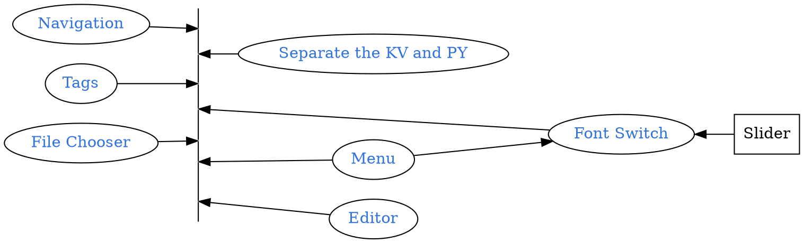

```
CryptoWatch-Kivy          1.13
Kivy                      2.0.0
Kivy-Garden               0.1.4
kivy-garden.wordcloud     1.0.0
kivymd                    0.104.2.dev0
```



## Quick Review
```bash
tree
```
<pre style= "color:#76EE00; background-color:#363636">
  .
  ├── 123.fa
  ├── 123.html
  ├── Karobben_logo_horizontal_800.png
  ├── LICENSE
  ├── Layout
  │   ├── Blog.kv
  │   ├── CV_cm.kv
  │   ├── CV_test.kv
  │   ├── Data_table.kv
  │   ├── Font.kv
  │   ├── Navigation_Draw.kv
  │   ├── Navigation_Tabs.kv
  │   ├── Seq.kv
  │   ├── editor.kv
  │   ├── filechooser.kv
  │   └── menu.kv
  ├── README.md
  ├── alipay.jpg
  ├── buildozer.spec
  ├── config
  │   ├── Navi.json
  │   └── home.json
  ├── custom_camera
  │   ├── __init__.py
  │   ├── custom_camera.kv
  │   └── custom_camera.py
  ├── demo
  │   ├── clustal
  │   └── echart
  ├── favicon.ico
  ├── font
  │   ├── ArtificialBox-WdD4.ttf
  │   ├── FangZhengHeiTiFanTi-1.ttf
  │   ├── FangZhengHeiTiJianTi-1.ttf
  │   ├── FangZhengKaiTiPinYinZiKu-1.ttf
  │   ├── FangzhenXiaozhuan.ttf
  │   ├── HuaKangXinZhuanTi-1.ttf
  │   ├── JingDianFanJiaoZhuan-1.ttf
  │   ├── heydings-controls-1.ttf
  │   ├── heydings-icons-1.ttf
  │   ├── heydings-icons-2.ttf
  │   └── icon-works-webfont-2.ttf
  ├── image_processing
  │   ├── __init__.py
  │   ├── cascades
  │   │   └── haarcascade_frontalface_default.xml
  │   └── image_processing.py
  ├── libWidget
  │   ├── Blog.py
  │   ├── CV_cm.py
  │   ├── CV_test.py
  │   ├── Data_table.py
  │   ├── Font.py
  │   ├── Seq.py
  │   ├── editor.py
  │   ├── filechooser.py
  │   ├── menu.py
  │   └── model.txt
  ├── libs
  │   ├── bio_seq.py
  │   ├── clustalo.py
  │   ├── clustalo.pytxt
  │   ├── web_open.py
  │   └── webview.py
  ├── logo.png
  ├── main.py
  └── wepay.png
</pre>

## Function for Close Tab

Because I was using my blog project to doing the test with this server, so I called it as `Blog.py`

Function `run_sever` is for starting the http server so you can render CSS and applying `js`, `close_blog` could close the server and back to home directory.

```python Blog.py
from kivy.lang import Builder
from kivy.uix.popup import Popup
from kivy.uix.floatlayout import FloatLayout
from kivy.uix.screenmanager import Screen
from kivy.properties import ObjectProperty
from kivy.utils import platform
import os
import webbrowser, time
import threading

class FunctionWidget():

    def main(self):
        Builder.unload_file("Layout/Blog.kv")
        self.Function_page = Builder.load_file("Layout/Blog.kv")
        self.Function_page.ids.buton_start.on_release = self.open_blog
        self.Function_page.ids.buton_close.on_release = self.close_blog
        return self.Function_page

    def run_sever(self):
        import http.server
        import socketserver
        PORT = 5500
        Handler = http.server.SimpleHTTPRequestHandler
        with socketserver.TCPServer(("", PORT), Handler) as self.httpd:
            print("serving at port", PORT)
            self.httpd.serve_forever()

    def close_blog(self):
        PATH = os.path.abspath(__file__).split("libWidget")[0].replace("appc","app")
        print(PATH)

        try:
            self.httpd.shutdown()
            os.chdir(PATH)
        except:
            os.chdir(PATH)

    def open_blog(self, *args):
        if platform == "android":
            from libs.webview import WebView
        os.chdir("Blog")
        PATH = os.path.abspath(__file__).split("libWidget")[0].replace("appc","app")
        URL = 'file://'+PATH+'/demo/clustal/123.html',
        URL = 'http://127.0.0.1:5500/'
        print("URL = ", URL)
        x = threading.Thread(target=self.run_sever, args=())
        x.start()
        print("Started, test")
        if platform == "android":
            self.browser = None
            self.browser = WebView(URL,
                                   enable_javascript = True,
                                   enable_downloads = True,
                                   enable_zoom = True)
        else:
            try:
                webbrowser.open('http://127.0.0.1:5500/')
            except:
                pass
```

## Layout

`Blog.py`

```kv Blog.kv
MDBoxLayout:
    MDRectangleFlatButton:
        id: buton_start
        text: "Start Server"
        on_release: None
        pos_hint: {"center_x": .5, "center_y": .5}
    MDRectangleFlatButton:
        id: buton_close
        text: "Close Server"
        on_release: None
        pos_hint: {"center_x": .5, "center_y": .5}
```


## Functions for webview
This function was written by [RobertFlatt](https://github.com/RobertFlatt) and published in [ RobertFlatt /Android-for-Python ](https://github.com/RobertFlatt/Android-for-Python/tree/main/webview). He also contributed lots of other awesome functions and examples of widgets.

I copied his `webview.py` to `libs` directory. An example of using it:
```python
if platform == "android":
    from libs.webview import WebView
    self.browser = None
    self.browser = WebView(URL,
                           enable_javascript = True,
                           enable_downloads = True,
                           enable_zoom = True)
```  
