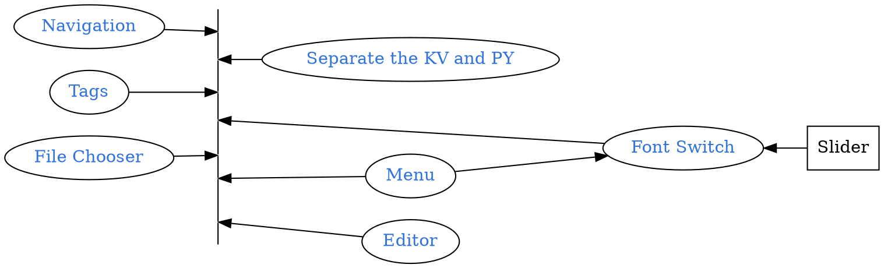

```
CryptoWatch-Kivy          1.13
Kivy                      2.0.0
Kivy-Garden               0.1.4
kivy-garden.wordcloud     1.0.0
kivymd                    0.104.2.dev0
```



## Quick Review
```bash
tree
```
<pre style= "color:#76EE00; background-color:#363636">
  .
  ├── 123.fa
  ├── 123.html
  ├── Karobben_logo_horizontal_800.png
  ├── LICENSE
  ├── Layout
  │   ├── Blog.kv
  │   ├── CV_cm.kv
  │   ├── CV_test.kv
  │   ├── Data_table.kv
  │   ├── Font.kv
  │   ├── Navigation_Draw.kv
  │   ├── Navigation_Tabs.kv
  │   ├── Seq.kv
  │   ├── editor.kv
  │   ├── filechooser.kv
  │   └── menu.kv
  ├── README.md
  ├── alipay.jpg
  ├── buildozer.spec
  ├── config
  │   ├── Navi.json
  │   └── home.json
  ├── custom_camera
  │   ├── __init__.py
  │   ├── custom_camera.kv
  │   └── custom_camera.py
  ├── demo
  │   ├── clustal
  │   └── echart
  ├── favicon.ico
  ├── font
  │   ├── ArtificialBox-WdD4.ttf
  │   ├── FangZhengHeiTiFanTi-1.ttf
  │   ├── FangZhengHeiTiJianTi-1.ttf
  │   ├── FangZhengKaiTiPinYinZiKu-1.ttf
  │   ├── FangzhenXiaozhuan.ttf
  │   ├── HuaKangXinZhuanTi-1.ttf
  │   ├── JingDianFanJiaoZhuan-1.ttf
  │   ├── heydings-controls-1.ttf
  │   ├── heydings-icons-1.ttf
  │   ├── heydings-icons-2.ttf
  │   └── icon-works-webfont-2.ttf
  ├── image_processing
  │   ├── __init__.py
  │   ├── cascades
  │   │   └── haarcascade_frontalface_default.xml
  │   └── image_processing.py
  ├── libWidget
  │   ├── Blog.py
  │   ├── CV_cm.py
  │   ├── CV_test.py
  │   ├── Data_table.py
  │   ├── Font.py
  │   ├── Seq.py
  │   ├── editor.py
  │   ├── filechooser.py
  │   ├── menu.py
  │   └── model.txt
  ├── libs
  │   ├── bio_seq.py
  │   ├── clustalo.py
  │   ├── clustalo.pytxt
  │   ├── web_open.py
  │   └── webview.py
  ├── logo.png
  ├── main.py
  └── wepay.png
</pre>

## Function for Close Tab

This script originally contributed by [okajun35](https://github.com/okajun35/kivy_show_opencv_pillow) in GitHub.

`CV_cm.py`

```python CV_test.py
# -*- coding: utf-8 -*
import numpy as np
import cv2
from kivy.uix.boxlayout import BoxLayout

from PIL import Image
from kivy.lang import Builder
from kivy.uix.widget import Widget
from kivy.graphics.texture import Texture
from kivy.graphics import Rectangle


class FunctionWidget():

    def main(self):
        Builder.unload_file("Layout/test.kv")
        self.Function_page = Builder.load_file("Layout/test.kv")
        self.Function_page.ids.button_load.on_release= self.run
        return self.Function_page

    def run(self, *args):
        img = cv2.imread('logo.png')
        img = cv2.cvtColor(img,cv2.COLOR_BGR2RGB)
        # 画像をグレイスケールに変換
        #gray_img = cv2.cvtColor(img,1)
        texture = Texture.create(size=(img.shape[1], img.shape[0]), colorfmt='rgb', bufferfmt='ubyte') # BGRモードで用意,ubyteはデフォルト引数なので指定なくてもよい
        texture.blit_buffer(img.tostring(),colorfmt='rgb', bufferfmt='ubyte')  # ★ここもBGRで指定しないとRGBになって色の表示がおかしくなる
        texture.flip_vertical()
        self.Function_page.show_pic  = texture
```

## Layout

`CV_cm.kv`
```kv CV_test.kv
BoxLayout:
    orientation: "vertical"
    show_pic: None
    BoxLayout:
        canvas:
            Rectangle:
                texture: root.show_pic
                pos: self.pos
                size: self.size
                #pos_hint: {'center_x': .5, 'center_y': .5}
                #color: 0, 0, 0, 1
    BoxLayout:
        orientation: "vertical"
        BoxLayout
            MDRaisedButton:
                id: button_load
                text: 'F'
                font_size: 30
                font_name: './font/heydings-icons-1'
                width: root.width * 0.5
                line_color: 1, 1, 1, 1
```

It works on PC not in androied. And I don't know why.
