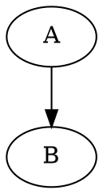

## Quick View



## Test Vide Information
This video is a MRI video record from [@浙江医学僧， Bilibili](https://www.bilibili.com/video/BV1Pv411q78v?from=search&seid=3757976832699732236)

## Code for play

```python
import cv2

cap=cv2.VideoCapture("心脏的跳动和声音.mp4")
while (True):
   ret,frame=cap.read()
   cv2.imshow("video",frame)
   # 在播放每一帧时，使用cv2.waitKey()设置适当的持续时间。如果设置的太低视频就会播放的非常快，如果设置的太高就会播放的很慢。通常情况下25ms就ok
   if cv2.waitKey(25)&0xFF==ord('q'):
       cv2.destroyAllWindows()
       break
```

## Extract a Line

### selecte an area

```python
Point_from = (121, 155)  # (x, y)
Point_end  = (292, 155)  # (Width, Height)
point_color = (0, 0, 255) # BGR
thickness = 1
lineType = 8
cv2.rectangle(frame, Point_from, Point_end,  point_color, thickness, lineType)
```

### get the date from the selected area

```
frame2 = frame.swapaxes(0,1)
print(frame2[Point_from[-1]][Point_from[0]:Point_end[0]].sum())
```

### Test: collect data from first 200 frames

Insert the codes below in the while loop to collecte the data.
```

Num = 0
Result = []
while Num < 200:
    Num += 1
    ...
    Selected_tmp = frame[Point_from[-1]][Point_from[0]:Point_end[0]].sum()
    Result += [Selected_tmp]
```

Data:

<pre>
  38484, 38499, 38910, 38886, 37764, 35799, 34968, 34968, 35565, 36000, 36879, 37044, 37062, 37089, 36930, 37041, 36525, 36384, 36213, 36279, 36186, 37065, 37272, 38034, 38175, 38220, 38532, 38730, 38835, 38412, 37287, 37278, 35487, 34749, 34650, 36159, 36891, 36858, 37074, 36969, 37167, 36981, 36696, 36711, 36255, 36048, 35841, 36591, 36966, 36975, 37110, 37737, 38139, 38772, 38769, 38778, 38736, 38634, 37392, 35487, 34701, 34701, 35154, 36345, 36666, 36996, 37065, 37071, 36867, 36903, 36804, 36435, 36039, 36039, 36117, 36006, 36456, 37101, 37461, 37461, 38088, 38466, 38856, 38679, 38742, 38748, 38718, 37830, 35724, 34905, 34977, 34977, 35949, 36726, 37149, 36945, 36789, 36846, 36663, 36783, 36828, 36216, 36030, 36033, 35877, 36789, 37485, 38148, 38463, 38466, 39003, 38997, 39012, 38862, 37707, 37707, 35367, 34971, 35016, 35556, 36684, 36684, 36873, 37233, 37152, 36840, 36714, 36702, 36567, 36318, 35952, 35778, 36420, 36450, 36939, 37221, 38004, 38556, 39108, 39120, 38979, 39105, 39111, 39066, 36699, 36699, 35199, 34488, 34788, 35859, 36420, 36420, 36954, 36783, 37038, 37119, 36825, 36879, 36762, 36681, 36474, 36099, 36006, 36006, 36357, 36996, 37194, 37461, 38325, 38364, 38661, 38967, 38898, 39066, 38838, 38853, 37446, 35427, 34785, 34881, 36003, 36003, 36915, 36951, 37257, 37098, 36810, 36810, 36855, 36453, 36066, 36093, 35508, 35544, 36042, 36693, 37230, 37776, 38019, 38049
</pre>


### Sitch the frames

```python
import cv2
import numpy as np

cap=cv2.VideoCapture("心脏的跳动和声音.mp4")
Point_from = (121, 155)  # (x, y)
Point_end  = (292, 155)  # (Width, Height)
point_color = (0, 0, 255) # BGR
thickness = 1
lineType = 8
ret,frame=cap.read()
Selected_frame = frame[Point_from[-1]][Point_from[0]:Point_end[0]]

Num = 0
Result = []
Result_frame = Selected_frame
Result_frame = Result_frame.reshape((171,1,3))
cap=cv2.VideoCapture("心脏的跳动和声音.mp4")
#while Num < 200:
while True:
    Num += 1
    ret,frame=cap.read()
    # Selecte an area
    frame = cv2.rectangle(frame, Point_from, Point_end,  point_color, thickness, lineType)
    frame2 = frame.swapaxes(0,1)
    Selected_tmp = frame2[Point_from[-1]][Point_from[0]:Point_end[0]].sum()
    Selected_frame = frame2[Point_from[-1]][Point_from[0]:Point_end[0]]
    Selected_frame = Selected_frame.reshape((171,1,3))

    Result += [Selected_frame]
    Result_frame = np.append(Result_frame, Selected_frame, axis=1)
    # Show frame
    cv2.imshow("video",frame)
    cv2.imshow("Selected Frames",Result_frame)
    if cv2.waitKey(25)&0xFF==ord('q'):
       cv2.destroyAllWindows()
       break

```


## Regression

```python
import numpy as np
import matplotlib.pyplot as plt
import scipy.optimize as optimize
pi = np.pi

y = [] # data from above
fps = 30
x = np.array(range(len(y)))/fps


fig, ax = plt.subplots()
ax.plot(x, np.log(y), 'b--')
plt.ion()
plt.show()

def target_func(x, a0, a1, a2, a3):
    return a0 * np.sin(a1 * x + a2) + a3

# 拟合sin曲线
fs = np.fft.fftfreq(len(x), x[1] - x[0])
Y = abs(np.fft.fft(y))
freq = abs(fs[np.argmax(Y[1:]) + 1])/2
a0 = max(y) - min(y)
a1 = 2 * pi * freq
a2 = 0
a3 = np.mean(y)
p0 = [a0, a1, a2, a3]
para, _ = optimize.curve_fit(target_func, x, y, p0=p0)
print(para)
y_fit = [target_func(a, *para) for a in x]
ax.plot(x, np.log(y_fit), 'g')


ax.plot(x, [i-ii for i,ii in zip(y, y_fit)], 'g')
plt.show()
```


### scripts from

[cse.unsw.edu](https://www.cse.unsw.edu.au/~en1811/18s1/lecs/week04/video/heart_beat_visualise.py)

Result:

