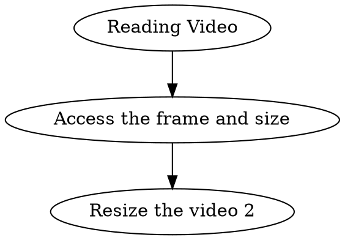

Basic Grammars of OpenCV: [Karobben Blog](https://karobben.github.io/2020/09/12/Python/OpenCV/)


## import library
```python Python
import cv2
import matplotlib.pyplot as plt
```

## Reading Video

With the Code below, you can load and show the video on window "video".

```python Python
# video read
Video1 = "test2.mp4"
Video2 = "output.avi"

# acquiring the fps and the size of the Video one
fps_c1 = cap1.get(cv2.CAP_PROP_FPS)
Video_h1 = cap1.get(cv2.CAP_PROP_FRAME_HEIGHT)
Video_w1 = cap1.get(cv2.CAP_PROP_FRAME_WIDTH)

while (True):
   ret,frame=cap.read()
   cv2.imshow("video",frame)
   if cv2.waitKey(1)&0xFF==ord('q'):
       cv2.destroyAllWindows()
       break
```

## Combine Two Frames
```python
def Fram_connect(fram1, frame2, h = Video_h, w = Video_w):
  frame2 = cv2.resize(frame2, (int(Video_w), int(Video_h)), interpolation = cv2.INTER_AREA)
  BG = cv2.resize(frame1, (int(Video_w * 2), int(Video_h)), interpolation = cv2.INTER_AREA)
  BG[0:int(Video_h),0:int(Video_w)] = frame1
  BG[0:int(Video_h),int(Video_w):int(Video_w*2)] = frame2
  return (BG)
```

## Write the result

```python
fps = fps_c

size = (1920, 1080)

fourcc = cv2.VideoWriter_fourcc('M','J','P','G')
videowriter = cv2.VideoWriter(OUTPUT + ".avi",fourcc,fps,size)

while (True):
  ret,frame1=cap1.read()
  ret,frame2=cap2.read()
  img = Fram_connect(frame1, frame2, Video_w, Video_h,  Video_w2, Video_h2)
  img = cv2.resize(img, size, interpolation = cv2.INTER_AREA)
  videowriter.write(img)

videowriter.write(frame)


```
## Result

```python
import argparse

parser = argparse.ArgumentParser()
parser.add_argument('-i','-I','--input',nargs='+',
                    help='Input vedio file')     #输入文件
parser.add_argument('-o','-U','--output', default = "combine_result.avi",
                    help='Output vedio file, default as "combine_result.avi"')     #输入文件
parser.add_argument('-f','-F','--FPS', type = int,
                    help='Start from X second. default is the same as the first video')     #输入文件
parser.add_argument('-w','-W','--window', nargs='?',
                    help='1920x1080 default is the combined size of two vedio')     #输入文件

#获取参数
args = parser.parse_args()
File = args.input
OUTPUT = args.output
Window = args.window
fps = args.FPS


import cv2


# function for combined two frames.
def Fram_connect(fram1, frame2, Video_w, Video_h,  Video_w2, Video_h2):
  frame2 = cv2.resize(frame2, (int(Video_w2), int(Video_h)), interpolation = cv2.INTER_AREA)
  BG = cv2.resize(frame1, (int(Video_w + Video_w2), int(Video_h)), interpolation = cv2.INTER_AREA)
  BG[0:int(Video_h),0:int(Video_w)] = frame1
  BG[0:int(Video_h),int(Video_w):int(Video_w+ Video_w2)] = frame2
  return (BG)

Video1 = File[0]
Video2 = File[1]

cap1=cv2.VideoCapture(Video1)
cap2=cv2.VideoCapture(Video2)

# The video 1 set the video 1 as the default size and fps
fps_c = cap1.get(cv2.CAP_PROP_FPS)
Video_h = cap1.get(cv2.CAP_PROP_FRAME_HEIGHT)
Video_w = cap1.get(cv2.CAP_PROP_FRAME_WIDTH)

fps_c2 = cap2.get(cv2.CAP_PROP_FPS)
Video_h2 = cap2.get(cv2.CAP_PROP_FRAME_HEIGHT)
Video_w2 = cap2.get(cv2.CAP_PROP_FRAME_WIDTH)


# args for the video output
fps = fps_c

if Window == None:
  size = (int(Video_w+Video_w2), int(Video_h))
else:
    size = (int(Window.split("x")[0]), int(Window.split("x")[1]))

fourcc = cv2.VideoWriter_fourcc('M','J','P','G')
videowriter = cv2.VideoWriter(OUTPUT + ".avi",fourcc,fps,size)


while (True):
  ret,frame1=cap1.read()
  ret,frame2=cap2.read()
  img = Fram_connect(frame1, frame2, Video_w, Video_h,  Video_w2, Video_h2)
  img = cv2.resize(img, size, interpolation = cv2.INTER_AREA)
  videowriter.write(img)
  if cv2.waitKey(1) & 0xFF == ord('q'):
      cv2.destroyAllWindows()
      break

videowriter.write(frame)
```

Two videos are combined to into a frame aligned by left-right

