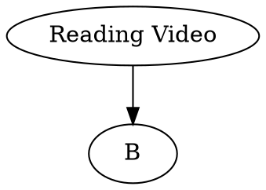

Basic Grammars of OpenCV: [Karobben Blog](https://karobben.github.io/2020/09/12/Python/OpenCV/)



So, the situation is, after you recorded a video, there are lots of nonsense frames when you are doing something else, drinking water for instance. By calculating the difference between each frame with the previous frame, we can get a list of numbers and tossing the frame with low value by looking into this list.

## import library
```python Python
import cv2
import matplotlib.pyplot as plt
```

## Reading Video

With the Code below, you can load and show the video on window "video"
```python Python
Video = "test2.mp4"
cap=cv2.VideoCapture(Video)
while (True):
   ret,frame=cap.read()
   cv2.imshow("video",frame)
   # 在播放每一帧时，使用cv2.waitKey()设置适当的持续时间。如果设置的太低视频就会播放的非常快，如果设置的太高就会播放的很慢。通常情况下25ms就ok
   if cv2.waitKey(1)&0xFF==ord('q'):
       cv2.destroyAllWindows()
       break
```

## Calculate the different of each frame

### Calculate the difference of the images
```python
def Diff_img(img0, img):
  '''
  This function is designed for calculating the difference between two
  images. The images are convert it to an grey image and be resized to reduce the unnecessary calculating.
  '''
  # Grey and resize
  img0 =  cv2.cvtColor(img0, cv2.COLOR_RGB2GRAY)
  img =  cv2.cvtColor(img, cv2.COLOR_RGB2GRAY)
  img0 = cv2.resize(img0, (320,200), interpolation = cv2.INTER_AREA)
  img = cv2.resize(img, (320,200), interpolation = cv2.INTER_AREA)
  # Calculate
  Result = (abs(img - img0)).sum()
  return Result

```

```python Python
Video = "test2.mp4"
cap=cv2.VideoCapture(Video)
ret,frame0 = cap.read()

Result = []
Num = 0
while (True):
   ret,frame=cap.read()
   #cv2.imshow("video",frame)
   if Num > 0:
    Result += [Diff_img(frame0, frame)]
    frame0 = frame
   Num += 1
   if cv2.waitKey(25)&0xFF==ord('q'):
       cv2.destroyAllWindows()
       break
```

### Write result

```python

Video = "test.mp4"
cap=cv2.VideoCapture(Video)
ret,frame0 = cap.read()

fps_c = cap.get(cv2.CAP_PROP_FPS)
Video_h = int(cap.get(cv2.CAP_PROP_FRAME_HEIGHT))
Video_w = int(cap.get(cv2.CAP_PROP_FRAME_WIDTH))

fps = fps_c
size = (Video_w,Video_h)
fourcc = cv2.VideoWriter_fourcc('M','J','P','G')
videowriter = cv2.VideoWriter("output.avi",fourcc,fps,size)


Result = []
Num = 0
while (True):
  ret,frame=cap.read()
  #cv2.imshow("video",frame)
  if Num > 0:
    Diff = Diff_img(frame0, frame)
    Result += [Diff]
    frame0 = frame
    if Diff > 10000:
      videowriter.write(frame0)
  Num += 1
  print(round(Num /237450 * 100, 3))

videowriter.release()

```

The compare of the video before (left) and after (right) processing.

