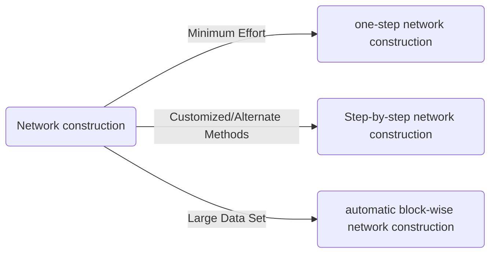

## WGCNA Tutorial 2

[Official Website](https://horvath.genetics.ucla.edu/html/CoexpressionNetwork/Rpackages/WGCNA/)
Paper: [Peter Langfelder, 2008](https://bmcbioinformatics.biomedcentral.com/articles/10.1186/1471-2105-9-559)

Weighted correlation network analysis (WGCNA) can be used for finding clusters (modules) of highly correlated genes, for summarizing such clusters using the module eigengene or an intramodular hub gene, for relating modules to one another and to external sample traits (using eigengene network methodology), and for calculating module membership measures.

[Play list](https://www.youtube.com/playlist?list=PLAv3hOAKTXH1zpvHiXUbxTmzUi-ZL0AR5) for Network Analysis

## Install

```r
## Mirrors
## options("repos" = c(CRAN="https://mirrors.tuna.tsinghua.edu.cn/CRAN/"))
## options(BioC_mirror="https://mirrors.tuna.tsinghua.edu.cn/bioconductor")
install.packages("BiocManager")
BiocManager::install("WGCNA")
```

Data:
- [Female data](https://horvath.genetics.ucla.edu/html/CoexpressionNetwork/Rpackages/WGCNA/Tutorials/FemaleLiver-Data.zip)
- [Male data](https://horvath.genetics.ucla.edu/html/CoexpressionNetwork/Rpackages/WGCNA/Tutorials/MaleLiver-Data.zip)

## 1. Data Preparation

### 1.1 Loading DataSet
The data sets contain roughly 130 samples each. Note that each row corresponds to a gene and column to a
sample or auxiliary information.
```r
library(WGCNA)

## Reading Data
options(stringsAsFactors = FALSE)
##Read in the female liver data set
femData = read.csv("LiverFemale3600.csv")
## Read in the male liver data set
maleData = read.csv("LiverMale3600.csv")
```

### 1.2 Groups in List
```r
## We work with two sets:
nSets = 2;
## For easier labeling of plots, create a vector holding descriptive names of the two sets.
setLabels = c("Female liver", "Male liver")
shortLabels = c("Female", "Male")

## Form multi-set expression data: columns starting from 9 contain actual expression data.
multiExpr = vector(mode = "list", length = nSets)

multiExpr[[1]] = list(data = as.data.frame(t(femData[-c(1:8)])));
names(multiExpr[[1]]$data) = femData$substanceBXH;
rownames(multiExpr[[1]]$data) = names(femData)[-c(1:8)];
multiExpr[[2]] = list(data = as.data.frame(t(maleData[-c(1:8)])));
names(multiExpr[[2]]$data) = maleData$substanceBXH;
rownames(multiExpr[[2]]$data) = names(maleData)[-c(1:8)];
## Check that the data has the correct format for many functions operating on multiple sets:
exprSize = checkSets(multiExpr)
```

### 1.3 Rudimentary data cleaning and outlier removal
Check that all genes and samples have sufficiently low numbers of missing values.
```r
gsg = goodSamplesGenesMS(multiExpr, verbose = 3);
gsg$allOK

if (!gsg$allOK)
{
  # Print information about the removed genes:
  if (sum(!gsg$goodGenes) > 0)
    printFlush(paste("Removing genes:", paste(names(multiExpr[[1]]$data)[!gsg$goodGenes],
                                              collapse = ", ")))
  for (set in 1:exprSize$nSets)
  {
    if (sum(!gsg$goodSamples[[set]]))
      printFlush(paste("In set", setLabels[set], "removing samples",
                       paste(rownames(multiExpr[[set]]$data)[!gsg$goodSamples[[set]]], collapse = ", ")))
    # Remove the offending genes and samples
    multiExpr[[set]]$data = multiExpr[[set]]$data[gsg$goodSamples[[set]], gsg$goodGenes];
  }
  # Update exprSize
  exprSize = checkSets(multiExpr)
}
```

### 1.4 Cluster

```r
sampleTrees = list()
for (set in 1:nSets)
{
  sampleTrees[[set]] = hclust(dist(multiExpr[[set]]$data), method = "average")
}

par(mfrow=c(2,1))
par(mar = c(0, 4, 2, 0))
for (set in 1:nSets)
  plot(sampleTrees[[set]], main = paste("Sample clustering on all genes in", setLabels[set]),
       xlab="", sub="", cex = 0.7)
```


By inspection, there seems to be <span style="background:salmon">**one outlier**</span> in the female data set, and no obvious outliers in the male set. We
now <span style="background:salmon">**remove the female outlier**</span> using a semi-automatic code that only requires a choice of a height cut

### 1.5 Remove Outlier
```r
## Choose the "base" cut height for the female data set
baseHeight = 16
## Adjust the cut height for the male data set for the number of samples
cutHeights = c(16, 16*exprSize$nSamples[2]/exprSize$nSamples[1]);
## Re-plot the dendrograms including the cut lines
png(file = "SampleClustering.png");
par(mfrow=c(2,1))
par(mar = c(0, 4, 2, 0))
for (set in 1:nSets)
{
  plot(sampleTrees[[set]], main = paste("Sample clustering on all genes in", setLabels[set]),
       xlab="", sub="", cex = 0.7);
  abline(h=cutHeights[set], col = "red");
}
dev.off();

## Removing outlier
for (set in 1:nSets)
{
  # Find clusters cut by the line
  labels = cutreeStatic(sampleTrees[[set]], cutHeight = cutHeights[set])
  # Keep the largest one (labeled by the number 1)
  keep = (labels==1)
  multiExpr[[set]]$data = multiExpr[[set]]$data[keep, ]
}
collectGarbage();
## Check the size of the leftover data
exprSize = checkSets(multiExpr)
exprSize
```


### 1.6 Loading Clinical Trait Data
```r
traitData = read.csv("ClinicalTraits.csv");
## remove columns that hold information we do not need.
allTraits = traitData[, -c(31, 16)];
allTraits = allTraits[, c(2, 11:36) ];
## See how big the traits are and what are the trait and sample names
dim(allTraits)
names(allTraits)
allTraits$Mice
## Form a multi-set structure that will hold the clinical traits.
Traits = vector(mode="list", length = nSets);
for (set in 1:nSets)
{
  setSamples = rownames(multiExpr[[set]]$data);
  traitRows = match(setSamples, allTraits$Mice);
  Traits[[set]] = list(data = allTraits[traitRows, -1]);
  rownames(Traits[[set]]$data) = allTraits[traitRows, 1];
}
collectGarbage();
## Define data set dimensions
nGenes = exprSize$nGenes;
nSamples = exprSize$nSamples;
```

## 2. Network Construction and Module Detection



### 2.1 One-Step Network Construction and Module Detection
```r
## Choose a set of soft-thresholding powers
powers = c(seq(4,10,by=1), seq(12,20, by=2));
## Initialize a list to hold the results of scale-free analysis
powerTables = vector(mode = "list", length = nSets);
## Call the network topology analysis function for each set in turn
for (set in 1:nSets)
  powerTables[[set]] = list(data = pickSoftThreshold(multiExpr[[set]]$data, powerVector=powers,
                                                     verbose = 2)[[2]]);
collectGarbage();
## Plot the results:
colors = c("black", "red")
## Will plot these columns of the returned scale free analysis tables
plotCols = c(2,5,6,7)
colNames = c("Scale Free Topology Model Fit", "Mean connectivity", "Median connectivity",
"Max connectivity");
## Get the minima and maxima of the plotted points
ylim = matrix(NA, nrow = 2, ncol = 4);
for (set in 1:nSets)
{
  for (col in 1:length(plotCols))
  {
    ylim[1, col] = min(ylim[1, col], powerTables[[set]]$data[, plotCols[col]], na.rm = TRUE);
    ylim[2, col] = max(ylim[2, col], powerTables[[set]]$data[, plotCols[col]], na.rm = TRUE);
  }
}
## Plot the quantities in the chosen columns vs. the soft thresholding power
sizeGrWindow(8, 6)
png(file = "scaleFreeAnalysis.png")
par(mfcol = c(2,2));
par(mar = c(4.2, 4.2 , 2.2, 0.5))
cex1 = 0.7;
for (col in 1:length(plotCols)) for (set in 1:nSets)
{
  if (set==1)
  {
    plot(powerTables[[set]]$data[,1], -sign(powerTables[[set]]$data[,3])*powerTables[[set]]$data[,2],
         xlab="Soft Threshold (power)",ylab=colNames[col],type="n", ylim = ylim[, col],
         main = colNames[col]);
    addGrid();
  }
  if (col==1)
  {
    text(powerTables[[set]]$data[,1], -sign(powerTables[[set]]$data[,3])*powerTables[[set]]$data[,2],
         labels=powers,cex=cex1,col=colors[set]);
  } else
    text(powerTables[[set]]$data[,1], powerTables[[set]]$data[,plotCols[col]],
         labels=powers,cex=cex1,col=colors[set]);
  if (col==1)
  {
    legend("bottomright", legend = setLabels, col = colors, pch = 20) ;
  } else
    legend("topright", legend = setLabels, col = colors, pch = 20) ;
}
dev.off();
```
 

### 2.2  Network construction and consensus module detection

<span style="background:salmon">Attention</span>: We have chosen the soft thresholding power <span style="background:salmon">6</span>, minimum module size <span style="background:salmon">30</span>, the module detection sensitivity deepSplit <span style="background:salmon">2</span>, cut height for merging of modules 0.20 (implying that modules whose eigengenes are correlated above 1 − 0.2 = 0.8 will be merged), we requested that the function return numeric module labels rather than color labels, we have effectively turned off reassigning genes based on their module eigengene-based connectivity KME, and we have instructed the code to save the calculated consensus topological overlap.

In this example most of them are left at their default value. We encourage the user to read the help file provided within the package in the R environment and experiment with tweaking the network construction and module detection parameters. The potential reward is, of course, better (biologically more relevant) results of the analysis.
```r
net = blockwiseConsensusModules(
        multiExpr, power = 6, minModuleSize = 30, deepSplit = 2,
        pamRespectsDendro = FALSE,
        mergeCutHeight = 0.25, numericLabels = TRUE,
        minKMEtoStay = 0,
        saveTOMs = TRUE, verbose = 5)
```

### 2.3 Model Extract

```r
consMEs = net$multiMEs;
moduleLabels = net$colors;
## Convert the numeric labels to color labels
moduleColors = labels2colors(moduleLabels)
consTree = net$dendrograms[[1]]

sizeGrWindow(8,6);
png(file = "ConsensusDendrogram-auto.png", wi = 600, he = 340)
plotDendroAndColors(consTree, moduleColors,
                    "Module colors",
                    dendroLabels = FALSE, hang = 0.03,
                    addGuide = TRUE, guideHang = 0.05,
                    main = "Consensus gene dendrogram and module colors")

dev.off()
```


## 3. Relating the consensus modules to female set-specific modules

### 3.1 datExpr
(WGCNA Tutorial 1, 1-2)
```r
femData = read.csv("LiverFemale3600.csv");
datExpr0 = as.data.frame(t(femData[, -c(1:8)]));
names(datExpr0) = femData$substanceBXH;
rownames(datExpr0) = names(femData)[-c(1:8)];
gsg = goodSamplesGenes(datExpr0, verbose = 3);
gsg$allOK
if (!gsg$allOK)
{
  if (sum(!gsg$goodGenes)>0)
     printFlush(paste("Removing genes:", paste(names(datExpr0)[!gsg$goodGenes], collapse = ", ")));
  if (sum(!gsg$goodSamples)>0)
     printFlush(paste("Removing samples:", paste(rownames(datExpr0)[!gsg$goodSamples], collapse = ", ")));
  datExpr0 = datExpr0[gsg$goodSamples, gsg$goodGenes]
}
sampleTree = hclust(dist(datExpr0), method = "average");
clust = cutreeStatic(sampleTree, cutHeight = 15, minSize = 10)
keepSamples = (clust==1)
datExpr = datExpr0[keepSamples, ]
nGenes = ncol(datExpr)
nSamples = nrow(datExpr)
traitData = read.csv("ClinicalTraits.csv");
dim(traitData)
names(traitData)
allTraits = traitData[, -c(31, 16)];
allTraits = allTraits[, c(2, 11:36) ];
dim(allTraits)
names(allTraits)
femaleSamples = rownames(datExpr);
traitRows = match(femaleSamples, allTraits$Mice);
datTraits = allTraits[traitRows, -1];
rownames(datTraits) = allTraits[traitRows, 1];
collectGarbage()
sampleTree2 = hclust(dist(datExpr), method = "average")
traitColors = numbers2colors(datTraits, signed = FALSE);
powers = c(c(1:10), seq(from = 12, to=20, by=2))
sft = pickSoftThreshold(datExpr, powerVector = powers, verbose = 5)
net = blockwiseModules(datExpr, power = 6,
                       TOMType = "unsigned", minModuleSize = 30,
                       reassignThreshold = 0, mergeCutHeight = 0.25,
                       numericLabels = TRUE, pamRespectsDendro = FALSE,
                       saveTOMs = TRUE,
                       saveTOMFileBase = "femaleMouseTOM",
                       verbose = 3)
moduleLabels = net$colors
moduleColors = labels2colors(net$colors)
MEs = net$MEs;
geneTree = net$dendrograms[[1]]
```
### 3.2 Relating consensus modules to female set-specific modules
```r
femaleLabels = moduleLabels;
femaleColors = moduleColors;
femaleTree = geneTree;
femaleMEs = orderMEs(MEs, greyName = "ME0");


## Isolate the module labels in the order they appear in ordered module eigengenes
femModuleLabels = substring(names(femaleMEs), 3)
consModuleLabels = substring(names(consMEs[[1]]$data), 3)
## Convert the numeric module labels to color labels
femModules = labels2colors(as.numeric(femModuleLabels))
consModules = labels2colors(as.numeric(consModuleLabels))
## Numbers of female and consensus modules
nFemMods = length(femModules)
nConsMods = length(consModules)
## Initialize tables of p-values and of the corresponding counts
pTable = matrix(0, nrow = nFemMods, ncol = nConsMods);
CountTbl = matrix(0, nrow = nFemMods, ncol = nConsMods);
## Execute all pairwaise comparisons
for (fmod in 1:nFemMods)
  for (cmod in 1:nConsMods)
  {
    femMembers = (femaleColors == femModules[fmod]);
    consMembers = (moduleColors == consModules[cmod]);
    pTable[fmod, cmod] = -log10(fisher.test(femMembers, consMembers, alternative = "greater")$p.value);
    CountTbl[fmod, cmod] = sum(femaleColors == femModules[fmod] & moduleColors ==
                      consModules[cmod])
  }

## Truncate p values smaller than 10^{-50} to 10^{-50}
pTable[is.infinite(pTable)] = 1.3*max(pTable[is.finite(pTable)]);
pTable[pTable>50 ] = 50 ;
## Marginal counts (really module sizes)
femModTotals = apply(CountTbl, 1, sum)
consModTotals = apply(CountTbl, 2, sum)
## Actual plotting
sizeGrWindow(10,7 );
##png(file = "ConsensusVsFemaleModules.png", wi = 500, he = 400);
par(mfrow=c(1,1));
par(cex = 1.0);
par(mar=c(8, 10.4, 2.7, 1)+0.3);
## Use function labeledHeatmap to produce the color-coded table with all the trimmings
labeledHeatmap(Matrix = pTable,
               xLabels = paste(" ", consModules),
               yLabels = paste(" ", femModules),
               colorLabels = TRUE,
               xSymbols = paste("Cons ", consModules, ": ", consModTotals, sep=""),
               ySymbols = paste("Fem ", femModules, ": ", femModTotals, sep=""),
               textMatrix = CountTbl,
               colors = greenWhiteRed(100)[50:100],
               main = "Correspondence of Female set-specific and Female-Male consensus modules",
               cex.text = 1.0, cex.lab = 1.0, setStdMargins = FALSE);
```


## 4. Consensus module to traits

### 4.1 Correlation
```r
moduleTraitCor = list();
moduleTraitPvalue = list();
## Calculate the correlations
for (set in 1:nSets)
{
  moduleTraitCor[[set]] = cor(consMEs[[set]]$data, Traits[[set]]$data, use = "p");
  moduleTraitPvalue[[set]] = corPvalueFisher(moduleTraitCor[[set]], exprSize$nSamples[set]);
}


## Convert numerical lables to colors for labeling of modules in the plot
MEColors = labels2colors(as.numeric(substring(names(consMEs[[1]]$data), 3)));
MEColorNames = paste("ME", MEColors, sep="");
## Open a suitably sized window (the user should change the window size if necessary)
sizeGrWindow(10,7)
##png(file = "ModuleTraitRelationships-female.png", wi = 800, he = 560);
## Plot the module-trait relationship table for set number 1
set = 1
textMatrix =  paste(signif(moduleTraitCor[[set]], 2), "\n(",
                           signif(moduleTraitPvalue[[set]], 1), ")", sep = "");
dim(textMatrix) = dim(moduleTraitCor[[set]])
par(mar = c(6, 8.8, 3, 2.2));
labeledHeatmap(Matrix = moduleTraitCor[[set]],
               xLabels = names(Traits[[set]]$data),
               yLabels = MEColorNames,
               ySymbols = MEColorNames,
               colorLabels = FALSE,
               colors = greenWhiteRed(50),
               textMatrix = textMatrix,
               setStdMargins = FALSE,
               cex.text = 0.5,
               zlim = c(-1,1),
               main = paste("Module--trait relationships in", setLabels[set]))
##dev.off();
```


```r
## Plot the module-trait relationship table for set number 2
set = 2
textMatrix =  paste(signif(moduleTraitCor[[set]], 2), "\n(",
                           signif(moduleTraitPvalue[[set]], 1), ")", sep = "");
dim(textMatrix) = dim(moduleTraitCor[[set]])
sizeGrWindow(10,7)
##png(file = "ModuleTraitRelationships-male.png", wi = 800, he = 560);
par(mar = c(6, 8.8, 3, 2.2));
labeledHeatmap(Matrix = moduleTraitCor[[set]],
               xLabels = names(Traits[[set]]$data),
               yLabels = MEColorNames,
               ySymbols = MEColorNames,
               colorLabels = FALSE,
               colors = greenWhiteRed(50),
               textMatrix = textMatrix,
               setStdMargins = FALSE,
               cex.text = 0.5,
               zlim = c(-1,1),
               main = paste("Module--trait relationships in", setLabels[set]))
dev.off();
```

```r

## Initialize matrices to hold the consensus correlation and p-value
consensusCor = matrix(NA, nrow(moduleTraitCor[[1]]), ncol(moduleTraitCor[[1]]));
consensusPvalue = matrix(NA, nrow(moduleTraitCor[[1]]), ncol(moduleTraitCor[[1]]));
## Find consensus negative correlations
negative = moduleTraitCor[[1]] < 0 & moduleTraitCor[[2]] < 0;
consensusCor[negative] = pmax(moduleTraitCor[[1]][negative], moduleTraitCor[[2]][negative]);
consensusPvalue[negative] = pmax(moduleTraitPvalue[[1]][negative], moduleTraitPvalue[[2]][negative]);
## Find consensus positive correlations
positive = moduleTraitCor[[1]] > 0 & moduleTraitCor[[2]] > 0;
consensusCor[positive] = pmin(moduleTraitCor[[1]][positive], moduleTraitCor[[2]][positive]);
consensusPvalue[positive] = pmax(moduleTraitPvalue[[1]][positive], moduleTraitPvalue[[2]][positive]);

textMatrix =  paste(signif(consensusCor, 2), "\n(",
                           signif(consensusPvalue, 1), ")", sep = "");
dim(textMatrix) = dim(moduleTraitCor[[set]])
sizeGrWindow(10,7)
png(file = "ModuleTraitRelationships-consensus.png", wi = 800, he = 560);
par(mar = c(6, 8.8, 3, 2.2));
labeledHeatmap(Matrix = consensusCor,
               xLabels = names(Traits[[set]]$data),
               yLabels = MEColorNames,
               ySymbols = MEColorNames,
               colorLabels = FALSE,
               colors = greenWhiteRed(50),
               textMatrix = textMatrix,
               setStdMargins = FALSE,
               cex.text = 0.5,
               zlim = c(-1,1),
               main = paste("Consensus module--trait relationships across\n",
                            paste(setLabels, collapse = " and ")))
```


### 4.2 Exporting results of the network analysis

```r

file = gzfile(description = "GeneAnnotation.csv.gz");
annot = read.csv(file = file);
## Match probes in the data set to the probe IDs in the annotation file
probes = names(multiExpr[[1]]$data)
probes2annot = match(probes, annot$substanceBXH)


consMEs.unord = multiSetMEs(multiExpr, universalColors = moduleLabels, excludeGrey = TRUE)
GS = list();
kME = list();
for (set in 1:nSets)
{
  GS[[set]] = corAndPvalue(multiExpr[[set]]$data, Traits[[set]]$data);
  kME[[set]] = corAndPvalue(multiExpr[[set]]$data, consMEs.unord[[set]]$data);
}


GS.metaZ = (GS[[1]]$Z + GS[[2]]$Z)/sqrt(2);
kME.metaZ = (kME[[1]]$Z + kME[[2]]$Z)/sqrt(2);
GS.metaP = 2*pnorm(abs(GS.metaZ), lower.tail = FALSE);
kME.metaP = 2*pnorm(abs(kME.metaZ), lower.tail = FALSE);

GSmat = rbind(GS[[1]]$cor, GS[[2]]$cor, GS[[1]]$p, GS[[2]]$p, GS.metaZ, GS.metaP);
nTraits = checkSets(Traits)$nGenes
traitNames = colnames(Traits[[1]]$data)
dim(GSmat) = c(nGenes, 6*nTraits)
rownames(GSmat) = probes;
colnames(GSmat) = spaste(
    c("GS.set1.", "GS.set2.", "p.GS.set1.", "p.GS.set2.", "Z.GS.meta.", "p.GS.meta"),
    rep(traitNames, rep(6, nTraits)))
## Same code for kME:
kMEmat = rbind(kME[[1]]$cor, kME[[2]]$cor, kME[[1]]$p, kME[[2]]$p, kME.metaZ, kME.metaP);
MEnames = colnames(consMEs.unord[[1]]$data);
nMEs = checkSets(consMEs.unord)$nGenes
dim(kMEmat) = c(nGenes, 6*nMEs)
rownames(kMEmat) = probes;
colnames(kMEmat) = spaste(
    c("kME.set1.", "kME.set2.", "p.kME.set1.", "p.kME.set2.", "Z.kME.meta.", "p.kME.meta"),
    rep(MEnames, rep(6, nMEs)))


info = data.frame(Probe = probes, GeneSymbol = annot$gene_symbol[probes2annot],
             EntrezID = annot$LocusLinkID[probes2annot],
             ModuleLabel = moduleLabels,
             ModuleColor = labels2colors(moduleLabels),
             GSmat,
             kMEmat);
write.csv(info, file = "consensusAnalysis-CombinedNetworkResults.csv",
          row.names = FALSE, quote = FALSE);
```

## 5. Relationships among modules and traits

```r

## Create a variable weight that will hold just the body weight of mice in both sets
weight = vector(mode = "list", length = nSets);
for (set in 1:nSets)
{
  weight[[set]] = list(data = as.data.frame(Traits[[set]]$data$weight_g));
  names(weight[[set]]$data) = "weight"
}
## Recalculate consMEs to give them color names
consMEsC = multiSetMEs(multiExpr, universalColors = moduleColors);
## We add the weight trait to the eigengenes and order them by consesus hierarchical clustering:
MET = consensusOrderMEs(addTraitToMEs(consMEsC, weight));

sizeGrWindow(8,10);
##png(file = "EigengeneNetworks.png", width= 480, height = 600);
par(cex = 0.9)
plotEigengeneNetworks(MET, setLabels, marDendro = c(0,2,2,1), marHeatmap = c(3,3,2,1),
                      zlimPreservation = c(0.5, 1), xLabelsAngle = 90)
## dev.off();
```

