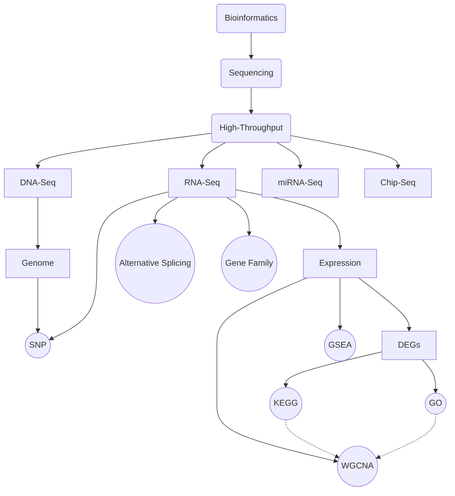

# Skill NetWork

DEGs: Differential Expression Genes
SNP: Single Nuclear polymorphism

---
github: [https://github.com/Karobben](https://github.com/Karobben)
blog: [Karobben.github.io](http://Karobben.github.io)
R 语言画图索引: [https://karobben.github.io/R/R-index.html](https://karobben.github.io/R/R-index.html)
